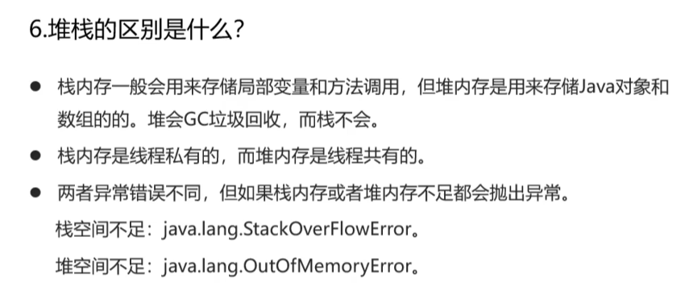

# Java

## 项目介绍


# java基础


## 基本数据类型

### 八大基本数据类型

Java 中有 8 种基本数据类型，分别为：

- 6 种数字类型： 
  - 4 种**整数**型：`byte`、`short`、`int`、`long`
  - 2 种**浮点**型：`float`、`double`
- 1 种**字符**类型：`char`
- 1 种**布尔**型：`boolean`。

这 8 种基本数据类型的默认值以及所占空间的大小如下：

| 基本类型  | 位数 | 字节 | 默认值  | 取值范围                                                     |
| :-------- | :--- | :--- | :------ | ------------------------------------------------------------ |
| `byte`    | 8    | 1    | 0       | -128 ~ 127                                                   |
| `short`   | 16   | 2    | 0       | -32768（-2^15） ~ 32767（2^15 - 1）                          |
| `int`     | 32   | 4    | 0       | -2147483648 ~ 2147483647                                     |
| `long`    | 64   | 8    | 0L      | -9223372036854775808（-2^63） ~ 9223372036854775807（2^63 -1） |
| `char`    | 16   | 2    | 'u0000' | 0 ~ 65535（2^16 - 1）                                        |
| `float`   | 32   | 4    | 0f      | 1.4E-45 ~ 3.4028235E38                                       |
| `double`  | 64   | 8    | 0d      | 4.9E-324 ~ 1.7976931348623157E308                            |
| `boolean` | 1    |      | false   | true、false                                                  |

####  Java int字节数

在Java中，`int`类型是32位的，即4个字节。这意味着`int`类型可以存储范围在 -2,147,483,648 到 2,147,483,647 之间的整数值（包括这两个值）。

#### 如何判断数据类型——instanceof

在Java中，可以使用`instanceof`操作符来判断一个对象是否是特定类的实例，从而间接判断数据类型。例如：

```java
Object obj = "Hello";
if (obj instanceof String) {
    System.out.println("obj是String类型");
} else {
    System.out.println("obj不是String类型");
}
```

上面的代码中，通过`instanceof`操作符来判断`obj`是否是`String`类型的实例，如果是，则输出"obj是String类型"，否则输出"obj不是String类型"。


### 包装类型的缓存

Java 基本数据类型的包装类型的大部分都用到了缓存机制来提升性能。

整数型`Byte`,`Short`,`Integer`,`Long` 这 4 种包装类默认创建了数值 **[-128，127]** 的相应类型的缓存数据，

`Character` 创建了数值在 **[0,127]** 范围的缓存数据，`Boolean` 直接返回 `True` or `False`。

`Float` 和 `Double`：由于精度问题，这两个类没有缓存机制。

这意味着，**当你使用自动装箱来创建一个值在缓存范围内的对象时，有可能会得到一个已经存在的对象的引用，而不是新创建一个对象**。这种缓存机制可以**减少内存使用，并提高性能**。但需要注意，缓存机制只适用于自动装箱，**直接使用构造方法创建的对象不会使用缓存**。


下面我们来看一个问题：下面的代码的输出结果是 `true` 还是 `false` 呢？

```java
Integer i1 = 40;
Integer i2 = new Integer(40);
System.out.println(i1==i2);
```

`Integer i1=40` 这一行代码会发生装箱，也就是说这行代码等价于 `Integer i1=Integer.valueOf(40)` 。因此，`i1` 直接使用的是缓存中的对象。而`Integer i2 = new Integer(40)` 会直接创建新的对象。

因此，答案是 `false` 。

记住：**所有整型包装类对象之间值的比较，全部使用 equals 方法比较**。


### java有哪些数据结构

Java中有许多内置的数据结构，其中一些是基本的，而另一些则是通过Java集合框架提供的。以下是一些常见的Java数据结构：

1. **数组（Array）**：数组是具**有固定大小的连续存储空间**，用于存储相同类型的元素。
2. **ArrayList**：ArrayList是Java集合框架中的一个**动态数组**实现，可以动态增长和缩减大小。
3. **LinkedList**：LinkedList是Java集合框架中的一个**双向链表**实现，可以在任意位置插入和删除元素。
4. **HashMap**：HashMap是Java集合框架中的一个**哈希表实现**，用于存储键值对，根据键快速查找值。
5. **HashSet**：HashSet是Java集合框架中的一个**哈希集合实现**，用于存储唯一元素，不允许重复。
6. **TreeMap**：TreeMap是Java集合框架中的一个**基于红黑树的实现**，**用于存储键值对**，并按照键的自然顺序或者自定义顺序进行排序。
7. **TreeSet**：TreeSet是Java集合框架中的一个基于红黑树的实现，**用于存储唯一元素**，并按照元素的自然顺序或者自定义顺序进行排序。
8. **Stack**：Stack是Java集合框架中的一个**后进先出（LIFO）的堆栈**实现。
9. **Queue**：Queue是Java集合框架中的一个**先进先出（FIFO）的队列**实现。
10. **PriorityQueue**：PriorityQueue是Java集合框架中的一个**基于优先级堆的优先队列**实现。


## 方法

### 重载和重写

重载（Overloading）和重写（Overriding）是面向对象编程中的两个重要概念，它们用于实现多态性，但它们的实现方式和目的不同。

#### 重载（Overloading）：

1. **定义**：重载是指在同一个类中可以定义多个同名方法，但**参数列表不同（个数、类型或顺序）**，以便根据传入参数的不同来执行不同的操作。

2. **特点**：

   - 方法名相同，参数列表不同。
   - 返回类型可以相同也可以不同。
   - 重载方法可以位于同一个类中，也可以位于其子类中。

3. **示例**：

   ```java
   javaCopy codepublic class Calculator {
       public int add(int a, int b) {
           return a + b;
       }
   
       public double add(double a, double b) {
           return a + b;
       }
   }
   ```

#### 重写（Overriding）：

1. **定义**：重写是指**子类重新定义（覆盖）了父类中的同名方法**，方法签名必须一致，以实现不同的行为。

2. **特点**：

   - 方法名相同，参数列表和返回类型都必须相同。
   - 重写方法只能位于子类中，不能位于父类中。
   - 重写方法的访问修饰符不能比父类中被重写方法的访问修饰符更严格。

3. **示例**：

   ```java
   javaCopy codeclass Animal {
       public void makeSound() {
           System.out.println("Animal makes a sound");
       }
   }
   
   class Dog extends Animal {
       @Override
       public void makeSound() {
           System.out.println("Dog barks");
       }
   }
   ```

#### 总结：

- 重载是在同一个类中定义多个同名方法，根据参数列表的不同来调用不同的方法，属于编译时多态。
- 重写是子类重新定义父类中的同名方法，以实现多态性，属于运行时多态。


### 多态

多态是面向对象编程中的一个重要概念，它通过不同对象对同一消息的不同响应实现了灵活的行为扩展。在Java中，多态主要通过继承和方法重写来实现。

#### 多态的实现方式：

1. **继承**：子类可以继承父类的属性和方法。
2. **方法重写**：子类可以重写父类的方法，以实现自己的逻辑。
3. **父类引用指向子类对象**：可以使用父类类型的引用指向子类对象，然后通过该引用调用方法，根据对象的实际类型来决定调用哪个类的方法。

编译时多态和运行时多态是面向对象编程中的两种不同类型的多态性，它们的区别在于多态性的解析发生的时间不同。


#### 编译时多态（Compile-time Polymorphism）：

1. **定义**：编译时多态是在编译时**根据参数的静态类型来确定调用的方法，通常通过函数重载和运算符重载来实现**。

   - 也称为**静态多态性或早期绑定**。

2. **示例**：

   ```java
   javaCopy codepublic class Calculator {
       public int add(int a, int b) {
           return a + b;
       }
   
       public double add(double a, double b) {
           return a + b;
       }
   }
   ```


#### 运行时多态（Runtime Polymorphism）：

1. **定义**：运行时多态是**在运行时根据对象的动态类型来确定调用的方法，通常通过方法重写来实现。**

   - 也称为**动态多态性或晚期绑定**。

2. **示例**：

   ```java
   javaCopy codeclass Animal {
       public void makeSound() {
           System.out.println("Animal makes a sound");
       }
   }
   
   class Dog extends Animal {
       @Override
       public void makeSound() {
           System.out.println("Dog barks");
       }
   }
   ```

#### 区别：

- 编译时多态的调用在编译时确定，因此效率较高，但缺乏灵活性；而运行时多态的调用在运行时确定，具有更高的灵活性，但可能会带来一定的性能开销。


### Lambda 原理

Java Lambda 表达式是 **Java 8** 中引入的一个重要特性，它允许在函数式接口上创建匿名函数。Lambda 表达式的使用**使得代码更加简洁、易读，同时也提供了更好的语言表达能力和函数式编程支持**。

 Java Lambda 表达式的原理和实现方式：

1. **函数式接口**：
   - Lambda 表达式必须与函数式接口（Functional Interface）一起使用。函数式接口是指只包含一个抽象方法的接口。Java 8 中引入了 `java.util.function` 包，其中定义了许多常用的函数式接口，如 `Consumer`、`Predicate`、`Function` 等。
2. **语法结构**：
   - Lambda 表达式的语法结构由参数列表、箭头符号 `->` 和方法体组成。例如 `(param1, param2) -> expression` 或 `(param1, param2) -> { statements; }`。
3. **类型推断**：
   - Lambda 表达式**允许省略参数类型和返回类型，编译器会根据上下文进行类型推断**。例如，对于函数式接口 `Consumer<String>`，可以写成 `s -> System.out.println(s)`，编译器会根据上下文推断出参数 `s` 的类型为 `String`。
4. **转换为内部类**：
   - **在编译时，Java 编译器将 Lambda 表达式转换为一个内部类的实现**，该内部类实现了对应函数式接口的抽象方法。Lambda 表达式背后的机制与传统的匿名内部类类似。
5. **InvokeDynamic 指令**：
   - 在 Java 虚拟机中，Lambda 表达式的实现依赖于 InvokeDynamic 指令。**InvokeDynamic 指令允许在运行时动态绑定方法调用**，它使得 JVM 可以在运行时确定 Lambda 表达式对应的方法实现。
6. **优化和性能**：
   - 虽然 Lambda 表达式会引入一定的性能开销，但 Java 编译器和虚拟机在执行时会进行一些优化，以尽量减少这些开销。例如，会**对 Lambda 表达式进行内联优化，减少额外的对象创建和方法调用**。


### static和final

static和 final 是 Java 中两个不同的关键字，它们分别用于不同的目的。以下是它们的比较：

1. **作用域**：
   - `static`：用于声明静态成员（静态变量和静态方法），静态成员属于类，不依赖于类的实例而存在，只会在内存中存在一份副本。
   - `final`：用于声明常量、不可变的变量、不可继承的类或不可覆盖的方法。
2. **修饰对象**：
   - `static`：可以用于修饰类的成员变量、方法和静态代码块，也可以用于静态内部类。
   - `final`：可以用于修饰变量、方法、类以及方法参数。
3. **改变性**：
   - `static`：**表示静态的，可以在类加载时初始化，且不能被修改**。
   - `final`：表示不可变的，可以在声明时初始化，且不能被重新赋值。
4. **内存中的位置**：
   - `static`：**静态成员存储在方法区**（Java 8 之前称为永久代，Java 8+ 称为元空间）。
   - `final`：**final 常量通常被放在常量池中，而 final 变量则会存储在堆（如果是对象引用）或者栈（如果是基本数据类型）中**。
5. **使用场景**：
   - `static`：适用于需要在类级别上共享的变量和方法，如计数器、工具方法等。
   - `final`：适用于**声明常量、保证变量不被修改、防止继承和覆盖等场景**。
6. **特殊情况**：
   - `static final`：**表示静态常量，常用于声明全局的不可变的常量**。
   - `final static`：与 `static final` 作用相同，用于声明静态常量。

总的来说，`static` 和 `final` 是两个不同的关键字，用于不同的场景。`static` 用于声明静态成员，而 `final` 用于声明不可变的常量或确保变量不被修改。在实际应用中，它们经常结合使用，以声明静态常量。


#### final

##### 修饰在字段，方法，和类上的不同

在Java中，`final` 关键字可以用于不同的上下文中，具有不同的作用。以下是 `final` 关键字的几种常见用法：

1. **final 修饰变量**：

   - 当 `final` 修饰一个变量时，表示该变量的值只能被赋值一次，即它是一个常量。如果是基本数据类型，则表示该变量的值不可变；**如果是引用类型，则表示该变量引用的对象不可变，但对象的内容（状态）可以改变**。

   - 例如：

     ```java
     final int MAX_VALUE = 100;
     final String MESSAGE = "Hello";
     ```

2. **final 修饰方法**：

   - 当 `final` 修饰一个方法时，表示该**方法不能被子类重写（覆盖**）。

   - 例如：

     ```java
     public final void doSomething() {
         // method implementation
     }
     ```

3. **final 修饰类**：

   - 当 `final` 修饰一个类时，表示该**类不能被继承**，即它是一个最终类（Final Class）。

   - 例如：

     ```java
     public final class MyClass {
         // class implementation
     }
     ```

4. **final 修饰方法参数**：

   - 当 `final` 修饰一个方法的参数时，表示该**参数在方法中是只读的，即不能被方法内部修改**。

   - 例如：

     ```java
     public void process(final int num) {
         // num++; // Error: Cannot assign a value to final variable 'num'
     }
     ```

5. **final 修饰成员变量的引用**：

   - 当 `final` 修饰一个对象引用时，表示该**引用指向的对象不能再改变，但对象的状态可以改变**。

   - 例如：

     ```java
     final List<String> list = new ArrayList<>();
     ```

`final` 关键字的使用可以**提高代码的可读性、可维护性和安全性，同时也有助于编译器进行更多的优化**。


## 面向对象

### 封装、继承和多态的底层原理和好处


封装（Encapsulation）、继承（Inheritance）和多态（Polymorphism）是面向对象编程中的三大特性，它们分别具有自己的底层原理和好处。

#### 封装：

- **底层原理**：封装是将数据和方法封装在一个单元中，**通过访问修饰符控制数据的访问权限，隐藏数据的实现细节，仅暴露必要的接口**给外部使用。
- 好处：
  1. **信息隐藏**：封装使得对象的内部实现细节对外部不可见，提高了安全性和可靠性。
  2. **解耦合**：封装将对象的接口和实现分离，使得修改对象的实现不会影响到其他部分的代码。
  3. **简化复杂性**：封装可以将复杂的实现细节隐藏起来，对外提供简洁的接口，降低了使用者的复杂度。

#### 继承：

- **底层原理**：继承是通过子类继承父类的属性和方法，使得**子类具有父类的特性，并且可以根据需要进行扩展和重写**。
- 好处：
  1. **代码重用**：继承允许子类重用父类的属性和方法，减少了代码的重复编写。
  2. **扩展性**：子类可以在不改变父类的情况下扩展新的功能，提高了代码的灵活性和可扩展性。
  3. **多态支持**：继承是多态性的基础，允许不同类型的对象被同一类型的引用所指向，提高了代码的通用性和可维护性。

#### 多态：

- **底层原理**：多态是指**同一种操作作用于不同的对象，可以产生不同的行为**。在 Java 中，多态性是通过动态绑定实现的，即在运行时根据对象的实际类型确定调用的方法。
- 好处：
  1. **灵活性**：多态使得代码更具灵活性，同一种操作可以应用于不同的对象，增加了代码的通用性。
  2. **可扩展性**：多态性支持新类型的添加而无需修改已有的代码，使得代码更易于扩展和维护。
  3. **解耦合**：多态性将方法的调用和方法的具体实现分离开来，减少了代码的耦合度，提高了代码的模块化和可维护性。

综上所述，封装、继承和多态是面向对象编程中的核心概念，它们分别通过隐藏信息、代码重用和灵活性支持来提高代码的安全性、可维护性和可扩展性。


### 抽象类与接口

**共同点**：

- 都不能被实例化。
- 都可以包含抽象方法。
- 都可以有默认实现的方法（Java 8 可以用 `default` 关键字在接口中定义默认方法）。

**区别**：

- **接口主要用于对类的行为进行约束，你实现了某个接口就具有了对应的行为。抽象类主要用于代码复用，强调的是所属关系**。
- **一个类只能继承一个类，但是可以实现多个接口**。
- 接口中的成员变量只能是 `public static final` 类型的，不能被修改且必须有初始值，而抽象类的成员变量默认 default，可在子类中被重新定义，也可被重新赋值。


####  创建接口原则

1. **单一职责原则（Single Responsibility Principle，SRP）**：
   - 接口应该只有一个职责。每个接口应该描述一种行为或功能，而不是试图包含太多的功能或职责。
2. **接口隔离原则（Interface Segregation Principle，ISP）**：
   - 接口应该小而专一。将大接口拆分为多个小接口，客户端只需实现它们所需的接口，而不需要依赖于不需要的接口。
3. **依赖倒置原则（Dependency Inversion Principle，DIP）**：
   - 接口应该依赖于抽象而不是具体实现。客户端代码应该依赖于接口，而不是具体的实现类，这样可以降低耦合度，提高代码的灵活性和可维护性。

遵循这些原则可以帮助设计出清晰、灵活和易于维护的接口，提高软件的质量和可维护性。


### 深拷贝和浅拷贝

在 Java 中，深拷贝和浅拷贝主要涉及到对象复制时处理对象属性和引用关系的方式。这两种拷贝方式的主要区别如下：

**浅拷贝（Shallow Copy）**

浅拷贝是创建一个新对象，并复制原对象中的**非引用类型数据**（如 int、double、float 等基本数据类型），但对于引用类型数据（如对象、数组等），只复制其引用而不复制引用的对象。换句话说，**浅拷贝对于非引用类型字段进行值传递，对引用类型字段进行引用传递**。因此，**如果原对象的引用类型字段被修改，浅拷贝后的对象也会受到影响**。

**深拷贝（Deep Copy）**

深拷贝则不同，它不仅创建一个新对象，并复制原对象中的非引用类型数据，还会递归地复制原对象中的引用类型数据。也就是说，对于原对象的引用类型字段，深拷贝会创建一个新的对象，并复制原引用对象的内容到新对象中。因此，如果原对象的引用类型字段被修改，深拷贝后的对象不会受到影响。


#### Java 有哪些深拷贝的方法？


> 在 Java 中，实现深拷贝的方法有多种：
>
> 1. **重写 `clone()` 方法**：Java 中的 `Object` 类提供了一个 `clone()` 方法，用于创建对象的副本。但是，默认情况下，`clone()` 方法执行的是浅拷贝。为了实现深拷贝，需要重写 `clone()` 方法，并在其中对对象的属性进行递归拷贝。
> 2. **使用序列化和反序列化**：Java 中的序列化和反序列化可以实现对象的深拷贝。通过将对象写入字节流，然后再从字节流中读取出来，就可以创建一个新的对象，而不是简单地复制引用。这种方式要求被复制的类及其所有被引用的类都必须实现 `Serializable` 接口。
> 3. **使用第三方库**：有些第三方库提供了深拷贝的功能，比如 Apache Commons Lang 和 Gson。这些库通常提供了更灵活和强大的深拷贝实现，可以处理更复杂的对象结构和关系。


## String


### String对象底层数据结构

在 Java 中，`String` 对象的底层数据结构是一个**不可变的字符序列**，其实际实现有两种：

1. **char 数组**：

   - 在早期版本的 Java 中，`String` 对象的底层数据结构是一个 **`char` 类型**的数组，用于存储字符串的字符序列。

   - 例如，在 Java 6 及之前的版本中，

     String 类的定义类似于：

     ```java
     public final class String implements java.io.Serializable {
         private final char value[]; // 存储字符序列的 char 数组
         ...
     }
     ```

2. **byte 数组**：

   - 从 Java 7 开始，Java 的内部实现对 `String` 对象进行了优化，引入了一种名为 `Compact Strings` 的机制。在某些情况下，`String` 对象的底层数据结构会是一个 `byte` 数组，而不是 `char` 数组。

   - 这种优化的目的是为了减少 `String` 对象的内存消耗，**在存储 ASCII 字符（占用一个字节）的情况下，使用 `byte` 数组可以减少一半的内存消耗。**

   - 在这种情况下，

     String类的定义会包含一个 **byte[]字节数组**，例如：

     ```java
     public final class String implements java.io.Serializable {
         private final byte[] value; // 存储字符序列的 byte 数组
         ...
     }
     ```


### String不可变的原因


`String` 类的不可变性是通过以下**设计策略**实现的：

1. 保存字符串的数组被 `final` 修饰且为私有的，并且`String` 类没有提供/暴露修改这个字符串的方法。

2. `String` 类被 `final` 修饰导致其不能被继承，进而避免了子类破坏 `String` 不可变。

   

### String不可变的原好处

`String` 在 Java 中是不可变的，即一旦创建后就不能被修改，这种设计是有一些**原因和好处**的：

1. **线程安全性**：由于 `String` 是不可变的，多个线程可以安全地共享 `String` 对象，而不必担心线程安全问题。因为**任何修改 `String` 对象的操作都不会改变原始对象，而是创建一个新的对象**。

2. **缓存优化**：由于 String 对象是不可变的，可以**被缓存起来重复使用，从而节省内存空间**。例如，在字符串常量池中，相同的字符串只会存储一份，多个引用可以共享同一个字符串对象，减少了内存消耗。

3. **安全性**：不可变的字符串可以防止在运行时修改字符串对象的内容，从而避免了意外修改字符串数据导致的程序逻辑错误。

4. **哈希值缓存**：String 类在创建字符串对象时会计算并缓存字符串的哈希值，由于字符串内容不可变，因此哈希值也不会改变，可以提高字符串对象作为 HashMap 键值的效率。

5. **参数传递**：由于 String 是不可变的，可以安全地作为方法的参数传递，不必担心参数被修改的问题，提高了代码的可靠性和可维护性。

   

### 字符串常量池


在 Java 中，字符串常量池（String Pool）是一块存储字符串对象的特殊内存区域，它用于存储字符串字面量以及通过 `String` 类的 `intern()` 方法手动添加到常量池中的字符串对象。字符串常量池的存在主要是为了提高字符串对象的共享和重用，以节省内存空间。

什么时候会创建新的字符串对象，什么时候不会？

1. **字符串字面量**：
   - 当程序中出现字符串字面量时，如果**字符串常量池中已经存在相同内容的字符串对象**，则不会创建新的对象，而是直接返回已存在的对象的引用。
   - 例如：`String str1 = "hello";`，如果字符串常量池中已经有 `"hello"` 对应的字符串对象，则 `str1` 会指向该对象；如果没有，则会创建一个新的字符串对象。
2. **通过 new 关键字创建**：
   - **使用 `new` 关键字创建字符串对象时，会在堆内存中创建一个新的对象，而不管字符串常量池中是否已经存在相同内容的字符串**对象。
   - 例如：`String str2 = new String("hello");`，无论字符串常量池中是否已经有 `"hello"` 对应的字符串对象，这里都会在堆内存中创建一个新的对象。
3. **调用 intern() 方法**：
   - **调用字符串对象的 `intern()` 方法会将该对象添加到字符串常量池中，如果字符串常量池中已经存在相同内容的字符串对象，则返回已存在的对象的引用；否则将该对象添加到常量池并返回自身的引用**。
   - 例如：`String str3 = "hello".intern();`，如果字符串常量池中已经有 `"hello"` 对应的字符串对象，则 `str3` 会指向该对象；如果没有，则会将 `"hello"` 对象添加到字符串常量池中，并返回该对象的引用。

综上所述，字符串对象何时会创建新的对象取决于字符串的创建方式和是否调用了 `intern()` 方法。使用字符串字面量或者调用 `intern()` 方法时，会尝试从字符串常量池中获取对象；而使用 `new` 关键字创建字符串对象时，会在堆内存中创建一个新的对象。


## 泛型

### 实现原理

Java泛型是通过**类型擦除（type erasure）**来实现的。类型擦除是Java编译器在编译时处理泛型代码的一种技术，它会将泛型代码中的类型信息擦除，使得泛型代码在运行时不再包含泛型类型的信息。

具体来说，Java编译器**在编译泛型代码时，会将泛型类型替换为它们的原始类型（raw type），并插入必要的类型转换代码来保证类型安全。在编译后的字节码中，泛型类型的信息会被擦除，所有的泛型类型参数都会被替换为它们的边界类型或Object类型**。

这意味着在**运行时，Java虚拟机（JVM）无法识别泛型类型的信息**。例如，对于一个泛型类 `List<T>`，在运行时，它的实例只能看作是 `List`，而无法知道具体的类型参数 `T`。这也就是为什么在运行时无法直接实例化泛型类型的原因。

尽管泛型类型的信息在运行时被擦除了，但是Java编译器会在编译时进行类型检查，并确保类型安全。这是通过插入必要的类型转换代码来实现的，以确保在运行时不会出现类型不匹配的情况。

总的来说，Java泛型是通过编译时的类型擦除来实现的，编译器在编译时负责类型检查和插入类型转换代码，以确保类型安全，而在运行时，泛型类型的信息被擦除，所有的泛型类型参数都被替换为它们的边界类型或Object类型。


### 泛型的好处

1. **类型安全性（Type Safety）**，**更安全的集合操作**
   - 泛型使得编译器能够在编译时检查代码，以**确保类型的一致性**。这意味着在编译时可以捕获类型错误，而不是在运行时出现异常。
2. **减少类型转换（Casting）**：
   - 泛型可以**消除代码中的大量类型转换**，因为它们提供了在编译时确定元素类型的机制。这减少了代码的复杂性，使得代码更易读、更易维护。
3. **代码重用**，**更强的抽象能力**：
   - 使用泛型可以编写**更通用、更灵活的代码**，可以用于处理各种类型的数据结构，而不需要为每种类型编写特定的代码。可以将数据结构的实现和数据类型分离，使得代码更加灵活和可扩展。
4. **性能提升**：
   - 泛型代码经过编译器类型擦除后会被转换成原始类型，因此在运行时不会产生额外的开销。相比于使用 Object 类型存储对象，泛型可以提高代码的性能。
5. **更清晰的接口**：
   - 使用泛型可以使方法和类的接口更清晰，因为它们可以明确指定要处理的数据类型，而不需要在文档中进行解释或者要求调用者进行类型转换。


综上所述，泛型使得代码更安全、更通用、更灵活，并且可以提高代码的性能和可读性，是 Java 中非常有价值的语言特性之一。


### 泛型适用场景,泛型限制场景

泛型（Generics）是一种在编程中使用参数化类型的技术，适用于许多场景，但也有一些限制场景。

**泛型适用场景**

1. **集合类和数据结构**：
   - 泛型非常适用于集合类和数据结构，例如列表、映射、队列等，可以使得数据结构更加类型安全、灵活和通用。
2. **容器类和工具类**：
   - 泛型可以用于编写通用的容器类和工具类，例如栈、队列、排序算法等，可以适用于各种不同类型的数据。
3. **算法和函数**：
   - 泛型可以用于编写通用的算法和函数，例如排序、搜索、过滤等，可以适用于不同类型的数据集合。
4. **设计模式**：
   - 泛型可以用于设计模式中，例如工厂模式、观察者模式、策略模式等，可以使得模式更加灵活和通用。
5. **API 设计**：
   - 泛型可以用于设计 API，使得 API 更加通用和易于使用，可以减少类型转换和提高代码的可读性。

**泛型限制场景：**

1. **基本数据类型**：

   - 泛型不能直接用于基本数据类型，例如 `int`、`double` 等，因为**泛型类型参数必须是一个引用类型**。但可以使用包装类型来代替基本数据类型。

2. **静态上下文**：

   - 在**静态上下文中（如静态方法、静态初始化块），无法引用泛型类型参数，因为泛型类型参数是实例级别的**。

   

虽然泛型在许多情况下都是非常有用的，但在某些特定场景下可能会受到一些限制。因此在使用泛型时需要注意其适用范围和限制条件。


## 异常

### 顶级父类

在 Java 中，所有异常类的顶级父类是 `java.lang.Throwable` 类。`Throwable` 类是一个抽象类，它是所有错误和异常的超类，其中包括了一些常见的方法，如 `getMessage()`、`printStackTrace()` 等，用于获取异常信息和打印异常堆栈轨迹。

`Throwable` 类有两个主要的子类：

1. **Error**：

   - `Error` 类用于表示严重的系统错误，通常是**虚拟机无法解决的问题**，例如内存溢出（`OutOfMemoryError`）、虚拟机错误（`VirtualMachineError`）等。程序一般不会捕获 `Error` 类的实例，而是让虚拟机进行处理。

2. **Exception**：

   - Exception 类用于表示程序中的异常情况，它是大多数异常类的直接或间接父类。

     Exception类又分为两种：

     - **受检异常（Checked Exception）**：这类异常是在**编译时检查**的，程序**必须显式地捕获或者声明抛出，否则编译会报错**。例如 `IOException`、`SQLException` 等。
     - **非受检异常（Unchecked Exception）**：这类异常是在**运行时抛出**的，编译器不会检查程序是否捕获或者声明抛出。通常是由于程序错误引起的，例如空指针异常（`NullPointerException`）、数组下标越界异常（`ArrayIndexOutOfBoundsException`）等。


### final,finally,finalize

`final`、`finally` 和 `finalize` 是 Java 中的三个关键字，它们分别表示不同的概念和用途：

1. **final**：
   - `final` 是一个修饰符，可以用于修饰类、方法和变量。它表示被修饰的元素具有最终（不可改变）的特性。
   - 修饰类时，表示该类不能被继承，即为最终类。修饰方法时，表示该方法不能被子类重写，即为最终方法。修饰变量时，表示该变量只能被赋值一次，即为常量。
2. **finally**：
   - `finally` 是一个关键字，用于定义在 try-catch 结构中的一个代码块，在 try 块执行完毕后、可能的 catch 块执行完毕后、try 块或 catch 块内部的代码执行完毕后，**无论是否发生异常，都会执行 finally 块中的代码**。这使得 finally 块通常用于释放资源、关闭连接等操作，确保资源得到正确地释放。
3. **finalize**：
   - `finalize` 是一个方法，定义在 `Object` 类中，是 Java 中的垃圾回收机制的一部分。
   - 当垃圾收集器确定没有对该对象的更多引用时，将调用对象的 `finalize` 方法来执行一些清理工作或者释放资源的操作。这个方法可以被子类覆盖，但通常不建议依赖于它，因为它的调用时机是不确定的，而且不是每个对象都会被垃圾收集器调用 `finalize` 方法。

综上所述，`final` 用于表示最终性，`finally` 用于定义在异常处理结构中的最终执行代码块，`finalize` 用于对象在被垃圾回收前的清理操作。这三个关键字在 Java 中各自有着不同的作用和用途。


#### finalize一定会执行吗


不，`finalize()` 方法并不保证一定会执行。虽然在某些情况下，垃圾收集器可能会调用对象的 `finalize()` 方法，但是调用的时机是不确定的，也不是每个对象都会被调用。

以下是一些关于 `finalize()` 方法的注意事项：

1. **不确定的调用时机**：
   - Java 垃圾收集器决定何时调用对象的 `finalize()` 方法是不确定的，它可能会受到多种因素的影响，包括垃圾收集器的算法、垃圾收集器的策略、对象的存活时间等等。
2. **不保证执行**：
   - 即使垃圾收集器调用了对象的 `finalize()` 方法，也不能保证该方法会被成功执行。例如，如果在 `finalize()` 方法中发生了无法捕获的异常，该方法可能会提前结束，导致未执行的清理操作。
3. **不建议依赖**：
   - 由于 `finalize()` 方法的调用时机不确定，也不是可靠的资源释放机制，因此不建议在代码中依赖于 `finalize()` 方法来进行重要的资源释放或清理操作。

因此，虽然 Java 中的垃圾回收机制提供了 `finalize()` 方法来进行对象的清理工作，但是在实际编程中，更好的做法是使用 `try-with-resources`、`finally` 块等确保资源的正确释放。


### 用try-catch throw去处理异常，具体底层是怎么实现的

在 Java 中，使用 `try-catch` 和 `throw` 来处理异常的底层实现涉及到编译器和运行时系统的多个环节。以下是大致的底层实现流程：

1. **编译时处理**：
   - 当编译器遇到带有异常处理代码块的 `try-catch` 结构时，它会**生成相应的字节码指令，并在字节码中添加异常处理表（exception table）的条目**，用于指示代码块中的异常处理逻辑。
2. **异常对象的创建**：
   - 当**发生异常时，Java 运行时系统会创建一个异常对象**（如 `NullPointerException`、`ArrayIndexOutOfBoundsException` 等）来表示该异常，其中包含了异常的类型、消息和堆栈轨迹等信息。
3. **异常抛出**：
   - 当执行到 `throw` 语句时，会立即**抛出**一个异常对象。这个**异常对象会被传递到当前的方法调用栈中，寻找与之匹配的 `try-catch` 结构来处理异常**。
4. **异常处理**：
   - 当发生异常时，Java 运行时系统会**沿着方法调用栈向上搜索与异常类型匹配的 `catch` 块**。
   - 如果找到了匹配的 `catch` 块，那么相应的异常处理代码就会被执行。
5. **异常传播**：
   - 如果异常没有被处理，它会继续**向上层调用栈传播，直至到达调用栈的顶层（例如 `main` 方法），如果依然没有处理，则会导致程序终止，并打印异常的堆栈轨迹信息**。

总的来说，`try-catch` 和 `throw` 语句的底层实现是由编译器生成相应的字节码指令，以及 Java 运行时系统负责异常对象的创建、抛出和传播。异常处理的过程是通过遍历方法调用栈中的 `try-catch` 结构来查找匹配的异常处理代码块，并执行相应的异常处理逻辑。


## 代理

### 写一个静态代理的例子


**静态代理中，我们对目标对象的每个方法的增强都是手动完成的（\*后面会具体演示代码\*），非常不灵活（\*比如接口一旦新增加方法，目标对象和代理对象都要进行修改\*）且麻烦(\*需要对每个目标类都单独写一个代理类\*）。** 实际应用场景非常非常少，日常开发几乎看不到使用静态代理的场景。

上面我们是从实现和应用角度来说的静态代理，从 JVM 层面来说， **静态代理在编译时就将接口、实现类、代理类这些都变成了一个个实际的 class 文件。**

静态代理实现步骤:

1. 定义一个接口及其实现类；
2. 创建一个代理类同样实现这个接口
3. 将目标对象注入进代理类，然后在代理类的对应方法调用目标类中的对应方法。这样的话，我们就可以通过代理类屏蔽对目标对象的访问，并且可以在目标方法执行前后做一些自己想做的事情。


以下是一个简单的静态代理的例子，假设有一个 `Calculator` 接口，其中定义了一个计算方法 `calculate()`，我们需要创建一个代理类 `CalculatorProxy` 来代理 `Calculator` 接口的实现类：

```java
// 接口：Calculator.java
public interface Calculator {
    int calculate(int a, int b);
}

// 实现类：CalculatorImpl.java
public class CalculatorImpl implements Calculator {
    @Override
    public int calculate(int a, int b) {
        return a + b;
    }
}

// 代理类：CalculatorProxy.java
public class CalculatorProxy implements Calculator {
    private Calculator calculator;

    public CalculatorProxy(Calculator calculator) {
        this.calculator = calculator;
    }

    @Override
    public int calculate(int a, int b) {
        // 在调用真实对象的方法前可以执行一些前置操作
        System.out.println("Before calculation");
        
        // 调用真实对象的方法
        int result = calculator.calculate(a, b);
        
        // 在调用真实对象的方法后可以执行一些后置操作
        System.out.println("After calculation");
        
        return result;
    }
}

// 测试类：Main.java
public class Main {
    public static void main(String[] args) {
        // 创建真实对象
        CalculatorImpl calculatorImpl = new CalculatorImpl();
        
        // 创建代理对象
        CalculatorProxy calculatorProxy = new CalculatorProxy(calculatorImpl);
        
        // 通过代理对象调用方法
        int result = calculatorProxy.calculate(3, 4);
        System.out.println("Result: " + result);
    }
}
```

在上面的例子中，`CalculatorProxy` 是 `Calculator` 接口的代理类，它持有一个 `Calculator` 接口的实现类的实例，并在调用真实对象的方法前后添加了一些额外的操作。通过使用静态代理，我们可以在不修改原始类的情况下，对其进行功能增强、日志记录、性能监控等操作。


### JDK 动态代理和 CGLIB 动态代理对比


JDK 动态代理和 CGLIB 动态代理是 Java 中两种常见的动态代理实现方式，它们各自有着一些特点和优劣势。

#### JDK 动态代理：

1. **基于接口**：
   - JDK 动态代理是**基于接口的代理**，即被代理的类**必须实现一个接口**。代理类实现了与目标类相同的接口，并通过 `InvocationHandler` 接口的 `invoke()` 方法来处理方法的调用。
2. **优势**：
   - 纯 Java 实现，不依赖第三方库，是 Java 标准库的一部分。
   - 安全性高，不会修改目标类的字节码。
   - 内置于 Java 标准库中，使用方便。
3. **劣势**：
   - 必须实现接口，无法对未实现接口的类进行代理。
   - 性能相对较低，每次代理调用都需要通过反射进行方法调用。

#### CGLIB 动态代理：

[CGLIBopen in new window](https://github.com/cglib/cglib)(*Code Generation Library*)是一个基于[ASMopen in new window](http://www.baeldung.com/java-asm)的字节码生成库，它允许我们在运行时对字节码进行修改和动态生成。CGLIB 通过继承方式实现代理。很多知名的开源框架都使用到了[CGLIBopen in new window](https://github.com/cglib/cglib)， 例如 Spring 中的 AOP 模块中：如果目标对象实现了接口，则默认采用 JDK 动态代理，否则采用 CGLIB 动态代理。


1. **基于继承**：

   - CGLIB 动态代理是**基于继承的代理**，它通过修改字节码生成目标类的子类，并重写需要代理的方法来实现代理功能。

2. **优势**：

   - 可以对未实现接口的类进行代理。
   - 性能相对较高，因为代理类是目标类的子类，无需通过反射进行方法调用。

3. **劣势**：

   - 需要依赖 CGLIB 库，增加了项目的复杂度。

     

     选择策略：

- **JDK 动态代理只能代理实现了接口的类或者直接代理接口，而 CGLIB 可以代理未实现任何接口的类。** 另外， CGLIB 动态代理是通过生成一个被代理类的子类来拦截被代理类的方法调用，因此不能代理声明为 final 类型的类和方法。
- 就二者的效率来说，大部分情况都是 JDK 动态代理更优秀，随着 JDK 版本的升级，这个优势更加明显。

## IO

### java中的IO模型

BIO  NIO  AIO


### 同步IO和异步IO区别

首先一个IO操作其实分成了两个步骤：发起IO请求和实际的IO操作，

同步IO和异步IO的区别就在于第二个步骤是否阻塞，如果实际的IO读写阻塞请求进程，那么就是同步IO，因此阻塞IO、非阻塞IO、IO服用、信号驱动IO都是同步IO，如果不阻塞，而是操作系统帮你做完IO操作再将结果返回给你，那么就是异步IO。

阻塞IO和非阻塞IO的区别在于第一步，发起IO请求是否会被阻塞，如果阻塞直到完成那么就是传统的阻塞IO，如果不阻塞，那么就是非阻塞IO。

### Java IO中的阻塞式IO和非阻塞式IO的区别和联系？

Java IO 中的阻塞式 IO（Blocking IO）和非阻塞式 IO（Non-blocking IO）是两种不同的 IO 模型，它们之间有着明显的区别：

1. **阻塞式 IO**：
   - 当应用程序执行 IO 操作时，如果数据没有准备好，线程会被阻塞，直到数据准备好并且被传输完成。
   - 在阻塞式 IO 模型中，线程会一直等待，直到IO操作完成，因此可能会导致线程的浪费，尤其是在并发情况下。
2. **非阻塞式 IO**：
   - 在非阻塞式 IO 模型中，当应用程序执行 IO 操作时，如果数据没有准备好，线程不会被阻塞，而是会立即返回一个状态，告诉应用程序当前数据不可用。
   - 应用程序可以通过不断地轮询或者异步事件通知的方式来检查 IO 操作是否完成，这样可以在等待 IO 操作的同时执行其他任务，提高了系统的并发性能。

联系：

- 阻塞式 IO 和非阻塞式 IO 都是 Java IO 中的两种常见的 IO 模型，它们都是通过 Java 的 IO 类库来实现的。
- 在 Java 中，阻塞式 IO 通常是通过 InputStream 和 OutputStream 类来实现的，而非阻塞式 IO 则通常是通过 NIO（New IO）包中的 Channel 和 Selector 类来实现的。
- 非阻塞式 IO 通常与多路复用技术（如 Selector）一起使用，以提高系统的性能和并发能力。

总的来说，阻塞式 IO 适用于简单的场景，但在高并发的情况下会导致资源的浪费，而非阻塞式 IO 则更适合于需要高并发处理的场景，可以更有效地利用系统资源。


### select，poll，epoll底层是什么数据结构


在讨论 select、poll 和 epoll 的底层数据结构时，需要了解它们都是用于实现 I/O 多路复用的机制，但在不同的操作系统上有不同的实现方式：

1. **select**：
   - 在 Unix/Linux 系统中，select 使用了一个文件描述符集合（fd_set）来跟踪一组文件描述符的状态。
   - fd_set 是一个位图，它的每一位对应一个文件描述符，用于表示该文件描述符的状态（可读、可写、异常等）。
   - select 函数通过遍历所有的文件描述符来检查它们的状态，并在有就绪的文件描述符时返回。
2. **poll**：
   - 类似于 select，poll 也使用一个文件描述符数组来跟踪一组文件描述符的状态。
   - 每个文件描述符都有一个对应的数据结构，用于记录该文件描述符的状态信息。
   - 当调用 poll 函数时，它会遍历所有的文件描述符，并检查它们的状态。
3. **epoll**：
   - epoll 是 Linux 特有的实现，它使用了一个红黑树（rbtree）和一个双向链表（doubly linked list）来管理文件描述符。
   - 在内核中，有一个叫做 epoll 实例的对象，它维护了一棵红黑树和一个双向链表，用于存储注册的文件描述符和它们的状态信息。
   - epoll 利用了事件通知机制，当文件描述符的状态发生变化时，内核会将就绪的文件描述符添加到就绪链表中，并通知用户空间程序。

总的来说，select 和 poll 使用简单的数组或位图来管理文件描述符，而 epoll 则利用了更为复杂的数据结构（红黑树和双向链表），并通过事件通知机制来提高效率。 epoll 在处理大量连接时具有更好的性能，特别是在高并发环境下。


#### 为什么select限制1024而poll不限制，如何改进的


### Linux中还有哪些IO

除了 select、poll 和 epoll 外，在 Linux 中还有一些其他的 I/O 模型和机制：

1. **IO多路复用**：
   - 除了 epoll 外，Linux 还支持其他形式的 IO 多路复用，如 `kqueue` 和 `devpoll`。
   - `kqueue` 是 BSD 系统中的一种事件通知机制，在某些场景下与 epoll 类似，但其具有更丰富的功能。
   - `devpoll` 是 Solaris 系统中的一种 IO 多路复用机制，也类似于 epoll。
2. **异步 IO**：
   - Linux 提供了异步 IO 的支持，包括 `aio_read`、`aio_write` 等函数，以及相应的异步 IO 操作管理机制。
   - 异步 IO 允许应用程序在发起 IO 操作后立即返回，并通过信号或回调函数等方式在操作完成后得到通知。
3. **信号驱动 IO**：
   - Linux 中的信号驱动 IO（Signal-driven IO）允许应用程序将 IO 操作与信号处理函数关联起来，当 IO 操作完成时，内核会发送一个信号给应用程序，触发相应的信号处理函数。
   - 这种机制在一些特定的场景下可以用来处理非阻塞 IO。
4. **文件异步IO**：
   - Linux 提供了 POSIX 异步 IO（AIO）的支持，可以通过 `io_setup`、`io_submit`、`io_getevents` 等函数来进行异步文件 IO 操作。
   - AIO 提供了一种更高级的异步 IO 模型，相比传统的异步 IO，其具有更高的性能和可扩展性。

这些不同的 IO 模型和机制在不同的场景下有着各自的优缺点，可以根据具体的应用需求和系统环境选择合适的方式来进行 IO 操作。


### 零拷贝

零拷贝原理,零拷贝主要场景

零拷贝（Zero-copy）是一种优化技术，旨在减少数据在系统内存中的复制次数，从而提高数据传输的效率。其原理是尽可能地减少数据在用户空间和内核空间之间的复制，以及在内核空间之间的复制。

**原理**：

1. **传统数据拷贝**：在传统的数据传输过程中，数据通常需要经过多次复制，包括从应用程序的用户空间到内核空间的复制，以及在内核空间中的缓冲区之间的复制，最后再将数据从内核空间传输到目标位置（如网卡）。

2. **零拷贝**：零拷贝技术通过直接在内核空间中操作数据，避免了数据在用户空间和内核空间之间的复制，以及在内核空间之间的缓冲区复制。具体来说，它可以通过以下几种方式来实现：
- 使用DMA（Direct Memory Access）引擎直接从应用程序的内存中读取或写入数据，而无需经过CPU的介入。
   - 通过mmap系统调用将文件映射到内存中，从而直接在内存中操作文件而不需要经过用户空间和内核空间之间的数据拷贝。
- 在网络传输中，可以使用零拷贝技术直接将数据从内核空间的发送缓冲区传输到网络设备，而无需经过用户空间。

**主要场景**：

1. **文件传输**：在文件传输过程中，零拷贝可以显著减少数据在应用程序、内核和文件系统之间的复制次数，提高文件传输的效率。特别是在大文件传输和高并发情况下，零拷贝技术能够显著减少系统开销，提高传输速度。
2. **网络传输**：在网络传输中，零拷贝可以避免数据在用户空间和内核空间之间的复制，提高网络数据传输的效率。尤其是在高并发的网络环境下，零拷贝技术可以降低系统的负载，提高网络吞吐量。
3. **数据库系统**：在数据库系统中，零拷贝可以用于优化数据的读取和写入操作，提高数据库的性能和响应速度。例如，可以通过mmap系统调用将数据库文件映射到内存中，从而避免数据在用户空间和内核空间之间的复制，提高数据的读取和写入效率。

总的来说，零拷贝技术可以在许多场景下提高系统的性能和效率，特别是在大数据传输和高并发环境下，其优势更加明显。


## 其他

### java是引用传递还是值传递

Java 中的参数传递是按值传递（pass-by-value）。这意味着在方法调用时，实际传递给方法的是参数的副本，而不是参数本身。

在 Java 中，无论是基本数据类型还是对象引用，都是按值传递的。具体来说：

1. **基本数据类型**：
   - 当传递基本数据类型（如 `int`、`double` 等）作为参数时，传递的是该数据的值的副本。在方法内对该参数的修改不会影响原始值。
2. **对象引用**：
   - 当传递对象引用作为参数时，传递的是该对象引用的副本，即指向对象的内存地址的副本。在方法内对该对象的修改会影响原始对象，因为副本和原始对象指向同一块内存空间，但如果在方法内重新分配了对象引用，那么原始引用不会被改变。

下面是一个示例来说明 Java 中的参数传递是按值传递的：

```java
javaCopy codepublic class Main {
    public static void main(String[] args) {
        int x = 10;
        changeValue(x); // 传递基本数据类型的值
        System.out.println("x after method call: " + x); // 输出：x after method call: 10

        StringBuilder sb = new StringBuilder("Hello");
        changeReference(sb); // 传递对象引用的副本
        System.out.println("sb after method call: " + sb.toString()); // 输出：sb after method call: Hello World
    }

    public static void changeValue(int x) {
        x = 20; // 修改副本的值
    }

    public static void changeReference(StringBuilder sb) {
        sb.append(" World"); // 修改原始对象
    }
}
```

在上面的例子中，虽然在 `changeValue` 方法中修改了参数 `x` 的值，但在方法调用后，`x` 的值仍然是原始的值 `10`。而在 `changeReference` 方法中修改了 `StringBuilder` 对象的内容，对原始对象产生了影响。


### 幂等


在计算机科学中，幂等（Idempotence）是指对于相同的输入，在一次或多次操作后产生的结果是相同的。换句话说，重复的操作不会改变结果。

#### 幂等的特点：

1. **相同的输入产生相同的输出**：对于相同的输入值，无论进行多少次操作，结果都是一致的。
2. **操作的副作用被限制**：即使进行多次操作，也不会产生额外的影响或状态变化。

#### 幂等的实现方法：

1. **通过唯一标识符或版本号来标识操作**：
   - 在进行重复操作时，首先检查唯一标识符或版本号，如果标识符相同，则直接返回结果，不进行重复操作。
2. **使用幂等性检查**：
   - 在执行操作之前，先进行幂等性检查，判断当前操作是否已经被执行过。如果已经执行过，则直接返回之前的结果，不再进行重复操作。
3. **保证操作的原子性**：
   - 通过事务或者原子性操作来保证操作的一致性和幂等性，即使操作失败或者中断，也不会对系统状态产生额外的影响。
4. **状态标记**：
   - 对已经执行的操作进行状态标记，以防止重复执行。例如，将已经执行的操作记录到数据库或者缓存中，在执行操作之前先检查状态标记。
5. **幂等性设计**：
   - 在设计系统时，尽可能地保证操作的幂等性，减少对幂等性的检查和处理。例如，设计接口时避免造成重复操作的副作用。

综上所述，实现幂等操作的关键在于设计合适的逻辑和机制来保证相同的输入产生相同的输出，并且限制操作的副作用。通过唯一标识符、幂等性检查、原子性操作、状态标记等方法可以实现幂等性。


# java集合

### Collection和Map的子成员


#### Collection 接口的主要子成员：

1. **List**：有序集合，允许重复元素。

   - **ArrayList**：基于数组实现的动态数组。
   - **LinkedList**：基于双向链表实现的链表。
   - **Vector**：与 ArrayList 类似，但是线程安全的动态数组。

2. **Set**：不允许重复元素的集合。

   - **HashSet**：基于哈希表实现的集合，不保证元素的顺序。
   - **TreeSet**：基于红黑树实现的有序集合，元素按照自然顺序或指定的比较器排序。

3. **Queue**：队列，通常用于存储和操作元素的顺序。

   - `PriorityQueue`: `Object[]` 数组来实现小顶堆。详细可以查看：[PriorityQueue 源码分析]()。

     `DelayQueue`:`PriorityQueue`。详细可以查看：[DelayQueue 源码分析]()。

     `ArrayDeque`: 可扩容动态双向数组。

     

   

#### set和list区别？

`Set` 和 `List` 是 Java 集合框架中的两个主要接口，它们都继承自 `Collection` 接口，但在使用上有一些明显的区别：

1. **有序性**：
   - **List**：是有序集合，即元素按照插入顺序排序，可以通过索引访问元素。插入的元素在集合中保持插入的顺序。
   - **Set**：是无序集合，即元素没有特定的顺序。元素的顺序可能会受到实现类的影响，但不能依赖于特定的顺序。
2. **是否允许重复元素**：
   - **List**：允许重复元素，可以包含相同的元素多次。
   - **Set**：不允许重复元素，每个元素在集合中只能出现一次。如果尝试向 Set 中添加已经存在的元素，添加操作会被忽略。
3. **数据结构**：
   - **List**：常见的实现类有 ArrayList、LinkedList 和 Vector。ArrayList 基于数组实现，适用于随机访问元素；LinkedList 基于链表实现，适用于频繁插入和删除操作；Vector 与 ArrayList 类似，但是线程安全的。
   - **Set**：常见的实现类有 HashSet、TreeSet 和 LinkedHashSet。HashSet 基于哈希表实现，查找速度快；TreeSet 基于红黑树实现，元素有序；LinkedHashSet 同时维护插入顺序或访问顺序。
4. **适用场景**：
   - **List**：适用于需要按照插入顺序存储元素，并且可能包含重复元素的情况，例如存储日志、记录历史等。
   - **Set**：适用于需要保持元素唯一性的情况，例如存储集合、去重等。

#### 数组和集合的区别

一、**数组**声明了它容纳的元素的类型，而集合不声明。

　　二、**数组是静态的，一个数组实例具有固定的大小**，一旦创建了就无法改变容量了。而**集合是可以动态扩展容量，可以根据需要动态改变大小，集合提供更多的成员方法**，能满足更多的需求。

　　三、**数组**既可以存储基本数据类型 ，又可以存储引用数据类型， 基本数据类型存储的是值，引用数据类型存储的是地址值； **一个数组**的存放的类型只能是一种（**基本类型/引用类型**）。

　　　　**集合**存放的类型可以不是一种(**不加泛型时添加的类型是Object**)。（与Java数组不同，Java集合中不能存放基本类型数据，而只能存放对象的引用）。**集合只能存储引用数据类型(对象)**, 集合中也可以**存储基本数据类型,但是****在存储的时候会自动装箱(JDK1.5新特性)变成对象**.

　　四、**数组**是java语言中内置的数据类型,是**线性排列的,执行效率或者类型检查都是最快的。** 

　　五、若程序时不知道究竟需要多少对象，需要在空间不足时自动扩增容量，则需要使用容器类库（**ArrayList就是基于数组创建的容器类），**array不适用。

 

**数组不是面向对象的**，存在明显的缺陷，集合完全弥补了数组的一些缺点，比数组更灵活更实用，可大大提高软件的开发效率而且不同的集合框架类可适用于不同场合。 具体如下：

　　1、数组优点

　　1）数组的**效率高**于集合类.

　　2）数组能存放基本数据类型和对象，而集合类中只能放对象。]

　　2、数组缺点

　　3）**数组容量固定且无法动态改变**，集合类容量动态改变。]

　　4）**数组无法判断其中实际存有多少元素**，**length只告诉了array的容量**。]

　　3、集合优点

　5）集合有多种实现方式和不同的适用场合，而不像**数组仅采用顺序表方式**。]

　6）**集合以类的形式存在**，具有**封装、继承、多态**等类的特性，通过简单的方法和属性调用即可实现各种复杂操作，**大大提高软件的开发效率**。]


#### List有几种底层形式

在 Java 中，List 有多种底层形式，主要取决于不同的实现类。以下是几种常见的 List 实现及其底层形式：

1. **ArrayList**：
   - **底层形式**：基于动态数组实现。
   - ArrayList 内部使用一个 Object 数组来存储元素，当数组容量不足时，会进行扩容操作，通常是当前容量的 1.5 倍。这使得 ArrayList 在随机访问时性能较好，但在插入和删除操作时可能会涉及元素的移动。
2. **LinkedList**：
   - **底层形式**：基于双向链表实现。
   - LinkedList 内部使用节点（Node）来存储元素，并通过指针（引用）将这些节点连接起来。由于每个节点都包含了对前后节点的引用，因此在插入和删除操作时，不需要移动其他节点，只需修改节点的指针即可。这使得 LinkedList 在频繁插入和删除操作时性能较好，但在随机访问时性能较差。
3. **CopyOnWriteArrayList**：
   - **底层形式**：基于数组实现。
   - CopyOnWriteArrayList 内部也是使用数组来存储元素，但与 ArrayList 不同的是，它的插入和删除操作采用了一种“写时复制”的策略。即在对集合进行修改时，先对原数组进行复制（拷贝），然后进行修改操作，最后将新数组赋值给原数组。这样做的好处是读操作无需加锁，并且读操作不会受到写操作的影响，但是写操作需要对整个数组进行复制，可能会消耗较大的内存和时间。
4. **Vector**：
   - **底层形式**：类似于 ArrayList，也是基于动态数组实现。
   - Vector 与 ArrayList 类似，但是 Vector 是线程安全的，内部的操作通常都使用了 synchronized 关键字来进行同步，因此在多线程环境下使用较为安全。由于 Vector 的操作都是同步的，因此在性能上可能会比 ArrayList 稍慢。


#### list一边循环一边删除有什么问题？


在使用 List 进行循环遍历并删除元素时，可能会遇到一些问题，特别是在同时修改列表结构的情况下。这种情况通常会导致以下问题：

1. **ConcurrentModificationException**：
   - 如果在使用迭代器遍历 List 的过程中，直接调用了 List 的删除方法（如 `remove()`），会导致迭代器的状态与列表的状态不一致，从而抛出 `ConcurrentModificationException` 异常。

```scss
for(String x:list){
    if(x.equals("del")){
        list.remove(x);
        }
}
```

 

这种方式的问题在于，删除元素后继续循环会报错误信息ConcurrentModificationException，因为元素在使用的时候发生了并发的修改，导致异常抛出。但是删除完毕马上使用break跳出，则不会触发报错。
　　
3、iterator遍历

```dart
Iterator<String> it = list.iterator();
while(it.hasNext()){
    String x = it.next();
    if(x.equals("del")){
        it.remove();
    }
}
```

 

这种方式可以正常的循环及删除。但要注意的是，使用iterator的remove方法，如果用list的remove方法同样会报上面提到的ConcurrentModificationException错误。

1. **未删除所有目标元素**：
   - 在循环遍历过程中，如果删除了某些元素，但是没有更新迭代器的位置，可能会导致部分目标元素未被删除，从而影响后续的处理逻辑。


为了避免上述问题，可以采取以下几种解决方案：

- 使用迭代器的安全删除方法：在使用迭代器遍历 List 时，应该使用迭代器的 `remove()` 方法进行元素的删除，而不是直接调用 List 的删除方法。
- 使用并发集合：如果在多线程环境下进行遍历和修改操作，可以考虑使用并发集合（如 `ConcurrentHashMap`、`CopyOnWriteArrayList` 等），它们提供了线程安全的遍历和修改操作。

总的来说，循环遍历并删除 List 中的元素需要谨慎处理，避免在遍历过程中直接修改列表结构，以确保程序的正确性和稳定性。


#### Map 接口的主要子成员：

1. **HashMap**：基于哈希表实现的键值对映射，不保证键值对的顺序。
2. **TreeMap**：基于红黑树实现的有序键值对映射，键按照自然顺序或指定的比较器排序。
3. **LinkedHashMap**：基于哈希表和双向链表实现的有序键值对映射，维护插入顺序或访问顺序。
4. **Hashtable**：与 HashMap 类似的键值对映射，但是线程安全的。
5. **ConcurrentHashMap**：与 HashMap 类似的键值对映射，但是线程安全且性能更好的版本。


### ArrayList和LinkedList

ArrayList和LinkedList是Java集合框架中两种常见的List实现，它们在内部实现和性能特征上有很大的区别。

1. **内部实现**：
   - ArrayList：基于数组实现。它内部使用一个动态数组来存储元素，可以根据需要自动扩展容量。
   - 0->10->15
   - LinkedList：基于双向链表实现。它内部使用链表结构来存储元素，每个元素都包含对前一个元素和后一个元素的引用。
2. **插入和删除操作**：
   - ArrayList：在末尾进行添加和删除操作速度较快，因为它可以直接在数组末尾添加或删除元素。但是在中间或开头进行添加和删除操作时，需要移动后续元素的位置，因此速度较慢。
   - LinkedList：在任意位置进行添加和删除操作速度都比较快，因为它只需要改变节点之间的引用关系，而不需要移动元素的位置。
3. **查找操作**：
   - ArrayList：通过索引直接访问元素的速度很快，因为它的底层数组支持随机访问。平均情况下，时间复杂度为O(1)。但是在中间或开头进行查找操作时，由于需要遍历数组，速度较慢，平均情况下，时间复杂度为O(n)。
   - LinkedList：在任意位置进行查找操作时，需要从头或尾开始遍历链表，直到找到目标元素，因此速度相对较慢，平均情况下，时间复杂度为O(n)。
4. **空间复杂度**：
   - ArrayList：由于需要预先分配一定大小的数组空间，所以它的空间复杂度与元素个数成正比，平均情况下为O(n)。
   - LinkedList：每个元素都需要额外的空间存储前后节点的引用，所以它的空间复杂度与元素个数成线性关系，平均情况下也为O(n)。

综上所述，如果需要频繁进行插入和删除操作，特别是在中间或开头进行插入和删除操作，LinkedList可能更适合。而如果需要频繁进行查找操作，特别是通过索引直接访问元素，ArrayList的性能可能更好


#### 如何将ArrayList变成线程安全

在 Java 中，可以通过使用 `Collections.synchronizedList()` 方法将 `ArrayList` 转换为线程安全的 `List`。这个方法返回的 `List` 是一个线程安全的包装器，它会对原始的 `ArrayList` 进行同步操作，从而保证多线程环境下的安全访问。

下面是将 `ArrayList` 转换为线程安全的示例代码：

```java
javaCopy codeimport java.util.ArrayList;
import java.util.Collections;
import java.util.List;

public class ThreadSafeArrayListExample {
    public static void main(String[] args) {
        // 创建一个普通的 ArrayList
        List<String> arrayList = new ArrayList<>();

        // 将 ArrayList 转换为线程安全的 List
        List<String> synchronizedList = Collections.synchronizedList(arrayList);

        // 在多个线程中操作 synchronizedList
        // 注意：对 synchronizedList 的所有操作都是同步的
    }
}
```

需要注意的是，虽然使用 `Collections.synchronizedList()` 方法可以将 `ArrayList` 转换为线程安全的 `List`，但是它只能保证单个操作的原子性，而不能保证多个操作之间的原子性。因此，在多线程环境中，如果需要保证多个操作的原子性，仍然需要使用额外的同步机制，如使用 `synchronized` 关键字或者 `ReentrantLock`。


**CopyOnWriteArrayList**：

- **底层形式**：基于数组实现。
- CopyOnWriteArrayList 内部也是使用数组来存储元素，但与 ArrayList 不同的是，它的插入和删除操作采用了一种“写时复制”的策略。即在对集合进行修改时，先对原数组进行复制（拷贝），然后进行修改操作，最后将新数组赋值给原数组。这样做的好处是读操作无需加锁，并且读操作不会受到写操作的影响，但是写操作需要对整个数组进行复制，可能会消耗较大的内存和时间。

### Java 的 HashMap 底层数据结构

Java的HashMap底层数据结构是数组（Array）和链表（LinkedList或者红黑树）。具体来说，HashMap将所有的键值对存储在一个数组中，每个数组元素又是一个链表或红黑树，用来解决哈希冲突的问题。

当插入一个键值对时，HashMap会根据键的哈希值确定其在数组中的位置，然后将该键值对插入对应位置的链表或红黑树中。当发生哈希冲突时，即不同的键具有相同的哈希值，HashMap会通过链表或红黑树将具有相同哈希值的键值对组织在一起。

在 JDK 8 中，HashMap 的链表长度超过一定阈值时会进行链表到红黑树的转换，而不是简单地以链表长度是否大于等于8来判断。

具体来说，当链表长度超过 8 时，HashMap 会检查当前的数组容量是否足够大。如果数组容量小于64，则不会进行转换，而是扩容数组。如果数组容量大于等于64，则会将链表转换为红黑树。这是因为在较小的数组容量下，红黑树的性能可能不如链表，因此不进行转换。

需要注意的是，这个阈值和条件是可以通过参数 `-Djdk.map.althashing.threshold=xxx` 进行调整的，不过通常情况下，不建议修改这个参数，因为默认值已经经过了充分的测试和优化。

0->16->32(当达到16*0.75 = 12时)

#### 底层put get实现


#### Hash为什么能去重


具体来说，哈希算法能够去重的原因如下：

1. **确定性**：相同的输入数据经过哈希算法得到的哈希值是确定的，即使多次计算得到的哈希值也是相同的。因此，如果两个数据的哈希值相同，则可以判断这两个数据是相同的，从而实现去重。
2. **唯一性**：不同的输入数据经过哈希算法得到的哈希值一般是不同的（理想情况下），即哈希算法具有良好的散列性质。这意味着哈希算法能够将数据均匀地映射到输出空间中，减少了哈希冲突的可能性，从而提高了去重的效率。

综上所述，哈希算法通过将输入数据映射到固定大小的输出空间，并具有确定性和唯一性的特点，使得相同的数据经过哈希算法得到相同的哈希值，从而实现了数据的去重功能。在实际应用中，哈希算法被广泛用于数据去重、数据加密、数据校验等领域。


#### Hash处理冲突的方式

##### 1. 开放定址法：

- 开放定址法是一种解决哈希冲突的方法，其中哈希表的每个槽位可以存放一个键值对。当发生哈希冲突时，即两个或多个不同的键被哈希函数映射到了同一个槽位上，开放定址法尝试在其他位置找到空的槽位来存储冲突的键值对。

##### (1) 线性探测法：

- 在线性探测法中，当发生哈希冲突时，会逐个探测下一个槽位，直到找到一个空槽位为止。具体步骤如下：
  1. 计算键的哈希值，确定键在哈希表中的初始位置。
  2. 如果初始位置已经被占用，则按照固定步长（通常为1）逐个探测下一个槽位，直到找到一个空槽位为止。
  3. 将键值对存储到找到的空槽位上。

##### (2) 平方探测法（二次探测）：

- 平方探测法是线性探测法的一种改进方法，它不是按照固定的步长逐个探测下一个槽位，而是按照固定步长的平方值进行探测。这样做的目的是避免出现“聚集”的情况，即多个键映射到同一个位置的现象。

##### 2. 再哈希法：

- 再哈希法是另一种解决哈希冲突的方法，与开放定址法不同，再哈希法在发生哈希冲突时不是尝试在其他位置找到空的槽位，而是通过应用另一个哈希函数来计算一个新的位置。具体步骤如下：
  1. 当发生哈希冲突时，使用另一个哈希函数计算一个新的位置。
  2. 将键值对存储到新计算得到的位置。
  3. 如果新位置仍然被占用，则重复步骤1，直到找到一个空槽位为止。

##### 3. 链地址法：

- 链地址法是一种将哈希表的每个槽位都设置为链表的方法。当发生哈希冲突时，即多个键被哈希函数映射到同一个槽位上时，将这些键值对存储在同一个链表中。这样做的好处是可以处理大量的冲突，但需要额外的空间来存储链表。
- 

#### HashMap为什么不能保证线程安全？

至于HashMap为什么不能保证线程安全，主要有以下几个原因：

1. **非线程安全的数据结构**：HashMap是非线程安全的数据结构，它的实现并没有对并发访问进行同步处理。多个线程同时对HashMap进行操作可能会导致数据不一致或其他的异常行为。
2. **不可见性**：当多个线程同时对HashMap进行修改时，一个线程对HashMap的修改可能对其他线程是不可见的，即一个线程对HashMap的修改并没有立即反映到其他线程的视图中。
3. **竞态条件**：HashMap的操作并不是原子性的，在并发环境下，多个线程对HashMap进行插入、删除或更新操作时可能会导致竞态条件的发生，从而导致数据的不一致。

为了在多线程环境下安全地使用HashMap，可以使用线程安全的Map实现，如ConcurrentHashMap。ConcurrentHashMap使用了锁分段技术和CAS操作来实现线程安全，在并发环境下能够提供较好的性能和线程安全保证。


##### hashmap并发情况下为什么有环


在并发环境下，HashMap 可能会出现环形链表的情况，这种情况通常发生在链地址法解决哈希冲突时。当多个线程同时对 HashMap 进行插入或删除操作时，可能会导致链表结构被破坏，从而形成环形链表。

具体来说，当两个线程同时在同一个桶位上进行插入或删除操作时，可能会导致链表节点的 next 指针被修改，从而形成环形链表。例如，线程 A 在节点 X 后插入了节点 Y，而线程 B 在节点 X 后删除了节点 Y，此时节点 Y 的 next 指针指向节点 X，从而形成了一个环。

环形链表可能会导致以下问题：

1. **死循环**：如果存在环形链表，那么遍历链表时可能会进入死循环，从而导致程序无法继续执行。
2. **内存泄漏**：如果存在环形链表，那么即使链表中的节点已经不再被引用，但由于存在环形引用，垃圾回收器无法回收这些节点，从而导致内存泄漏。

为了解决 HashMap 在并发情况下可能出现的环形链表问题，可以采取以下措施：

- **使用线程安全的并发集合**：可以考虑使用 `ConcurrentHashMap` 等线程安全的并发集合来代替 HashMap，它们内部采用了更加复杂的数据结构和锁机制来保证并发安全性。
- **避免同时对同一桶位进行修改**：在并发环境下，尽量避免多个线程同时对同一个桶位进行插入或删除操作，可以通过合理的并发控制来避免这种情况发生。
- **使用更加安全的并发控制机制**：可以使用更加安全的并发控制机制，如读写锁、分段锁等，来保证对 HashMap 的并发访问的安全性。


#### hashmap的key可以是类吗

是的，HashMap 的 key 可以是类的实例。在 Java 中，HashMap 的 key 必须是可哈希的对象，这意味着 key 对象必须实现了 `hashCode()` 方法和 `equals()` 方法。

通常情况下，Java 中的类都默认继承了 `Object` 类，因此它们都具有 `hashCode()` 和 `equals()` 方法。如果需要将某个类的实例作为 HashMap 的 key，通常需要确保该类正确地实现了 `hashCode()` 和 `equals()` 方法，以保证 HashMap 能够正确地处理哈希冲突和判断键的相等性。

例如，假设有一个名为 `Person` 的类，它具有以下属性：

```java
javaCopy codepublic class Person {
    private String name;
    private int age;

    // 构造方法、getter 和 setter 方法省略

    @Override
    public int hashCode() {
        return Objects.hash(name, age);
    }

    @Override
    public boolean equals(Object obj) {
        if (this == obj) return true;
        if (obj == null || getClass() != obj.getClass()) return false;
        Person person = (Person) obj;
        return age == person.age && Objects.equals(name, person.name);
    }
}
```

在上面的例子中，`Person` 类正确地实现了 `hashCode()` 和 `equals()` 方法，因此可以将 `Person` 类的实例作为 HashMap 的 key。当以 `Person` 对象作为 key 放入 HashMap 中时，HashMap 会根据 `hashCode()` 方法计算出哈希值，并根据 `equals()` 方法来判断两个 key 是否相等。


#### ConcurrentHashMap


##### ConcurrentHashMap 是怎么保证线程安全的?

ConcurrentHashMap在JDK1.8中使用了CAS和synchronized来实现线程安全。简单来说，CAS用于在数组中插入新的节点，synchronized用于在链表或红黑树中添加或删除节点。具体的逻辑如下：

- 当数组中当前位置为空时，使用CAS来把新的节点写入数组中对应的位置。
- 当数组中当前位置不为空时，通过加锁来添加或删除节点。如果当前位置是链表，就遍历链表找到合适的位置插入或删除节点。如果当前位置是红黑树，就按照红黑树的规则插入或删除节点。
- 当链表长度超过阈值（默认为8）时，就把链表转换为红黑树。当红黑树节点数小于阈值（默认为6）时，就把红黑树转换为链表。

这样做的好处是减少了锁的粒度和竞争，提高了并发性能和扩容效率。


##### ConcurrentHashMap哪些操作是原子操作

ConcurrentHashMap 是 Java 并发包中提供的线程安全的哈希表实现，它提供了一些原子操作，可以保证在多线程环境下的线程安全性。以下是 ConcurrentHashMap 中一些常见操作的原子性保证：

1. **插入操作**：
   - `put(K key, V value)`：向 ConcurrentHashMap 中插入键值对是原子操作，保证在多线程环境下的线程安全性。如果已存在相同的键，则新的值会覆盖旧的值。
2. **替换操作**：
   - `replace(K key, V oldValue, V newValue)`：替换指定键的值是原子操作，只有在当前值等于给定的旧值时，才会替换为新值。
3. **删除操作**：
   - `remove(Object key, Object value)`：删除指定键值对是原子操作，只有在当前值等于给定的值时，才会删除键值对。
   - `remove(Object key)`：根据键删除键值对也是原子操作。
4. **更新操作**：
   - `compute(K key, BiFunction<? super K, ? super V, ? extends V> remappingFunction)`：根据指定的键执行指定的计算，更新键值对的值是原子操作。
5. **遍历操作**：
   - 在 ConcurrentHashMap 中，迭代器遍历是弱一致性的，即迭代器会尽力反映出其创建后的键值对状态，但不保证在迭代期间其他线程对 ConcurrentHashMap 的更改都能被迭代器及时发现。

总的来说，ConcurrentHashMap 提供了一些原子操作来保证在多线程环境下的线程安全性，但需要注意的是，并不是所有的操作都是原子操作，例如 `putAll()` 方法并不是原子的。因此，在使用 ConcurrentHashMap 时，需要根据具体需求选择合适的操作来确保线程安全性。


##### concurrentHashMap1.7到1.8有哪些改变

一个segment多长

Segment的大小size默认为16


Java 1.8 对 ConcurrentHashMap 进行了一些改进，主要包括以下几个方面的变化：

1. **结构变化**：
   - Java 1.7 中 ConcurrentHashMap 的底层结构采用分段锁（Segment）实现，即将整个哈希表分成多个段，每个段拥有自己的锁，不同段之间的操作可以并发执行。而在 Java 1.8 中，底层结构采用了一种新的数据结构，即 CAS（Compare And Swap）操作和红黑树（Red-Black Tree）的组合，实现了更高效的并发控制。
2. **并发度**：
   - Java 1.8 中 ConcurrentHashMap 的并发度更高，支持更多的并发操作，提升了并发性能。
3. **新方法**：
   - Java 1.8 中新增了一些方法，如 `forEach()`、`search()`、`reduce()` 等，可以方便地对 ConcurrentHashMap 进行遍历、搜索和归约操作。
4. **扩容机制**：
   - Java 1.8 中改进了 ConcurrentHashMap 的扩容机制，采用了一种更加灵活的方式来动态调整容量，提升了扩容的效率。
5. **红黑树**：
   - Java 1.8 中 ConcurrentHashMap 使用红黑树来优化处理链表过长的情况，提高了查询性能。
6. **内存占用**：
   - Java 1.8 中优化了 ConcurrentHashMap 的内存占用，减少了一些不必要的内存消耗。

总的来说，Java 1.8 中对 ConcurrentHashMap 进行了一些优化和改进，提升了其并发性能和性能表现。这些改进使得 ConcurrentHashMap 在多线程环境下更加高效和可靠。


##### concurrentHashMap的size算法

在 Java 8 中，ConcurrentHashMap 使用了新的算法来计算大小（size），该算法主要基于统计 Cell 数组中的元素数量以及 BaseCount。这个算法的目标是提高计算大小的性能，尽量减少对全局锁的依赖。

具体来说，ConcurrentHashMap 的 size 方法的计算逻辑如下：

1. **统计 BaseCount**：
   - ConcurrentHashMap 内部有一个名为 baseCount 的字段，用于保存 ConcurrentHashMap 的大小。BaseCount 是在初始化 ConcurrentHashMap 时计算得到的，它包括 Cell 数组中已经放置的元素数量和一个基础计数值。
2. **统计 Cell 数组中的元素数量**：
   - ConcurrentHashMap 内部包含一个 Cell 数组，每个 Cell 可以容纳多个键值对。size 方法首先遍历 Cell 数组中的每个 Cell，统计每个 Cell 中的元素数量，然后将这些数量相加得到 Cell 数组中的元素总数。
3. **计算总大小**：
   - 最后，将 BaseCount 和 Cell 数组中元素的数量相加，得到 ConcurrentHashMap 的总大小。

在计算大小时，ConcurrentHashMap 不会加锁或者阻塞其他操作，因此它的性能比较高。但需要注意的是，ConcurrentHashMap 的大小是一个估算值，并不是精确的大小。由于在计算大小的过程中 ConcurrentHashMap 的内容可能会发生变化，因此得到的大小可能不是最新的。


##### ConcurrentHashMap和HashMap吞吐量比较

在并发场景下，ConcurrentHashMap 和 HashMap 的吞吐量可能会有显著差异，这取决于具体的使用情况和并发压力。以下是它们的吞吐量比较的一些考虑因素：

1. **并发访问**：
   - 在高并发的情况下，ConcurrentHashMap 通常比 HashMap 的性能更好，因为它内部采用了一些并发控制机制来保证多线程环境下的线程安全性。而 HashMap 并不是线程安全的，如果多个线程同时访问 HashMap，可能会导致不一致的状态和数据丢失。
2. **锁的粒度**：
   - ConcurrentHashMap 内部使用了分段锁（Java 7）或者更高效的 CAS 操作和红黑树（Java 8）来控制并发访问，因此在多线程访问时，不同线程可以并发地操作不同的段或者节点，从而提高了吞吐量。而 HashMap 使用的是全局锁，所有操作都需要竞争同一个锁，容易造成线程的阻塞和竞争。
3. **并发更新**：
   - 如果在并发场景下需要频繁地更新 HashMap 或 ConcurrentHashMap 中的元素，由于 ConcurrentHashMap 的并发更新机制，它通常比 HashMap 具有更好的吞吐量。因为 ConcurrentHashMap 允许多个线程同时进行更新操作，而 HashMap 的更新操作需要获得全局锁，可能会导致线程的阻塞和竞争。
4. **数据规模**：
   - 如果数据规模比较小，并发访问压力不大，HashMap 的性能可能会优于 ConcurrentHashMap。因为在数据规模较小的情况下，并发控制机制可能会带来一些额外的开销，而 HashMap 没有这些开销。

综上所述，ConcurrentHashMap 在高并发场景下通常比 HashMap 具有更好的吞吐量，特别是在多线程并发访问和更新的情况下。因此，在选择使用 HashMap 还是 ConcurrentHashMap 时，需要根据具体的需求和使用场景来进行权衡和选择。


##### ConcurrentHashMap底层树化阈值为什么是8？链表化为什么是6？是10行不行？


ConcurrentHashMap 底层树化阈值为 8，链表化阈值为 6 的选择是经过仔细考虑和性能优化的结果。这些阈值的设定是为了在不同的情况下保持性能的平衡，并在时间和空间上达到最佳的折衷。

1. **树化阈值为 8**：
   - 当一个桶中的链表长度达到 8 时，ConcurrentHashMap 会将该链表转换为红黑树。这是因为在链表长度较大的情况下，使用红黑树可以更快地进行查找操作，从而提高了并发操作的性能。此外，树化也可以防止链表过长导致的性能下降问题，因为红黑树的查找时间复杂度为 O(log n)，而链表的查找时间复杂度为 O(n)。
2. **链表化阈值为 6**：
   - 当一个桶中的链表长度达到 6 时，ConcurrentHashMap 会将该链表转换为红黑树。相比于树化阈值，链表化阈值要低一些，这是因为在链表长度较短的情况下，树化可能会带来一些额外的开销，因此在链表长度较短时，链表的性能可能更好。

是否将阈值设置为 10 取决于具体的需求和应用场景。一般来说，阈值的选择需要根据实际情况进行权衡和调整。如果将阈值设置得太大，可能会导致树化或链表化的频率过低，无法充分利用红黑树或链表的优势；如果将阈值设置得太小，可能会导致过早地进行树化或链表化，增加了额外的开销。

因此，在确定阈值时，需要考虑到数据结构的性能、空间利用率、并发性能等因素，并根据实际情况进行调整和优化。


##### 为什么要将红黑树转化成链表？

在 ConcurrentHashMap 中，当红黑树（即树化）的节点数量减少到一定程度时，会将红黑树转化回链表（即链表化）。这是因为在某些情况下，链表可能比红黑树更适合存储少量节点的数据结构，可以减少一些额外的开销并提高性能。

以下是一些原因：

1. **节省内存开销**：
   - 红黑树相比于链表需要更多的额外空间来存储节点的颜色、指向父节点的指针等信息。当节点数量较少时，使用红黑树可能会浪费一些内存空间。将红黑树转化成链表可以节省一些额外的内存开销，提高内存利用率。
2. **降低查找成本**：
   - 红黑树在节点数量较多时具有较好的查找性能，但当节点数量较少时，链表可能比红黑树更适合进行查找操作。因为在链表中进行查找时，不需要进行复杂的平衡调整操作，查找成本更低。
3. **降低维护成本**：
   - 红黑树需要进行平衡调整以保持其性质，这可能会带来一些额外的维护成本。当节点数量减少到一定程度时，维护红黑树可能会带来的开销大于使用链表的开销。将红黑树转化成链表可以降低维护成本，提高性能。

综上所述，当红黑树的节点数量减少到一定程度时，将红黑树转化成链表可以节省内存开销、降低查找成本和维护成本，从而提高 ConcurrentHashMap 的性能。这种转化是为了在不同的节点数量下保持性能的平衡，并根据实际情况进行动态调整。


### HashSet底层结构

HashSet 的底层结构是基于 HashMap 实现的。HashSet 是基于哈希表的集合，它使用 HashMap 的键来存储集合中的元素，而所有的键共享同一个静态的 final Object 值（由于 Java 中无法直接声明一个空的哈希表而是通过 HashMap 实例来实现）。

在 HashSet 中，添加一个元素实际上是将该元素作为键存储到 HashMap 中，并将对应的值设为固定的常量（比如 `PRESENT = new Object()`）。这样，**HashSet 中的元素实际上就是 HashMap 的键，而所有元素共享同一个值，通过 HashMap 的键值对来实现 HashSet 的存储和操作**。

因此，HashSet 的底层结构可以理解为一个**由 HashMap 实现的键集合**，其中所有的值都是固定的，而键则对应于 HashSet 中的元素。这种设计可以保证 HashSet 的元素是不重复的，因为 HashMap 不允许重复的键存在。同时，HashSet 中的元素是无序的，因为 HashMap 的键是无序存储的。


#### hashset存的值可以是null吗？

在 Java 中，HashSet 允许存储一个 null 值。因为 HashSet 的底层实现是基于 HashMap 的，而 HashMap 允许键和值都为 null。因此，在 HashSet 中添加 null 值是合法的操作。

当你向 HashSet 中添加 null 值时，它会调用 HashMap 的 `put()` 方法将 null 作为键存储到 HashMap 中，并将对应的值设为一个特定的常量（例如 `PRESENT = new Object()`）。这样，HashSet 中就可以通过 HashMap 的键值对来实现对 null 值的存储和操作。

需要注意的是，虽然 HashSet 允许存储 null 值，但是在遍历 HashSet 时需要小心处理 null 值，以免产生空指针异常。因为在遍历 HashSet 时，可能会遇到 null 值，并且无法通过该值来执行任何操作。


### HashMap/HashTable/TreeMap的区别

HashMap、Hashtable 和 TreeMap 是 Java 中常用的 Map 接口的三个实现类，它们之间有以下区别：

1. **线程安全性**：
   - HashMap 是非线程安全的，它不保证在多线程环境下的线程安全性，如果需要在多线程环境下使用，可以使用concurrenthashmap或通过 Collections 工具类的 `synchronizedMap()` 方法将 HashMap 转换为线程安全的。
   - Hashtable 是线程安全的，它的方法都使用了 synchronized 关键字进行同步，因此可以保证在多线程环境下的线程安全性。然而，由于同步的开销比较大，Hashtable 在性能上通常比较低。
   - TreeMap 是非线程安全的，它不保证在多线程环境下的线程安全性。如果需要在多线程环境下使用，可以通过 Collections 工具类的 `synchronizedSortedMap()` 方法将 TreeMap 转换为线程安全的。
2. **顺序性**：
   - HashMap 和 Hashtable 不保证存储顺序，它们根据键的哈希值来存储键值对，因此遍历它们的顺序是不确定的。
   - **TreeMap 保持键的自然排序或者根据构造函数中提供的 Comparator 进行排序，因此可以保证按照键的顺序进行遍历**。
3. **键和值的允许性**：
   - HashMap 和 Hashtable 都允许 null 键和 null 值。
   - TreeMap 不允许 null 键，但允许 null 值，因为 **TreeMap 是基于红黑树实现的，而红黑树不允许 null 键**。
4. **性能**：
   - HashMap 的性能通常比 Hashtable 好，因为 HashMap 不进行同步，而 **Hashtable 的方法都使用了 synchronized 关键字进行同步**，因此 HashMap 的并发性能更好。
   - **TreeMap 的性能通常比 HashMap 和 Hashtable 差，因为 TreeMap 需要维护树的平衡性**，并且对键进行排序，因此在大多数操作上，HashMap 的性能更好。
   - 

### 红黑树

红黑树（Red-Black Tree）是一种自平衡的二叉查找树，它是由 Rudolf Bayer 在 1972 年发明的，后来由 Leo J. Guibas 和 Robert Sedgewick 进行了改进。红黑树具有以下特性：

1. **节点颜色**：每个节点都带有颜色属性，可以是红色（Red）或黑色（Black）。
2. **根节点和叶子节点**：根节点是黑色的，叶子节点（NIL 节点）是黑色的。
3. **红色节点性质**：红色节点的子节点都是黑色的。
4. **路径性质**：从任一节点到其每个叶子的所有路径都包含相同数目的黑色节点，这就保证了红黑树的高度近似平衡，最长路径不会超过最短路径的两倍。
5. **插入和删除操作的平衡**：插入和删除操作会通过对节点进行旋转和颜色调整来保持红黑树的性质，确保树的平衡。

红黑树的自平衡性质保证了其在插入、删除和查找等操作的时间复杂度都是 O(log n)，其中 n 是树中节点的数量。这使得红黑树成为一种高效的数据结构，在许多场景下被广泛应用，例如在 Java 中 TreeMap 的实现就是基于红黑树的。

总的来说，红黑树是一种自平衡的二叉查找树，具有良好的平衡性和高效的插入、删除和查找操作，适用于需要高效维护有序集合的场景。


#### 为什么可以保证平衡？

红黑树可以保证平衡的关键在于其节点的颜色和插入/删除操作中的旋转和颜色调整。

1. **节点颜色规则**：红黑树的节点可以是红色或黑色。根据红黑树的性质，任何一条从根到叶子的路径上不能有两个连续的红色节点，这就保证了红黑树的最长路径不会超过最短路径的两倍。
2. **旋转操作**：在插入或删除节点后，可能会破坏红黑树的平衡性质，使得某些路径的黑色节点数量不一致。为了恢复平衡，红黑树会进行一系列的旋转操作，包括左旋（left rotation）和右旋（right rotation），通过交换节点的位置来保持红黑树的性质。
3. **颜色调整**：在进行旋转操作后，可能会导致节点的颜色属性不符合红黑树的规则。为了修复这种情况，红黑树会进行颜色调整，包括颜色翻转和颜色变换，通过改变节点的颜色来保持红黑树的性质。

通过这些旋转和颜色调整操作，红黑树可以在插入和删除节点后保持平衡。具体来说，红黑树会通过旋转和颜色调整来保证任意一条从根到叶子的路径上的黑色节点数量相等，从而保证了红黑树的高度近似平衡，使得树的高度始终保持在 O(log n) 的水平，从而保证了插入、删除和查找等操作的时间复杂度都是 O(log n)。


### 平衡二叉树

平衡二叉树（Balanced Binary Tree）是一种二叉树，它的左右子树的高度差不超过 1，从而保证了树的高度近似平衡。平衡二叉树的设计旨在保持树的高度尽可能地低，从而提高了插入、删除和查找等操作的效率。

常见的平衡二叉树包括：

1. **AVL 树**：AVL 树是最早被发明的平衡二叉树，它要求任意节点的左右子树高度差不超过 1，这样可以保证树的高度是 O(log n)，其中 n 是树中节点的数量。AVL 树通过旋转操作来保持平衡。
2. **红黑树**：红黑树是一种更加宽松的平衡二叉树，它要求任意节点的左右子树的黑色高度相等，而且满足一些附加条件，从而保持树的高度近似平衡。红黑树通过颜色和旋转操作来保持平衡。
3. **B 树和 B+ 树**：B 树和 B+ 树是一种多路搜索树，它们的每个节点可以拥有多个子节点，从而降低了树的高度，提高了查找效率。B 树和 B+ 树通常用于文件系统和数据库索引等场景。

平衡二叉树具有以下特点：

- 每个节点最多有两个子节点。
- 左右子树的高度差不超过 1。
- 树的高度近似平衡，保证了插入、删除和查找等操作的时间复杂度是 O(log n)。

总的来说，平衡二叉树是一种高效的数据结构，它通过保持树的高度近似平衡来提高了插入、删除和查找等操作的效率，适用于需要频繁执行这些操作的场景。


### 队列

队列（Queue）是一种常见的线性数据结构，它具有先进先出（FIFO，First-In-First-Out）的特性，即先进入队列的元素先被取出。队列通常支持两种基本操作：入队（enqueue）和出队（dequeue）。

在队列中，新元素会被添加到队列的末尾，而元素的移除则是从队列的头部进行。这样保证了队列中的元素按照添加的顺序被依次处理，符合先进先出的原则。

常见的队列实现包括：

1. **普通队列（Regular Queue）**：普通队列是最基本的队列实现，它通常由数组或链表实现。在普通队列中，入队操作将元素添加到队列的末尾，出队操作将从队列的头部移除元素。
2. **优先级队列（Priority Queue）**：优先级队列是一种特殊的队列，它不是严格按照先进先出的原则处理元素，而是根据元素的优先级进行处理。在优先级队列中，具有最高优先级的元素会被优先处理。
3. **双端队列（Deque）**：双端队列是一种具有两端插入和删除操作的队列，允许从队列的两端进行插入和删除操作。双端队列可以在队列的两端执行插入和删除操作，既可以作为队列使用，也可以作为栈使用。

队列在计算机科学中有着广泛的应用，例如在数据结构、操作系统、网络通信等领域都有着重要的地位。队列常用于任务调度、缓冲区管理、消息传递等场景，能够提高系统的效率和性能。


#### BlockingQueue

`BlockingQueue` 是 Java 中用于实现生产者-消费者模式的接口，它提供了线程安全的队列操作，支持阻塞操作，可以很方便地实现线程之间的数据交换。

`BlockingQueue` 接口定义了一系列用于操作队列的方法，其中包括添加、删除和检查元素的操作。常用的实现类有 `ArrayBlockingQueue`、`LinkedBlockingQueue`、`PriorityBlockingQueue` 等。

主要特点和用法包括：

1. **线程安全性**：`BlockingQueue` 实现了线程安全的队列操作，可以在多线程环境下安全地进行数据的生产和消费。
2. **阻塞操作**：`BlockingQueue` 提供了阻塞的插入和移除方法，当队列已满或者为空时，插入和移除操作会被阻塞，直到队列可用或者线程被中断。
3. **生产者-消费者模式**：`BlockingQueue` 可以很方便地用于实现生产者-消费者模式。生产者线程可以将数据插入到队列中，而消费者线程可以从队列中取出数据进行处理，两者之间通过阻塞队列实现数据的交换。
4. **等待超时**：`BlockingQueue` 的插入和移除方法支持等待超时的操作，可以指定最大等待时间，超过指定时间后仍未完成操作，则返回特定的结果。
5. **队列容量控制**：`BlockingQueue` 的实现类可以指定队列的容量，限制队列中元素的数量，从而控制内存的使用和系统的负载。

使用 `BlockingQueue` 可以很方便地实现多线程之间的协作和数据交换，简化了线程间的同步和通信操作，提高了程序的可读性和可维护性。


##### 阻塞队列的阻塞是什么含义

阻塞队列（Blocking Queue）是一种特殊的队列，它具有阻塞的特性。阻塞队列的阻塞指的是在特定条件下，队列的插入（入队）和删除（出队）操作会被阻塞，直到条件满足为止。

具体来说，阻塞队列的阻塞含义如下：

1. **插入阻塞**：当阻塞队列已满时，尝试向队列中插入元素的操作会被阻塞，直到队列有空闲空间或者超时为止。这种阻塞方式可以保证在队列满时，插入操作不会导致数据丢失，而是等待队列有空间再进行插入。
2. **删除阻塞**：当阻塞队列为空时，尝试从队列中删除元素的操作会被阻塞，直到队列中有元素可用或者超时为止。这种阻塞方式可以保证在队列为空时，删除操作不会导致取出空值，而是等待队列有元素后再进行删除。

阻塞队列的阻塞特性使得它在多线程编程中具有重要的作用，可以帮助实现线程间的协调和同步。例如，在生产者-消费者模型中，生产者线程会不断向阻塞队列中插入数据，消费者线程会不断从队列中取出数据进行处理，而阻塞队列可以确保在生产者产生数据过快或者消费者处理数据过慢时，实现线程的阻塞和等待，从而达到协调生产者和消费者的目的。


##### 优先队列是基于什么数据结构实现的

优先队列（Priority Queue）通常是基于堆（Heap）数据结构实现的。堆是一种特殊的树形数据结构，具有以下特点：

1. **完全二叉树**：堆是一棵完全二叉树，即除了最后一层外，其他每一层都是满的，并且最后一层的节点都尽量靠左排列。
2. **堆序性质**：堆中的每个节点都满足堆序性质，即父节点的值总是大于或者小于其子节点的值，这取决于是最大堆还是最小堆。

优先队列通过堆来实现，以实现按优先级顺序处理元素。具体来说：

- 在最大堆中，根节点的值最大，因此优先队列中优先级最高的元素总是位于堆的根节点。
- 在最小堆中，根节点的值最小，因此优先队列中优先级最高的元素总是位于堆的根节点。

通过堆的特性，优先队列可以实现在 O(log n) 的时间复杂度内插入和删除元素，并且在 O(1) 的时间复杂度内获取优先级最高的元素。这使得优先队列成为一种高效的数据结构，在很多场景下都有广泛的应用，例如任务调度、事件处理等。


### 堆

堆（Heap）是一种特殊的树形数据结构，通常用于实现优先队列（Priority Queue）。堆具有以下特点：

1. **完全二叉树结构**：堆是一棵完全二叉树，即除了最后一层外，其他每一层都是满的，并且最后一层的节点都尽量靠左排列。
2. **堆序性质**：堆中的每个节点都满足堆序性质，即父节点的值总是大于或小于其子节点的值，这取决于是最大堆还是最小堆。

根据堆序性质的不同，堆可以分为两种常见类型：

1. **最大堆（Max Heap）**：在最大堆中，每个父节点的值都大于或等于其子节点的值。因此，最大堆的根节点存储的是堆中的最大元素。
2. **最小堆（Min Heap）**：在最小堆中，每个父节点的值都小于或等于其子节点的值。因此，最小堆的根节点存储的是堆中的最小元素。

堆的主要操作包括插入（Insert）、删除最大/最小元素（Delete Max/Min）以及堆化（Heapify）等。这些操作可以在 O(log n) 的时间复杂度内完成，其中 n 是堆中的元素数量。

由于其高效的插入和删除操作，堆常常被用来实现优先队列、堆排序等算法，也被广泛应用于操作系统、图论、网络路由等领域。

####  堆是怎么实现的？怎么增删改查？

堆可以通过数组实现，数组的每个元素对应堆中的一个节点。通常情况下，堆中的根节点存储在数组的索引 0 处，而其他节点存储在数组的其他位置上。对于节点 i 来说：

- 它的父节点索引为 (i-1)/2
- 它的左子节点索引为 2*i+1
- 它的右子节点索引为 2*i+2

堆的增删改查操作如下：

1. **插入（Insert）**：
   - 将新元素插入到数组的末尾。
   - 从新插入的节点开始，与其父节点进行比较。如果父节点的值小于（或大于，具体取决于是最小堆还是最大堆）新插入节点的值，则交换两个节点。
   - 重复上述步骤，直到满足堆的堆序性质。
2. **删除最大/最小元素（Delete Max/Min）**：
   - 删除堆的根节点（即最大元素或最小元素）。
   - 将数组的最后一个元素移动到根节点的位置。
   - 从根节点开始，与其子节点进行比较。如果子节点的值大于（或小于，具体取决于是最小堆还是最大堆）根节点的值，则交换两个节点。
   - 重复上述步骤，直到满足堆的堆序性质。
3. **堆化（Heapify）**：
   - 从最后一个非叶子节点开始，向上依次对每个节点进行向下调整（下沉）操作。
   - 在向下调整的过程中，将当前节点与其子节点中较大（或较小，具体取决于是最小堆还是最大堆）的节点进行交换，直到满足堆的堆序性质。
4. **查询（Query）**：
   - 对于最大堆，最大元素存储在根节点中，可以直接返回根节点的值。
   - 对于最小堆，最小元素同样存储在根节点中，可以直接返回根节点的值。

以上操作都可以在 O(log n) 的时间复杂度内完成，其中 n 是堆中的元素数量。


# Java并发JUC

### 创建线程的几个方式

1. **继承 Thread 类**：

   - 创建一个类，继承自 Thread 类。
   - 在子类中重写 run() 方法，定义线程要执行的任务。
   - 创建子类的实例并调用 start() 方法启动线程。

   ```java
   javaCopy codeclass MyThread extends Thread {
       public void run() {
           // 线程执行的任务
       }
   }
   
   // 创建线程并启动
   MyThread thread = new MyThread();
   thread.start();
   ```

2. **实现 Runnable 接口**：

   - 创建一个类，实现 Runnable 接口。
   - 在类中实现 run() 方法，定义线程要执行的任务。
   - 创建 Runnable 接口实现类的实例，然后将其作为参数传递给 Thread 类的构造方法。
   - 调用 Thread 实例的 start() 方法启动线程。

   ```java
   javaCopy codeclass MyRunnable implements Runnable {
       public void run() {
           // 线程执行的任务
       }
   }
   
   // 创建线程并启动
   Thread thread = new Thread(new MyRunnable());
   thread.start();
   ```

3. **实现 Callable 接口**：

   - 创建一个类，实现 Callable 接口，并指定泛型类型为线程执行完任务后的返回值类型。
   - 在类中实现 call() 方法，定义线程要执行的任务，并返回结果。
   - 创建 Callable 接口实现类的实例，然后将其作为参数传递给 ExecutorService 的 submit() 方法。
   - 调用 Future 的 get() 方法获取线程执行任务的结果。

   ```java
   javaCopy codeclass MyCallable implements Callable<Integer> {
       public Integer call() {
           // 线程执行的任务
           return 1; // 返回结果
       }
   }
   
   // 创建线程池
   ExecutorService executor = Executors.newFixedThreadPool(1);
   // 提交任务并获取 Future
   Future<Integer> future = executor.submit(new MyCallable());
   // 获取线程执行的结果
   Integer result = future.get();
   ```

4. **使用线程池**：

   - 创建一个线程池，通常使用 Executors 工具类创建。
   - 将任务提交给线程池执行，可以使用 Runnable 或 Callable 接口来表示任务。
   - 线程池会管理线程的生命周期，并复用线程，提高了线程的利用率和效率。

   ```java
   javaCopy code// 创建线程池
   ExecutorService executor = Executors.newFixedThreadPool(1);
   // 提交任务给线程池执行
   executor.submit(() -> {
       // 线程执行的任务
   });
   // 关闭线程池
   executor.shutdown();
   ```

这些方式各有优缺点，具体选择取决于应用的需求和场景。通常情况下，推荐使用实现 Runnable 接口和使用线程池的方式，因为它们更灵活、高效，并且能更好地管理线程的生命周期。

#### 创建的线程怎么返回值？

对于使用 Callable 接口创建的线程，可以通过 ExecutorService 的 submit() 方法来提交任务，并返回一个 Future 对象。通过 Future 对象的 get() 方法可以获取线程执行任务的结果。示例如下：

```java
javaCopy codeimport java.util.concurrent.*;

class MyCallable implements Callable<Integer> {
    public Integer call() {
        // 执行任务，并返回结果
        return 42;
    }
}

public class Main {
    public static void main(String[] args) throws InterruptedException, ExecutionException {
        // 创建线程池
        ExecutorService executor = Executors.newFixedThreadPool(1);
        // 提交任务并获取 Future
        Future<Integer> future = executor.submit(new MyCallable());
        // 获取线程执行的结果
        Integer result = future.get();
        System.out.println("线程执行的结果：" + result);
        // 关闭线程池
        executor.shutdown();
    }
}
```

在这个例子中，线程通过实现 Callable 接口并重写 call() 方法来执行任务，并返回一个结果。通过调用 Future 对象的 get() 方法，可以获取线程执行任务的结果。

#### Callable和Runnable有什么区别

Callable 和 Runnable 是 Java 中用于表示线程任务的两个接口，它们之间有以下区别：

1. **返回值**：
   - Runnable 接口的 run() 方法没有返回值，它表示的是一个没有返回结果的任务。
   - Callable 接口的 call() 方法可以返回一个结果，它允许线程执行任务并返回一个结果对象。
2. **异常处理**：
   - Runnable 接口的 run() 方法不能抛出 checked 异常，只能抛出未检查异常（RuntimeException），因此在任务执行过程中发生异常时，无法通过方法签名来捕获。
   - Callable 接口的 call() 方法可以抛出任意类型的异常，包括 checked 异常，因此在任务执行过程中发生异常时，可以通过捕获异常来进行处理。
3. **线程池**：
   - Runnable 接口通常与 ExecutorService 结合使用，将任务提交给线程池执行。
   - Callable 接口也可以与 ExecutorService 结合使用，将任务提交给线程池执行，但是需要使用 Future 接口来获取任务执行的结果。

总的来说，Runnable 和 Callable 都用于表示线程任务，但是它们的主要区别在于是否能返回结果以及是否能抛出 checked 异常。如果任务需要返回结果或者需要进行异常处理，可以使用 Callable 接口；如果任务不需要返回结果，只是执行一些操作，可以使用 Runnable 接口。

### JMM，java内存模型 

Java 内存模型（Java Memory Model，JMM）是一种抽象的计算机内存模型，定义了 Java 程序中多线程并发访问共享变量的行为规范。JMM 规定了在多线程环境下，程序如何访问共享变量以及各种内存操作的可见性、顺序性和原子性，确保多线程之间的协作正确性。

JMM 主要包含以下几个方面的内容：

1. **主内存和工作内存**：JMM 将内存分为主内存和每个线程的工作内存。主内存是所有线程共享的内存区域，存储所有的共享变量；每个线程都有自己的工作内存，存储该线程使用到的变量的副本。
2. **内存可见性**：JMM 确保当一个线程修改了共享变量的值后，其他线程能够立即看到修改后的值。这种保证是通过对共享变量的读写操作进行同步来实现的，例如使用 synchronized、volatile、Lock 等同步机制。
3. **顺序性**：JMM 确保程序执行的顺序满足线程间的 happens-before 关系。happens-before 是一种偏序关系，指定了在不同线程操作之间的一些顺序性规则，例如，一个线程的写操作 happens-before 于后续对同一个变量的读操作。
4. **原子性**：JMM 确保特定操作具有原子性，即在执行过程中不会被其他线程中断，要么执行成功，要么执行失败，不会出现中间状态。
5. **volatile 关键字**：volatile 是 Java 提供的一种轻量级同步机制，它保证了被 volatile 修饰的变量的可见性和顺序性，但并不保证原子性。对于 volatile 变量的读取和写入操作会直接在主内存中进行，而不会在工作内存中进行缓存，从而保证了多线程之间的可见性。

总的来说，Java 内存模型定义了程序中多线程并发访问共享变量的行为规范，确保了多线程之间的协作正确性。了解并遵守 JMM 规范对于编写正确、高效的多线程程序至关重要。

#### java内存模型联系一下cpu的内存模型

Java 内存模型（Java Memory Model，JMM）是一种规范，用于定义 Java 程序中多线程并发访问共享变量的行为。它定义了线程之间如何交互以及对共享变量进行读写操作的规则，保证了多线程程序的正确性和可移植性。

CPU 的内存模型是指计算机硬件中处理器和内存之间的交互规则，主要包括内存屏障、缓存一致性、指令重排序等机制。与 Java 内存模型类似，CPU 内存模型也关注多个处理器或核心之间的并发访问共享内存的情况，保证多核处理器系统的正确性和性能。

两者之间的联系如下：

1. **并发访问共享内存**：Java 内存模型和 CPU 内存模型都关注多个线程或处理器之间如何访问共享内存。Java 程序中的多线程通过 JMM 定义的规则来保证对共享变量的正确访问，而 CPU 通过硬件机制来保证对共享内存的一致性访问。
2. **内存屏障和指令重排序**：CPU 内存模型中的内存屏障（Memory Barrier）用于控制指令重排序和内存可见性，确保处理器在执行指令时能够正确地同步数据到内存或其他处理器。Java 内存模型也定义了类似的同步操作（如 volatile 变量的读写操作）来保证对共享变量的一致性访问，避免了指令重排序导致的问题。
3. **缓存一致性**：CPU 内存模型中的缓存一致性机制用于保证多个处理器的缓存与主内存中的数据一致，避免了缓存中的脏数据和一致性问题。Java 内存模型也通过 volatile 变量、synchronized 关键字等机制来确保多个线程之间对共享变量的可见性和一致性。

总的来说，Java 内存模型和 CPU 内存模型都是为了保证多线程或多核处理器系统中对共享内存的正确访问而设计的，它们之间有一些相似的概念和机制，并且相互配合来保证程序的正确性和性能。


#### 指令为什么会发生重排序

指令重排序是现代计算机系统中的一个重要概念。它指的是编译器、处理器或者运行时环境在执行程序时，会对程序中的指令进行优化重排的过程。重排序的目的是提高程序的执行效率，但可能会导致程序的行为不符合程序员的预期。

指令重排序主要包括以下几种类型：

1. **编译器重排序**：编译器在生成目标代码时，会对指令进行重排序优化，以提高程序的性能。例如，可以将无依赖关系的指令调换顺序，或者通过将常量提升到循环外来减少重复计算。
2. **处理器重排序**：现代处理器在执行指令时，也会对指令进行重排序优化，以提高指令级并行度和性能。例如，可以通过乱序执行技术对具有无依赖关系的指令进行重排序，从而减少空闲周期。
3. **内存系统重排序**：内存系统在执行指令时，也可能对内存访问进行重排序优化，以减少内存访问延迟和提高内存系统的吞吐量。例如，可以通过缓存一致性技术对内存读写操作进行重排序。

指令重排序可能会导致程序的行为不符合程序员的预期，从而引发各种并发和内存一致性问题。为了避免指令重排序带来的问题，程序员可以使用同步机制（如 volatile、synchronized、Lock 等）或者使用内存屏障（Memory Barrier）来禁止特定类型的重排序，从而保证程序的正确性和可靠性。


### volatile关键字

`volatile` 是 Java 中用于修饰变量的关键字，主要用于**保证变量的可见性和禁止指令重排序**。

1. **可见性**：

   - 当一个变量被 `volatile` 关键字修饰时，**线程在读取该变量的值时会直接从主内存中读取，而不是从线程的工作内存中读取**。同时，在一个线程修改了 `volatile` 变量的值后，**该值会立即被写回主内存，从而使得其他线程可以立即看到这个修改后的值**，保证了变量的可见性。

   - ```
     volatile关键字适用于以下场景：
     ```

     - 一个变量被多个线程访问，且至少有一个线程会修改该变量的值。
     - 变量的值不依赖于其他变量的值。

2. **禁止指令重排序**：

   - `volatile` 关键字可以防止编译器和处理器对被修饰变量的读写操作进行重排序优化，从而保证了在程序执行过程中，指令的执行顺序与程序代码的顺序一致。
   - 这种禁止重排序的机制可以确保某些操作的顺序不会被调整，例如双重检查锁定（Double-Checked Locking）中的单例模式的初始化。

需要注意的是，`volatile` 关键字能够保证变量的可见性和禁止指令重排序，但**并不能保证原子性**。如果多个线程同时对 `volatile` 变量进行修改，由于缺乏同步机制，仍然可能出现竞态条件（Race Condition）和不一致性的问题。对于需要保证原子性的操作，应当使用锁或者原子类来实现。


#### volatile能不能保证原子性

`volatile` 关键字可以保证可见性和禁止指令重排序，但不能保证原子性。具体来说，当一个变量被声明为 `volatile` 后，每次访问这个变量时都会直接从主内存中读取最新值，并且对这个变量的修改会立即刷新到主内存中，从而保证了多线程之间对该变量的可见性。

然而，`volatile` 关键字并不能保证对变量的操作是原子性的。例如，对于一个 `volatile int` 类型的变量，虽然每次对这个变量的读取都是从主内存中读取最新值，每次对这个变量的修改也会立即刷新到主内存中，**但如果多个线程同时对这个变量进行修改，仍然可能出现竞态条件的情况，从而导致数据不一致或不正确的结果**。

如果需要保证对变量的操作是原子性的，可以使用 `synchronized` 关键字或者 `java.util.concurrent.atomic` 包中提供的原子类来实现。这些方式可以确保对变量的操作是原子性的，并且保证了线程安全。


#### 怎么让volatile有原子性

（加锁继续问，原子类继续问，其实想问原子类底层怎么实现的）

虽然 `volatile` 关键字本身不能保证对变量的操作是原子性的，但可以通过一些技巧结合 `volatile` 关键字来实现特定情况下的原子性操作。下面介绍两种常见的方法：

1. **使用 volatile 和 CAS（Compare and Swap）操作**：

   - CAS 操作是一种原子性操作，它可以在不加锁的情况下实现对变量的原子性修改。
   - 可以将一个 `volatile` 变量作为状态标志，并结合 CAS 操作来实现对状态的原子性更新。
   - 例如，可以使用 `AtomicInteger` 类来封装一个原子性的计数器：

   ```java
   javaCopy codeimport java.util.concurrent.atomic.AtomicInteger;
   
   public class AtomicCounter {
       private volatile AtomicInteger count = new AtomicInteger(0);
   
       public void increment() {
           count.incrementAndGet(); // 原子性的自增操作
       }
   
       public int getCount() {
           return count.get(); // 原子性的获取操作
       }
   }
   ```

2. **使用 volatile 和 synchronized 关键字**：

   - 可以使用 `volatile` 关键字来保证可见性，然后结合 `synchronized` 关键字来实现对变量的原子性操作。
   - 例如，可以将关键代码块用 `synchronized` 关键字包裹起来，确保对变量的读取和修改是原子性的：

   ```java
   javaCopy codepublic class SynchronizedCounter {
       private volatile int count = 0;
   
       public synchronized void increment() {
           count++; // 原子性的自增操作
       }
   
       public synchronized int getCount() {
           return count; // 原子性的获取操作
       }
   }
   ```

这些方法可以在特定情况下实现对变量的原子性操作，但需要根据具体的情况选择合适的方式。在多线程编程中，通常建议使用 `java.util.concurrent.atomic` 包中提供的原子类来实现原子性操作，因为这些类已经经过了广泛测试和优化，并且能够提供更好的性能和线程安全性。


#### volatile会不会造成线程阻塞

`volatile` 关键字本身不会造成线程阻塞。


### threadlocal

ThreadLocal 是 Java 中一个线程级别的变量，它提供了一种线程安全的方式来存储和访问线程的局部变量。每个线程都有自己独立的 ThreadLocal 实例，可以将数据存储在其中，而这些数据对其他线程不可见。

#### ThreadLocal的实现原理

ThreadLocal 是 Java 中一个非常有用的工具类，它提供了线程局部变量的支持，允许线程在方法之间共享数据，同时保证了线程安全。ThreadLocal 的实现原理主要涉及到 ThreadLocalMap、ThreadLocal 类和 Thread 类的协作。


ThreadLocal 的实现原理可以总结为以下几点：

- **每个线程都维护了一个 ThreadLocalMap 对象，用于存储线程局部变量**。
- 每个 **ThreadLocal 实例都作为 ThreadLocalMap 的键，对应着线程局部变量的值**。
- 在线程执行的过程中，可以通过 ThreadLocal 实例来获取或设置线程局部变量，而不需要担心线程安全问题。

需要注意的是，由于 ThreadLocalMap 是与线程绑定的，因此在使用完毕后，需要及时调用 remove() 方法清理线程局部变量，以避免内存泄漏问题。


#### ThreadLocal 的特点

1. **线程隔离性**：每个线程都拥有自己独立的 ThreadLocal 实例，存储在其中的数据只对该线程可见，其他线程无法访问。

2. **线程安全性**：由于 ThreadLocal 中存储的数据只对拥有它的线程可见，所以不需要额外的同步措施来保证线程安全性。因此，ThreadLocal 是一种线程安全的方式来存储线程的局部变量。

3. **简化线程间的数据传递**：使用 ThreadLocal 可以简化线程间的数据传递。例如，在一个线程内部产生的数据可以存储在 ThreadLocal 中，而不需要将数据传递给其他线程。

4. **避免参数传递的开销**：使用 ThreadLocal 可以避免在方法调用中频繁传递参数的开销。例如，可以将一些共享的上下文信息存储在 ThreadLocal 中，而不需要在方法参数中传递。

   

#### ThreadLocal 的使用场景：

- 在 Web 开发中，可以将用户身份信息（如用户 ID、用户名等）存储在 ThreadLocal 中，以便在整个请求处理过程中访问。

- 在线程池中，可以使用 ThreadLocal 来存储线程池中的一些上下文信息，例如请求标识、请求参数等。

- 在框架和库中，可以使用 ThreadLocal 来存储一些需要在整个调用链中共享的上下文信息，例如事务上下文、日志跟踪信息等。

  

#### 线程安全问题

需要注意的是，使用 ThreadLocal 时要注意避免内存泄漏和使用不当导致的线程安全问题。特别是在使用线程池或者异步编程时，需要注意在任务执行完毕后清理 ThreadLocal 中的数据，以避免线程复用时出现数据混乱的情况。


对于同一个线程来说：

1. **ThreadLocal 实例**：在一个线程中，可以有多个不同的 ThreadLocal 实例。每个 ThreadLocal 实例用于存储线程的局部变量。

2. **ThreadLocalMap 中的键值对**：在一个线程的 ThreadLocalMap 中，可以存储多个键值对，每个键值对对应一个 ThreadLocal 实例及其存储的值。因为 ThreadLocalMap 是以键值对的形式来存储数据的，所以一个线程的 ThreadLocalMap 中可以同时包含多个不同的 ThreadLocal 实例及其对应的值

   

#### 内存泄漏

每个ThreadLocal对象都会被存储在当前线程的ThreadLocalMap中，并且使用ThreadLocal对象作为key来访问它的变量值。由于使用的是弱引用对象作为key，当一个ThreadLocal对象没有被任何线程引用时，该对象就会被回收。

但是，即使ThreadLocal对象已经被回收，对应的变量副本仍然存在于该线程的ThreadLocalMap中。这是因为ThreadLocalMap内部使用了强引用对象（Entry对象）来引用变量副本，只有在当前线程被回收时，ThreadLocalMap中对应的Entry才会被回收。

也就是说，ThreadLocal对象虽然使用的是弱引用，但是与之关联的变量副本却是通过强引用对象间接引用的，因此在ThreadLocal对象被回收后，其变量副本可能不会立刻被回收。如果我们没有手动调用remove()方法将变量副本从ThreadLocalMap中清除，那么它就会一直存在于内存中，从而导致内存泄漏问题。


为什么ThreadLocalMap和HashMap的key不同，会设计成弱引用呢？我们来分析一下：

- HashMap被程序员使用存储各类数据，ThreadLocalMap为静态访问修饰符为Default的类，只为线程Thread存储数据（其属性）。
- 看一下类注释：To help deal withvery large and long-lived usages, the hash table entries use WeakReferences for keys。解释一下：为了帮助处理巨大和长时间存活的对象使用，才会使用弱引用。

所以总结上面两点，我们就知道。ThreadLocalMap不像HashMap一样被外部使用，可以认为是线程私有的Map,**这就意味着**：在线程长时间存活的情况下，如果ThreadLocalMap没有使用弱引用，而是使用HashMap的话。当Map中被放入大量大对象和值时，又不及时手动删除K-V的话就很可能会出现应用堆栈溢出的情况。但是如果使用弱引用的话，那么在没有其他强引用的时候，就不需要程序员手动去删除K-V,再一定程度上会降低堆栈溢出的风险（要是KEY都被外部强引用，那也没办法啊）。

ThreadLocalMap的每次get、set、remove，都会清理过期的Entry，如果不调用remove则会导致value不会被GC回收

ThreadLocalMap的每次get、set、remove，都会清理过期的Entry（key为null的entry）


内存泄漏的典型场景如下：

1. **线程池使用不当**：在使用线程池时，如果在任务执行完毕后没有手动清理 ThreadLocal 的值（调用 remove 方法），那么 ThreadLocal 实例会一直存在于线程池的线程中，导致对应的值在 ThreadLocalMap 中得不到及时清理，从而可能引发内存泄漏。

2. **长时间存活的线程**：在一些长时间存活的线程中，如果 ThreadLocal 实例被设置了值，但在线程的生命周期内没有被及时清理，那么对应的值也可能会一直存在于 ThreadLocalMap 中，导致内存泄漏。

   

##### 出现内存泄漏怎么解决？

内存泄漏是指程序中已经不再需要使用的内存没有被正确释放，导致这部分内存无法被垃圾回收器回收，从而长时间占用内存资源，最终可能导致系统内存不足或性能下降的问题。解决内存泄漏问题需要通过一系列的调查和分析来确定泄漏的原因，并采取相应的措施来修复。

下面是一些常见的解决内存泄漏问题的方法：

1. **分析内存泄漏的原因**：
   - 使用内存分析工具（如 Eclipse Memory Analyzer、VisualVM 等）来检测和分析内存泄漏的情况。
   - 分析内存泄漏的堆栈信息，查看对象的引用链，确定造成内存泄漏的代码位置。
2. **修复代码问题**：
   - 检查是否存在不再使用的对象没有及时释放的情况，例如未关闭的文件、数据库连接、网络连接等资源。
   - 检查是否存在长生命周期的对象持有了短生命周期对象的引用，导致短生命周期对象无法被及时回收的情况。
3. **注意使用容器和缓存**：
   - 在使用集合、缓存等数据结构时，注意及时清理不再需要的对象，避免长时间占用内存资源。
   - 考虑使用 WeakHashMap、WeakReference 等弱引用相关的数据结构，使得对象在不再被强引用时可以被自动回收。
4. **避免静态引用**：
   - 静态变量持有的对象在整个应用程序的生命周期内都存在，容易导致内存泄漏。因此，应避免使用静态变量持有大量对象的引用。
5. **内存监控和性能优化**：
   - 定期监控应用程序的内存使用情况，及时发现内存泄漏和性能问题，并进行优化和调整。
   - 对于大型应用程序，可以考虑使用内存池、对象池等技术来优化内存使用和提高系统性能。

通过以上方法，可以有效地解决和预防内存泄漏问题，保证应用程序的稳定性和性能。


##### 根据ThreadLocal内存泄漏问题，除了remove还有什么办法


##### gc会回收静态变量吗


一般情况下，**静态变量是随着类的加载而被加载到方法区**（在 JDK7 及之前的版本中，叫做永久代；在 JDK8 及之后的版本中，叫做元空间）。静态变量不是随着对象的创建而创建的，而是**随着类的加载而创建，生命周期与类的生命周期相同，直到类被卸载才会被回收**。

由于**静态变量是与类关联的，而不是与对象关联的，因此静态变量不会被垃圾回收器回收。垃圾回收器主要负责回收堆内存中的对象，而静态变量不是存储在堆内存中的对象，而是存储在方法区中，因此垃圾回收器无法对静态变量进行回收**。

需要注意的是，当类被卸载时，其对应的静态变量也会被卸载并释放内存。一般情况下，类的卸载是在类加载器被回收时发生的，例如当 Web 应用程序被卸载时，对应的类加载器可能会被回收，从而导致加载的类被卸载，其静态变量也会被释放。

总之，静态变量的回收不由垃圾回收器负责，而是由类加载器的卸载来触发。


##### 写个内存泄漏的程序

内存泄漏通常发生在程序中未正确释放不再使用的内存资源的情况下。下面是一个简单的 Java 程序示例，演示了可能导致内存泄漏的情况：

```java
javaCopy codeimport java.util.ArrayList;
import java.util.List;

public class MemoryLeakExample {
    private static List<Object> list = new ArrayList<>();

    public static void main(String[] args) {
        while (true) {
            Object obj = new Object();
            list.add(obj);
            // 模拟程序中未正确释放对象资源导致内存泄漏
        }
    }
}
```

在这个例子中，程序创建了一个静态的 ArrayList 对象 list，并在一个无限循环中不断向其中添加新的 Object 对象。由于 list 是静态变量，因此它的生命周期与类一样长，而不是像局部变量一样随方法的执行结束而结束。每次循环迭代，都会创建一个新的 Object 对象，并将其添加到 list 中，但是由于 list 对象一直被引用，因此其中的 Object 对象永远无法被垃圾回收，从而导致了内存泄漏。

为了避免内存泄漏，程序应该确保及时释放不再需要的对象资源。在这个例子中，可以在循环中添加 list.clear() 方法来清空 list 中的对象引用，从而释放内存。


##### 内存溢出和内存闲置

内存溢出（Out of Memory）和内存泄漏（Memory Leak）是两种不同的内存相关问题。

1. **内存溢出（Out of Memory）**：
   - 内存溢出指的是程序在申请内存时，没有足够的内存空间供其使用，导致无法继续执行程序的情况。
   - 内存溢出通常发生在程序申请的内存超过了系统可用内存的情况下，例如创建了过多的对象或者申请了过大的内存空间。
   - 内存溢出通常会导致程序抛出 **OutOfMemoryError** 异常，从而使程序崩溃或者无法继续执行。
2. **内存泄漏（Memory Leak）**：
   - 内存泄漏指的是**程序中已经不再需要使用的内存没有被正确释放，导致这部分内存无法被垃圾回收器回收，从而长时间占用内存资源**。
   - 内存泄漏通常发生在程序中没有正确释放对象资源的情况下，例如未关闭文件、数据库连接、网络连接等资源，导致这些资源一直被占用而无法被回收。
   - 内存泄漏通常会导致程序的内存占用持续增长，最终可能导致系统内存不足或性能下降的问题。

解决内存溢出和内存泄漏问题的方法不同：

- 内存溢出通常是由于程序中存在过多的对象或者申请了过大的内存空间导致的，可以通过优化程序逻辑、减少内存使用或者增加系统内存等方式来解决。
- 内存泄漏通常是由于程序中存在未正确释放的对象资源导致的，可以通过及时释放对象资源、使用内存分析工具来检测和分析内存泄漏的情况，并进行修复来解决。

综上所述，内存溢出和内存泄漏是两种不同的内存相关问题，需要针对性地采取不同的解决方法来解决。


### sleep() 方法和 wait() 方法

`sleep()` 方法和 `wait()` 方法都可以让当前线程暂停执行一段时间，但它们在用法和作用上有一些不同之处。

1. **所属类和使用方式**：
   - **`sleep()` 方法属于 `Thread` 类**，调用方式为 `Thread.sleep(long millis)`，它是静态方法，直接通过 `Thread` 类调用。
   - `wait()` 方法属于 `Object` 类，调用方式为 `object.wait()`，它是实例方法，需要在对象上调用。
2. **锁的释放**：
   - 在调用 `sleep()` 方法后，**线程持有的锁不会被释放，其他线程无法获取该锁**，即使是同步方法或同步代码块也无法进入。
   - 在调用 `wait()` 方法后，线程持有的锁会被释放，其他线程可以获取该锁，进入同步方法或同步代码块。线程会进入等待状态，直到其他线程调用了相同对象上的 `notify()` 或 `notifyAll()` 方法来唤醒它。
3. **用途**：
   - `sleep()` 方法通常用于**暂停当前线程的执行，可以用来实现定时任务、延迟执行等功能**。
   - `wait()` 方法通常**用于线程间的协作**，比如在多线程环境下，一个线程等待某个条件满足后再继续执行，可以使用 `wait()` 和 `notify()` 或 `notifyAll()` 来实现。
4. **调用位置**：
   - `sleep()` 方法可以在任何地方调用，包括静态方法和实例方法中。
   - `wait()` 方法只能在同步方法或同步代码块中调用，因为它必须在获取锁的情况下才能调用。

总的来说，`sleep()` 方法和 `wait()` 方法都可以用于线程的暂停，但它们的用途和影响不同。`sleep()` 主要用于线程的暂停，不释放锁；`wait()` 主要用于线程间的协作，释放锁，并等待其他线程唤醒。


### Java中的锁

#### 公平非公平锁

公平锁和非公平锁是针对锁的获取顺序而言的，它们的主要区别在于**线程获取锁的顺序不同**。

1. **公平锁**：
   - 公平锁是指线程按照请求锁的顺序来获取锁，即**先到先得**的原则。当一个线程请求锁时，如果锁已被其他线程持有，则该线程会进入等待队列中等待，直到轮到它获取锁为止。
   - 公平锁能够保证锁的获取是按照请求的顺序进行的，因此公平锁能够避免线程饥饿现象（即某些线程长时间无法获取锁的情况）。
2. **非公平锁**：
   - 非公平锁是指线程获取锁时不考虑等待队列中的顺序，而是直接尝试获取锁。如果锁已经被其他线程持有，则该线程会根据锁的具体实现情况进行不同的处理（例如自旋等待或者进入等待队列）。
   - 非公平锁相比于公平锁可以提高系统的吞吐量，因为它允许某些线程插队获取锁，避免了等待队列中线程的唤醒和切换开销。

在 Java 中，`ReentrantLock` 类提供了可重入锁的实现，并且支持公平锁和非公平锁。可以通过指定构造函数的参数来创建公平锁或者非公平锁，例如：

```java
javaCopy code// 创建公平锁
ReentrantLock fairLock = new ReentrantLock(true);

// 创建非公平锁
ReentrantLock unfairLock = new ReentrantLock(false);
```

需要注意的是，公平锁和非公平锁的选择取决于具体的应用场景和需求。公平锁能够保证锁的获取顺序，适用于对锁获取顺序有严格要求的情况；而非公平锁能够提高系统的吞吐量，适用于对性能要求较高的情况。


#### 悲观锁：synchronized

`synchronized` 是 Java 中用于实现线程同步的关键字，它可以修饰代码块或方法，用于控制多个线程对共享资源的访问。

`synchronized` 主要有以下几个特点和用法：

1. **确保原子性**：
   - `synchronized` 关键字可以**确保被修饰的代码块或方法在同一时刻只能被一个线程执行**，从而保证了这些代码的原子性。即使在多线程环境下，也不会出现数据不一致的问题。
2. **保证可见性**：
   - 通过 `synchronized` 关键字修饰的代码块或方法**对共享变量的修改对其他线程可见**。当一个线程获取了对象的锁，进入 `synchronized` 代码块或方法时，会清空工作内存中的共享变量副本，从而确保在释放锁之前，修改过的共享变量对其他线程可见。
3. **保护共享资源**：
   - `synchronized` 关键字可以用于保护共享资源，防止多个线程同时对其进行修改，从而保证数据的一致性和完整性。只有获取了对象的锁，才能进入 `synchronized` 代码块或方法进行操作。
4. **锁对象**：
   - 在使用 `synchronized` 关键字时，需要指定一个锁对象，通常可以是当前对象（`this`）、类对象（`SomeClass.class`）或者其他对象。不同线程访问同步代码块或方法时，如果使用的是同一个锁对象，那么这些线程就会按照同步顺序执行。
5. **不可中断**：
   - `synchronized` 关键字获取的锁是不可中断的，即使其他线程中断了当前线程，当前线程仍然会持有锁，直到代码块或方法执行完毕并释放锁。

需要注意的是，虽然 `synchronized` 关键字简化了线程同步的实现，但在某些情况下可能会导致性能问题，因为它会引起线程的阻塞和上下文切换。因此，在使用 `synchronized` 关键字时，应谨慎考虑锁的粒度和性能问题，以避免出现死锁和性能瓶颈。


##### synchronized和Lock区别

`synchronized` 和 `Lock` 都是 Java 中用于实现线程同步的机制，它们有一些共同点，也有一些区别。

共同点：

1. **线程同步**：都可以用于实现线程之间的同步，确保多个线程之间的共享资源被安全地访问。
2. **可重入性**：都支持可重入性，即同一个线程可以多次获取同一个锁而不会造成死锁。

区别：

1. **使用方式**：
   - `synchronized` 是 Java 语言的关键字，可以直接修饰方法或代码块，在方法或代码块中使用时，会隐式地获取和释放锁。
   - `Lock` 是 Java 中的一个接口，需要通过 `ReentrantLock` 等实现类来使用，需要显式地调用 `lock()` 方法获取锁，调用 `unlock()` 方法释放锁。
2. **可中断性**：
   - `synchronized` **获取锁的过程是不可中断的**，即如果一个线程在等待获取锁时被中断，它会一直等待下去，直到获取到锁或者抛出异常。
   - `Lock` 支持可中断的获取锁操作，即线程可以在等待获取锁的过程中被中断，可以通过 `lockInterruptibly()` 方法实现。
3. **公平性**：
   - `synchronized` 关键字实现的锁是非公平锁，即线程获取锁的顺序是不确定的，可能会导致某些线程长时间无法获取锁。
   - `Lock` 可以实现公平锁或者非公平锁，通过 `ReentrantLock` 的构造方法参数来指定。
4. **条件等待**：
   - `Lock` 接口提供了条件变量（Condition）的支持，可以通过 `newCondition()` 方法创建条件变量，并通过 `await()`、`signal()`、`signalAll()` 等方法实现线程之间的等待和唤醒。
   - `synchronized` 关键字没有直接对应的条件变量机制，需要借助 `Object` 类的 `wait()`、`notify()`、`notifyAll()` 等方法来实现条件等待。

综上所述，`synchronized` 是 Java 语言提供的一种内置的锁机制，简单易用，适用于大多数情况；而 `Lock` 接口提供了更灵活、更强大的锁机制，可以实现更丰富的线程同步功能。在具体选择时，需要根据需求来决定使用哪种方式。


##### `synchronized` 锁升级

根据竞争情况进行升级

1. **无锁状态（无竞争）**：
   - 当一个线程进入`synchronized`代码块时，如果没有其他线程持有相同对象的锁，那么该线程会尝试获取锁，并将对象头中的标志位设为偏向锁标志，表示当前线程已经获得了锁，并将当前线程的ID记录在对象头中。
2. **偏向锁状态**：
   - 当一个线程成功获取了对象的锁，并且在接下来的执行中，没有其他线程尝试获取相同对象的锁时，该锁会升级为偏向锁。在偏向锁状态下，锁的标志位为偏向锁标志，对象头中记录了拥有偏向锁的线程ID。
   - 偏向锁的升级不会引起额外的竞争，减少了不必要的上下文切换和同步操作，提高了程序的性能。
3. **轻量级锁状态**：
   - 当有多个线程竞争同一个对象的锁时，偏向锁会升级为轻量级锁。在轻量级锁状态下，对象头中记录了指向锁记录的指针（指向栈中的锁记录），线程会尝试**使用CAS操作来竞争锁**。
   - 如果竞争成功，线程会将对象头中的标志位设为轻量级锁标志，并将锁记录中的owner指针指向当前线程的栈帧；如**果竞争失败，表示有其他线程持有了锁，轻量级锁会膨胀为重量级锁**。
4. **重量级锁状态**：
   - 当轻量级锁竞争失败时，锁会膨胀为重量级锁。在重量级锁状态下，对象头中的锁标志位设置为重量级锁标志，表示锁由操作系统的mutex实现，线程进入阻塞状态。
   - 在重量级锁状态下，竞争锁的线程会被挂起，需要等待锁的释放，会引起操作系统层面的上下文切换，性能较差。

通过锁的升级，JVM可以根据锁的竞争情况来优化锁的性能，尽量减少不必要的上下文切换和同步操作，提高程序的并发性能。


##### synchronized 底层原理

`synchronized` 关键字是 Java 中用于实现线程同步的机制，它的底层原理涉及到 Java 对象头（Object Header）、锁的获取与释放、对象监视器（Monitor）等内容。

下面是 `synchronized` 关键字的底层实现原理：

1. **对象头（Object Header）**：
   - 每个 Java 对象在内存中都有一个对象头，对象头中包含了对象的元数据信息，其中就包括锁信息。
   - 对于一个普通对象，对象头中会包含一个指向对象的类元数据的指针（Mark Word）和一些用于存储锁信息的字段（Lock Record）。
   - 对于被 `synchronized` 修饰的方法或代码块，会在对象头中的锁信息字段中记录当前对象被哪个线程持有，以及持有线程的状态信息。
2. **锁的获取与释放**：
   - 当一个线程进入 `synchronized` 方法或代码块时，会尝试获取对象的锁。
   - 如果对象的锁没有被其他线程持有，那么当前线程会成功获取锁，并且在对象头中记录当前线程持有锁的信息。
   - 如果对象的锁已经被其他线程持有，那么当前线程会进入阻塞状态，直到持有锁的线程释放锁。
3. **对象监视器（Monitor）**：
   - 每个 Java 对象都关联着一个 Monitor 对象，用于实现对象的同步机制。
   - Monitor 对象中包含了一个 EntrySet 和 WaitSet，分别用于存储获取锁失败的线程和调用 `wait()` 方法进入等待状态的线程。
   - 当一个线程成功获取锁时，它会在 EntrySet 中记录自己的信息，并开始执行同步代码块中的代码；当线程释放锁时，它会将自己从 EntrySet 中移除，并唤醒 WaitSet 中的线程。

**`synchronized` 同步语句块的实现使用的是 `monitorenter` 和 `monitorexit` 指令，其中 `monitorenter` 指令指向同步代码块的开始位置，`monitorexit` 指令则指明同步代码块的结束位置。**

上面的字节码中包含一个 `monitorenter` 指令以及两个 `monitorexit` 指令，这是为了保证锁在同步代码块代码正常执行以及出现异常的这两种情况下都能被正确释放

当执行 `monitorenter` 指令时，线程试图获取锁也就是获取 **对象监视器 `monitor`** 的持有权。

> 在 Java 虚拟机(HotSpot)中，Monitor 是基于 C++实现的，由[ObjectMonitoropen in new window](https://github.com/openjdk-mirror/jdk7u-hotspot/blob/50bdefc3afe944ca74c3093e7448d6b889cd20d1/src/share/vm/runtime/objectMonitor.cpp)实现的。每个对象中都内置了一个 `ObjectMonitor`对象。
>
> 另外，`wait/notify`等方法也依赖于`monitor`对象，这就是为什么只有在同步的块或者方法中才能调用`wait/notify`等方法，否则会抛出`java.lang.IllegalMonitorStateException`的异常的原因。

在执行`monitorenter`时，会尝试获取对象的锁，如果锁的计数器为 0 则表示锁可以被获取，获取后将锁计数器设为 1 也就是加 1。


##### synchronized是独占锁吗

是的，`synchronized` 是一种独占锁（也称为互斥锁）。在 Java 中，被 `synchronized` 修饰的方法或代码块在同一时刻只能被一个线程持有，其他线程需要等待当前持有锁的线程释放锁之后才能继续执行。

当一个线程获取了 `synchronized` 锁之后，其他线程需要等待，直到持有锁的线程释放锁。这确保了同一时刻只有一个线程可以执行被 `synchronized` 修饰的方法或代码块，从而避免了多个线程同时访问共享资源导致的数据不一致或竞态条件问题。

因此，`synchronized` 是一种独占锁，它可以保证线程的互斥访问，确保了线程安全性。


##### synchronized可以修饰静态方法吗


是的，**`synchronized` 关键字可以修饰静态方法。当 `synchronized` 关键字修饰一个静态方法时，该方法被称为静态同步方法，它会对整个类的 Class 对象进行加锁，从而实现对静态方法的同步**。

具体来说，静态同步方法使用的锁是类的 Class 对象。当一个线程调用一个被 `synchronized` 修饰的静态方法时，它会尝试获取类的 Class 对象的锁。如果该锁没有被其他线程持有，那么当前线程会成功获取锁，并且可以执行静态方法中的代码。如果锁已经被其他线程持有，那么当前线程会进入阻塞状态，直到持有锁的线程释放锁。

静态同步方法的使用和普通同步方法类似，都能够保证在同一时刻只有一个线程可以执行该方法，从而确保了静态方法的线程安全性。

以下是一个示例代码，演示了 `synchronized` 关键字修饰静态方法的用法：

```java
javaCopy codepublic class SynchronizedStaticMethodExample {
    private static int count = 0;

    public static synchronized void increment() {
        count++;
    }

    public static int getCount() {
        return count;
    }

    public static void main(String[] args) {
        // 创建多个线程调用静态同步方法
        for (int i = 0; i < 10; i++) {
            new Thread(() -> {
                for (int j = 0; j < 1000; j++) {
                    increment();
                }
            }).start();
        }

        // 等待所有线程执行完成
        try {
            Thread.sleep(1000);
        } catch (InterruptedException e) {
            e.printStackTrace();
        }

        // 输出最终结果
        System.out.println("Final count: " + getCount()); // 10000
    }
}
```

在这个示例中，`increment()` 方法被修饰为静态同步方法，多个线程调用该方法时会对类的 Class 对象进行加锁，从而确保了对 `count` 变量的线程安全访问。

##### 重量级锁能降级吗

是的，重量级锁是可以降级的。在 Java 中，锁的状态可以从重量级锁降级为轻量级锁，这种降级过程称为锁的撤销（Lock Deflation）。

锁的撤销通常发生在以下情况下：

1. **竞争不激烈**：当一个重量级锁被一个线程持有，但是其他线程对该锁的竞争并不激烈时，JVM 可能会将重量级锁降级为轻量级锁或偏向锁，以提高性能。
2. **自旋超时**：在轻量级锁状态下，如果持有锁的线程进行自旋等待时发生了自旋超时（自旋次数达到上限），那么锁可能会被撤销，转而使用重量级锁。
3. **适应性自旋**：JVM 会根据当前运行环境动态调整自旋等待的次数，如果在某些情况下发现自旋等待效果不好，可能会直接将锁升级为重量级锁。
4. **线程调用 wait() 或者 sleep() 方法**：当线程调用 `wait()` 或者 `sleep()` 方法时，JVM 可能会将锁撤销，并且释放对应的资源，以防止死锁或其他问题的发生。

总的来说，锁的撤销是一种优化手段，用于提高多线程并发执行的效率。重量级锁的撤销可能会发生在多种情况下，这种撤销过程能够根据当前的运行环境和竞争情况动态地调整锁的状态，从而提高程序的性能。


##### 如果synchronized不可重入会发生什么事情？

如果 `synchronized` 不可重入，会导致线程在持有锁的情况下无法再次获取该锁，从而可能导致死锁或者线程阻塞的情况。

可重入性是指同一个线程可以多次获取同一个锁而不会造成死锁的现象。在 Java 中，`synchronized` 关键字是可重入的，即当一个线程持有锁时，它可以再次获取该锁而不会发生死锁。这种机制允许线程在执行同步代码块时调用自身的其他同步方法，或者递归调用同步方法，从而简化了编程模型。

如果 `synchronized` 不可重入，那么当一个线程持有锁时，如果再次尝试获取该锁，就会发生死锁或者线程阻塞的情况。因为持有锁的线程在等待获取锁的过程中会阻塞其他线程获取锁，而自己又无法释放锁，导致所有线程都无法继续执行。

可重入性是保证线程安全的重要机制之一，如果 `synchronized` 不可重入，将会给多线程编程带来极大的困难和风险。因此，在 Java 中，`synchronized` 关键字被设计为可重入的，以确保线程的安全性和可靠性。


##### synchronize在Java哪些类的底层实现中使用了


##### synchronized和volatile区别

`volatile` 关键字和 `synchronized` 关键字都是 Java 中用于实现线程同步的机制，但它们之间有一些重要的区别：

1. **作用范围**：
   - `volatile` 关键字主要用于保证变量的**可见性**，即当一个线程修改了 `volatile` 变量的值时，其他线程能够立即看到最新的值，从而避免了线程之间的数据不一致问题。
   - `synchronized` 关键字则可以用于实现更广泛的线程同步，它可以**修饰方法、代码块，以及静态方法，用于实现对共享资源的互斥访问，避免多个线程同时修改共享资源导致的数据不一致或竞态条件问题**。
2. **原子性**：
   - `volatile` 关键字保证了变量的可见性，但并不保证操作的原子性。即使使用了 `volatile` 关键字，对 `volatile` 变量的读写操作仍然可能发生并发问题，例如读取-修改-写入的非原子性操作。
   - `synchronized` 关键字**不仅保证了临界区内的代码块的原子性，还能保证操作的可见性和顺序性**。在进入 `synchronized` 代码块之前，会自动获取锁，执行完毕后会自动释放锁，这样就能够保证同一时刻只有一个线程执行临界区内的代码，从而避免了并发问题。
3. **适用场景**：
   - `volatile` 适用于变量的读写操作，当变量的值在多个线程之间进行修改并且对于线程间的顺序不敏感时可以使用。
   - `synchronized` **更适用于临界区的操作，当多个线程需要对共享资源进行互斥访问时可以使用**。 `synchronized` 提供了更强大的线程同步功能，能够保证临界区的原子性和互斥性。
4. **性能**：
   - 由于 `volatile` 主要保证了变量的可见性，而不涉及锁的获取和释放，因此通常比 `synchronized` 的性能要好。
   - `synchronized` 涉及到锁的获取和释放，可能会引入线程阻塞和上下文切换的开销，因此性能可能相对较低。

综上所述，`volatile` 关键字主要用于保证变量的可见性，而 `synchronized` 关键字主要用于实现临界区的互斥访问，它们在功能、性能和适用场景上有所不同。在实际编程中，需要根据具体的需求和情况选择合适的线程同步机制。


##### volatile和synchronized是否能被编译器优化

1. - volatile标记的变量不会被编译器优化；synchronized标记的变量可以被编译器优化
2. **synchronized**：
   - `synchronized` 关键字会在编译时生成锁的获取和释放的指令，这些指令会确保临界区的代码在同一时刻只能被一个线程执行。
   - 编译器会根据 `synchronized` 关键字的语义，保证锁的获取和释放的顺序不会被重新排序，以确保多线程之间的正确同步行为。


#### 乐观锁，自旋锁：CAS

CAS，即**比较并交换（Compare and Swap）**，是一种乐观锁技术，常用于实现**无锁**算法和并发数据结构。CAS 操作包含三个操作数：内存位置（V）、预期原值（A）和新值（B）。如果内存位置的值等于预期原值，则将该位置的值更新为新值，否则不做任何操作。CAS 操作是**原子性**的，可以确保在**多线程环境下对共享变量的原子更新**。

##### CAS 操作的主要特点和优点包括：

1. **原子性**
2. **无锁，非阻塞**
3. **高性能**


##### CAS操作的原子性怎么保证:

**CAS操作的原子性是由CPU提供的原子指令来保证的，例如x86架构中的CMPXCHG指令**。当执行CAS操作时，CPU会将比较和交换两个步骤组合为一个原子操作，这样在多线程环境下，即使多个线程同时执行CAS操作，也能保证只有一个线程能够成功执行操作。


然而，CAS 操作也存在一些局限性和缺点：

1. **ABA 问题**：即如果一个变量原来的值是 A，后来变成了 B，再后来又变成了 A，在比较时无法检测到这种情况，可能会导致数据的不一致性。

   为了解决 ABA 问题，可以采用一些额外的手段，其中常见的方式包括以下几种：

   1. **版本号或时间戳**：

      - 在进行 CAS 操作时，除了比较变量的值外，还可以比较版本号或时间戳等附加信息。每次更新变量时，都会将版本号或时间戳递增，这样即使变量的值从 A 变成 B，再变回 A，版本号或时间戳仍然会发生变化，可以避免 ABA 问题的发生。

      JDK 1.5 以后的 `AtomicStampedReference` 类就是用来解决 ABA 问题的，其中的 `compareAndSet()` 方法就是首先检查当前引用是否等于预期引用，并且当前标志是否等于预期标志，如果全部相等，则以原子方式将该引用和该标志的值设置为给定的更新值。

      

2. **循环时间长开销大**：如果 CAS 操作长时间无法成功，会造成一直忙等的情况，可能会带来一定的性能开销。

   ​    如果 JVM 能支持处理器提供的 **pause 指令**那么效率会有一定的提升，pause 指令有两个作用：

   ​    在处理器支持pause指令的情况下，可以在自旋循环中插入pause指令。pause指令的作用是**暂停处理器流水线的执行一段时间**，这样可以降低CPU资源的消耗，减少自旋期间的功耗。

   ​    另外，当自旋循环退出时，即CAS操作成功或达到最大重试次数时，插入pause指令也能提高CPU的执行效率。在退出自旋循环时，pause指令可以帮助处理器更顺畅地执行后续的指令，**避免因内存顺序冲突而导致CPU流水线被清空**，从而减少了CPU的闲置时间，提高了系统的性能和吞吐量。

   ​    综上所述，通过在自旋循环中插入pause指令，可以有效地降低CPU资源的消耗，提高CPU的执行效率，在高并发场景下减少CAS操作带来的执行开销，从而提高系统的性能和吞吐量。                                                                                                                                               

   

3. **只能保证一个共享变量的原子操作**：CAS 只能针对单个共享变量进行原子操作，对于复合操作或多个变量的原子操作需要额外的处理。

​    `AtomicReference`：原子更新引用类型的值。从 JDK 1.5 开始，提供了`AtomicReference`类来保证引用对象之间的原子性，你可以把多个变量放在一个对象里来进行 CAS 操作.所以我们可以使用锁或者利用`AtomicReference`类把多个共享变量合并成一个共享变量来操作


##### CAS 在JDK里面有哪些实现

在 JDK 中，CAS（Compare and Swap）操作主要由 `sun.misc.Unsafe` 类提供支持，它是 Java 提供的一个不安全的类，提供了一些底层操作，包括直接操作内存、线程挂起、CAS 操作等。`Unsafe` 类的部分方法可以用于实现 CAS 操作。

除了 `Unsafe` 类之外，JDK 中的 `java.util.concurrent.atomic` 包也提供了一些原子类，这些类使用了 CAS 操作来实现线程安全的原子操作。这些原子类包括：

1. `AtomicBoolean`：原子更新 boolean 类型的值。
2. `AtomicInteger`：原子更新 int 类型的值。
3. `AtomicLong`：原子更新 long 类型的值。
4. `AtomicReference`：原子更新引用类型的值。从 JDK 1.5 开始，提供了`AtomicReference`类来保证引用对象之间的原子性，你可以把多个变量放在一个对象里来进行 CAS 操作.所以我们可以使用锁或者利用`AtomicReference`类把多个共享变量合并成一个共享变量来操作
5. `AtomicIntegerArray`：原子更新整型数组的元素。
6. `AtomicLongArray`：原子更新长整型数组的元素。
7. `AtomicReferenceArray`：原子更新引用类型数组的元素。

这些原子类都是基于 CAS 操作实现的，它们提供了一种线程安全的方式来进行原子操作，避免了使用锁所带来的性能开销。

另外，在 JDK 1.8 中引入了 `java.util.concurrent.atomic` 包下的 `AtomicXXXFieldUpdater` 类，它提供了一种通过反射来更新指定类中的 `volatile` 类型字段的值的方式，也是基于 CAS 操作实现的。

总的来说，JDK 中的 CAS 操作主要由 `Unsafe` 类和 `java.util.concurrent.atomic` 包提供支持，它们都提供了一种线程安全的原子操作方式。

```java
import java.util.concurrent.atomic.AtomicInteger;

public class CASExample {
    private static final int MAX_SPINS = 10; // 设置最大自旋次数

    private static AtomicInteger counter = new AtomicInteger(0);

    public static void main(String[] args) {
        Thread[] threads = new Thread[10];

        for (int i = 0; i < threads.length; i++) {
            threads[i] = new Thread(() -> {
                for (int j = 0; j < 100; j++) {
                    boolean success = false;
                    int spins = 0;

                    // 自旋重试CAS操作
                    while (!success && spins < MAX_SPINS) {
                        int currentValue = counter.get();
                        int newValue = currentValue + 1;
        //compareAndSet方法是AtomicInteger类中的一个原子比较和设置方法，它用于实现CAS（Compare And Swap）操作
                        // CAS操作尝试增加计数器
                        if (counter.compareAndSet(currentValue, newValue)) {
                            success = true; // CAS操作成功，退出自旋循环
                        } else {
                            spins++; // CAS操作失败，增加自旋次数
                        }
                    }

                    // 如果自旋次数达到最大值仍未成功，则使用其他处理方式
                    if (!success) {
                        // 可以选择等待一段时间再重试，或者使用其他机制进行处理
                        System.out.println("CAS操作超过最大自旋次数，使用其他处理方式。");
                    }
                }
            });
            threads[i].start();
        }

        // 等待所有线程执行完成
        for (Thread thread : threads) {
            try {
                thread.join();
            } catch (InterruptedException e) {
                e.printStackTrace();
            }
        }

        // 输出最终的计数器值
        System.out.println("Final counter value: " + counter.get());
    }
}
```

#### 可重入锁：ReentrantLock

`ReentrantLock` 是 Java 中提供的可重入锁（也称为递归锁），它提供了与 `synchronized` 关键字类似的功能，但具有更多的灵活性和扩展性。

`ReentrantLock` 的主要特点和用法如下：

1. **可重入性**：
   - 与 `synchronized` 关键字类似，`ReentrantLock` 具有可重入性，允许同一个线程多次获取同一把锁而不会造成死锁。
2. **等待可中断**：
   - `ReentrantLock` 提供了 `lockInterruptibly()` 方法，允许在等待锁的过程中响应中断，提高了对线程中断的支持。
3. **超时获取锁**：
   - `ReentrantLock` 提供了 `tryLock(long timeout, TimeUnit unit)` 方法，允许在指定的时间内尝试获取锁，超时后会放弃获取锁并返回失败。
4. **公平性和非公平性**：
   - `ReentrantLock` 可以选择使用公平锁（FairLock）或非公平锁（NonfairLock）。公平锁会按照请求的顺序获取锁，而非公平锁则允许插队，可能会导致某些线程长时间得不到执行。
5. **条件变量**：
   - `ReentrantLock` 提供了 `Condition` 接口，可以通过 `newCondition()` 方法创建条件变量，用于在等待某个条件成立时挂起线程，直到其他线程唤醒它。
6. **可替代性**：
   - 与 `synchronized` 关键字不同，`ReentrantLock` 提供了更多的功能和灵活性，例如超时获取锁、中断响应、公平性设置等，适用于更复杂的场景和需求。

使用 `ReentrantLock` 时需要注意以下几点：

- **使用完锁后必须手动释放锁**，否则可能会造成死锁或其他问题。

- 尽量使用 `tryLock()` 方法来避免死锁情况。

- 需要在 `finally` 块中释放锁，以确保在发生异常时也能正确释放锁。

- 在使用条件变量时，应当先获取锁，再使用条件变量进行等待和唤醒操作。

  

##### reentrantLock具体怎么去唤醒新线程的，（api应用层面）


在使用 `ReentrantLock` 的情况下，可以使用 `Condition` 来实现线程的等待和唤醒。`Condition` 类似于传统的 `Object` 的 `wait()` 和 `notify()` 方法，但更加灵活和强大。

下面是一个示例，演示了如何使用 `ReentrantLock` 和 `Condition` 来实现线程的等待和唤醒：

```java
javaCopy codeimport java.util.concurrent.locks.Condition;
import java.util.concurrent.locks.Lock;
import java.util.concurrent.locks.ReentrantLock;

public class ConditionExample {
    private Lock lock = new ReentrantLock();
    private Condition condition = lock.newCondition();
    private boolean flag = false;

    public void waitForFlag() throws InterruptedException {
        lock.lock();
        try {
            while (!flag) {
                condition.await(); // 当 flag 为 false 时，当前线程等待
            }
            // 执行条件满足时的逻辑
            System.out.println("Flag is true, continue...");
        } finally {
            lock.unlock();
        }
    }

    public void setFlag() {
        lock.lock();
        try {
            flag = true; // 设置 flag 为 true
            condition.signal(); // 唤醒等待的线程
        } finally {
            lock.unlock();
        }
    }

    public static void main(String[] args) throws InterruptedException {
        ConditionExample example = new ConditionExample();

        Thread thread1 = new Thread(() -> {
            try {
                example.waitForFlag();
            } catch (InterruptedException e) {
                e.printStackTrace();
            }
        });

        Thread thread2 = new Thread(() -> {
            try {
                Thread.sleep(1000); // 休眠 1 秒，模拟一些操作
                example.setFlag();
            } catch (InterruptedException e) {
                e.printStackTrace();
            }
        });

        thread1.start();
        thread2.start();

        // 等待线程执行完成
        thread1.join();
        thread2.join();
    }
}
```

在这个示例中，`waitForFlag()` 方法中的线程在 `flag` 变量为 false 时调用 `condition.await()` 进入等待状态，直到其他线程调用了 `setFlag()` 方法将 `flag` 变量设为 true，然后调用 `condition.signal()` 唤醒等待的线程。这样，`waitForFlag()` 方法中的线程就可以继续执行后续的逻辑了。

使用 `ReentrantLock` 和 `Condition` 可以实现更灵活和精确的线程等待和唤醒机制，比传统的 `wait()` 和 `notify()` 方法更加强大。

#####  非公平和公平锁区别？在ReentryLock中的具体实现？

在 `ReentrantLock` 中，非公平锁和公平锁的具体实现是通过 `Sync` 内部类实现的，`ReentrantLock` 类本身并不直接提供锁的具体实现。`Sync` 内部类有两个具体的子类实现，分别是 `NonfairSync` 和 `FairSync`，它们分别对应非公平锁和公平锁的实现。

具体来说，`NonfairSync` 内部类中的 `tryAcquire` 方法会直接尝试获取锁，而 `FairSync` 内部类中的 `tryAcquire` 方法会先判断队列中是否有等待线程，如果有则会按照队列中的线程等待顺序进行锁的获取。

以下是 `ReentrantLock` 中 `Sync` 内部类的部分实现：

```java
javaCopy codeabstract static class Sync extends AbstractQueuedSynchronizer {
    // ...
}

static final class NonfairSync extends Sync {
    // 非公平锁的实现
    // ...
}

static final class FairSync extends Sync {
    // 公平锁的实现
    // ...
}
```

综上所述，`ReentrantLock` 中的非公平锁和公平锁的区别主要在于线程获取锁的顺序上，具体实现是通过内部的 `Sync` 类及其子类实现的。

#### synchronized 与 reentrantLock 差别

`synchronized` 和 `ReentrantLock` 都是 Java 中用于实现线程同步的机制，它们有一些相似之处，也有一些不同之处。

相似之处：

1. **实现线程同步**：`synchronized` 和 `ReentrantLock` 都可以用于实现线程之间的同步，确保多个线程安全地访问共享资源。
2. **可重入性**：`synchronized` 和 `ReentrantLock` 都支持可重入，即同一个线程可以多次获取同一个锁而不会产生死锁。
3. **原子性**：`synchronized` 和 `ReentrantLock` 都能保证临界区内的操作是原子性的。

不同之处：

1. **获取锁的方式**：
   - `synchronized` 是隐式锁，编译器会自动加锁和解锁，**不需要手动管理锁的获取和释放**。
   - `ReentrantLock` 是显式锁，需要手动调用 `lock()` 方法获取锁，并且要在 `finally` 块中调用 `unlock()` 方法释放锁。
2. **可中断性**：
   - `ReentrantLock` 提供了更丰富的特性，例如可中断性、超时获取锁、公平锁等。通过 `lockInterruptibly()` 方法可以支持线程中断操作。
   - `synchronized` 不支持线程的中断操作，一旦线程进入 `synchronized` 块等待获取锁，就无法通过中断来唤醒。
3. **灵活性**：
   - `ReentrantLock` 提供了更多的灵活性，可以通过 `tryLock()` 方法尝试获取锁，并且支持超时机制。
   - `synchronized` 没有提供类似的尝试获取锁的方法。
4. **性能**：
   - 在 JDK 1.6 之前，`ReentrantLock` 的性能一般比 `synchronized` 差，但在 JDK 1.6 之后，`ReentrantLock` 做了很多优化，在高并发情况下性能可能会略优于 `synchronized`。

总的来说，`synchronized` 是 Java 中最基本、最常用的同步机制，简单易用，适用于大多数情况下的线程同步；而 `ReentrantLock` 则提供了更多的高级特性和灵活性，适用于一些特殊的场景和需求。在选择使用时，需要根据具体情况进行权衡和选择。


#### 读写锁底层原理

读写锁（ReadWriteLock）是用于控制多线程对共享资源的访问的一种同步机制，它允许多个线程同时读取共享资源，但在有写操作时需要进行互斥。读写锁可以提高并发性，在读多写少的情况下能够更好地利用系统资源。

读写锁的底层原理通常是通过两种锁来实现：读锁（读共享锁）和写锁（写独占锁）。下面是一个简单的读写锁的示意图：

```
            Read Lock (Shared)
          /                     \
         /                       \
        /                         \
       /                           \
      /                             \
Read Lock (Shared)           Write Lock (Exclusive)
```

读锁（读共享锁）：

- 多个线程可以同时持有读锁，实现读的并发性。
- 如果当前没有写锁被持有，那么读锁可以被多个线程同时获取。
- 当有线程持有写锁时，读锁不能被其他线程获取，此时需要等待写锁释放。

写锁（写独占锁）：

- 写锁是独占的，一次只能被一个线程持有，用于实现写的互斥性。
- **当有线程持有写锁时，其他线程无法获取读锁或写锁，需要等待写锁释放**。

读写锁的实现可以是基于上述两种锁的任意组合，常见的有以下两种实现方式：

1. **ReentrantReadWriteLock**：
   - `ReentrantReadWriteLock` 是 Java 标准库中提供的读写锁实现，它内部维护了两个锁：读锁和写锁。
   - 读锁和写锁都是可重入的，即同一个线程可以多次获取同一个锁。
   - 读写锁在读多写少的情况下能够提供更高的并发性。
2. **StampedLock**：
   - `StampedLock` 是 JDK 8 中新增的读写锁实现，它比 `ReentrantReadWriteLock` 更加灵活，性能更好。
   - `StampedLock` 提供了乐观读锁、悲观读锁和写锁三种模式，并且支持读锁和写锁之间的转换。

总的来说，读写锁通过合理地控制读操作和写操作之间的并发性，能够在某些场景下提高系统的性能和吞吐量。不同的应用场景可能选择不同的读写锁实现来满足需求。

##### 什么是读写锁分离？为什么要有读写锁分离

读写锁分离是指在同一时间内对共享资源的读操作和写操作采用不同的锁进行控制。读写锁分离的主要目的是提高并发性，通过允许多个线程同时进行读操作，以提高系统的吞吐量，同时保证对共享资源的写操作是互斥的，以保证数据的一致性和正确性。

1. **读锁（读共享锁）**：
   - 多个线程可以同时获取读锁，实现读的并发性。
   - 当没有线程持有写锁时，多个线程可以同时持有读锁，进行并发读取操作。
2. **写锁（写独占锁）**：
   - 写锁是独占的，一次只能被一个线程持有，用于保护写操作的原子性。
   - 当有线程持有写锁时，其他线程无法获取读锁或写锁，保证写操作的互斥性。

读写锁分离的优点包括：

- 提高了系统的并发性和吞吐量：允许多个线程同时进行读操作，提高了读操作的并发性，减少了读操作的等待时间。
- 降低了锁的竞争：将读操作和写操作分离，降低了读操作和写操作之间的竞争，减少了锁的争用，提高了系统的性能。

总的来说，读写锁分离是一种有效的同步机制，适用于读多写少的场景，能够提高系统的并发性和性能。


###  AQS


AQS（AbstractQueuedSynchronizer）是 Java 并发包中提供的一个用于实现同步器（Synchronizer）的抽象基类。它提供了一种基于 FIFO 等待队列的同步器框架，可以用于构建各种不同类型的同步器，如锁、信号量、倒计时器等。

AQS 提供了两种方式来实现同步器**：独占模式（Exclusive Mode）和共享模式（Shared Mode）**。其中，独占模式适用于只有一个线程可以访问共享资源的情况，而共享模式适用于多个线程可以同时访问共享资源的情况。

AQS 的核心思想是通过一个**内部的等待队列（即 CLH 队列）来管理等待获取锁的线程**，并且通过 CAS（Compare and Swap）操作来实现对状态的原子更新。AQS 将状态（state）作为同步器的主要状态变量，开发者可以通过继承 AQS 来实现自定义的同步器，需要实现的核心方法包括 `tryAcquire` 和 `tryRelease`（独占模式）或 `tryAcquireShared` 和 `tryReleaseShared`（共享模式）等。

AQS 提供了一些基本的模板方法，如 `acquire` 和 `release`（**独占模式**）或 `acquireShared` 和 `releaseShared`（**共享模式**），这些方法负责调用用户实现的核心方法，完成对状态的获取和释放操作，并且在获取失败时，将当前线程加入到等待队列中，等待被唤醒。

AQS 的设计具有较高的灵活性和扩展性，用户可以根据自己的需求实现不同类型的同步器。常见的基于 AQS 的同步器包括 ReentrantLock、Semaphore、CountDownLatch 等。这些同步器在内部都使用了 AQS 的框架，并且根据自身的特点实现了对应的核心方法，以提供不同的同步功能。

总的来说，AQS 是 Java 并发包中一个重要的抽象基类，提供了一种基于等待队列和 CAS 操作的同步器框架，为用户实现自定义的同步器提供了良好的基础。

#### 有什么类用到了AQS

AQS（AbstractQueuedSynchronizer）是 Java 并发包中的一个基础框架，提供了一种实现同步器（synchronizer）的框架，它是很多并发工具的基础，例如锁、信号量、倒计数器等都是基于 AQS 实现的。以下是一些常用的类和工具使用了 AQS：

1. **ReentrantLock**：`ReentrantLock` 是基于 AQS 实现的可重入锁。它内部使用了 AQS 来管理锁的状态和线程的等待队列。
2. **Semaphore**：`Semaphore` 是基于 AQS 实现的信号量。它用来控制同时访问某个特定资源的线程数。
3. **CountDownLatch**：`CountDownLatch` 是基于 AQS 实现的倒计数器。它允许一个或多个线程等待其他线程完成执行一组操作。
4. **CyclicBarrier**：`CyclicBarrier` 是基于 AQS 实现的循环栅栏。它允许一组线程相互等待，直到达到某个共同点，然后继续执行。
5. **Phaser**：`Phaser` 是基于 AQS 实现的阶段器。它允许线程以阶段的形式进行协作，每个阶段都包含一个或多个参与者，当所有参与者都到达当前阶段时，才能继续执行。
6. **FutureTask**：`FutureTask` 是基于 AQS 实现的可取消的异步计算任务。它允许一个线程执行计算任务，并在计算完成后获取结果。
7. **ReentrantReadWriteLock**：`ReentrantReadWriteLock` 是基于 AQS 实现的读写锁。它允许多个线程同时读取共享资源，但只允许一个线程写入共享资源。
8. **ThreadPoolExecutor**：`ThreadPoolExecutor` 是 Java 中线程池的实现之一，它内部使用了 AQS 来管理线程的状态和线程池的任务队列。

这些类和工具都是 Java 并发包中常用的并发工具，它们的实现都依赖于 AQS 框架，通过 AQS 提供的同步器框架来管理线程的等待和唤醒，以及实现线程间的协作和同步。


##### ReentrantLock是如何使用AQS构建的？公平锁在这之上是怎么实现的？可重入锁呢？

`ReentrantLock` 是基于 AQS（AbstractQueuedSynchronizer）构建的可重入锁，它的实现主要依赖于 AQS 提供的同步器框架。下面简要介绍 `ReentrantLock` 是如何使用 AQS 构建的：

1. **内部维护的同步状态**：
   - `ReentrantLock` 内部使用一个整型变量来表示同步状态。这个同步状态可以是 0（表示锁没有被任何线程持有）或者大于 0（表示锁被某个线程持有的次数）。
2. **锁的获取（lock）**：
   - 当某个线程尝试获取锁时，如果锁当前没有被任何线程持有（同步状态为 0），那么它可以立即获取到锁，并将同步状态设置为 1。
   - 如果当前锁已经被某个线程持有，那么尝试获取锁的线程会进入同步队列（等待队列），并在队列中等待。
3. **锁的释放（unlock）**：
   - 当某个线程持有锁时，可以通过调用 `unlock()` 方法来释放锁。
   - 在释放锁的过程中，如果当前线程持有的是独占锁（同步状态为 1），那么它会将同步状态设置为 0，并唤醒等待队列中的一个线程，使之能够获取锁。
   - 如果当前线程持有的是可重入锁（同步状态大于 1），那么它会将同步状态减一，表示释放了一次锁。只有当同步状态为 0 时，才会唤醒等待队列中的线程。
4. **支持可重入性**：
   - `ReentrantLock` 支持可重入性，即同一个线程可以多次获取同一个锁而不会产生死锁。
   - 当某个线程已经持有锁时，如果再次尝试获取锁，它可以直接成功，而不会被阻塞。同时，它会增加同步状态的值，表示多次获取锁。
5. **AQS 提供的核心方法**：
   - `ReentrantLock` 使用 AQS 提供的核心方法来实现锁的获取和释放，例如 `tryAcquire()`、`tryRelease()`、`acquire()`、`release()` 等方法，具体实现在 `Sync` 内部类中。

总的来说，`ReentrantLock` 在其内部使用 AQS 提供的同步器框架来管理锁的状态和线程的等待队列，通过 AQS 提供的方法来实现锁的获取、释放和线程的排队等操作，从而实现了可重入锁的功能。


在 AQS（AbstractQueuedSynchronizer）之上实现公平锁和可重入锁的主要思想是通过维护一个等待队列，以及使用线程的排队机制来实现公平性和可重入性。

**公平锁的实现：**

1. **等待队列**：
   - AQS 内部维护了一个等待队列，用于存放等待获取锁的线程。
   - 等待队列中的线程按照获取锁的顺序进行排队，保证了先来先服务的公平性原则。
2. **入队和出队**：
   - 当一个线程尝试获取锁时，如果锁已经被其他线程持有，那么该线程会被放入等待队列中，并进行排队。
   - 当持有锁的线程释放锁时，会唤醒等待队列中的第一个线程，使之能够获取锁。

**可重入锁的实现：**

1. **同步状态的增减**：
   - AQS 内部使用一个整型变量来表示同步状态。
   - 当一个线程持有锁时，它可以多次重复获取锁而不会产生死锁，每次获取锁都会增加同步状态的值。
   - 当持有锁的线程释放锁时，会减少同步状态的值，直到同步状态为 0 时才会释放锁。
2. **线程持有锁的判断**：
   - 在同一个线程重复获取锁时，需要判断当前线程是否已经持有锁，以避免死锁或其他异常情况的发生。
   - 可重入锁通过记录当前持有锁的线程以及锁被重复获取的次数来实现这一功能。

总的来说，公平锁和可重入锁在 AQS 之上的实现都依赖于 AQS 提供的同步器框架和等待队列，通过等待队列的排队机制来实现线程的公平性和可重入性。在公平锁中，线程按照先来先服务的原则进行排队；在可重入锁中，同一个线程可以多次获取锁而不会产生死锁。


#### AQS的设计模式

AQS（AbstractQueuedSynchronizer）是一个基于模板方法设计模式的同步器框架，它提供了一种实现同步器的模板，并定义了一组抽象方法和钩子方法，供具体的同步器子类实现。AQS 的设计模式主要包括以下几个方面：

1. **模板方法模式**：
   - AQS 使用了模板方法设计模式，定义了一个同步器的基本框架，并将具体实现延迟到子类中。这种设计模式使得 AQS 可以定义一个算法的骨架，而将具体实现细节留给子类来实现。
2. **抽象方法和钩子方法**：
   - AQS 定义了一组抽象方法和钩子方法，用于在同步器的子类中实现具体的同步逻辑。
   - 抽象方法包括 `tryAcquire()`、`tryRelease()` 等，用于在特定条件下尝试获取或释放锁。
   - 钩子方法包括 `isHeldExclusively()`、`shouldParkAfterFailedAcquire()` 等，用于在同步操作中提供默认实现或进行扩展。

总的来说，AQS 的设计模式通过模板方法、抽象方法、钩子方法等技术，提供了一种灵活的同步器框架，使得同步器的实现可以在很大程度上复用和扩展，同时使得具体的同步逻辑更加清晰和可控。


#### 采用双向链表作为等待队列的数据结构

1. **FIFO 队列**：双向链表可以方便地实现 FIFO（先进先出）的等待队列。在多线程环境下，通常希望等待获取锁的线程按照先到先服务的原则来获取锁，因此使用双向链表可以确保等待队列中的线程按照到达顺序依次获取锁。
2. **高效操作**：双向链表支持高效的插入和删除操作，对于需要频繁操作队列的场景，双向链表的性能优势比较明显。AQS 中的等待队列需要频繁地进行入队和出队操作，使用双向链表可以更快地完成这些操作。
3. **节点的前驱和后继指针**：双向链表中的每个节点都有指向前一个节点和后一个节点的指针，这样可以方便地遍历链表、查找节点和进行节点的删除操作。在 AQS 中，等待队列的节点（Node）需要存储等待线程的信息以及额外的标记位，因此需要一个灵活的数据结构来存储这些信息，双向链表正好满足了这个需求。
4. **支持中断和超时等操作**：双向链表结构可以支持对等待线程进行中断和超时等操作。当一个线程等待获取锁时，可能会被其他线程中断或者超时，这时需要从等待队列中移除对应的节点，双向链表提供了方便的操作方式来实现这些功能。

综上所述，AQS 采用双向链表作为等待队列的数据结构，主要是因为双向链表能够方便地实现 FIFO 队列、高效操作、支持节点的前驱和后继指针以及支持中断和超时等操作等优点，适合用于实现并发同步器的等待队列。


#### 构建等待队列时采用尾插法（Tail Insertion）

1. **保持 FIFO 顺序**：尾插法可以保持等待队列中节点的 FIFO（先进先出）顺序。在多线程环境中，通常希望等待获取锁的线程按照先到先服务的原则来获取锁，因此需要保持队列中节点的顺序性。尾插法保证了新的节点总是插入在队列的尾部，从而能够满足 FIFO 的要求。
2. **减少竞争**：尾插法可以减少插入节点时的竞争。由于尾插法将新节点插入在队列的尾部，因此在多线程环境中，不同线程往队列中插入节点时，它们的操作会分散在队列的不同位置，减少了线程之间的竞争，降低了并发环境下的性能瓶颈。
3. **避免破坏队列的原子性**：尾插法可以保证插入操作的原子性。在多线程环境中，如果采用头插法（Head Insertion）插入节点，可能会破坏队列的原子性，因为多个线程可能会同时竞争队列的头部节点，导致插入操作不具备原子性。而尾插法可以确保只有一个线程能够插入节点到队列的尾部，从而保证了插入操作的原子性。
4. **简化队列操作**：尾插法使得队列的操作更加简单高效。由于新节点总是插入在队列的尾部，因此不需要维护额外的头节点指针，简化了队列的操作逻辑，提高了代码的可读性和可维护性。

综上所述，AQS 采用尾插法构建等待队列，主要是为了保持 FIFO 顺序、减少竞争、保证操作的原子性和简化队列操作等方面的考虑。这种插入方式能够有效地满足并发环境下同步器的设计需求，提高了同步器的性能和可靠性。


#### 锁之间通信如何实现


在多线程编程中，如果一个线程需要与另一个线程进行通信，例如告知另一个线程某个条件已经满足，或者传递某个数据给另一个线程，可以通过锁的机制来实现线程之间的通信。主要的方式包括：

1. **等待/通知机制**：
   - 等待/通知机制是指一个线程等待某个条件成立，另一个线程在条件成立时通知等待线程继续执行。
   - 在 Java 中，`Object` 类提供了 `wait()`、`notify()` 和 `notifyAll()` 方法来实现等待/通知机制。
   - 通常结合锁对象使用，等待线程在获取锁后调用 `wait()` 方法释放锁并进入等待状态，而通知线程在某个条件满足后调用 `notify()` 或 `notifyAll()` 方法唤醒等待线程。
2. **Condition 条件队列**：
   - 在 Java 并发包中，`Condition` 接口提供了一种更灵活的线程通信机制，可以与 `Lock` 接口配合使用。
   - `Condition` 接口的实现类（如 `ReentrantLock` 的 `Condition`）提供了 `await()`、`signal()` 和 `signalAll()` 方法来实现等待/通知机制。
   - 与等待/通知机制类似，等待线程在调用 `await()` 方法后释放锁并进入等待状态，而通知线程在某个条件满足后调用 `signal()` 或 `signalAll()` 方法唤醒等待线程。

通过锁的等待/通知机制或者其他同步器的通信机制，不同线程之间可以进行有效的通信，实现数据的传递和同步。


### CountDownLatch

`CountDownLatch` 是 Java 并发包中的一个同步工具类，它可以让某个线程等待其他线程执行完一组操作后再继续执行。`CountDownLatch` 的核心思想是：一个线程等待多个线程完成某个操作，它通过一个计数器来实现，计数器的初始值由用户指定，每个线程完成操作时将计数器减一，当计数器减到零时，等待的线程被唤醒继续执行。

### 主要特点：

1. **计数器**：`CountDownLatch` 内部维护了一个计数器，初始值由用户指定，表示等待的操作数量。
2. **等待和倒计时**：调用 `await()` 方法的线程会进入等待状态，直到计数器减到零；每个完成操作的线程调用 `countDown()` 方法将计数器减一。
3. **线程协作**：`CountDownLatch` 可以用于实现线程之间的协作，例如一个主线程等待多个工作线程全部完成任务后再继续执行。

### 使用示例：

```java
javaCopy codeimport java.util.concurrent.CountDownLatch;

public class Example {
    public static void main(String[] args) throws InterruptedException {
        int threadCount = 5;
        CountDownLatch latch = new CountDownLatch(threadCount);
        
        // 创建并启动多个工作线程
        for (int i = 0; i < threadCount; i++) {
            Thread thread = new Thread(new Worker(latch));
            thread.start();
        }
        
        // 主线程等待所有工作线程执行完毕
        latch.await();
        
        System.out.println("All threads have finished their work.");
    }
    
    static class Worker implements Runnable {
        private final CountDownLatch latch;
        
        public Worker(CountDownLatch latch) {
            this.latch = latch;
        }
        
        @Override
        public void run() {
            // 模拟工作任务
            try {
                Thread.sleep((long) (Math.random() * 1000));
                System.out.println(Thread.currentThread().getName() + " has finished its work.");
            } catch (InterruptedException e) {
                e.printStackTrace();
            } finally {
                // 完成任务，计数器减一
                latch.countDown();
            }
        }
    }
}
```

在上面的示例中，主线程等待 `threadCount` 个工作线程执行完毕后才继续执行。每个工作线程执行完任务后调用 `countDown()` 方法将计数器减一，直到所有工作线程都执行完毕，计数器归零，主线程被唤醒并继续执行。


### Excetors/线程池

`Executors` 是 Java 并发包中提供的一个工具类，用于创建和管理线程池。它提供了一系列静态工厂方法，用于创建不同类型的线程池，简化了线程池的创建和管理过程。

`Executors` 类的常用方法包括：

1. **newFixedThreadPool(int nThreads)**： 创建一个固定大小的线程池，该线程池中包含固定数量的线程，任务提交时会在这些线程中执行。如果所有线程都处于活动状态时，新的任务会在队列中等待。
2. **newCachedThreadPool()**： 创建一个可缓存的线程池，线程池中的线程数量不固定，可以根据实际情况自动调整。如果线程池中的线程空闲时间超过指定的时间（默认为 60 秒），则这些线程将被终止并从线程池中移除。
3. **newSingleThreadExecutor()**： 创建一个单线程的线程池，该线程池中只包含一个线程，所有任务都按顺序在这个线程中执行。如果该线程异常结束，会有一个新的线程来取代它，保证线程池中始终有一个线程。
4. **newScheduledThreadPool(int corePoolSize)**： 创建一个定时执行的线程池，可以延迟执行或定期执行任务。除了可以执行 `Runnable` 任务外，还可以执行 `Callable` 任务，并且可以延迟执行或定期执行任务。
5. **newWorkStealingPool(int parallelism)**： 创建一个工作窃取线程池，线程池中的线程数量为给定的并行度（parallelism），每个线程都有自己的任务队列，当一个线程执行完自己队列中的任务后，会从其他线程的队列中窃取任务来执行，从而实现了负载均衡。

`Executors` 类提供了一种简单而灵活的方式来创建不同类型的线程池，根据实际需求选择合适的线程池类型，可以有效地管理和执行多线程任务。需要注意的是，在使用 `Executors` 创建线程池时，应根据具体情况选择合适的线程池参数，以避免因为线程池配置不当导致性能问题或资源浪费。

#### newFixedThreadPool使用了什么阻塞队列，阻塞队列最大存多少任务

`newFixedThreadPool` 方法创建的线程池使用了一个容量固定的阻塞队列，这个阻塞队列是一个基于数组实现的有界队列。具体来说，`newFixedThreadPool` 使用了 `LinkedBlockingQueue`，它是一个基于链表实现的阻塞队列，其容量是固定的，等于线程池的最大线程数量。

`LinkedBlockingQueue` 的最大容量是 `Integer.MAX_VALUE`，即 `2^31 - 1`，这是由于 `LinkedBlockingQueue` 是一个无界队列，只受内存限制的影响。然而，由于线程池的最大线程数量是有限的，当线程池中的线程数达到最大值时，新的任务会被阻塞在队列中，直到有线程可用来执行它们。因此，虽然 `LinkedBlockingQueue` 的容量理论上是无限的，但在实际应用中，线程池的最大线程数量限制了阻塞队列最大能存储的任务数量。


#### 什么用线程数固定的线程池？为什么用有界队列？用无界队列会带来哪些问题？

1. 固定线程数的线程池是一种常见的线程池配置，其特点是线程池中的线程数量是固定的，不会随着任务数量的增加而动态增减。使用固定线程数的线程池通常是为了控制系统资源的使用，避免因线程数量过多而导致系统资源耗尽的问题。以下是固定线程数线程池的一些优点和适用场景：

   1. **资源控制**：固定线程数的线程池可以限制同时执行的线程数量，避免因线程过多导致系统资源（如内存、CPU）耗尽的问题。
   2. **稳定性**：固定线程数的线程池可以提供稳定的性能表现，因为线程数量固定，不会因任务数量的波动而频繁创建和销毁线程。
   3. **适用于稳定的负载**：适用于负载相对稳定的场景，其中任务的数量和执行时间相对可预测，不会出现大幅度的波动。

   有界队列的使用与固定线程数的线程池配合使用，可以有效控制线程池中任务的排队数量，避免无限制地接受新任务而导致资源耗尽或任务积压的问题。有界队列的容量限制了线程池中任务的排队数量，当队列已满时，新提交的任务将被拒绝或以其他方式处理，从而避免了任务积压和资源耗尽的风险。

   使用无界队列可能会带来一些问题：

   1. **内存耗尽**：无界队列可以无限制地接受新任务，当任务生产速度远大于消费速度时，可能会导致内存耗尽，因为队列会无限制地增长。
   2. **OOM（Out of Memory）**：由于无界队列的容量是无限的，可能会导致队列占用大量内存，从而触发 OOM 错误。
   3. **任务积压**：无界队列可能会导致任务积压，当任务生产速度大于消费速度时，队列中的任务会不断增加，最终导致系统无法处理所有的任务。

   因此，在大多数情况下，为了控制系统资源的使用并保持系统的稳定性，使用有界队列是更安全和可靠的选择。

   

#### newCachedThreadPool里的阻塞队列是什么？有什么特点？

`newCachedThreadPool` 方法创建的线程池使用了一个特殊的无界队列，这个队列是 `SynchronousQueue`。`SynchronousQueue` 是一个特殊的阻塞队列，它具有以下特点：

1. **容量为零**：`SynchronousQueue` 的容量为零，也就是说它不会保存任何元素。当一个线程尝试向 `SynchronousQueue` 中插入元素时，如果没有其他线程正在等待接收这个元素，那么插入操作将会阻塞，直到有另一个线程尝试从队列中取出这个元素。
2. **直接传输**：`SynchronousQueue` 实现了一种直接传输的机制。当一个线程尝试向队列中插入元素时，它会找到正在等待的另一个线程（可能是生产者线程，也可能是消费者线程），直接将元素传递给这个线程，然后返回。
3. **公平性**：`SynchronousQueue` 是一个不公平的队列，它不保证线程按照先后顺序访问队列。在某些情况下，某些线程可能会得到更多的机会执行。

由于 `SynchronousQueue` 的特殊性，`newCachedThreadPool` 使用它作为任务队列，主要有以下特点：

- **零容量**：`SynchronousQueue` 不会保存任务，每个任务都需要立即执行。这意味着线程池中的线程在执行完任务后，如果没有新的任务需要执行，它们会被立即销毁，从而实现了线程数量的动态调整。

- **直接传输**：线程池中的线程在执行任务时，会直接从 `SynchronousQueue` 中获取任务。如果没有任务可供执行，线程会等待，直到有任务可供执行为止。

- **动态调整线程数量**：由于线程池的任务队列是一个零容量的 `SynchronousQueue`，线程池中的线程在执行完任务后会被销毁，如果有新的任务提交，线程池会自动创建新的线程来处理任务。这样就实现了线程数量的动态调整，适应不同负载下的需求。

  

#### 线程池的参数


在使用线程池时，通常需要设置一些参数来控制线程池的行为，以满足实际的需求。以下是线程池中常见的参数及其含义：

1. **corePoolSize**：
   - 核心线程数，即线程池中始终保持的活动线程数。即使这些线程处于空闲状态，也不会被回收。默认情况下，核心线程数为 0。
2. **maximumPoolSize**：
   - 最大线程数，即线程池中允许的最大线程数量。当队列满了且当前线程数小于最大线程数时，线程池会创建新的线程来处理任务。默认情况下，最大线程数为 `Integer.MAX_VALUE`。
3. **keepAliveTime**：
   - 空闲线程存活时间，即当线程池中的线程数大于核心线程数时，多余的空闲线程在经过一定时间后会被回收。单位可以是秒、毫秒等。默认情况下，空闲线程会立即被回收。
4. **unit**：
   - 空闲线程存活时间的时间单位，通常与 `keepAliveTime` 参数配合使用。
5. **workQueue**：
   - 任务队列，用于保存等待执行的任务。当线程池中的线程数达到核心线程数时，新的任务会被放入任务队列中等待执行。常见的任务队列有 `LinkedBlockingQueue`、`ArrayBlockingQueue`、`SynchronousQueue` 等。
6. **threadFactory**：
   - 线程工厂，用于创建新线程。可以通过自定义线程工厂来指定线程的名称、优先级等属性。
7. **handler**：
   - 拒绝策略，用于处理任务队列已满且无法继续添加任务的情况。常见的拒绝策略有 `AbortPolicy`、`CallerRunsPolicy`、`DiscardPolicy`、`DiscardOldestPolicy` 等。

以上是线程池中常见的参数，通过调整这些参数，可以控制线程池的大小、线程的存活时间、任务的排队策略等，以满足不同的需求。在使用线程池时，应根据实际情况和系统资源来合理设置这些参数，以确保线程池的性能和稳定性。

场景：如果coreSize是5，maxSize是10，阻塞队列是链表，6个任务来，线程池中会运行几个任务。（？）


#### 线程池的任务队列是如何保障线程安全的

线程池的任务队列是通过同步机制来保障线程安全的，不同类型的任务队列可能采用不同的同步策略。

1. **有界队列**（如 `ArrayBlockingQueue`、`LinkedBlockingQueue` 等）：
   - 对于有界队列，**通常采用锁（如 `ReentrantLock`）或者内部的同步机制（如 `synchronized` 关键字）来实现线程安全**。
   - 在**向队列中添加任务或者从队列中获取任务时，线程会先获取锁或者通过内部的同步机制进行同步，确保同时只有一个线程在修改队列的状态**。
   - 这样可以保证在多线程环境下对队列的操作是安全的，不会出现数据不一致或者竞态条件的问题。
2. **无界队列**（如 `LinkedBlockingQueue`、`SynchronousQueue` 等）：
   - 对于无界队列，通常也会使用锁或者内部的同步机制来保证线程安全。
   - 尽管无界队列的容量是无限的，但是在插入或者获取元素时仍然需要考虑线程安全的问题，以避免多线程同时修改队列状态导致的问题。
3. **并发队列**（如 `ConcurrentLinkedQueue`、`LinkedTransferQueue` 等）：
   - 并发队列通常采用更加高效的无锁（lock-free）算法来实现线程安全。
   - 这些队列利用原子操作或者基于 CAS（Compare and Swap）的机制来保证并发访问时的线程安全性，从而避免了显式的锁竞争，提高了并发性能。

总的来说，无论是有界队列、无界队列还是并发队列，线程池的任务队列都会采用适当的同步机制来保障线程安全，确保在多线程环境下对队列的操作是线程安全的。这样可以有效地避免数据不一致、竞态条件等问题，确保线程池的正常运行。


#### 线程池怎样知道线程正在占用或者线程空闲


1. **线程池**：如果线程是由线程池管理的，线程池通常会提供一些方法来获取线程的状态。例如，`ThreadPoolExecutor` 类提供了 `getActiveCount()` 方法来获取线程池中活跃线程的数量，`getQueue()` 方法来获取线程池的任务队列，通过这些方法可以了解线程池中线程的状态和任务情况。


#### 如何有一个线程排队竞争锁，这时我打断了会怎么办

在 Java 中，如果一个线程正在等待获取锁（即处于阻塞状态），而另一个线程打断了它（即调用了该线程的 `interrupt()` 方法），那么被打断的线程会抛出 `InterruptedException` 异常。

在这种情况下，通常需要在 `catch` 块中处理 `InterruptedException` 异常，以便合理地处理线程被打断的情况。具体的处理方式取决于应用场景和需求，常见的处理方式包括：

1. **继续等待**：捕获到 `InterruptedException` 异常后，可以选择继续等待获取锁，即重新尝试获取锁的操作。
2. **停止执行**：捕获到 `InterruptedException` 异常后，可以选择停止当前线程的执行，即退出当前方法或线程。
3. **清理资源**：如果线程在等待获取锁期间申请了某些资源，捕获到 `InterruptedException` 异常后，可以选择释放这些资源，以防止资源泄漏。
4. **恢复中断状态**：捕获到 `InterruptedException` 异常后，可以选择恢复线程的中断状态，即重新设置中断标志位，使得其他线程能够感知到该线程被打断。

在实际应用中，处理 `InterruptedException` 异常时需要根据具体情况来决定采取何种处理方式，以保证程序的正确性和稳定性。


#### 如果有一个线程池中有一个线程运行报错了，外部能用捕获到吗

在 Java 中，线程池中的线程运行报错通常不会直接抛出到外部，**而是由于线程池内部捕获了异常而导致线程结束**。如果你希望外部能够捕获到线程池中某个线程的异常信息，你可以在任务执行时进行异常处理，并将异常信息通过适当的方式传递到外部。

一种常见的方法是在任务执行的代码中使用 `try-catch` 块捕获异常，并将异常信息记录到日志中或者通过其他方式传递到外部。例如：

```java
javaCopy codeExecutorService executor = Executors.newFixedThreadPool(1);

executor.execute(() -> {
    try {
        // 任务执行的代码
        // 如果发生异常，则在这里捕获并处理异常
    } catch (Exception e) {
        // 将异常信息记录到日志中或者通过其他方式传递到外部
        e.printStackTrace();
    }
});

executor.shutdown();
```

通过在任务执行的代码中捕获异常，并将异常信息传递到外部，你就能够在外部捕获到线程池中某个线程的异常信息了。需要注意的是，在捕获异常后，你需要适当地处理异常信息，以保证程序的正确性和稳定性。


#### 线程池的结束任务后我们如何获取返回的结果，语法上如何实现

在 Java 中，如果你使用 `ExecutorService` 接口及其实现类来管理线程池，你可以**通过 `submit()` 方法提交任务，并获得 `Future` 对象来获取任务的返回结果**。

下面是一种常见的实现方式：

```java
javaCopy codeimport java.util.concurrent.*;

public class Main {
    public static void main(String[] args) {
        // 创建一个固定大小的线程池
        ExecutorService executor = Executors.newFixedThreadPool(1);

        // 提交任务并获得 Future 对象
        Future<String> future = executor.submit(() -> {
            // 任务执行的代码
            return "Hello, World!";
        });

        // 等待任务执行完成并获取返回结果
        try {
            String result = future.get(); // 这里会阻塞直到任务执行完成并返回结果
            System.out.println("任务执行结果：" + result);
        } catch (InterruptedException | ExecutionException e) {
            e.printStackTrace();
        }

        // 关闭线程池
        executor.shutdown();
    }
}
```

在上面的示例中，我们通过 `executor.submit()` 方法提交一个任务，并获得了一个 `Future` 对象。然后，我们调用 `future.get()` 方法来等待任务执行完成，并获取任务的返回结果。如果任务还未完成，则 `future.get()` 方法会阻塞当前线程，直到任务执行完成并返回结果。最后，我们通过 `executor.shutdown()` 方法关闭线程池。

需要注意的是，`future.get()` 方法可能会抛出 `InterruptedException` 和 `ExecutionException` 异常，因此我们需要在调用该方法时进行异常处理。


#### 如果先增加线程去达到 max 数量，再加入等待队列，会有什么问题？

当线程池中的线程数量已经达到最大线程数量（maxPoolSize），而此时又有新的任务提交到线程池，这些新的任务会被放入等待队列中等待执行。如果等待队列也已经达到其最大容量，而此时又有新的任务提交到线程池，那么**线程池将会执行拒绝策略**（RejectedExecutionHandler）。

具体可能出现的问题包括：

1. **任务被拒绝执行**：新提交的任务由于线程池的线程数量已达到最大值且等待队列已满，因此可能会执行拒绝策略，导致任务无法执行。
2. **性能下降**：当线程池中的线程数量已达到最大值且等待队列已满时，新的任务将无法被立即执行，需要等待线程池中的线程空闲出来后才能执行，这可能导致任务响应时间增加，性能下降。
3. **资源耗尽**：如果线程池的最大线程数量和等待队列的容量设置过小，无法满足系统的并发需求，可能导致任务无法得到及时执行，从而影响系统的吞吐量和响应能力。

为了避免以上问题，通常需要根据系统的负载情况和性能需求来合理设置线程池的参数，包括最大线程数量、等待队列的容量以及拒绝策略，以保证线程池的稳定运行和良好性能。


#### 线程执行完任务怎么通知阻塞队列

在Java中，通常使用阻塞队列的`put`和`take`方法来实现线程之间的通信。当线程执行完任务后，可以将任务结果放入阻塞队列中，另一个线程可以通过`take`方法从阻塞队列中获取结果。这样就实现了线程之间的通信。

具体来说，如果线程执行完任务后要通知阻塞队列，可以使用以下步骤：

1. 执行完任务后，将任务结果放入阻塞队列中。
2. 如果阻塞队列已满，`put`方法会阻塞当前线程，直到队列有空间可以放入元素。
3. 当有其他线程调用`take`方法从队列中取出任务结果时，`take`方法会从队列中取出元素并返回，线程会继续执行下去。

这样，通过阻塞队列的`put`和`take`方法，线程可以在执行完任务后通知其他线程，实现线程之间的通信和协作。


#### 动态线程池如何实现的

动态线程池通常指的是能够根据任务的负载情况自动调整线程池的大小，以适应不同的工作负载。在 Java 中，可以通过以下方式实现动态线程池：

1. **使用`ThreadPoolExecutor`类**：`ThreadPoolExecutor`是Java中线程池的实现类，它提供了一些方法来动态调整线程池的大小，以满足不同的需求。可以使用`setCorePoolSize()`、`setMaximumPoolSize()`等方法来动态修改线程池的核心线程数和最大线程数。
2. **使用`ScheduledThreadPoolExecutor`类**：`ScheduledThreadPoolExecutor`是`ThreadPoolExecutor`的一个子类，它提供了定时执行任务的功能，可以在一定时间间隔内动态调整线程池的大小，以适应不同的负载情况。
3. **自定义实现**：除了使用现有的线程池实现类外，还可以根据具体需求自定义实现动态线程池。例如，可以编写一个线程池管理器，定期检查任务队列的长度或者系统负载情况，并根据检查结果动态调整线程池的大小。

无论是哪种方式，动态线程池的实现都需要考虑以下几个方面：

- **监控任务队列**：定期检查任务队列的长度或者系统负载情况，以确定是否需要增加或减少线程池的大小。
- **调整线程池大小**：根据监控结果动态调整线程池的核心线程数和最大线程数，以适应不同的工作负载。
- **线程池参数调优**：合理设置线程池的参数，包括核心线程数、最大线程数、线程空闲时间等，以提高线程池的性能和稳定性。

综上所述，动态线程池的实现需要结合具体的业务需求和系统特点，选择合适的线程池实现类，并根据实际情况进行调优和调整，以提高系统的性能和稳定性。


#### SynchronousQueue一般应用于什么场景

`SynchronousQueue` 是 Java 并发包中的一个特殊类型的阻塞队列，它具有以下特点：

1. 容量为 0：`SynchronousQueue` 的容量为零，意味着它不保存任何元素。
2. 生产者与消费者直接传递：生产者线程必须等待消费者线程准备好来获取元素，反之亦然。因此，生产者线程将元素放入队列时会等待，直到某个消费者线程取走该元素；同样，消费者线程在尝试取走元素时会等待，直到某个生产者线程放入元素。

因为其特殊的特性，`SynchronousQueue` 适用于以下场景：

1. **直接交付**：当生产者线程和消费者线程需要直接交付数据，而不需要在生产者和消费者之间保留数据时，可以使用 `SynchronousQueue`。生产者生产一个元素后，必须等待消费者线程准备好来获取元素，这种直接交付的方式可以降低数据在内存中的存储和复制开销。
2. **任务提交**：`SynchronousQueue` 可以用作线程池中的工作队列，当线程池的线程数量已经达到最大值时，新提交的任务会被放入 `SynchronousQueue` 中等待执行。由于 `SynchronousQueue` 的容量为零，因此新提交的任务会立即被一个空闲的线程执行，而不需要额外的存储开销。
3. **生产者-消费者模式**：在一些生产者-消费者模式的场景中，生产者线程和消费者线程之间的速率可能不同，`SynchronousQueue` 可以用作生产者和消费者之间的交换点，以控制生产者和消费者之间的速率。当生产者线程的生产速率大于消费者线程的消费速率时，生产者线程会阻塞，直到消费者线程准备好来获取元素；反之亦然。


#### 重启程序，如何对线程池进行正确关闭


正确关闭线程池是确保程序正常退出的重要步骤，以避免资源泄漏或者线程阻塞等问题。以下是关闭线程池的一般步骤：

1. **调用 `shutdown()` 方法**：首先，调用线程池的 `shutdown()` 方法来请求关闭线程池。这个方法会停止接受新的任务，并尝试将所有已经提交但尚未开始执行的任务执行完毕。
2. **调用 `awaitTermination()` 方法**：然后，可以调用 `awaitTermination()` 方法等待线程池中所有任务执行完成，或者在指定的超时时间内等待。这个方法会阻塞当前线程，直到线程池中所有任务执行完成或者超时。
3. **调用 `shutdownNow()` 方法（可选）**：如果在调用 `shutdown()` 方法后，仍然有任务未能执行完成，可以调用 `shutdownNow()` 方法来立即关闭线程池。这个方法会尝试中断所有线程并返回尚未执行的任务列表。
4. **释放资源**：关闭线程池后，应该释放线程池使用的资源，例如关闭底层的线程等。

下面是一个示例代码：

```java
javaCopy codeExecutorService executor = Executors.newFixedThreadPool(5);

// 提交任务给线程池执行
executor.submit(() -> {
    // 任务执行的代码
});

// 请求关闭线程池
executor.shutdown();

try {
    // 等待线程池中所有任务执行完成
    if (!executor.awaitTermination(60, TimeUnit.SECONDS)) {
        // 如果超时还有任务没有执行完成，则调用shutdownNow()方法立即关闭线程池
        executor.shutdownNow();
        // 等待线程池中被中断的线程执行完毕
        if (!executor.awaitTermination(60, TimeUnit.SECONDS)) {
            System.err.println("线程池未能完全关闭");
        }
    }
} catch (InterruptedException e) {
    // 处理异常
    executor.shutdownNow();
    Thread.currentThread().interrupt();
}

// 释放资源
```

需要注意的是，关闭线程池后不能再向其中提交新的任务，否则会抛出 `RejectedExecutionException` 异常。另外，在调用 `awaitTermination()` 方法时，需要考虑到线程池中任务的执行时间，设置合适的超时时间以避免程序长时间阻塞。

### Future

`Future` 是 Java 并发包中的一个接口，用于表示异步计算的结果。它提供了一些方法来检查计算是否已经完成、等待计算的完成，并获取计算的结果。

下面是 `Future` 接口中的一些主要方法：

1. **`boolean isDone()`**：判断异步计算是否已经完成。如果计算完成，则返回 true；否则返回 false。
2. **`boolean isCancelled()`**：判断异步计算是否已经被取消。如果计算被取消，则返回 true；否则返回 false。
3. **`boolean cancel(boolean mayInterruptIfRunning)`**：尝试取消异步计算。如果计算尚未开始，则尝试取消计算并返回 true；如果计算已经开始且参数 `mayInterruptIfRunning` 为 true，则尝试中断执行计算的线程并取消计算；如果计算已经完成或者已经被取消，则返回 false。
4. **`V get()`**：等待计算完成并获取计算的结果。如果计算尚未完成，则该方法会阻塞当前线程直到计算完成并返回结果。
5. **`V get(long timeout, TimeUnit unit)`**：等待计算完成并获取计算的结果，但最多等待指定的超时时间。如果在超时时间内计算完成，则返回计算的结果；如果超时，则抛出 `TimeoutException` 异常。

`Future` 接口的实现类通常是 `FutureTask`，它表示一个异步计算任务。可以通过 `ExecutorService` 的 `submit()` 方法提交一个 `Callable` 对象给线程池执行，返回一个 `FutureTask` 对象，然后可以通过 `FutureTask` 对象获取计算的结果。

以下是一个简单的示例代码：

```java
javaCopy codeExecutorService executor = Executors.newFixedThreadPool(1);

Future<Integer> future = executor.submit(() -> {
    // 模拟耗时计算任务
    Thread.sleep(1000);
    return 42;
});

// 检查计算是否已经完成
if (future.isDone()) {
    // 获取计算的结果
    try {
        Integer result = future.get();
        System.out.println("计算结果：" + result);
    } catch (InterruptedException | ExecutionException e) {
        e.printStackTrace();
    }
}

executor.shutdown();
```

在实际应用中，可以使用 `Future` 来实现异步任务的执行和结果获取，从而提高程序的并发性能和响应能力。


#### CompletableFuture

`CompletableFuture` 是 Java 8 引入的一个类，用于实现异步编程和构建复杂的异步流程。它是 `Future` 的一个扩展，提供了更加灵活和强大的异步编程功能。

`CompletableFuture` 可以用于以下几个方面：

1. **异步计算**：`CompletableFuture` 可以用于表示一个异步计算任务，通过 `supplyAsync()` 方法提交一个计算任务给线程池执行，并返回一个 `CompletableFuture` 对象，可以通过该对象获取计算的结果。
2. **组合多个异步计算任务**：`CompletableFuture` 提供了一系列方法，如 `thenApply()`、`thenAccept()`、`thenCompose()` 等，用于组合多个异步计算任务，构建复杂的异步流程。
3. **异常处理**：`CompletableFuture` 支持异常处理机制，可以使用 `exceptionally()` 方法处理计算过程中的异常。
4. **异步任务链式调用**：`CompletableFuture` 支持链式调用，可以通过一系列方法来构建异步任务的执行流程，使得代码更加清晰和简洁。
5. **等待多个异步计算任务完成**：`CompletableFuture` 提供了 `allOf()`、`anyOf()` 等方法，用于等待多个异步计算任务全部完成或者任意一个完成。

下面是一个简单的示例代码：

```java
javaCopy codeCompletableFuture<Integer> future = CompletableFuture.supplyAsync(() -> {
    // 模拟耗时计算任务
    try {
        Thread.sleep(1000);
    } catch (InterruptedException e) {
        e.printStackTrace();
    }
    return 42;
});

// 处理计算结果
future.thenApply(result -> {
    System.out.println("计算结果：" + result);
    return result * 2;
}).thenAccept(result -> {
    System.out.println("处理后的结果：" + result);
}).exceptionally(ex -> {
    ex.printStackTrace();
    return null;
});

// 等待计算任务完成
try {
    future.get();
} catch (InterruptedException | ExecutionException e) {
    e.printStackTrace();
}
```

在实际应用中，`CompletableFuture` 可以用于处理各种异步任务，包括网络请求、数据库查询、IO操作等，从而提高程序的并发性能和响应能力。


### 多线程流程设计

多线程123依次执行怎么做（回答了用两个布尔值）join

那1000个怎么做（回答volatile）

那样CPU浪费太多，有没有其他方法（不会，扯了CAS）


多线程交替打印


10个线程输出1-100


三个线程循环打印1-100


### 在编程过程中实际遇到过的并发安全问题


### 多线程为什么会出现并发问题（JMM角度答了下）

并发问题是由于多线程访问共享资源时可能产生的不确定性和不一致性导致的。主要原因包括以下几点：

1. **竞争条件**：当多个线程同时竞争访问共享资源时，其执行结果依赖于线程执行的时序，从而导致不确定性。例如，如果多个线程同时对同一个变量进行读取和写入操作，可能会导致数据不一致。
2. **执行顺序不确定性**：线程的执行顺序是不确定的，因此在多线程环境下，无法保证线程的执行顺序和结果是一致的。如果多个线程对共享资源进行交错执行，可能会导致数据不一致或者程序逻辑错误。
3. **资源竞争**：多个线程同时竞争访问共享资源时，可能会导致资源竞争问题，如死锁、饥饿等，从而影响程序的正常执行。
4. **内存可见性**：线程之间的内存可见性问题也可能导致并发问题。当一个线程修改了共享变量的值，其他线程不一定能立即看到这个变化，从而导致数据不一致。
5. **原子性问题**：一些复合操作可能不是原子性的，即它们不能保证在多线程环境下的执行是不可分割的。如果多个线程同时执行这些复合操作，可能会导致部分操作被中断，从而导致数据不一致。

综上所述，多线程并发问题的出现主要是由于共享资源的竞争、执行顺序的不确定性、内存可见性问题等原因导致的。为了避免并发问题，需要采取合适的并发控制手段，如使用同步机制、使用线程安全的数据结构、避免共享资源等。


# JVM

### JVM的内存模型

堆：线程共享，存放对象实例和数组，静态变量，字符串常量池，分为 年轻代（eden，s0，s1）老年代

栈：线程私有，虚拟机栈（局部变量表，操作数栈，动态链接，方法返回地址），程序计数器，本地方法栈

方法区： 属于是 JVM 运行时数据区域的一块逻辑区域，是各个线程共享的内存区域。

《Java 虚拟机规范》只是规定了有方法区这么个概念和它的作用，方法区到底要如何实现那就是虚拟机自己要考虑的事情了。也就是说，在不同的虚拟机实现上，方法区的实现是不同的。

本地内存：能够避免OOM，永久代-》 元空间（运行时常量池）


new一个对象存放在哪里？（运行时数据区——堆），局部变量存在JVM哪里（栈内存）

int a=1 存放在哪：中的变量 `a` 是一个局部变量，因此它会被存储在栈内存中。这个值 `1` 直接存储在栈内存的变量 `a` 所指向的位置。

Object o = new Object(); 存放在哪    对象 `o` 是通过 `new` 关键字在堆内存中动态分配的，然后栈内存中的变量 `o` 存储了这个对象的引用（即在堆内存中对象的地址）。所以 `o` 这个变量存储在栈内存中，而对象本身存储在堆内存中。

Int a = 20000呢 `Integer` 是一个对象类型，因此在堆内存中动态分配了一个 `Integer` 对象，存储了值 `20000`。然后栈内存中的变量 `a` 存储了这个对象的引用。所以 `a` 这个变量存储在栈内存中，而对象本身存储在堆内存中。


#### 虚拟机栈栈桢

Java 虚拟机栈是线程私有的内存区域之一，它与线程的生命周期一样长，每个线程在创建时都会被分配一个对应的 Java 虚拟机栈。虚拟机栈由多个栈帧（Stack Frame）组成，每个栈帧对应着一个方法的调用。

栈帧是用于存储方法调用和执行过程中的局部变量、操作数栈、动态链接、方法出口等数据的数据结构。每当一个方法被调用时，Java 虚拟机都会创建一个对应的栈帧，并将其推入虚拟机栈顶。当方法执行完成时，栈帧被弹出，相应的局部变量、操作数栈等数据也会被销毁。

栈帧通常包含以下几个部分：

1. **局部变量表（Local Variable Table）**：用于存储方法的参数和局部变量。局部变量表的大小在编译期间确定，并且在方法调用时被分配到栈帧中。

2. **操作数栈（Operand Stack）**：用于存储方法执行过程中的操作数。操作数栈的大小在编译期间确定，并且在方法调用时被分配到栈帧中。

3. **动态链接（Dynamic Linking）**：包含一个指向运行时常量池中该方法的符号引用的引用。

4. **方法返回地址（Return Address）**：指向方法调用者的返回地址。当方法执行完成时，程序将会跳转到该地址继续执行。

   

虚拟机栈和栈帧的作用是支持方法的调用和执行，以及方法间的参数传递和局部变量的存储。同时，它也负责方法的异常处理和栈帧的管理，以保证程序的正常执行。


#### 新生代为什么需要两个s区

在 JVM 的新生代中，为了实现垃圾回收时的高效率和低停顿时间，通常采用分代回收的策略。新生代主要用于存放新创建的对象，因为大部分对象的生命周期很短，所以新生代的垃圾回收频率比较高。

为了更好地利用垃圾回收算法，新生代通常被分为两个部分：

1. **Eden 区**：Eden 区是新生代的主要部分，用于存放新创建的对象。大部分对象都是在 Eden 区进行分配的。当 Eden 区满了之后，将会触发一次 Minor GC，将所有存活的对象复制到另一个 Survivor 区。
2. **Survivor 区**：Survivor 区是 Eden 区的两倍大小，通常有两个 Survivor 区，分别称为 From 区和 To 区。每次 Minor GC 时，存活的对象会被复制到另一个 Survivor 区，而非存活的对象则会被回收。在下一次 Minor GC 时，存活的对象会再次被复制到另一个 Survivor 区，直到达到一定的年龄阈值，然后会被移动到老年代。

使用两个 Survivor 区的主要目的是实现对象的复制和清理，以便达到高效的垃圾回收。通过不断地将存活的对象复制到另一个 Survivor 区，并在回收时清理非存活的对象，可以减少垃圾回收的停顿时间，提高应用程序的性能。


#### 元空间有什么作用？为什么要有元空间？

元空间（Metaspace）是 Java 虚拟机中用于存储类元数据的内存区域。在 Java 8 及之后的版本中，元空间取代了永久代（PermGen）作为存储类元数据的区域。

元空间的主要作用包括：

1. **存储类元数据**：元空间用于存储加载的类的元数据信息，包括**类的结构、方法、字段、注解等信息**。每个类在元空间中都有对应的元数据结构，用于描述类的结构和特性。
2. **支持类的动态加载和卸载**：与永久代相比，元空间具有更大的内存空间和更灵活的管理机制，可以支持更多的类加载和卸载操作。这使得应用程序可以动态加载和卸载类，从而实现更加灵活和高效的应用程序设计。
3. **减少内存溢出风险**：元空间采用了基于本地内存的管理机制，不再受限于永久代的固定大小，可以根据应用程序的需要动态调整内存空间。这减少了永久代常见的内存溢出问题，提高了应用程序的稳定性和可靠性。
4. **提高垃圾回收效率**：元空间采用了基于本地内存的管理机制，不再需要进行垃圾回收，从而避免了永久代常见的 Full GC 问题。这提高了垃圾回收的效率，减少了应用程序的停顿时间。

总的来说，元空间的出现是为了解决永久代存在的内存溢出和垃圾回收效率低下等问题，提供了更加灵活和高效的类元数据存储和管理机制，从而提高了 Java 应用程序的性能、稳定性和可靠性。


##### 元空间和方法区有什么区别？


- 方法区：**方法区是 Java 虚拟机的内存模型中的一个逻辑区域**，属于 Java 堆的一部分，与堆空间一起被线程共享。

  


#### 常量池

了解吗？String a = new String("abc")创建了几个对象？

常量池是 Java 虚拟机中的一块特殊区域，用于存储字符串常量、基本类型常量和符号引用等信息。在 Java 中，字符串常量池是存放字符串常量的地方，它的主要作用是提高字符串的重用性和节省内存空间。

对于代码 `String a = new String("abc")`，会创建几个对象取决于具体的情况：

1. `"abc"` 字符串常量会被放入常量池中。如果常量池中已经存在相同内容的字符串，则不会创建新的对象，而是直接返回常量池中的引用。
2. `new String("abc")` 会创建一个新的 `String` 对象，它的内容是 `"abc"`。即使常量池中已经存在相同内容的字符串，使用 `new` 关键字也会创建一个新的对象。
3. 变量 `a` 将会引用通过 `new String("abc")` 创建的对象。

所以，总共会创建两个对象：一个是常量池中的 `"abc"` 字符串常量，另一个是通过 `new String("abc")` 创建的新的 `String` 对象。


#### 什么时候对象会到老年代

（答了**16次到老年代以及大对象到老年代**他问还有没有）

在 Java 的垃圾回收过程中，对象会根据其存活时间和存储位置的不同被分配到不同的内存区域，其中包括新生代和老年代。通常情况下，对象会在新生代中被创建并经过一定次数的垃圾回收后逐渐晋升到老年代。对象到达老年代的时机通常由以下几个因素决定：

1. **年龄阈值**：在新生代中，对象每经过一次垃圾回收（Minor GC），如果仍然存活，它的年龄就会增加一岁。当对象的年龄达到一定阈值时（通常是 15 岁），它就会被晋升到老年代中。
2. **空间分配担保**：当新生代进行一次垃圾回收时，如果存活对象的大小超过了 To 区的可用空间，或者 To 区无法容纳单个较大对象，那么这些对象将直接进入老年代。这是为了避免新生代的存活对象无法放入 To 区而导致的复制操作失败。
3. **长期存活的对象**：长期存活的对象，例如缓存、静态对象或长时间运行的线程，可能会直接被分配到老年代中，以避免频繁地在新生代中进行垃圾回收操作。

总的来说，对象到达老年代的时机主要取决于对象的存活时间和存储位置，以及垃圾回收器的具体实现。通常情况下，对象会经过一定次数的垃圾回收后晋升到老年代，但也有一些特殊情况（如空间分配担保）会导致对象直接进入老年代。


### JVM的垃圾回收

判断方法： 引用计数法（循环引用问题），可达性分析法


####  Java 的 GC分几种？

Java的垃圾回收（GC）主要可以分为以下几种：

1. 按线程数分：

   - **串行垃圾回收器**：在同一时间段内只允许有一个CPU用于执行垃圾回收操作，此时工作线程被暂停，直至垃圾收集工作结束。
   - **并行垃圾回收器**：使用多个线程同时执行垃圾回收工作，以提高垃圾回收的效率。

2. 按工作模式分：

   - **并发式垃圾回收器**：垃圾回收线程与应用程序线程同时运行，可以在垃圾回收的同时进行应用程序的执行。
   - **独占式垃圾回收器（Stop the World）**：一旦运行，就停止应用程序中的所有用户线程，直到垃圾回收过程完全结束。

3. 按碎片处理方式分：

   - **压缩式垃圾回收器**：在垃圾回收后，会对内存空间进行整理，消除内存碎片。
   - **非压缩式垃圾回收器**：在垃圾回收后，不整理内存空间，可能产生内存碎片。

4. 按工作的内存区间分：

   - **年轻代垃圾回收器**：主要负责回收新生代中的垃圾对象。
   - **老年代垃圾回收器**：主要负责回收老年代中的垃圾对象。

5. 按垃圾回收种类分：

   - **Partial GC**：部分收集模式，可以是Young GC（只收集年轻代的GC）或Old GC（只收集老年代的GC）。
   - **Mixed GC**：收集整个年轻代以及部分老年代的GC，例如G1收集器就有这种模式。
   - **Full GC**：收集整个堆和方法区，堆是垃圾回收的主要区域，方法区很少会被回收。

在Java虚拟机（JVM）中，程序计数器、虚拟机栈、本地方法栈都是随线程而生随线程而灭，栈帧随着方法的进入和退出做入栈和出栈操作，实现了自动的内存清理。而Java堆内存被划分为新生代和年老代两部分，新生代主要使用复制和标记-清除垃圾回收算法，年老代主要使用标记-整理垃圾回收算法。


#### minGC和FullGC有什么区别？

MinGC（通常指的是Minor GC或Young GC）和Full GC（也称为Major GC或Old Generation GC）是Java虚拟机（JVM）中两种不同的垃圾回收（GC）操作，它们主要针对的是堆内存中的不同部分，并且在执行时有着不同的特点。

**Minor GC（Young GC）**：

- 主要针对新生代（Young Generation）进行垃圾回收。新生代是堆内存中的一个区域，主要用于存放新创建的对象。
- 由于新生代中的对象生命周期通常较短，因此Minor GC的执行频率通常较高，但每次回收的耗时相对较短。
- Minor GC采用复制算法，将存活对象从一个内存区域复制到另一个内存区域，同时清理掉不再使用的对象。

**Full GC（Major GC或Old Generation GC）**：

- 涉及整个Java堆（Heap）的回收，包括年轻代、老年代（Old Generation），以及方法区（也称为永久代在JDK 7或之前的版本，或者元空间在JDK 8以后的版本）。
- Full GC的执行时间通常较长，因为它需要扫描整个堆内存，识别不再存活的对象并进行清理。
- Full GC可能导致系统停顿，因为在垃圾回收过程中，所有的应用线程都会被暂停，直到GC完成。
- Full GC的触发条件通常与老年代的空间不足或需要整理碎片化的内存有关。

Minor GC和Full GC的主要区别在于它们针对的堆内存区域不同，执行频率和耗时也不同。Minor GC主要关注新生代的垃圾回收，而Full GC则涉及整个堆内存的回收。在设计Java应用时，需要尽量减少Full GC的次数，以保证系统的性能。同时，可以通过优化代码、减少内存泄漏和不必要的对象引用等方式来降低垃圾回收的频率和耗时。


####  怎么进行分代回收

分代回收是一种垃圾回收的策略，通常用于提高垃圾回收的效率和性能。它将堆内存划分为不同的代，根据对象的存活时间和特征将对象分配到不同的代中，并对每个代采用不同的回收算法和策略。Java 虚拟机中的分代回收通常将堆内存分为新生代（Young Generation）、老年代（Old Generation）和永久代（Permanent Generation）。

下面是进行分代回收的一般步骤：

1. **对象分配**：在程序运行过程中，新创建的对象通常会被分配到新生代中。新生代通常比较小，采用复制算法来进行垃圾回收。
2. **对象晋升**：经过一定次数的垃圾回收后，仍然存活的对象会被晋升到老年代中。晋升的条件通常是对象的年龄达到一定阈值，或者新生代的垃圾回收失败。
3. **老年代回收**：老年代中的垃圾回收采用标记-清除、标记-整理等算法。由于老年代中存放的对象通常较大且存活时间较长，因此老年代的回收频率较低。
4. **永久代回收**：永久代通常用于存储类的元数据等信息，在 Java 8 及之后的版本中被元空间取代。永久代的垃圾回收通常采用标记-清除等算法。

进行分代回收的目的是根据对象的生命周期和特征采用不同的回收策略，提高垃圾回收的效率和性能。新生代中存放的对象通常生命周期较短，因此采用复制算法进行垃圾回收，而老年代中存放的对象通常生命周期较长，因此采用标记-清除、标记-整理等算法进行垃圾回收。


#### GC root

**哪些对象可以作为 GC Roots 呢？**

- 虚拟机栈(栈帧中的局部变量表)中引用的对象

- 本地方法栈(Native 方法)中引用的对象

- 方法区中类静态属性引用的对象

- 方法区中常量引用的对象

- 所有被同步锁持有的对象

- JNI（Java Native Interface）引用的对象

  

垃圾收集算法：标记-清除（速度快，内存碎片化），复制算法（内存利用率低），标记-整理（老年代）


#### 三色标记法


三色标记法是一种用于垃圾回收的算法，通常用于标记-清除垃圾回收器中。它基于图论中的颜色染色理论，将对象的标记状态分为三种颜色：白色、灰色和黑色，用于表示对象的不同状态和可达性。

1. **白色对象**：表示对象尚未被访问过，或者对象已经被访问过但其引用的对象都还没有被访问过。在初始状态下，所有对象都被认为是白色的。
2. **灰色对象**：表示对象已经被访问过，但其引用的对象还没有被访问过。灰色对象通常保存在待处理队列中，等待进一步的处理。
3. **黑色对象**：表示对象已经被访问过，并且其引用的对象都已经被访问过。黑色对象是安全的，不会被回收。

三色标记法的基本思想是从根节点开始，对所有可达对象进行深度优先搜索，并将其标记为灰色。然后，将灰色对象出队列，对其引用的对象进行递归访问，并将其标记为灰色。直到所有可达对象都被访问过，并且其引用的对象也都被访问过为止，最终所有的对象都将被标记为黑色，表示这些对象是安全的，不会被回收。而白色对象则表示不可达的对象，可以被回收。

三色标记法通过对对象的标记状态进行颜色标记，实现了对可达对象和不可达对象的区分，从而提高了垃圾回收的准确性和效率。


##### 三色标记法存在什么问题？三色标记法为什么会出现错标？cms和G1怎么解决？

三色标记法在理论上是一种有效的垃圾回收算法，但在实践中也存在一些问题，主要包括：

1. **并发引起的一致性问题**：在并发场景下，对象的引用关系可能会动态地发生变化，这可能导致在标记过程中对象的引用状态发生变化，进而出现错标问题。
2. **并发引起的内存泄漏问题**：并发场景下，垃圾回收器可能无法完全遍历所有对象的引用关系，从而导致部分对象无法被正确标记，造成内存泄漏。
3. **停顿时间长**：由于需要在标记阶段对整个对象图进行遍历，所以可能会导致标记阶段的停顿时间过长，影响程序的响应性能。

为了解决三色标记法存在的问题，CMS（Concurrent Mark-Sweep）和 G1（Garbage-First）垃圾回收器采用了一些优化和改进措施，以提高并发性能和减少停顿时间：

1. **并发标记**：CMS 和 G1 垃圾回收器采用了并发标记的方式，在应用程序运行的同时，进行垃圾回收的标记阶段。这样可以减少垃圾回收的停顿时间，提高程序的响应性能。
2. **增量标记**：CMS 垃圾回收器还采用了增量标记的方式，在标记阶段将整个对象图分成多个阶段进行标记，每次标记一部分对象，然后让应用程序运行一段时间，然后再继续标记剩余的对象。这样可以进一步减少垃圾回收的停顿时间。
3. **自适应调节**：G1 垃圾回收器采用了自适应调节的方式，根据当前堆内存的使用情况和应用程序的运行情况动态调整垃圾回收的策略和参数，以最大限度地提高性能和减少停顿时间。

通过以上优化和改进措施，CMS 和 G1 垃圾回收器在一定程度上解决了三色标记法存在的问题，提高了垃圾回收的并发性能和减少了停顿时间。


#### 常见的垃圾回收器

串行——[Serial 收集器] [Serial Old 收集器]

并行——[ParNew 收集器]ParNew 收集器其实就是 Serial 收集器的多线程版本

[Parallel Old 收集器]**Parallel Scavenge 收集器的老年代版本**。使用多线程和“标记-整理”算法

CMS：**初始标记：并发标记：重新标记：并发清除：** 优点：**并发收集、低停顿**。

但是它有下面三个明显的缺点：

- **对 CPU 资源敏感；**
- **无法处理浮动垃圾；**
- **它使用的回收算法-“标记-清除”算法会导致收集结束时会有大量空间碎片产生。**

**从 JDK9 开始，CMS 收集器已被弃用。**


##### CMS

**有那些地方需要停顿**


CMS（Concurrent Mark-Sweep）是Java虚拟机的一种垃圾回收算法，它主要用于尽可能地减少应用程序的停顿时间。尽管CMS算法可以在大部分情况下实现低停顿时间的垃圾回收，但它仍然有一些地方需要停顿：

1. **初始标记（Initial Mark）**：在初始标记阶段，CMS需要暂停应用程序，以标记所有从根节点直接可达的对象，确定这些对象的存活状态。
2. **并发标记（Concurrent Mark）**：在并发标记阶段，CMS运行在与应用程序并发执行的情况下，标记所有存活对象。尽管标记过程是并发的，但由于标记的同时应用程序可能会继续创建新的对象，因此在标记过程中并不是所有对象都被标记。这可能会导致在标记结束后仍然有一些对象需要被标记，这些对象会在下一次CMS周期中进行标记。
3. **重新标记（Remark）**：在并发标记结束后，CMS需要暂停应用程序，以重新标记在并发标记过程中被修改的对象，以确保标记的准确性。
4. **并发清除（Concurrent Sweep）**：在并发清除阶段，CMS清除已经标记为垃圾的对象，这个过程是与应用程序并发执行的。

需要注意的是，尽管CMS的主要目标是减少停顿时间，但在某些情况下，由于并发标记和清除的开销，CMS可能会导致一些较长的停顿。此外，由于CMS采用的是标记-清除算法，可能会导致内存碎片化问题。


##### G1：

**G1 收集器在后台维护了一个优先列表，每次根据允许的收集时间，优先选择回收价值最大的 Region(这也就是它的名字 Garbage-First 的由来)** 。这种使用 Region 划分内存空间以及有优先级的区域回收方式，保证了 G1 收集器在有限时间内可以尽可能高的收集效率（把内存化整为零）


G1（Garbage-First）是 Java 虚拟机中的一种垃圾回收器，从 JDK 7u4 版本开始引入，主要目标是取代 CMS（Concurrent Mark-Sweep）垃圾回收器，提供更好的性能、可预测的停顿时间和更高的吞吐量。G1 垃圾回收器采用了分代回收的思想，但与传统的分代回收器不同，它将堆内存划分为多个大小相等的区域，而不是仅仅将堆内存划分为新生代和老年代。

以下是 G1 垃圾回收器的一些特点和优势：

1. **分区回收**：G1 将整个堆内存划分为多个大小相等的区域（Region），每个区域可以是 Eden 区、Survivor 区、Old 区等，而不是仅仅将堆内存划分为新生代和老年代。这样可以更灵活地管理内存空间，提高内存的利用率。
2. **并发标记**：G1 垃圾回收器采用了并发标记的方式，在应用程序运行的同时，进行垃圾回收的标记阶段。这样可以减少垃圾回收的停顿时间，提高程序的响应性能。
3. **混合回收**：G1 垃圾回收器采用了混合回收的方式，将标记-清除和复制算法相结合，根据堆内存的使用情况选择合适的回收策略。这样可以在保证垃圾回收性能的同时，最大限度地减少停顿时间。
4. **可预测的停顿时间**：G1 垃圾回收器设计了一套停顿时间预测机制，可以根据用户指定的停顿时间目标来动态调整垃圾回收的策略和参数，以保证垃圾回收的停顿时间不超过用户指定的阈值。
5. **增量模式**：在标记阶段，G1 垃圾回收器采用了增量模式进行标记，将标记过程分成多个阶段，每次标记一部分对象，然后让应用程序运行一段时间，然后再继续标记剩余的对象。这样可以进一步减少垃圾回收的停顿时间。

综上所述，G1 垃圾回收器通过分区回收、并发标记、混合回收、可预测的停顿时间和增量模式等技术，提供了更好的垃圾回收性能和更高的吞吐量，成为 Java 虚拟机中的主要垃圾回收器之一。


如垃圾回收器讲了G1痛点到ZGC，结合了一篇美团ZGC调优的博客来讲


### 类加载机制

#### 类加载分几步？

类加载机制是 Java 虚拟机在运行 Java 程序时负责加载类文件（.class 文件）并生成 Java 类的过程。它包括了类加载的各个阶段以及加载过程中的一些特性和规则。

Java 类加载机制主要分为以下三个阶段：

1. **加载（Loading）**：
   - 加载阶段是指通过类加载器将类的字节码文件（.class 文件）加载到内存中的过程。加载阶段不会执行类中的静态代码，只是将类的字节码文件加载到内存中，并创建一个代表该类的 Class 对象。
2. **链接（Linking）**：
   - 链接阶段包括了验证、准备和解析三个步骤：
     - **验证（Verification）**：验证阶段是确保加载的类文件符合 Java 虚拟机规范的过程，包括检查字节码的格式、语义是否正确等。
     - **准备（Preparation）**：准备阶段是为类的静态变量分配内存并设置默认初始值的过程，不包括 final 修饰的静态变量。
     - **解析（Resolution）**：解析阶段是将类中的符号引用转换为直接引用的过程，符号引用是一种编译时期生成的，直接引用是指向内存中的实际数据结构的指针或偏移量。
3. **初始化（Initialization）**：
   - 初始化阶段是执行类的初始化代码（静态变量赋值和静态代码块）的过程。在初始化阶段，Java 虚拟机会按照顺序执行类中的静态变量赋值和静态代码块。

#### 每种类加载器加载什么？

不同的类加载器在 Java 中负责加载不同类型的类，它们之间存在一定的区别和特点。以下是常见的类加载器及其主要负责加载的内容：

1. **启动类加载器（Bootstrap Class Loader）**：
   - 负责加载 Java 核心类库（JAVA_HOME/jre/lib 目录下的类）
   - 加载的类包括 java.lang 包中的类、java.util 包中的类等
   - 它是 JVM 自带的类加载器，通常由 C++ 实现，不是 Java 类
2. **扩展类加载器（Extension Class Loader）**：
   - 负责加载 Java 扩展类库（JAVA_HOME/jre/lib/ext 目录下的类）
   - 加载的类包括 javax 包中的类、一些第三方扩展库等
   - 它是由 Java 实现的类加载器，通常是 sun.misc.Launcher$ExtClassLoader 类的实例
3. **应用程序类加载器（Application Class Loader）**：
   - 也称为系统类加载器，负责加载应用程序类路径（classpath）上指定的类
   - 加载的类包括应用程序自己编写的类、第三方库中的类等
   - 它是由 Java 实现的类加载器，通常是 sun.misc.Launcher$AppClassLoader 类的实例
4. **自定义类加载器（Custom Class Loader）**：
   - 用户可以通过继承 java.lang.ClassLoader 类并重写其中的方法来实现自定义类加载器
   - 自定义类加载器可以加载用户自定义的类，从任意的数据源（如文件系统、网络、数据库等）加载类文件
   - 自定义类加载器通常用于实现一些特殊的类加载需求，例如动态加载类、实现热部署等场景

每种类加载器都有自己的加载范围和加载策略，通过组合使用不同的类加载器，可以实现灵活的类加载机制。在使用自定义类加载器时，需要注意遵循双亲委派模型，避免破坏类加载的安全性和一致性。


#### 双亲委派的好处

双亲委派模型在 Java 类加载机制中起着至关重要的作用，它带来了许多好处，其中一些包括：

1. **安全性**：双亲委派模型可以确保 Java 类库的安全性。由于每个类加载器都会先委托其父加载器加载类，因此可以防止恶意代码通过替换核心类库中的类来执行恶意操作。这种机制有效地保护了 Java 运行环境的安全性。

2. **避免类重复加载**：双亲委派模型可以避免同一个类被多个加载器重复加载到内存中。当一个类加载器收到加载类的请求时，它会先询问父加载器是否已经加载了该类，如果父加载器已经加载过该类，就不会再次加载，从而节省了内存空间，提高了加载效率。

   

总的来说，双亲委派模型通过提供安全性、避免类重复加载、保证类加载的一致性和简化类加载器的实现等好处，有效地提高了 Java 类加载机制的效率和稳定性，是 Java 虚拟机中的一个重要特性。

#### 如何打破？

自定义加载器的话，需要继承 `ClassLoader` 。如果我们不想打破双亲委派模型，就重写 `ClassLoader` 类中的 `findClass()` 方法即可，无法被父类加载器加载的类最终会通过这个方法被加载。但是，如果想打破双亲委派模型则需要重写 `loadClass()` 方法。

为什么是重写 `loadClass()` 方法打破双亲委派模型呢？双亲委派模型的执行流程已经解释了：

> 类加载器在进行类加载的时候，它首先不会自己去尝试加载这个类，而是把这个请求委派给父类加载器去完成（调用父加载器 `loadClass()`方法来加载类）。

重写 `loadClass()`方法之后，我们就可以改变传统双亲委派模型的执行流程。例如，子类加载器可以在委派给父类加载器之前，先自己尝试加载这个类，或者在父类加载器返回之后，再尝试从其他地方加载这个类。具体的规则由我们自己实现，根据项目需求定制化。

我们比较熟悉的 Tomcat 服务器为了能够优先加载 Web 应用目录下的类，然后再加载其他目录下的类，就自定义了类加载器 `WebAppClassLoader` 来打破双亲委托机制。这也是 Tomcat 下 Web 应用之间的类实现隔离的具体原理。


### jvm优化,调参命令

#### 排查GC

使用哪些工具？

排查垃圾回收（GC）问题通常需要使用一些工具和技术来分析 JVM 的内存使用情况和 GC 行为。以下是常用的排查 GC 问题的工具：

1. **jstat**：jstat 是 JDK 自带的命令行工具，用于监视 JVM 内存和 GC 相关的统计信息。可以使用 jstat 命令查看堆内存的使用情况、GC 时间、GC 频率等。
2. **jmap**：jmap 是 JDK 自带的命令行工具，用于生成 Java 进程的内存快照。可以使用 jmap 命令生成堆内存的快照文件，并使用其他工具分析快照文件，了解内存中的对象分布和占用情况。
3. **jstack**：jstack 是 JDK 自带的命令行工具，用于生成 Java 进程的线程快照。可以使用 jstack 命令查看 Java 进程中所有线程的堆栈信息，帮助定位死锁、死循环等问题。
4. **VisualVM**：VisualVM 是 JDK 自带的图形化监控和分析工具，提供了丰富的功能，包括内存监视器、线程监视器、垃圾回收器监视器等。可以使用 VisualVM 实时监控 Java 进程的内存使用情况和 GC 行为，并对内存快照进行分析。
5. **jconsole**：jconsole 是 JDK 自带的图形化监控工具，可以监视 Java 进程的内存使用情况、线程状态、GC 行为等。可以使用 jconsole 连接到运行中的 Java 进程，并实时监控和分析其内存和线程状态。
6. **GC 日志**：可以通过设置 JVM 的参数启用 GC 日志，记录 JVM 的 GC 行为和内存使用情况。GC 日志包括详细的 GC 时间、GC 类型、内存占用情况等信息，可以通过分析 GC 日志来定位内存泄漏、性能问题等。
7. **内存分析工具**：还有一些第三方的内存分析工具，如 Eclipse Memory Analyzer（MAT）、YourKit Java Profiler 等，可以帮助分析 JVM 内存中的对象分布和占用情况，发现内存泄漏和性能问题。

使用这些工具和技术，可以帮助定位和解决 Java 程序中的内存泄漏、性能问题和 GC 相关的异常。


#### OOM造成的原因？


OOM（Out Of Memory）是指程序在运行过程中耗尽了可用的内存资源，无法再分配足够的内存来满足新的内存申请请求，导致程序无法正常继续执行。OOM 造成的原因通常包括以下几种情况：

1. **内存泄漏（Memory Leak）**：内存泄漏是指程序中的**对象分配了内存空间但在不再需要时没有被释放**，导致内存占用持续增加，最终耗尽了可用的内存资源。常见的内存泄漏情况包括未关闭资源、缓存对象未正确清理、长生命周期的对象持有短生命周期对象的引用等。
2. **内存溢出（Memory Overflow）**：内存溢出是指程序试图分配超过可用内存大小的内存空间，导致无法满足新的内存申请请求。常见的内存溢出情况包括创建了过多的对象、递归调用导致栈溢出、大对象无法分配连续的内存空间等。
3. **内存资源不足（Memory Exhaustion）**：即使程序中没有内存泄漏或内存溢出，但是如果系统的物理内存或虚拟内存资源不足，也会导致OOM错误。这种情况通常是由于系统负载过高、其他进程占用了大量内存资源等原因造成的。
6. **虚拟机参数设置不当**：如果虚拟机的参数设置不当，如堆内存设置过小、GC算法选择不当等，也可能会导致OOM错误。


内存泄漏如何检查

检查内存泄漏通常需要使用一些工具和技术来分析程序的内存使用情况和对象生命周期，以确定是否存在内存泄漏。以下是一些常用的检查内存泄漏的方法和工具：

1. **内存快照分析工具**：使用内存快照分析工具可以生成 Java 进程的堆内存快照，并分析内存快照中的对象引用关系和对象生命周期，从而确定是否存在内存泄漏。常用的内存快照分析工具包括 Eclipse Memory Analyzer（MAT）、YourKit Java Profiler、VisualVM 等。
2. **代码审查**：通过审查程序代码，查找可能导致内存泄漏的代码片段。常见的内存泄漏原因包括未关闭资源、缓存对象未正确清理、长生命周期的对象持有短生命周期对象的引用等。
3. **监控工具**：使用监控工具实时监视程序的内存使用情况，查看内存占用的变化趋势和内存泄漏的迹象。常用的监控工具包括 jstat、VisualVM、jconsole 等。
4. **堆转储分析**：当程序发生内存泄漏时，可以通过设置 JVM 参数生成堆转储文件（heap dump），然后使用内存分析工具对堆转储文件进行分析，找出内存泄漏的对象和泄漏的原因。可以使用 jmap 生成堆转储文件，然后使用 Eclipse Memory Analyzer（MAT）等工具进行分析。
5. **日志记录**：在程序中添加日志记录，记录对象的创建和销毁情况，以及对象引用关系的变化。通过分析日志记录，可以找出对象生命周期管理不当的地方，进而解决内存泄漏问题。

通过以上方法和工具的组合使用，可以有效地检查和定位程序中的内存泄漏问题，并采取相应的措施进行修复。


#### oom是怎么排查，解决的


### 操作系统堆和栈的区别    



1. **堆（Heap）：**

   - 堆是一种动态分配内存的区域，用于存储由程序员手动分配和释放的对象。
   - 堆中的内存空间通常比较大，可以在运行时动态增长和缩减。
   - 堆中的内存分配由程序员控制，通常用于存储动态创建的对象、数组等数据结构。
   - 堆的内存分配和释放比较灵活，但是也容易导致内存泄漏和碎片化。

2. **栈（Stack）：**

   - 栈是一种静态分配内存的区域，用于存储方法调用的局部变量、方法参数、方法返回值以及方法调用的状态信息。

   - 栈中的内存空间通常比较小，大小固定，由系统自动管理。

   - 栈中的内存分配和释放由系统自动完成，遵循后进先出（LIFO）的原则。

   - 栈的内存分配和释放速度通常比堆更快，因为栈中的数据存取是顺序的，而且栈是系统直接支持的数据结构。

     

#### 堆和栈哪个快解释原因

关于哪个更快，无法简单地一概而论，因为它们的性能取决于具体的使用情况。但是，一般来说，栈的内存分配和释放速度要比堆快，因为栈中的数据存取是顺序的、系统直接支持的数据结构，而且栈的大小固定、由系统自动管理，没有堆那样的灵活性和复杂性。所以在某些情况下，栈的性能可能会更优秀一些。但是在实际编程中，我们需要根据具体的需求和情况选择合适的内存分配方式。


#### 在代码中堆和栈(默认1024k，或者2M)的内存上限大概有多少


# 计算机网络


### 七层网络模型

七层网络模型是指 OSI（Open Systems Interconnection）参考模型，也称为 OSI 模型。它是国际标准化组织（ISO）定义的一个网络通信的框架，用于将网络通信划分为七个不同的层次，每个层次都有其特定的功能和责任。这七个层次从底层到顶层依次是：

1. **物理层（Physical Layer）**：
   - 物理层是网络模型中的最底层，主要负责在物理媒介上传输原始的比特流（bitstream），并定义了传输的物理特性，如电压、光强度、频率等。它不关心数据的含义，只负责数据的传输。
2. **数据链路层（Data Link Layer）**：
   - 数据链路层建立在物理层之上，负责将比特流划分为数据帧（frame），并提供了可靠的点对点数据传输，通常包括数据的同步、帧的定界、流量控制、错误检测和纠正等功能。
3. **网络层（Network Layer）**：
   - 网络层负责为数据在网络中的传输提供路由选择、分组转发和流量控制等功能。它定义了数据的传输路径，以及如何在网络中进行寻址和路由选择。
4. **传输层（Transport Layer）**：
   - 传输层为两个通信节点之间的数据传输提供了端到端的可靠性和透明性。它负责分段、数据重组、错误检测和纠正，以及流量控制和拥塞控制等功能。常见的传输层协议包括 TCP（传输控制协议）和 UDP（用户数据报协议）。
5. **会话层（Session Layer）**：
   - 会话层负责在通信节点之间建立、管理和终止会话连接，以及处理会话层的控制和同步。它为应用程序提供了建立和维护通信会话的功能。
6. **表示层（Presentation Layer）**：
   - 表示层负责处理数据的格式转换、数据的加密和解密、数据的压缩和解压缩等功能。它为应用层提供了数据格式的统一标准，以便不同系统之间进行通信。
7. **应用层（Application Layer）**：
   - 应用层是网络模型中的最顶层，负责为用户提供网络服务和应用程序。它包括了各种网络应用，如电子邮件、文件传输、远程登录、Web 浏览器等。

每一层都通过定义协议、规范和接口来完成其特定的功能，不同层次之间通过接口进行通信，从而实现了网络通信的灵活性、可扩展性和互操作性。

#### http是什么层，ip是什么层,arp协议属于哪一层

1. **HTTP（超文本传输协议）**：HTTP位于应用层，是负责应用程序之间通信的协议，用于传输超文本文档，例如网页数据。
2. **IP（Internet Protocol，网络协议）**：IP位于网络层，负责提供主机到主机的数据传送服务，实现数据包的路由和转发。
3. **ARP（Address Resolution Protocol，地址解析协议）**：ARP位于数据链路层，是用于将IP地址解析为MAC地址的协议，实现IP地址到硬件地址的映射。

综上所述，HTTP位于应用层，IP位于网络层，ARP位于数据链路层。

#### 网络ping命令使用的是什么协议（瞎猜了一个tcp)ping命令是在哪一层（答了网络）

ping底层是啥，我说icmp，他说更底层呢？


ping 命令使用的是 ICMP（Internet Control Message Protocol，互联网控制消息协议）。ICMP 是一个网络层的协议，用于在 IP 网络上发送控制消息。ping 命令通常用于测试主机之间的连通性，它发送 ICMP Echo 请求消息给目标主机，并等待目标主机返回 ICMP Echo 回应消息。

因此，ping 命令既不使用 TCP 协议，也不使用 UDP 协议，而是使用 ICMP 协议。而 ICMP 协议则属于网络层，因此可以说 ping 命令是在网络层进行的操作。


#### 介绍五层模型及协议，对比介绍四层模型，七层模型

五层模型、四层模型和七层模型是常用的网络通信协议体系结构模型，它们分别代表着 OSI 参考模型、TCP/IP 协议栈和OSI参考模型的变种。

五层模型（OSI 参考模型）：

1. **物理层（Physical Layer）**：负责在物理媒介上传输比特流，主要关注传输媒介、信号调制、数据传输速率等。
2. **数据链路层（Data Link Layer）**：提供可靠的数据传输，通过帧来管理和传输数据，主要关注数据帧的传输和错误检测。
3. **网络层（Network Layer）**：负责将数据包从源主机传输到目标主机，主要关注 IP 地址分配、路由选择和数据包转发。
4. **传输层（Transport Layer）**：提供端到端的可靠数据传输服务，主要关注数据分段、错误检测与纠正、流量控制和拥塞控制。常见的协议有 TCP 和 UDP。
5. **会话层（Session Layer）**：负责建立、管理和终止会话，主要关注会话的建立、同步和恢复。

四层模型（TCP/IP 协议栈）：

1. **网络接口层（Network Interface Layer）**：相当于 OSI 模型中的物理层和数据链路层的结合，负责将数据帧发送到网络。
2. **网络层（Internet Layer）**：相当于 OSI 模型中的网络层，负责 IP 寻址和路由选择。
3. **传输层（Transport Layer）**：与 OSI 模型中的传输层类似，负责端到端的数据传输，包括 TCP 和 UDP 协议。
4. **应用层（Application Layer）**：包含了 OSI 模型中的会话层、表示层和应用层的功能，负责应用程序与网络之间的通信，包括 HTTP、FTP、SMTP 等协议。

七层模型（OSI 参考模型的全称）：

1. **物理层（Physical Layer）**
2. **数据链路层（Data Link Layer）**
3. **网络层（Network Layer）**
4. **传输层（Transport Layer）**
5. **会话层（Session Layer）**
6. **表示层（Presentation Layer）**：负责数据的格式化、编码和加密解密等操作。
7. **应用层（Application Layer）**

对比比较：

- **五层模型** 和 **七层模型** 更加细致地划分了数据通信的各个功能层次，使得网络通信的各个方面更加清晰和规范化。
- **四层模型** 是 TCP/IP 协议栈的基础，简化了 OSI 参考模型中的会话层和表示层，并将数据链路层和物理层合并为网络接口层，更贴近实际网络通信的需求。
- **五层模型** 和 **七层模型** 更适合作为教学和理论研究的参考模型，而 **四层模型** 更符合实际网络通信的需求，被广泛应用在实际网络中。

### Http

#### HTTP是有状态的吗

HTTP 协议本身是无状态的，这意味着每个 HTTP 请求都是独立的，服务器不会记录任何关于之前请求的状态信息。每个 HTTP 请求都是独立的事务，服务器无法直接从之前的请求中获取任何状态信息。


#### HTTP1,2 3区别

HTTP/1.0、HTTP/1.1 和 HTTP/2 是 HTTP 协议的不同版本，它们在功能和性能方面有一些区别。以下是它们的主要区别：

1. HTTP/1.0：

- **连接管理**：每个 HTTP 请求/响应都**需要建立一个新的 TCP 连接**，请求完成后连接立即关闭。
- **头部信息**：头部信息相对简单，不支持复杂的头部压缩和二进制传输。
- **性能**：性能受到连接建立和关闭的开销，存在“**队头阻塞**”问题，即一个请求阻塞了其他请求的发送。

2. HTTP/1.1：

- **持久连接**：引入了**持久连接机制**，即一个 TCP 连接可以发送多个 HTTP 请求/响应，减少了连接建立和关闭的开销。
- **管道化**：允许在一个 TCP 连接上发送多个请求，但请求/响应仍然按照发送顺序依次进行。
- **分块传输编码**：支持分块传输编码，允许响应以多个部分（块）的形式发送，适用于大型响应的传输。

3. HTTP/2：

- **二进制协议**：采用二进制格式传输数据，替代了文本格式的头部信息和报文。
- **头部压缩**：引入了 HPACK 算法，对**头部信息进行压缩**，减少了数据传输的大小，提高了效率。
- **多路复用**：允许在一个 TCP 连接上同时发送多个请求和响应，解决了 HTTP/1.x 的队头阻塞问题，提高了性能。
- **服务器推送**：服务器可以在**客户端发送请求之前主动向客户端推送数据**，减少了请求延迟，提高了性能。

总的来说，HTTP/2 相对于 HTTP/1.x 在性能方面有较大的改进，主要体现在头部压缩、多路复用和服务器推送等方面，从而提高了 Web 应用的加载速度和性能。


##### HTTP3简单介绍一下

HTTP/3 是一种基于 UDP 的新一代 HTTP 协议，旨在提供更快速、更安全和更可靠的网络通信。以下是 HTTP/3 的一些主要特点和特性：

1. **基于 QUIC 协议**：HTTP/3 基于 QUIC（Quick UDP Internet Connections）协议，QUIC 是一种基于 UDP 的通信协议，旨在解决 TCP 协议的一些缺点，并提供更快速和更可靠的数据传输。
2. **多路复用**：HTTP/3 支持多路复用，允许在单个连接上同时发送多个请求和响应，从而避免了 HTTP/1.x 和 HTTP/2 中的队头阻塞问题，提高了性能。
3. **头部压缩**：HTTP/3 使用 QPACK 算法对头部信息进行压缩，减少了数据传输的大小，提高了效率。
4. **零RTT连接**：HTTP/3 支持零往返时间（Zero Round Trip Time，0-RTT）连接，允许客户端在不进行完整握手的情况下向服务器发送请求，减少了连接建立的延迟。
5. **流量加密**：HTTP/3 使用 TLS 1.3 加密所有数据传输，包括头部信息和请求体，提高了数据的安全性和隐私性。
6. **服务器推送**：类似于 HTTP/2，HTTP/3 也支持服务器推送机制，服务器可以在客户端请求之前主动向客户端推送资源，提高了性能和用户体验。

总的来说，HTTP/3 主要的目标是通过引入 QUIC 协议和一些新的特性，提供更快速、更安全和更可靠的网络通信，从而改善 Web 应用的性能和用户体验。


#### HTTPS

HTTPS（HyperText Transfer Protocol Secure，安全超文本传输协议）是在 HTTP 的基础上加入了 SSL/TLS 协议进行加密传输的网络协议，用于在客户端和服务器之间传输数据时保护数据安全和隐私。

主要特点和工作原理：

1. **加密传输**：HTTPS 使用 SSL/TLS 协议对通信内容进行加密，包括请求头、请求体、响应头和响应体等数据，防止数据被窃听和篡改。
2. **身份认证**：HTTPS 使用 SSL/TLS 协议进行服务器身份认证，确保客户端连接的是正确的服务器，防止中间人攻击。
3. **数据完整性**：HTTPS 使用 SSL/TLS 协议使用数字签名确保数据的完整性，防止数据在传输过程中被篡改。

工作原理：

1. **握手过程**：客户端和服务器之间进行 SSL/TLS 握手，建立安全连接。包括协商加密算法、交换密钥、验证证书等步骤。
2. **数据传输**：客户端和服务器之间的通信数据都使用 SSL/TLS 协议进行加密和解密，确保数据的安全性和隐私性。
3. **断开连接**：连接关闭时，客户端和服务器之间的最后通信可以包括关闭 SSL/TLS 连接。

HTTPS 使用的主要技术和概念：

- **SSL/TLS 协议**：用于加密通信数据和进行身份验证的安全协议。
- **数字证书**：用于对服务器进行身份验证的数字证书，通常由 CA（Certificate Authority，证书颁发机构）签发。
- **加密算法**：HTTPS 使用的加密算法包括对称加密算法（如AES）、非对称加密算法（如RSA）和哈希算法（如SHA）等。

总的来说，HTTPS 提供了一种安全的通信机制，用于保护网络通信中的数据安全和隐私，适用于各种 Web 应用和网站。

##### 加密算法有哪些

SSL（Secure Sockets Layer，安全套接层）是一种用于保护网络通信安全的协议，它主要用于在客户端和服务器之间建立安全连接，并确保通信数据的机密性、完整性和可信度。在 SSL 协议中，使用了多种加密算法来实现数据的加密和认证。以下是一些常见的加密算法：

**非对称加密算法**：

- **RSA（Rivest-Shamir-Adleman）**：是一种常用的非对称加密算法，用于加密和数字签名。

  

- **ECC（Elliptic Curve Cryptography）**：是一种基于椭圆曲线的非对称加密算法，具有短密钥长度和高安全性的特点。


##### 如何防止中间人攻击


中间人攻击（Man-in-the-Middle Attack，MITM 攻击）是一种常见的网络攻击方式，攻击者截取网络通信中的数据流，可以窃取敏感信息、篡改数据或伪造通信双方的身份。以下是一些防止中间人攻击的常用方法：

1. **使用 HTTPS 加密通信**：使用 HTTPS 协议进行通信可以加密数据传输，并通过数字证书对服务器身份进行验证，防止数据被窃听或篡改。
2. **严格验证证书和公钥**：在建立安全连接时，确保服务器端的数字证书是由可信任的证书颁发机构（CA）签发的，并验证证书的有效性和合法性。
3. **使用安全的网络**：避免在公共网络（如公共 Wi-Fi）上进行敏感信息的传输，尤其是未加密的网络环境，因为攻击者可以在这些网络中更轻易地进行中间人攻击。


##### HTTPS 一定安全吗？什么时候不安全？怎么解决？

虽然 HTTPS 提供了一定程度的安全性，但并不意味着绝对安全，仍然存在一些情况下可能会不安全的情况。以下是一些可能导致 HTTPS 不安全的情况以及相应的解决方法：

1. **证书信任链被破坏**：如果客户端的证书信任链被攻击者篡改或劫持，那么客户端就可能不会正确验证服务器的证书，从而使得连接不安全。

   **解决方法**：确保客户端上的证书信任库是最新的，并且只信任可信任的证书颁发机构（CA）。及时更新操作系统和浏览器，以获取最新的证书信任库。

2. **中间人攻击**：攻击者能够在客户端和服务器之间插入自己，并窃取或篡改通信数据。

   **解决方法**：使用 HTTPS 加密通信，并确保客户端和服务器之间的 SSL/TLS 握手过程是安全的，可以采用双向认证、严格验证证书和公钥等方法来防止中间人攻击。

3. **弱密码和弱加密算法**：如果使用弱密码或弱加密算法（如旧版 SSL/TLS 协议中的 RC4 加密算法），那么可能会被攻击者破解。

   **解决方法**：使用更强大的密码和加密算法，如使用现代的 TLS 协议版本和推荐的加密套件，避免使用已被证实不安全的加密算法。

4. **服务器端安全漏洞**：如果服务器存在安全漏洞，可能被攻击者利用来获取服务器上的敏感信息或执行恶意操作。

   **解决方法**：及时更新服务器上的软件和操作系统，修复已知的安全漏洞，并采取其他安全措施，如使用 Web 应用防火墙（WAF）等。

5. **社会工程学攻击**：攻击者可能通过欺骗、诱骗等手段获取用户的敏感信息或凭证。

   **解决方法**：加强用户的安全意识教育，警惕钓鱼网站、欺诈邮件等社会工程学攻击手段。

总的来说，要保证 HTTPS 的安全性，需要综合考虑网络、系统、应用程序等多个方面的安全问题，并采取相应的安全措施来预防各种可能的安全威胁。


##### 建立一次https需要几个RTT


建立一次 HTTPS 连接通常需要两个 RTT（Round-Trip Time，往返时间）。RTT 是指客户端发送请求到服务器，服务器收到请求并发送响应，再到客户端接收响应的时间。

HTTPS 连接建立的过程如下：

1. **客户端发送 ClientHello 请求**：客户端向服务器发送一个加密套件列表，包括支持的加密算法、压缩算法等信息。
2. **服务器返回 ServerHello 响应**：服务器从客户端发来的加密套件列表中选择一个加密套件，并返回给客户端。此时，客户端和服务器已经确定了使用的加密算法等参数。
3. **证书验证**：客户端验证服务器的数字证书的有效性和合法性，包括证书的颁发者、有效期等信息。
4. **密钥协商**：客户端和服务器之间协商会话密钥（Session Key）用于后续的通信加密和解密。
5. **完成握手**：双方发送 Finished 消息，确认握手过程完成，并且可以开始安全通信。

这个过程中，每个 RTT 包括了客户端发送请求和服务器返回响应的时间，因此建立一次 HTTPS 连接通常需要两个 RTT 的时间。在一些情况下，可以通过 TLS 1.3 中的 0-RTT 功能来减少握手过程的 RTT 数量，从而加速连接建立的速度。


##### https建立的流程 （tcp和TLS）流程

建立 HTTPS 连接的过程涉及到 TCP 握手和 TLS 握手两个阶段。以下是建立 HTTPS 连接的完整流程：

1. **TCP 握手阶段**：
   - **客户端向服务器发送 SYN 包**：客户端发送一个 TCP SYN（同步）包，表示请求建立连接，并指明客户端的初始序列号。
   - **服务器回复 SYN + ACK 包**：服务器收到客户端的 SYN 包后，返回一个 SYN + ACK（同步应答）包，表示接收到了客户端的请求，并指明服务器的初始序列号。
   - **客户端发送 ACK 包**：客户端收到服务器的 SYN + ACK 包后，发送一个 ACK（应答）包，表示连接建立成功，可以开始数据传输。
2. **TLS 握手阶段**：
   - **客户端发送 ClientHello 消息**：客户端向服务器发送一个 ClientHello 消息，包含了支持的 TLS 版本、加密套件列表等信息。
   - **服务器回复 ServerHello 消息**：服务器从客户端发来的加密套件列表中选择一个加密套件，并返回给客户端，同时生成并发送服务器端的数字证书。
   - **证书验证**：客户端验证服务器的数字证书的有效性和合法性，包括证书的颁发者、有效期等信息。
   - **密钥协商**：客户端和服务器之间协商会话密钥（Session Key）用于后续的通信加密和解密。
   - **客户端发送 Finished 消息**：客户端发送一个 Finished 消息，表示握手过程完成，并且可以开始安全通信。
   - **服务器发送 Finished 消息**：服务器也发送一个 Finished 消息，确认握手过程完成，并且可以开始安全通信。
3. **数据传输阶段**：
   - 在完成 TCP 和 TLS 握手之后，客户端和服务器之间建立了安全的连接，可以开始进行数据传输。客户端发送 HTTP 请求，服务器返回 HTTP 响应，所有的数据在传输过程中都是加密的。

这样，通过 TCP 握手建立连接和 TLS 握手建立安全通道，就完成了 HTTPS 连接的建立过程。


##### tls1.2/tls1.3

TLS（Transport Layer Security，传输层安全）是一种用于保护网络通信安全的协议，TLS 1.2 和 TLS 1.3 是两个不同版本的 TLS 协议，它们之间有一些显著的区别。

TLS 1.2 版本：

1. **握手过程复杂**：TLS 1.2 握手过程相对复杂，包括多个往返通信、多个消息的交换，导致连接建立时间较长。
2. **支持的加密套件有限**：TLS 1.2 支持的加密套件相对较少，包括基于 RSA、DSA 和 ECC 的密钥交换和签名算法。
3. **不支持 0-RTT**：TLS 1.2 不支持 0-RTT（Zero Round-Trip Time）模式，即无法在第一次连接中发送数据，因此不能在连接建立过程中实现零延迟。

TLS 1.3 版本：

1. **简化的握手过程**：TLS 1.3 简化了握手过程，减少了往返通信的次数和消息的交换，加速了连接建立速度。
2. **更强的安全性**：TLS 1.3 强制使用现代安全算法，弃用了一些不安全的算法和协议，提高了安全性。
3. **支持的加密套件扩展**：TLS 1.3 支持更多的加密套件，包括基于 AEAD（Authenticated Encryption with Associated Data）的加密算法。
4. **支持 0-RTT**：TLS 1.3 引入了 0-RTT 模式，允许客户端在第一次连接时发送数据，从而实现零延迟。

综上所述，TLS 1.3 相对于 TLS 1.2，具有更简化的握手过程、更强的安全性、更丰富的加密套件支持和支持 0-RTT 等优势。因此，推荐使用 TLS 1.3 来提高安全性和性能。


##### CA证书


CA（Certificate Authority，证书颁发机构）证书是由数字证书颁发机构（CA）颁发的数字证书，用于验证公钥的身份和真实性。CA 证书通常包含以下信息：

1. **证书所有者信息**：包括证书的持有者（通常是服务器）的名称、组织、部门等信息。
2. **公钥**：证书的持有者的公钥，用于加密和验证数据。
3. **数字签名**：由 CA 使用其私钥对证书内容进行数字签名，用于验证证书的真实性和完整性。
4. **有效期**：证书的生效日期和失效日期，用于确定证书的有效期限。
5. **颁发者信息**：包括证书颁发机构（CA）的名称和数字签名，用于验证 CA 的真实性。

CA 证书是建立信任链的重要组成部分，通过 CA 证书，可以验证服务器的身份，并确保通信过程中的安全性和可信度。常见的 CA 包括 Symantec、Comodo、Let's Encrypt 等，它们颁发的证书被广泛用于保护网站、应用程序和其他网络通信。


##### 是如何签发的，CA有什么作用，客户端是如何验证CA证书是合法的

CA（Certificate Authority，证书颁发机构）签发数字证书的过程通常包括以下步骤：

1. **申请证书**：证书的持有者（例如网站服务器）向 CA 提交证书申请，包括证书的所有者信息、公钥等信息。
2. **验证身份**：CA 对证书的持有者进行身份验证，确保其身份的真实性和合法性。这可能涉及到多种验证方式，如组织身份验证、域名验证等。
3. **签发证书**：验证通过后，CA 使用其私钥对证书信息进行签名，生成数字签名。签名过程使用 CA 的私钥进行加密，以确保证书的真实性和完整性。
4. **发布证书**：CA 将签发的证书发送给证书的持有者，持有者可以将证书安装到其服务器上，用于加密通信和验证身份。

CA 的作用主要包括：

1. **验证身份**：CA 对证书持有者的身份进行验证，确保其身份的真实性和合法性。
2. **签发证书**：根据验证结果，CA 签发数字证书，并在证书中附加数字签名，以确保证书的真实性和完整性。
3. **建立信任链**：CA 的证书被客户端信任，客户端可以通过 CA 的证书验证服务器的身份，并确保通信的安全性和可信度。

客户端验证 CA 证书的合法性通常包括以下步骤：

1. **获取根证书**：客户端内置了一组信任的根证书（Root Certificates），用于验证服务器证书的真实性。这些根证书通常由操作系统或浏览器提供，并由受信任的 CA 签发。
2. **验证证书链**：客户端从服务器获取到数字证书后，会验证证书链的完整性。它会检查服务器证书中包含的 CA 数字签名，并使用本地存储的根证书对签名进行验证，从而构建证书链。
3. **验证有效期**：客户端检查服务器证书的有效期，确保证书在有效期内。
4. **验证域名**：客户端验证服务器证书中的域名是否与客户端要连接的域名匹配，防止钓鱼网站攻击。

如果以上验证步骤通过，则客户端信任服务器的证书，建立安全连接。如果其中任何一步验证失败，则客户端会警告用户或中止连接，以确保通信的安全性。


#### get和post请求

HTTP 协议中的 GET 和 POST 请求是两种常见的请求方法，它们有以下区别和用途：

**GET 请求：**

1. **参数传递方式**：

   - GET 请求将参数通过 URL 的查询字符串（query string）附加在 URL 后面，形如 `?key1=value1&key2=value2`，参数之间使用 `&` 分隔。

2. **请求体**：

   - GET 请求不包含请求体（body），所有的参数都在 URL 中，因此 GET 请求对发送的数据量有限制，一般不能超过 2048 字节。

3. **幂等性**：

   - GET 请求是幂等的，即多次发送相同的 GET 请求会得到相同的结果，不会对服务器端资源产生影响。

4. **安全性**：

   - GET 请求对请求的资源只是获取数据，并不会对服务器端资源进行修改，因此相对来说更安全。

     

**POST 请求：**

1. **参数传递方式**：
   - POST 请求将参数放在请求体（body）中发送，而不是放在 URL 中，因此 POST 请求的参数不会显示在 URL 中，更安全。
2. **请求体**：
   - POST 请求可以发送大量的数据，因为数据存放在请求体中，不受 URL 长度的限制。
3. **非幂等性**：
   - POST 请求不是幂等的，即多次发送相同的 POST 请求可能会对服务器端资源产生不同的影响，如新增、修改或删除数据。
4. **安全性**：
   - POST 请求对请求的资源可能会进行修改，因此相对来说比 GET 请求更不安全，需要谨慎使用。

**用途：**

- **GET 请求的用途**：
  - 获取数据：常用于从服务器获取数据，如查询、搜索等操作。
  - 浏览页面：用于打开网页和跳转页面。
  - 可以被缓存：GET 请求的响应可以被浏览器和代理服务器缓存。
- **POST 请求的用途**：
  - 提交数据：常用于向服务器提交数据，如表单提交、上传文件等操作。
  - 修改数据：用于对服务器上的资源进行修改、新增或删除操作。
  - 不会被缓存：POST 请求的响应不会被浏览器和代理服务器缓存。

总的来说，GET 请求适用于获取数据和浏览页面，而 POST 请求适用于提交数据和修改数据。在选择使用 GET 还是 POST 请求时，需要根据具体的场景和需求来决定。

##### get和post请求存放数据的最大容量大概有多少

1. - 定 GET 请求的数据大小限制，但是通常受到浏览器、服务器和网络环境的限制。
   - 在实际应用中，浏览器和服务器通常会对 GET 请求的 URL 长度进行限制，一般在 2KB 到 8KB 之间。
2. POST 请求：
   - POST 请求的数据通常是放在请求体中的，而不是 URL 中，因此通常比 GET 请求的数据容量限制要大得多。
   - POST 请求的数据大小限制取决于服务器和客户端的配置，以及网络环境的限制。通常情况下，服务器端的限制会比客户端更加严格。
   - 一般来说，常见的 Web 服务器（如 Apache、Nginx 等）和应用服务器（如 Tomcat、Jetty 等）都会有默认的请求体大小限制，可以通过配置文件进行调整。

综上所述，GET 请求和 POST 请求的数据大小限制是不确定的，可能受到多种因素的影响。为了确保应用的稳定性和安全性，开发人员应该注意数据大小的合理使用，并根据具体情况进行调整和优化。


##### GET请求可以在自己的请求体中添加图片吗？

在标准的 HTTP 协议中，GET 请求的数据是通过 URL 参数传递的，而不是通过请求体传递的。因此，GET 请求通常不适合在请求体中添加大量数据，包括图片等二进制文件。

虽然**理论上可以在 GET 请求的请求体中添加图片数据，但这种做法并不常见，并且可能会受到浏览器和服务器的限制**。由于 URL 的长度存在限制，将大量数据放在 URL 参数中可能会导致 URL 过长，造成传输错误或请求失败。

通常情况下，如果需要传递图片等大量数据，应该使用 POST 请求，并将图片数据放在 POST 请求的请求体中。POST 请求的请求体可以存放较大的数据量，适合传输大型文件或二进制数据。


我们想要通过GET请求在服务端进行图片搜索这个怎样实现？或者说有必要这样实现吗？你会怎样实现？


通过 GET 请求在服务端进行图片搜索并不是一个常见的做法，因为 GET 请求通常用于传递少量的文本数据，并不适合传递大量的二进制数据（如图片）。而且，将图片数据作为 URL 参数传递可能会导致 URL 过长，造成一些问题。

通常情况下，进行图片搜索的流程是客户端上传图片文件到服务器，服务器接收到图片文件后进行处理并返回搜索结果。这个过程通常使用 POST 请求来实现，客户端将图片数据放在请求体中发送给服务器。

以下是一个简单的实现步骤：

1. **客户端上传图片**：客户端使用 `<input type="file">` 标签或其他方式选择并上传图片文件到服务器。
2. **服务端接收图片**：服务器接收到客户端上传的图片文件，通常会保存在临时文件夹中或者内存中。
3. **图片搜索**：服务器使用适当的图像处理算法对上传的图片进行处理，并进行图片搜索。
4. **返回搜索结果**：服务器将搜索结果返回给客户端，客户端可以根据需要显示搜索结果或者进行其他处理。

如果你非常希望通过 GET 请求实现图片搜索，也可以考虑将图片转换为 Base64 编码的字符串，并将其作为 URL 参数传递给服务器。但是需要注意的是，Base64 编码会使图片数据变得更大，增加了 URL 的长度，可能会导致一些问题。因此，使用 POST 请求是更为常见和可靠的做法。

### RPC

RPC（Remote Procedure Call，远程过程调用）是一种计算机通信协议，用于在不同的计算机或进程之间进行远程调用。它允许程序调用另一个地址空间（通常是网络上的另一台计算机）的过程或函数，就像本地调用一样，而不需要程序员显式编写网络通信代码。

RPC 的基本思想是：客户端通过调用本地的远程过程调用接口（Stub），将参数传递给服务器端；服务器端接收到参数后，调用本地的相应过程或函数进行处理，并将结果返回给客户端。在客户端看来，整个过程就像调用本地函数一样，而不需要了解底层的网络通信细节。

RPC 的工作流程通常包括以下步骤：

1. **客户端调用**：客户端调用本地的 Stub（远程过程调用接口），传递参数并发起远程调用请求。
2. **参数传递**：Stub 将调用参数打包成网络消息，并通过网络发送给服务器端。
3. **服务器端处理**：服务器端接收到请求消息后，解析参数并调用本地的相应过程或函数进行处理。
4. **结果返回**：服务器端处理完成后，将结果打包成响应消息，并通过网络发送给客户端。
5. **客户端接收**：客户端接收到响应消息后，解析结果并返回给调用者。

RPC 协议和框架有很多种，包括常见的 gRPC、Apache Thrift、Dubbo 等。它们在实现上可能有所不同，但都遵循类似的工作原理和流程。RPC 在分布式系统和微服务架构中被广泛应用，用于实现跨服务的远程调用，简化了分布式系统的开发和管理。

### TCP

#### TCP的特点

面向连接的 可靠的 基于字节流

TCP（Transmission Control Protocol，传输控制协议）是一种面向连接的、可靠的、基于字节流的传输层协议，它在网络通信中扮演着重要的角色。TCP 具有以下几个主要特点：

1. **可靠性**：

   - TCP 通过序号、确认和重传机制来确保数据的可靠传输。每个 TCP 报文段都有一个序号，接收端通过确认报文段的序号来确认数据的接收情况，如果发送端没有收到确认，就会重传数据，从而确保数据的可靠性。

     

   TCP为什么可靠

   确认应答 滑动窗口 拥塞控制 重传机制

2. **面向连接**：

   - 在使用 TCP 进行通信时，通信双方需要先建立连接，即三次握手过程，确立双向通信的数据传输路径。连接建立后，才能进行数据的传输，传输结束后需要关闭连接，即四次挥手过程。TCP 通过连接的建立和关闭过程来确保通信的可靠性和完整性。

3. **字节流**：

   - TCP 是基于字节流的协议，数据被看作是一连串的字节流，没有固定的消息边界。发送端将数据按照字节流的方式发送，接收端根据接收到的字节流重新组装成完整的数据。

     

#### 三次握手过程

TCP 的三次握手（Three-Way Handshake）是建立 TCP 连接时的重要过程，用于确立通信双方的初始序列号（Sequence Number）和确认序号（Acknowledgement Number），以及协商通信参数。三次握手的过程如下：

1. **客户端发送 SYN 报文段**：
   - 客户端（Client）向服务器端（Server）发送一个带有 SYN（同步）标志位的 TCP 报文段，表明客户端希望建立连接。这个报文段包含了客户端的初始序列号（ISN）。
2. **服务器端响应 SYN +ACK报文段**：
   - 服务器端收到客户端发送的 SYN 报文段后，会回复一个带有 SYN 和 ACK（确认）标志位的 TCP 报文段，表明服务器端接受了客户端的连接请求，并发送了自己的初始序列号。服务器端的初始序列号也称为服务器端的 ISN。
3. **客户端发送 ACK 报文段**：
   - 客户端收到服务器端的 SYN-ACK 报文段后，会发送一个带有 ACK 标志位的 TCP 报文段作为确认，确认服务器端的初始序列号。同时，客户端也可以在这个报文段中发送数据。

完成上述三个步骤后，TCP 连接就建立起来了，双方可以开始进行数据的传输。

需要注意的是，三次握手的目的是建立连接，并且确保双方都能够接收到对方发送的信息。在这个过程中，客户端和服务器端都向对方发送了确认信息，从而确保了连接的可靠性和完整性。


##### tcp第一次握手服务端底层发生了什么?

比如accept什么时候调用，什么时候返回?

在 TCP 握手过程中，服务端在第一次握手时并不会调用 `accept()` 方法，而是通过操作系统的 TCP 栈来处理连接请求。

下面是服务端底层发生的一些主要步骤：

1. **监听套接字创建**：
   - 服务端首先创建一个监听套接字（Listening Socket），并通过调用 `bind()` 方法绑定到一个 IP 地址和端口上。
   - 然后调用 `listen()` 方法开始监听来自客户端的连接请求。
2. **内核态处理连接请求**：
   - 当客户端发起连接请求时，TCP 栈会将请求放入一个等待队列中。
   - 在第一次握手时，服务端内核态并不会调用 `accept()` 方法，而是在内核态接收到客户端的连接请求后，为该连接创建一个 TCP 连接的控制块（TCB）。
   - 服务端 TCP 栈会向客户端发送一个 SYN-ACK 包，表示确认客户端的连接请求，并等待客户端的 ACK 确认。
3. **accept 调用**：
   - 在用户态，服务端可以通过调用 `accept()` 方法来接受客户端的连接。
   - 当调用 `accept()` 方法时，服务端进程会阻塞，直到内核态接收到客户端的 ACK 确认。
4. **返回结果**：
   - 当客户端发送的 ACK 确认到达服务端，内核态会将连接信息填充到 `accept()` 方法的参数中，并返回客户端的套接字描述符。
   - 此时 `accept()` 方法返回，在用户态服务端进程可以通过返回的套接字描述符与客户端进行通信。

总的来说，服务端在第一次握手时并不主动调用 `accept()` 方法，而是等待客户端的连接请求到达，内核态处理连接请求并创建连接控制块，当服务端调用 `accept()` 方法时，内核态接收到客户端的 ACK 确认后，将连接信息返回给服务端进程，从而完成第一次握手。


##### 为什么不二握，为什么不三挥

TCP 使用三次握手来建立连接，而不是两次握手的原因主要是为了确保双方都能正确地确认连接的建立，同时防止已失效的连接请求报文段被错误地接受并建立连接。

1. **防止失效连接请求的建立**：在两次握手的情况下，客户端发送连接请求（SYN）给服务器，如果这个连接请求在网络中滞留，并且客户端没有收到服务器的响应，则客户端会认为连接建立失败，重新发送连接请求。然而，如果这个滞留的连接请求最终到达了服务器，并且服务器接受了该连接请求并建立了连接，那么此时客户端和服务器之间将会建立一个错误的连接。这种情况下，**服务器将浪费资源处理这个已失效的连接请求**，并且客户端和服务器之间的连接状态将会处于错误的状态。使用三次握手可以避免这种情况发生，因为服务器在收到客户端的连接请求后，需要发送 SYN+ACK 给客户端，而客户端需要对这个 SYN+ACK 进行确认，只有在客户端发送 ACK 后，连接才算正式建立，从而确保了双方都能确认连接的建立。
2. **确保双方都能确认连接的建立**：在两次握手的情况下，客户端发送连接请求（SYN）给服务器，服务器接受了这个连接请求并发送了确认（ACK），此时连接就建立了。但是，客户端并没有发送确认给服务器，因此服务器并不知道客户端是否已经收到了确认，也无法确认连接的建立。使用三次握手可以确保双方都能正确地确认连接的建立，客户端发送连接请求（SYN），服务器接受并发送确认（ACK），客户端再发送确认给服务器，连接就正式建立了。

综上所述，TCP 使用三次握手来建立连接，可以确保双方都能正确地确认连接的建立，同时避免已失效的连接请求被错误地接受并建立连接。


##### SYN Flood

SYN Flood（SYN 洪水攻击）是一种常见的网络攻击方式，属于拒绝服务（DoS，Denial of Service）攻击的一种。在 SYN Flood 攻击中，攻击者通过发送大量伪造的 TCP 连接请求（SYN）给目标服务器，消耗服务器资源并使其无法处理正常的网络请求。

SYN Flood 攻击的工作原理如下：

1. **三次握手过程**：正常的 TCP 连接建立需要经过三次握手的过程。客户端发送 SYN（同步）包给服务器，服务器接收到 SYN 后会回复一个 SYN+ACK（同步+确认）包给客户端，客户端再发送一个 ACK（确认）包给服务器，完成连接建立。
2. **攻击行为**：攻击者发送大量的伪造的 SYN 请求给目标服务器，但不完成后续的握手过程，即不发送 ACK 包。服务器在收到这些伪造的 SYN 请求后，会为每个未完成的连接请求分配一定的资源（如内存和连接表项），等待客户端发送 ACK 包。攻击者通过发送大量的 SYN 请求，使服务器资源耗尽，导致正常的连接请求无法得到响应，从而达到拒绝服务的目的。
3. **资源耗尽**：由于服务器不断地为未完成的连接请求分配资源，服务器的资源（如内存、连接表项等）被耗尽，导致无法处理正常的网络请求，服务不可用。

为了应对 SYN Flood 攻击，通常可以采取以下防御措施：

1. **SYN Cookie**：服务器使用 SYN Cookie 技术，在收到 SYN 请求时不立即分配资源，而是根据 SYN 请求的信息生成一个 Cookie，并将 Cookie 发送给客户端。客户端在后续的 ACK 包中携带这个 Cookie，服务器根据 Cookie 还原出连接的状态，从而有效防御 SYN Flood 攻击。
2. **连接限制**：服务器对连接请求进行限制，限制每个 IP 地址或每个端口同时打开的连接数，防止单个 IP 地址发送过多的连接请求。
3. **防火墙设置**：在网络边界处设置防火墙，对于怀疑是 SYN Flood 攻击的流量进行过滤和限制。
4. **网络设备升级**：更新网络设备的固件和软件，使其能够识别和应对 SYN Flood 攻击等各种网络攻击。

综上所述，SYN Flood 攻击是一种常见的网络攻击方式，对网络和服务器造成严重的影响。为了保障网络安全，服务器管理员需要采取相应的防御措施来应对此类攻击。


#### 粘包，拆包

TCP 粘包和拆包是在网络通信中常见的问题，特别是在使用 TCP 协议进行数据传输时。

1. **粘包**：粘包指的是发送方在发送数据时，多个数据包被合并成一个大的数据包发送给接收方。造成粘包的原因主要有：
   - 发送方一次性发送多个数据包，而 TCP 协议是面向流的，无法保证接收方能够按照发送方发送的粒度进行数据接收，因此可能将多个数据包合并成一个大的数据包发送。
   - 网络传输中存在网络延迟、拥塞等情况，导致数据包在传输过程中被合并。
2. **拆包**：拆包指的是接收方在接收数据时，一个大的数据包被拆分成多个小的数据包。造成拆包的原因主要有：
   - 发送方发送的数据大于 TCP 协议的最大传输单元（MTU），导致数据被拆分成多个 IP 分片发送。
   - TCP 协议是面向流的，接收方无法准确知道发送方发送的数据包的边界，因此可能将接收到的数据按照不同的边界拆分成多个小的数据包。

解决 TCP 粘包和拆包问题的常用方法包括：

1. **消息边界标识**：在消息的开头或结尾添加特定的边界标识（如换行符、特殊字符等），接收方根据边界标识将接收到的数据进行拆分，从而识别出不同的消息。
2. **固定长度消息**：发送方发送固定长度的数据包，接收方根据固定的长度进行数据拆分。
3. **消息头包含长度信息**：发送方在发送数据之前，先发送一个固定长度的消息头，消息头中包含了后续数据的长度信息，接收方根据消息头中的长度信息来接收数据。
4. **使用消息边界协议**：使用像 HTTP、WebSocket 这样的消息边界协议，这些协议已经定义了消息的格式和边界，接收方可以根据协议来接收和处理数据。

综上所述，TCP 粘包和拆包是由于 TCP 协议的面向流特性而引起的，通过合适的方法和协议可以有效地解决这些问题。


在 UDP（User Datagram Protocol，用户数据报协议）中，数据包是独立的，没有像 TCP 那样的流式传输特性，因此不会发生 TCP 中的粘包问题。每个 UDP 数据包都是一个独立的消息，发送方发送的每个数据包都会被视为一个单独的数据报，接收方收到的每个数据包也都是独立处理的。

UDP 协议本身并没有提供像 TCP 那样的流量控制、重传机制和顺序保证，因此数据包在发送和接收过程中不会被合并或拆分，也不会发生粘包或拆包的问题。每个数据包都是独立的，接收方收到的数据包的顺序可能与发送方发送的顺序不一致，也可能出现丢包的情况。

虽然 UDP 不会发生粘包问题，但是由于 UDP 是不可靠的传输协议，因此在应用层需要自行处理丢包、顺序和重复数据的问题，以确保数据的可靠传输。


#### TCP连接会占用哪些资源

TCP 连接会占用以下资源：

1. **端口号**：每个 TCP 连接都会占用一个唯一的端口号，用于标识该连接。端口号是一个 16 位的无符号整数，因此理论上一个计算机可以拥有 65536 个不同的端口。
2. **内存**：每个 TCP 连接都需要在内核中分配一定的内存用于维护连接的状态信息，如接收和发送缓冲区、连接状态等。这些状态信息的大小取决于操作系统的实现和配置，一般情况下会占用一定量的内存空间。
3. **文件描述符**：在 Unix-like 系统中，每个 TCP 连接都会被分配一个文件描述符（File Descriptor），用于在用户态和内核态之间进行通信。文件描述符是一个小的非负整数，用于标识打开的文件或者网络连接。
4. **CPU 时间**：TCP 连接的建立、维护和关闭都需要消耗一定的 CPU 时间，特别是在密集的网络通信环境下，TCP 协议的处理会占用较多的 CPU 资源。
5. **带宽**：每个 TCP 连接都会占用一定的带宽资源，用于传输数据。TCP 连接的带宽消耗取决于数据传输的速率和网络延迟等因素。

总的来说，TCP 连接会占用一定的系统资源，包括端口号、内存、文件描述符、CPU 时间和带宽等。因此，在设计网络应用程序时，需要合理管理和优化 TCP 连接，避免资源的过度占用和浪费。


#### TCP的TIME_WAIT 和 close_wait

##### TIME_WAIT为什么是 2MSL?

在 TCP 连接关闭过程中，当一端主动关闭连接时，会进入 TIME_WAIT 状态。TIME_WAIT 状态是为了确保已经传输完成的数据在网络中被丢弃后，对方收到最后的确认报文段（ACK）。

TIME_WAIT 状态的主要作用和特点如下：

1. **等待 ACK**：
   - 进入 TIME_WAIT 状态的主要目的是**等待对方确认收到了连接关闭的 ACK 报文段**。在这个状态下，该连接仍然可以接收到对方发送的 ACK 报文段，以便在需要时进行重传。
2. **确保连接的完整性**：
   - 在 TIME_WAIT 状态下，连接会保持一段时间，**确保网络中残留的数据报文段被丢弃**，避免它们对下一次连接的影响。这样可以确保连接的完整性，防止混淆已经关闭的连接和新建立的连接。
3. **避免新连接的混淆**：
   - 在 TIME_WAIT 状态下，端口仍然被占用，但是连接已经关闭。这样可以确保在 TIME_WAIT 时间内不会出现相同的本地端口和远程地址端口组合，避免新连接的混淆。
4. **默认时间**：
   - TIME_WAIT 状态的持续时间由操作系统内核参数指定，默认情况下为 2MSL（Maximum Segment Lifetime，最大报文段生存时间）的时间，通常是 2 分钟到 4 分钟。MSL 是 IP 层数据报文在网络中的最大存活时间，通常为 2 分钟。
5. **释放端口**：
   - TIME_WAIT 状态结束后，连接关闭，占用的端口也被释放，可以供其他连接使用。

总的来说，TIME_WAIT 状态是 TCP 连接关闭过程中的一个重要状态，通过等待一段时间保证了连接的完整性和可靠性，避免了新连接的混淆，并释放了占用的端口资源。


##### 大量TIME_WAIT状态和timewait状态的影响

`CLOSE_WAIT` 和 `TIME_WAIT` 是 TCP 连接的两种状态，它们都是在连接关闭过程中的状态，但具有不同的含义和影响。

1. **CLOSE_WAIT**：

   - `CLOSE_WAIT` 状态表示本地端口已经关闭了连接，但是仍然在等待远程端口关闭连接。在这种状态下，本地端口仍然可以接收来自远程端口的数据，但不再发送数据。
   - 影响：如果出现大量的 `CLOSE_WAIT` 状态连接，可能会消耗系统资源，导致资源泄漏或者服务不可用。

2. **TIME_WAIT**：

   - `TIME_WAIT` 状态表示连接已经关闭，但是等待一段时间（称为 TIME_WAIT 时间）后才能完全释放资源。在这段时间内，该连接的端口不能被重新使用，以防止在网络中残留的数据包造成混乱。

   - 影响：大量的 `TIME_WAIT` 状态连接会占用系统资源，尤其是端口资源，可能导致端口耗尽和无法建立新的连接。

     大量的 `TIME_WAIT` 状态连接可能会导致以下问题：

     1. **端口资源耗尽**：`TIME_WAIT` 状态连接会占用系统的端口资源，在短时间内大量连接的积累可能会导致端口资源耗尽，影响系统的正常运行。
     2. **连接负载增加**：由于 `TIME_WAIT` 状态连接还未完全释放，因此会增加系统的连接负载，降低系统的性能和吞吐量。
     3. **服务性能下降**：大量的 `TIME_WAIT` 状态连接会导致系统资源的浪费，可能会影响服务的响应速度和稳定性，降低用户体验。

##### 怎么消除影响

为了消除 `CLOSE_WAIT` 和 `TIME_WAIT` 状态的影响，可以采取以下措施：

1. **优化应用程序**：确保应用程序在关闭连接后及时释放资源，并正确处理连接关闭的异常情况，避免出现大量的 `CLOSE_WAIT` 状态连接。
2. **调整系统参数**：可以通过调整操作系统的参数来减少 `TIME_WAIT` 状态连接的影响，如减小 `TIME_WAIT` 时间、增加端口资源等。
3. **重用端口**：在开发网络应用程序时，可以设置 SO_REUSEADDR 套接字选项，允许端口被重用，从而避免 `TIME_WAIT` 状态连接占用端口资源。
4. **使用连接池**：对于频繁创建和关闭连接的情况，可以使用连接池来管理连接，减少连接的创建和关闭次数，从而减少 `TIME_WAIT` 状态连接的产生。

综上所述，通过合理调优应用程序和系统参数，并采取适当的措施来管理连接，可以有效地消除 `CLOSE_WAIT` 和 `TIME_WAIT` 状态的影响，提高系统的性能和稳定性。


##### 服务端会进入TIME_WAIT吗？

服务端在关闭连接后也会进入 `TIME_WAIT` 状态，这是 TCP 协议的设计规定。`TIME_WAIT` 状态是为了确保在网络中残留的数据包能够被完全处理和清除，防止对后续连接造成影响。

3. 

为了减少 `TIME_WAIT` 状态连接的影响，可以采取以下措施：

1. **调整系统参数**：通过调整操作系统的参数，如减小 `TIME_WAIT` 时间、增加端口资源等，可以减少 `TIME_WAIT` 状态连接的积累。
2. **重用端口**：在开发网络应用程序时，可以设置 SO_REUSEADDR 套接字选项，允许端口被重用，从而减少 `TIME_WAIT` 状态连接占用端口资源。
3. **连接池管理**：对于频繁创建和关闭连接的情况，可以使用连接池来管理连接，减少连接的创建和关闭次数，从而减少 `TIME_WAIT` 状态连接的产生。
4. **优化网络设计**：合理设计网络架构和应用程序，减少不必要的连接创建和关闭，避免过度消耗系统资源。

在实际应用中，应根据具体情况采取合适的措施来减少 `TIME_WAIT` 状态连接的影响，确保系统的性能和稳定性。


##### TIME_WAIT能复用吗

在 TCP 连接的关闭过程中，当一端主动关闭连接后，会进入 TIME_WAIT 状态，此时会等待一段时间（两倍的 MSL，最长为 2 分钟），以确保网络中的所有数据包都已经被接收和处理，同时防止旧的数据包被新的连接误认为是有效数据。在 TIME_WAIT 状态下，套接字（包括 IP 地址和端口号）会被保留一段时间。

TIME_WAIT 状态下的套接字是不能被立即复用的，因为 TIME_WAIT 状态持续一段时间是为了确保网络中的所有数据包都能被正确处理，防止旧的数据包被新的连接误认为是有效数据。只有在 TIME_WAIT 状态结束后，套接字才会被释放并可以被新的连接所复用。

在实际开发中，如果频繁地创建和销毁 TCP 连接，而且出现了大量的 TIME_WAIT 状态的连接，可能会导致套接字资源的浪费。为了解决这个问题，可以通过以下方法来缓解：

1. 调整操作系统的 TCP 参数，减少 TIME_WAIT 状态持续的时间。
2. 采用连接池等技术，复用已经建立过的连接，避免频繁地创建和销毁连接。
3. 使用 SO_REUSEADDR 或 SO_REUSEPORT 套接字选项，在一定程度上允许端口复用，以降低 TIME_WAIT 对资源的占用。
4. 优化网络架构和设计，减少连接的创建和销毁频率，避免大量的 TIME_WAIT 状态连接产生。


##### 什么情况会出现大量CLOSE_WAIT？

大量的 `CLOSE_WAIT` 状态连接通常是由于以下情况引起的：

1. **未正确关闭连接**：在编写网络应用程序时，如果未正确地关闭连接，可能导致 `CLOSE_WAIT` 状态连接的积累。例如，在使用 Socket 进行通信时，如果未及时关闭 Socket 连接，会导致连接处于 `CLOSE_WAIT` 状态。
2. **连接泄露**：如果应用程序中存在连接泄露的情况，即连接被创建但未被正确关闭，会导致大量的 `CLOSE_WAIT` 状态连接积累。连接泄露可能是由于程序逻辑错误、异常处理不当或资源释放不及时等原因造成的。
3. **网络延迟或超时**：在网络通信过程中，如果客户端未能及时发送 FIN 包来关闭连接，或者服务器端未能及时响应 FIN 包，可能会导致连接处于 `CLOSE_WAIT` 状态。这种情况通常是由于网络延迟或者超时引起的。
4. **网络中断或异常**：在网络通信过程中，如果网络发生异常或者中断，可能会导致连接未能正常关闭，从而产生 `CLOSE_WAIT` 状态连接。这种情况通常是由于网络故障、硬件故障或者操作系统问题引起的。

要解决大量 `CLOSE_WAIT` 状态连接问题，可以通过以下方式进行排查和处理：

- 审查应用程序的连接管理逻辑，确保连接被正确地创建和关闭，避免连接泄露和未关闭的情况。

- 分析日志和监控数据，查找连接异常或者超时的情况，及时调整网络配置和连接参数。

- 使用工具进行连接追踪和调试，排查连接泄露和异常情况，及时修复问题。

- 对于持久存在的 `CLOSE_WAIT` 状态连接，可以考虑重启应用程序或者重启服务器来清除这些连接，从而恢复系统的正常运行。

  

#### 流量控制

TCP 流量控制是一种机制，用于控制数据发送方向接收方发送数据的速率，以确保接收方能够及时处理并接收数据，避免数据丢失或网络拥塞。

TCP 流量控制的主要目标是：

1. **平衡发送方和接收方的数据处理速率**：发送方不会发送过多的数据，导致接收方无法及时处理而造成数据丢失或缓冲区溢出。
2. **避免网络拥塞**：通过控制发送方的数据发送速率，避免在网络中出现过多的数据包，从而避免网络拥塞。

TCP 流量控制的实现基于滑动窗口（Sliding Window）机制，具体包括：

1. **接收窗口（Receive Window）**：接收方通过 TCP 报文中的窗口字段通知发送方自己当前的可接收窗口大小，即接收缓冲区的剩余空间大小。发送方根据接收方发送的窗口大小来控制发送的数据量，确保不会超出接收方的处理能力和接收缓冲区的容量。
2. **发送窗口（Send Window）**：发送方维护一个发送窗口，根据接收方发送的确认信息来动态调整发送窗口的大小。发送窗口表示了发送方可以发送的数据量，受到接收方的接收窗口和网络拥塞情况的影响。

TCP 流量控制的具体步骤如下：

1. 接收方根据自己的接收缓冲区空闲大小，计算出自己的接收窗口大小，并将该值包含在 TCP 报文的窗口字段中发送给发送方。
2. 发送方根据接收方发送的窗口大小，调整自己的发送窗口大小，确保发送的数据量不会超过接收方的处理能力和接收缓冲区的容量。
3. 发送方根据接收方发送的确认信息，动态调整发送窗口的大小，以适应网络的实际情况，避免网络拥塞。

通过 TCP 流量控制机制，发送方和接收方之间能够协调地调整数据的发送速率，保证数据传输的可靠性和效率。


#### 拥塞控制

TCP 拥塞控制是一种机制，用于控制数据在网络中传输时的速率，以避免网络拥塞和数据丢失。TCP 拥塞控制的主要目标是使网络的吞吐量接近其容量的极限，同时避免网络拥塞和数据包丢失。

TCP 拥塞控制的主要特点包括：

1. **慢启动（Slow Start）**：发送方在连接刚建立时，通过以指数增长的速度增加发送窗口的大小，逐渐增加发送数据的速率，直到达到网络的拥塞点或拥塞窗口大小。
2. **拥塞避免（Congestion Avoidance）**：一旦达到拥塞点，发送方将进入拥塞避免阶段。在拥塞避免阶段，发送方以线性增长的速率增加发送窗口的大小，而不是指数增长，以避免过度增加发送数据的速率。
3. **快速重传（Fast Retransmit）**：当发送方连续收到三个重复的确认报文时，会认为网络出现了拥塞，立即重传丢失的数据包，而不是等待超时后再重传。
4. **快速恢复（Fast Recovery）**：在快速重传后，发送方进入快速恢复状态，将拥塞窗口减半，并继续以线性增长的速率增加发送窗口的大小，直到达到拥塞窗口大小。
5. **拥塞窗口（Congestion Window）**：拥塞控制的关键是拥塞窗口的调整。拥塞窗口指的是发送方可以发送的数据量，其大小受到拥塞避免算法的调整和网络状态的影响。

通过以上机制，TCP 拥塞控制可以有效地控制数据在网络中的传输速率，避免网络拥塞和数据丢失，从而提高网络的吞吐量和传输效率。


### UDP

#### UDP与TCP区别

UDP（User Datagram Protocol，用户数据报协议）和 TCP（Transmission Control Protocol，传输控制协议）是两种主要的传输层协议，它们有以下主要区别和特点：

1. **连接方式**：

   - TCP 是一种面向连接的协议，通信双方在通信之前需要建立连接，通过三次握手来确立连接，然后进行数据传输，最后通过四次挥手来关闭连接。而 UDP 是一种无连接的协议，通信双方不需要建立连接，直接进行数据传输，每个数据包都是独立的，没有连接的概念。

2. **可靠性**：

   - TCP 提供可靠的数据传输，通过序号、确认和重传机制来确保数据的完整性和可靠性。UDP 则不提供可靠性，数据包的传输可能会丢失、重复或无序，不提供重传机制和流量控制。

3. **数据包大小**：

   - TCP 采用字节流传输，没有固定大小的数据包限制，可以根据需要自动分段传输。UDP 则有固定大小的数据包限制，每个数据包的最大长度为 65507 字节（包括IP头部），超过这个大小的数据会被分段传输或丢弃。

4. **资源消耗**：

   - TCP 对系统资源的消耗较大，包括连接建立、维护和释放的开销，以及重传和流量控制的处理。UDP 则对系统资源的消耗较小，不需要建立连接，也不需要维护连接状态，因此在对资源要求较低的情况下更适合使用。

5. **适用场景**：

   - TCP 适用于对可靠性要求较高的应用，如文件传输、Web 浏览、电子邮件等。UDP 则适用于实时性要求较高、对可靠性要求较低的应用，如实时音视频传输、实时游戏、DNS 查询等。

     

#### UDP相对于TCP有什么优势吗？

UDP 相对于 TCP 的优势主要体现在以下几个方面：

- **低延迟**：UDP 没有建立连接和断开连接的开销，数据传输更为迅速，适用于对实时性要求较高的应用。
- **简单轻量**：UDP 的协议头部较小，不需要维护连接状态，对系统资源消耗较小，适用于对系统资源要求较低的场景。
- **灵活性**：UDP 没有流量控制和拥塞控制，可以自行实现数据传输的控制逻辑，适用于自定义的通信协议和特定的应用场景。

总的来说，UDP 相对于 TCP 具有更低的延迟、更简单轻量的特点，适用于对实时性要求较高、对可靠性要求较低的应用场景。


#### tcp和udp写程序要注意一些什么

在编写 TCP 和 UDP 程序时，需要注意以下几点：

1. **可靠性要求**：TCP 提供可靠的、面向连接的数据传输，而 UDP 则是无连接的、不可靠的传输。因此，如果你的应用程序需要可靠性，例如文件传输、视频流等，应选择 TCP。如果对实时性要求高、数据量小、丢失一些数据不会造成严重影响的场景，可以选择 UDP。
2. **数据包大小**：UDP 数据报的大小有限制（通常为 65507 字节），而 TCP 数据流的大小理论上没有限制（实际受限于操作系统和网络硬件等因素）。因此，在设计 UDP 应用时，需要注意控制数据包的大小，以避免被截断或分片丢失。而在 TCP 中，可以直接发送大块数据。
3. **连接管理**：TCP 是面向连接的，需要进行连接的建立和关闭，而 UDP 则不需要。在编写 TCP 程序时，需要考虑连接的建立、维护和关闭，以及处理连接中断等情况。
4. **错误处理**：UDP 不保证数据的可靠传输，因此在 UDP 程序中需要考虑丢包、重复包等情况，并进行相应的处理。而 TCP 提供了数据的可靠传输，但仍然可能出现超时、重传等错误，需要进行适当的错误处理。
5. **网络拥塞和流量控制**：TCP 有拥塞控制机制，可以避免网络拥塞，而 UDP 则没有。在编写 TCP 程序时，需要注意拥塞控制和流量控制，以避免网络拥塞导致的性能问题。
6. **性能考虑**：UDP 比 TCP 更轻量级，没有连接建立和断开的开销，因此在一些对性能要求较高的场景下，可以选择 UDP。但要注意 UDP 的不可靠性可能会导致数据丢失或重复。
7. **安全性**：TCP 提供了数据的可靠传输和连接的安全性（通过 TLS/SSL），而 UDP 则没有。因此，在传输敏感数据时，应选择 TCP，并考虑加密传输以确保数据的安全性。

总的来说，根据应用场景的需求和特点选择 TCP 或 UDP，并根据协议的特性进行相应的设计和实现。


### QUIC

#### 为什么有了TCP还要用UDP实现一个可靠传输？

是的，我了解 QUIC（Quick UDP Internet Connections），它是一种由 Google 开发的基于 UDP 的新型传输协议。QUIC 综合了 TCP 和 UDP 的优点，旨在提供更快的连接建立和数据传输速度，以及更好的网络性能和安全性。

在了解 QUIC 的原因之前，我们先来看看为什么会有人提出需要基于 UDP 实现可靠传输的需求：

1. **TCP 的缺点**：
   - TCP 是一种面向连接的可靠传输协议，通过序号、确认和重传机制来确保数据的完整性和可靠性。然而，TCP 在某些情况下存在一些不足之处，例如连接建立和关闭的延迟、传输速度受限、头部开销较大等。
2. **网络环境变化**：
   - 在现代网络环境中，由于带宽增加、延迟降低和丢包率下降等因素，一些 TCP 的传输机制可能显得过于保守，无法充分利用网络资源，导致传输效率低下。
3. **需求变化**：
   - 随着网络应用的发展，对实时性要求较高、对连接建立速度和数据传输速度有较高要求的应用逐渐增多，这些应用对 TCP 的传输特性提出了新的挑战。

基于上述原因，一些研究人员和公司开始探索在 UDP 上构建可靠传输协议的可能性，QUIC 就是其中的一个重要实践。QUIC 具有以下几个优点：

- **快速连接建立**：QUIC 使用了0-RTT和1-RTT的连接建立方式，相比 TCP 的三次握手更加快速。
- **更好的拥塞控制**：QUIC 在设计时考虑了现代网络环境的特点，实现了更灵活、更有效的拥塞控制机制。
- **多路复用支持**：QUIC 支持在单个连接上实现多路复用，可以同时传输多个数据流，提高了传输效率。
- **头部优化**：QUIC 的头部开销较小，相比 TCP 和 TLS 的组合更为紧凑，减少了网络传输的消耗。
- **安全性增强**：QUIC 默认使用加密传输，提供了更好的安全性，能够有效抵御网络攻击和窃听。

综上所述，尽管 TCP 是一种成熟和可靠的传输协议，但在某些场景下可能存在一些不足之处。UDP 提供了更灵活、更快速的数据传输机制，通过 QUIC 这样的协议可以在 UDP 上实现可靠传输，并克服 TCP 的一些局限性，满足现代网络应用对传输速度和性能的要求。


### WebSocket

WebSocket 是一种在单个 TCP 连接上进行全双工通信的协议，它允许客户端和服务器之间进行实时数据的双向传输。与传统的 HTTP 协议相比，WebSocket 更加高效、轻量级，并且支持实时性要求高的应用场景，如在线聊天、实时数据更新等。

WebSocket 协议的主要特点包括：

1. **全双工通信**：WebSocket 在单个 TCP 连接上实现了全双工通信，客户端和服务器可以同时进行双向数据传输，无需像 HTTP 那样每次请求都需要建立新的连接。
2. **低延迟**：由于建立了长连接，WebSocket 可以减少每次通信的握手和断开连接的开销，从而降低了通信的延迟。
3. **实时性**：WebSocket 支持实时数据传输，可以在服务器端有数据更新时立即将数据推送给客户端，实现了实时更新的效果。
4. **轻量级**：WebSocket 的头部信息相对较小，协议本身更加轻量级，减少了通信过程中的数据开销。
5. **跨域通信**：WebSocket 协议支持跨域通信，允许在不同域名下的客户端与服务器之间进行实时通信。
6. **安全性**：WebSocket 支持加密传输（wss://），可以保障通信数据的安全性。

使用 WebSocket 的步骤包括：

1. 客户端发起 WebSocket 握手请求。
2. 服务器接受 WebSocket 握手请求，并建立连接。
3. 客户端和服务器之间进行数据交换，实现实时通信。
4. 连接结束后，客户端和服务器可以选择主动关闭连接。

WebSocket 的出现大大提高了 Web 应用的实时性和交互性，使得开发者可以更轻松地实现实时更新、即时通讯等功能。


### IP

IP（Internet Protocol，互联网协议）是互联网中用于在网络之间传输数据的一种协议。它定义了数据在网络中的传输方式和格式，是互联网上的网络层协议之一，负责将数据从源主机传输到目标主机。

IP 协议的主要特点包括：

1. **数据分组传输**：IP 将数据分成一个个的数据包（也称为数据报），每个数据包包含了目标主机的地址信息和数据内容。这样的数据包独立传输，可以通过不同的路由路径到达目标主机。
2. **无连接**：IP 是一种无连接的协议，每个数据包都是独立的，发送和接收不需要建立连接，也不会保持连接状态。
3. **不可靠性**：IP 是一种不可靠的协议，它不保证数据包的可靠传输。在传输过程中可能发生数据包丢失、重复、顺序错乱等问题，需要上层协议（如 TCP）来进行数据的可靠传输和重传机制。
4. **跨网络传输**：IP 被设计为一种能够跨越不同网络的协议，它定义了全球统一的地址空间和路由规则，使得数据可以在不同的网络之间进行传输和交换。
5. **地址编址**：IP 使用 IP 地址来唯一标识主机和网络。IPv4 地址由 32 位二进制数表示，通常以点分十进制的形式表示（如 192.168.0.1）；IPv6 地址由 128 位二进制数表示，通常以冒号分隔的十六进制表示（如 2001:0db8:85a3:0000:0000:8a2e:0370:7334）。

IP 协议是互联网中最基础、最重要的协议之一，它为上层协议提供了基础的数据传输服务，支持了互联网的建立和发展。

#### 子网掩码

子网掩码（Subnet Mask）是用于划分网络中主机和网络地址的一种技术。它与 IP 地址一起使用，用于确定 IP 地址中的网络地址部分和主机地址部分。

子网掩码的主要作用是将 IP 地址划分成网络地址部分和主机地址部分，以便于进行网络的管理和路由。子网掩码由 32 位二进制数字组成，与 IP 地址的对应位进行逐位的“与”操作，得到网络地址部分。

子网掩码中的连续的一串“1”表示网络地址部分，而剩余的连续的一串“0”表示主机地址部分。通过调整子网掩码中“1”的个数和位置，可以划分不同大小的子网，从而灵活地管理网络中的主机和子网。

例如，对于 IP 地址 192.168.1.1，如果子网掩码为 255.255.255.0，那么前三个字节（192.168.1）就是网络地址部分，最后一个字节（1）就是主机地址部分。这样，该 IP 地址就属于子网 192.168.1.0/24。

子网掩码常用的有以下几种：

1. **默认子网掩码**：根据 IP 地址的类别自动分配的子网掩码，如 A 类地址默认子网掩码为 255.0.0.0，B 类地址默认子网掩码为 255.255.0.0，C 类地址默认子网掩码为 255.255.255.0。
2. **自定义子网掩码**：根据网络规模和需求自行定义的子网掩码，可以根据需要灵活调整网络的划分和主机数量。

通过合理配置子网掩码，可以有效地划分网络，提高网络的管理效率和安全性。


#### tcpip层交互

TCP/IP 是一组用于互联网通信的协议集合，它包括了多个层级，每个层级都负责不同的功能。下面是 TCP/IP 协议栈的主要层级及其交互过程：

1. **物理层（Physical Layer）**：物理层负责将比特流传输到网络媒体上，并控制物理设备的接口。它主要关注如何将数据转换成电信号，以及如何在物理介质上传输数据。
2. **数据链路层（Data Link Layer）**：数据链路层负责将数据帧从一个物理节点传输到相邻节点，并提供可靠的数据传输。它将比特流划分成数据帧，并在数据帧中添加地址和校验信息，以保证数据的正确传输。
3. **网络层（Network Layer）**：网络层负责将数据包从源主机传输到目标主机，并提供路由和转发功能。它使用 IP 协议进行数据包的路由和传输，确保数据包能够正确地在网络中传输，并最终到达目标主机。
4. **传输层（Transport Layer）**：传输层负责在源主机和目标主机之间建立可靠的、端到端的数据传输连接。它使用 TCP 协议（可靠传输）或 UDP 协议（不可靠传输）来实现数据的可靠传输和流量控制。
5. **应用层（Application Layer）**：应用层负责提供网络应用程序与网络协议之间的接口，并实现特定的网络服务。它包括了诸如 HTTP、FTP、SMTP 等协议，用于实现 Web 浏览、文件传输、电子邮件等应用。

在 TCP/IP 协议栈中，不同层级之间通过封装和解封装的方式进行交互，每个层级负责不同的功能，并将数据从一个层级传递到另一个层级，最终完成数据的传输和处理。通过这种层级化的设计，TCP/IP 协议栈能够实现高效可靠的网络通信。

#### MAC 和 IP 区别


MAC（Media Access Control）地址和 IP（Internet Protocol）地址是两种不同的地址类型，用于在计算机网络中唯一标识网络设备。它们之间的主要区别如下：

1. **作用范围**：
   - MAC 地址是指网络设备（如网卡）在出厂时分配的全球唯一的硬件地址，用于在局域网中唯一标识网络设备。
   - IP 地址是指网络设备在网络中的逻辑地址，用于在全球范围内唯一标识网络设备。
2. **层级位置**：
   - MAC 地址位于 OSI 模型的数据链路层（第二层），用于在局域网中唯一标识物理设备。
   - IP 地址位于 OSI 模型的网络层（第三层），用于在全球范围内唯一标识逻辑设备。
3. **唯一性**：
   - MAC 地址是由设备制造商在生产过程中分配的，通常是全球唯一的。
   - IP 地址是根据网络配置或动态分配的，同一网络中可能会存在相同的 IP 地址，但在全球范围内必须唯一。
4. **标识范围**：
   - MAC 地址标识的是网络设备的硬件地址，不会随着网络的改变而改变。
   - IP 地址标识的是网络设备在网络中的位置，可能会因网络配置的改变而改变。
5. **工作方式**：
   - MAC 地址是在数据链路层使用的，用于在局域网中唯一标识网络设备，并在局域网中直接传输数据帧。
   - IP 地址是在网络层使用的，用于在全球范围内唯一标识网络设备，并在网络中进行路由和转发。

总的来说，MAC 地址和 IP 地址在网络中有不同的作用和定位，它们共同组成了网络通信中的重要部分，各自发挥着不同的功能。


#### MAC 作用在什么场景

MAC（Media Access Control）地址在局域网中发挥着重要的作用，主要用于以下几个方面的场景：

1. **唯一标识网络设备**：每个网络设备（如计算机、路由器、交换机、网卡等）都有唯一的 MAC 地址，用于在局域网中唯一标识网络设备。
2. **数据帧传输**：在局域网中，数据通过数据帧的形式进行传输，每个数据帧都包含了目标 MAC 地址和源 MAC 地址，用于在局域网中进行数据帧的传输和路由。
3. **帧过滤**：交换机在转发数据时会根据目标 MAC 地址进行帧过滤，只将数据帧发送到目标设备所在的端口，从而提高了局域网的带宽利用率。
4. **网桥和交换机的学习**：网桥和交换机通过学习源 MAC 地址和端口的映射关系，可以根据目标 MAC 地址将数据帧发送到正确的端口，实现局域网中的数据交换和路由。
5. **网络安全**：MAC 地址可以用于网络访问控制和安全认证，管理员可以根据 MAC 地址设置访问控制列表（ACL），限制特定 MAC 地址的网络访问权限，提高网络安全性。

总的来说，MAC 地址在局域网中扮演着重要的角色，它是局域网中唯一标识网络设备的地址，用于数据帧的传输、路由和过滤，以及网络安全和访问控制等方面。


# 登录验证方式

### JWT

JWT（JSON Web Token）是一种开放标准（RFC 7519），定义了一种紧凑且自包含的方式，用于在各方之间作为 JSON 对象安全地传输信息。它主要用于在网络中传递声明信息（Claims），以便于在身份验证和授权系统中进行安全的身份验证和信息传递。

JWT 主要由三部分组成，它们之间使用`.`分隔：

1. **Header（头部）**：包含了两部分信息，token 类型（typ）和所使用的算法（alg）。通常是 Base64 编码后的 JSON 对象，例如：

   ```java
   jsonCopy code{
     "alg": "HS256",
     "typ": "JWT"
   }
   ```

2. **Payload（负载）**：包含了要传输的声明信息，也就是数据内容。它可以包含任何想要传输的数据，但不建议存放敏感信息。通常是 Base64 编码后的 JSON 对象，例如：

   ```java
   jsonCopy code{
     "sub": "1234567890",
     "name": "John Doe",
     "admin": true
   }
   ```

3. **Signature（签名）**：使用指定的算法对头部和负载进行签名，以确保 token 的完整性和真实性。签名是由头部和负载的 Base64 编码字符串加上一个秘钥通过指定算法生成的字符串，例如：

   ```java
   scssCopy codeHMACSHA256(
     base64UrlEncode(header) + "." +
     base64UrlEncode(payload),
     secret
   )
   ```

JWT 的工作流程通常如下：

1. **认证阶段**：用户提供用户名和密码，服务端进行身份验证后，生成 JWT 并返回给客户端。
2. **授权阶段**：客户端在请求中携带 JWT，并发送给服务端。服务端验证 JWT 的完整性和真实性后，授权用户访问相应的资源。

JWT 的优点包括：

- **自包含**：JWT 包含了所有必要的信息，减少了服务端的存储开销。
- **跨域传输**：JWT 可以跨域传输，适用于多种环境下的身份验证和授权。
- **可扩展性**：JWT 的负载可以包含任何自定义的声明信息，具有很高的灵活性。

不过，需要注意的是，JWT 存在一些安全性方面的考虑，例如在生成签名时需要确保密钥的安全性，以及在使用时需要注意避免将敏感信息存放在 JWT 的负载中。


### session

Session（会话）是指客户端与服务器之间建立的一种持久性的连接。在 Web 开发中，通常指的是服务器端存储的一组与用户相关的数据，用于跟踪用户的状态和交互信息。Session 可以存储用户的登录状态、购物车内容、用户偏好设置等信息。

Session 的工作原理通常如下：

1. **客户端请求**：客户端通过发送 HTTP 请求到服务器端发起会话。
2. **服务器端创建**：服务器端接收到请求后，会为该请求创建一个唯一的 Session 标识，并在服务器端存储相关信息。
3. **Session 标识**：服务器端将 Session 标识返回给客户端，通常是通过 Cookie 或 URL 参数的方式返回给客户端。
4. **客户端请求携带标识**：客户端在后续的请求中携带该 Session 标识。
5. **服务器端检索**：服务器端根据 Session 标识检索相应的 Session 数据，用于处理客户端的请求。

Session 通常由服务器端的应用程序管理和维护，它可以存储在服务器端的内存、数据库或文件系统中。在 Web 开发中，常见的技术如下：

- **基于内存的 Session**：Session 数据存储在服务器内存中，通常在单个服务器实例下使用。
- **基于数据库的 Session**：Session 数据存储在数据库中，可以实现分布式部署和共享 Session 数据。
- **基于文件的 Session**：Session 数据以文件的形式存储在服务器文件系统中，通常用于简单的应用场景。

Session 在 Web 开发中扮演着重要的角色，它可以帮助服务器端跟踪用户的状态和交互信息，实现用户认证、数据保持、购物车管理等功能。不过，需要注意的是，Session 数据存储在服务器端，会占用服务器资源，并且需要考虑到分布式部署和负载均衡等问题。


#### 为什么要解决session共享

解决 Session 共享的问题主要涉及到分布式系统中多台服务器之间的会话数据共享和一致性问题。以下是一些需要解决 Session 共享问题的情况和原因：

1. **负载均衡**：在使用负载均衡技术时，多个服务器共同处理用户请求，但每个服务器都会维护自己的 Session 数据。如果用户的请求被分发到不同的服务器上，会导致用户的会话数据无法共享，造成用户体验的不一致。
2. **水平扩展**：为了提高系统的可伸缩性和性能，系统需要进行水平扩展，即增加服务器的数量。但在水平扩展的情况下，各个服务器之间的会话数据无法共享，需要额外的机制来解决。
3. **灾备和容错**：为了提高系统的可用性和容错能力，通常会在多个地理位置部署备份服务器。但备份服务器需要与主服务器共享会话数据，以保证在主服务器故障时能够无缝切换。
4. **跨域共享**：当系统跨越多个域或子域时，用户可能会在不同的域名下访问同一个应用，需要保证用户在不同域名下的会话数据能够共享和同步。

为了解决 Session 共享的问题，可以采用以下几种方案：

- **基于数据库的 Session 存储**：将 Session 数据存储在数据库中，各个服务器共享同一个数据库实例，以实现会话数据的共享和一致性。
- **基于缓存的 Session 存储**：将 Session 数据存储在分布式缓存中，各个服务器共享同一个缓存集群，以提高读写性能和数据一致性。
- **使用统一的 Session 管理器**：引入统一的 Session 管理服务，由该服务负责会话数据的管理和同步，各个服务器通过 RPC 调用该服务来读写会话数据。
- **使用分布式存储系统**：引入分布式存储系统（如分布式文件系统、分布式数据库），将会话数据存储在可靠的分布式存储系统中，各个服务器共享存储资源。

这些方案都可以有效地解决 Session 共享的问题，但需要根据具体的应用场景和需求选择合适的方案。


#### redis在项目里如何解决session共享问题

在项目中使用 Redis 解决 Session 共享问题通常涉及以下几个步骤：

1. **配置 Redis**：首先，在项目中配置 Redis，包括连接信息、端口号、密码等。可以使用 Redis 客户端连接 Redis 服务器，也可以使用第三方的 Redis 客户端库，如 Jedis（Java）、StackExchange.Redis（C#）等。
2. **序列化 Session 数据**：将 Session 数据序列化为字符串格式存储在 Redis 中。通常情况下，Session 数据是以键值对的形式存储在 Redis 中，键是一个唯一的 Session 标识，值是序列化后的 Session 对象。
3. **Session 管理**：在项目中实现 Session 的管理逻辑，包括创建、获取、更新和删除 Session。当用户访问系统时，服务器会生成一个唯一的 Session 标识，并将该标识存储在客户端的 Cookie 中，同时将 Session 数据存储在 Redis 中。
4. **跨服务器共享 Session**：在多个服务器之间共享 Session 数据。当用户的请求被分发到不同的服务器上时，各个服务器通过 Redis 客户端库从 Redis 中获取或更新 Session 数据，以实现 Session 数据的共享和同步。
5. **Session 超时处理**：在 Redis 中设置 Session 数据的过期时间，以防止长时间未活动的 Session 占用过多的资源。可以根据业务需求设置合适的过期时间，一般建议根据用户的活动状态动态调整过期时间。
6. **异常处理**：在项目中处理 Redis 连接异常、数据序列化异常等可能出现的异常情况，保证系统的稳定性和可靠性。

通过以上步骤，可以在项目中使用 Redis 解决 Session 共享的问题，实现多个服务器之间的会话数据共享和同步，提高系统的可伸缩性和性能。


#### 如果session要存很多数据如何设计


如果 Session 数据量较大，需要存储大量数据时，可以考虑以下几种设计方案：

1. **分布式 Session 存储**：将 Session 数据分散存储在多个 Redis 实例或集群中，以提高存储容量和读写性能。可以根据用户的会话标识或业务类型将数据分片存储在不同的 Redis 实例中，或者使用 Redis 集群来分布存储数据。
2. **Session 数据压缩**：对 Session 数据进行压缩处理，以减少存储空间和网络传输量。可以使用压缩算法（如 GZIP、DEFLATE）对 Session 数据进行压缩，然后存储在 Redis 中，需要使用时再进行解压缩。
3. **分级存储**：根据数据的重要性和访问频率，将 Session 数据分为不同的级别，采用不同的存储策略。可以将常用的数据存储在内存中，而不常用的数据存储在持久化存储介质（如 Redis 磁盘持久化、数据库）中。
4. **数据分片**：对于大规模数据，可以将 Session 数据按照一定的规则进行分片存储，以降低单个数据存储的压力。可以根据用户标识、会话类型、业务类型等因素将数据进行分片存储，并设计合适的数据访问策略。
5. **数据清理和过期处理**：定期清理和过期处理 Session 数据，及时释放不再使用的数据，以减少存储空间的占用。可以根据业务需求和数据特点制定合适的清理策略，如定时清理、基于访问时间的过期处理等。

综合考虑以上因素，可以设计出合适的 Session 存储方案，以满足项目需求并提高系统的性能和可伸缩性。需要根据具体的业务场景和技术架构选择合适的方案，并进行合理的设计和优化。


#### 大量用户并发访问，产生了很多个session如何提升效率

针对大量用户并发访问产生的大量 Session，可以采取以下几种方式来提升效率：

1. **优化 Session 存储**：选择合适的存储方式和存储介质，如使用内存存储或者基于 Redis 等内存数据库存储 Session 数据，以提高读写速度和响应效率。
2. **减少 Session 数据量**：尽量减少 Session 中存储的数据量，避免存储过多冗余或不必要的数据，只存储必要的用户标识和会话信息。
3. **Session 数据压缩**：对 Session 数据进行压缩处理，减少存储空间和网络传输量，提高数据传输效率。
4. **并发处理优化**：优化并发访问处理逻辑，采用线程池等技术进行并发处理，减少线程创建和销毁的开销，提高服务器资源利用率。
5. **使用缓存**：对于频繁访问的 Session 数据，可以使用缓存技术进行缓存，减少数据库或存储系统的访问次数，提高数据读取效率。
6. **分布式存储和负载均衡**：使用分布式存储系统和负载均衡技术，将 Session 数据分布存储在多个节点上，并通过负载均衡器均衡请求流量，提高系统的整体性能和可伸缩性。
7. **优化网络传输**：采用高效的网络传输协议和技术，如使用 HTTP/2、WebSocket 等技术来减少网络传输延迟和带宽消耗，提高数据传输效率。

综合考虑以上因素，可以有效地提升大量用户并发访问下 Session 管理的效率和性能。需要根据具体的业务场景和系统需求选择合适的优化策略，并进行系统级的设计和实施。


### 单点登录

如何实现，面试官让现场画流程图一步步解释，一点点纠错，疯狂拷打，超级细，细到参数名称和cookie名称

单点登录（Single Sign-On，SSO）是一种身份认证的解决方案，允许用户使用一组凭据（如用户名和密码）登录多个相关但独立的系统或应用程序，而无需为每个系统重新进行身份验证。

实现单点登录可以采用以下常见的方式：

1. **基于 Token 的认证机制**：用户在认证成功后，服务端颁发一个包含用户信息的 Token 给客户端，客户端在后续的请求中携带该 Token，服务端通过验证 Token 来完成用户身份认证。常见的 Token 有 JWT（JSON Web Token）等。
2. **中心化认证服务**：引入一个单独的认证中心（Identity Provider，IdP），所有的系统都将认证委托给该认证中心。用户登录时，首先访问认证中心进行身份认证，认证成功后，认证中心生成一个令牌（Token）返回给用户，用户再使用该令牌访问其他系统。
3. **基于 OAuth2.0 的认证**：OAuth2.0 是一种授权框架，可以用于实现用户的单点登录。在 OAuth2.0 中，用户在认证服务器上登录成功后，客户端会收到一个访问令牌（Access Token），然后可以使用该令牌访问其他相关资源服务器。
4. **基于 SAML 的认证**：Security Assertion Markup Language（SAML）是一种基于 XML 的标准，用于在不同安全域之间传递身份认证和授权数据。通过 SAML，用户可以在一个系统上进行登录，然后在不同系统之间共享认证信息。
5. **基于 CAS 的认证**：Central Authentication Service（CAS）是一种企业级的单点登录协议，通过 CAS 服务器进行用户的身份认证和票据管理，其他应用系统可以通过 CAS 客户端验证用户的票据来完成单点登录。

以上这些方式都可以实现单点登录，选择合适的方式取决于具体的业务需求、技术栈和安全考虑。实现单点登录需要在各个系统之间建立信任关系，并确保用户的身份信息安全可靠。


# 定时任务

在 Java 中实现定时任务通常可以使用以下几种方式：

1. **Timer 和 TimerTask**：`java.util.Timer` 和 `java.util.TimerTask` 是 Java 提供的最基本的定时任务调度工具。可以创建一个 Timer 对象，然后调用其 `schedule()` 方法来执行定时任务。

```java
javaCopy codeimport java.util.Timer;
import java.util.TimerTask;

public class MyTask extends TimerTask {
    public void run() {
        // 定时任务的具体逻辑
        System.out.println("定时任务执行了！");
    }

    public static void main(String[] args) {
        Timer timer = new Timer();
        timer.schedule(new MyTask(), 1000, 1000); // 延迟1秒后开始执行，每隔1秒执行一次
    }
}
```

1. **ScheduledExecutorService**：`java.util.concurrent.ScheduledExecutorService` 是 Java 并发包提供的定时任务调度工具，相比 Timer 更加灵活和高效。可以通过 `ScheduledExecutorService` 的 `scheduleAtFixedRate()` 方法执行周期性任务。

```java
javaCopy codeimport java.util.concurrent.Executors;
import java.util.concurrent.ScheduledExecutorService;
import java.util.concurrent.TimeUnit;

public class MyTask implements Runnable {
    public void run() {
        // 定时任务的具体逻辑
        System.out.println("定时任务执行了！");
    }

    public static void main(String[] args) {
        ScheduledExecutorService scheduler = Executors.newScheduledThreadPool(1);
        scheduler.scheduleAtFixedRate(new MyTask(), 1, 1, TimeUnit.SECONDS); // 延迟1秒后开始执行，每隔1秒执行一次
    }
}
```

1. **Spring Task**：Spring 框架提供了 `@Scheduled` 注解来简化定时任务的配置。可以在 Spring Boot 项目中使用 `@Scheduled` 注解来定义定时任务的执行规则。

```java
javaCopy codeimport org.springframework.scheduling.annotation.Scheduled;
import org.springframework.stereotype.Component;

@Component
public class MyTask {
    @Scheduled(fixedRate = 1000) // 每隔1秒执行一次
    public void run() {
        // 定时任务的具体逻辑
        System.out.println("定时任务执行了！");
    }
}
```

以上是常用的几种 Java 实现定时任务的方式，根据具体的项目需求和技术栈选择合适的方式进行定时任务的编写。

### 如果有多个结点，同时执行定时任务，会出现什么问题


当多个节点同时执行定时任务时，可能会出现以下问题：

1. **重复执行任务**：如果定时任务没有做好幂等性处理，多个节点同时执行同一个定时任务可能导致任务被重复执行，造成数据的重复处理或其他不良影响。
2. **竞争资源**：多个节点同时执行定时任务时，可能会竞争共享资源，例如数据库连接、文件资源等，造成资源的争抢和性能下降。
3. **任务重复调度**：如果使用的是基于时间的调度器（如 Timer、ScheduledExecutorService），每个节点都会独立触发定时任务，可能导致同一个任务在不同节点上重复调度。
4. **定时任务不均匀**：多个节点同时执行定时任务时，可能由于各节点的系统负载不同或网络延迟等原因，导致定时任务的执行时间不均匀，一些节点可能会比其他节点更早或更晚执行任务。

为了解决以上问题，可以采取以下措施：

- **分布式锁**：使用分布式锁来保证同一时间只有一个节点执行定时任务，避免任务的重复执行和资源竞争。
- **分布式调度器**：使用专门的分布式调度器来管理和调度定时任务，如 Quartz、Elastic Job 等，这些调度器可以保证在集群环境下只有一个节点执行任务。
- **幂等性处理**：在编写定时任务逻辑时，保证任务的幂等性，即多次执行任务对结果不会产生影响。这样即使任务被重复执行也不会造成问题。
- **任务监控和管理**：建立定时任务的监控系统，及时发现任务执行异常或重复执行的情况，并进行管理和处理。

综合使用以上措施可以有效地解决多节点同时执行定时任务可能出现的问题，确保定时任务在分布式环境下的稳定性和可靠性。


# 操作系统


### 操作系统是什么


操作系统（Operating System，简称 OS）是一种软件系统，它是计算机系统中的核心组成部分，负责管理和控制计算机硬件资源，并为用户和应用程序提供统一的接口和服务。操作系统的主要功能包括以下几个方面：

1. **资源管理**：操作系统负责管理计算机的硬件资源，包括处理器、内存、磁盘、网络等资源，通过调度算法和管理机制来有效地分配和利用这些资源，提高系统的性能和吞吐量。
2. **进程管理**：操作系统管理计算机中运行的进程（程序的执行实例），包括进程的创建、调度、同步、通信、终止等操作，保证多个进程之间的协调和合作，实现并发执行和资源共享。
3. **内存管理**：操作系统管理计算机的内存资源，包括内存的分配、回收、地址映射、页交换等操作，为应用程序提供统一的虚拟地址空间，使得程序能够方便地访问内存。
4. **文件系统**：操作系统管理计算机的存储资源，包括文件和目录的创建、读写、删除、权限控制等操作，提供统一的文件访问接口，使得用户和应用程序可以方便地管理和操作文件。
5. **设备管理**：操作系统管理计算机的外部设备，包括输入设备、输出设备、网络设备等，通过设备驱动程序和中断处理机制实现设备的控制和数据交换。
6. **用户接口**：操作系统提供用户与计算机系统交互的接口，包括命令行界面（CLI）、图形用户界面（GUI）、应用程序接口（API）等，使得用户能够方便地操作计算机系统。

操作系统的设计和实现对计算机系统的性能、稳定性和安全性有着重要的影响，不同的操作系统具有不同的特点和适用场景，包括 Windows、Linux、macOS 等。操作系统的发展也是计算机科学领域的重要研究方向之一。


### 文件管理

#### 操作系统的段和页？

操作系统中的段（Segment）和页（Page）是内存管理的两种不同方式。

1. **段（Segment）**：
   - 段是一种逻辑上连续的地址空间，可以用来存储程序的不同部分，如代码段、数据段、堆栈段等。
   - 段的大小可以不同，并且每个段都有自己的基址（Base）和界限（Limit）寄存器，用于指定段在内存中的位置和长度。
   - 段的管理相对灵活，可以根据程序的需求动态分配和释放，但是容易产生外部碎片，不利于内存的利用率。
2. **页（Page）**：
   - 页是一种固定大小的内存块，通常为4KB或者8KB大小，操作系统将内存划分为大小相同的页框（Page Frame）。
   - 程序的地址空间也被划分为固定大小的页，当程序访问内存时，地址被分成页号和页内偏移量两部分，页号用于索引页表，找到对应的页框。
   - 页的管理更加高效，因为页的大小固定，并且可以采用分页技术来实现虚拟内存和内存保护，同时可以减少外部碎片。

在实际的内存管理中，操作系统通常会将段和页结合起来使用，称为段页式内存管理（Segmentation and Paging）。这种方式兼具了段管理的灵活性和页管理的高效性，能够更好地满足不同程序的内存管理需求。


#### 分段和分页的区别

分段（Segmentation）和分页（Paging）是操作系统中两种不同的内存管理方式，它们有以下几点区别：

1. **管理对象**：
   - 分段将程序的地址空间划分为若干个逻辑段，每个段可以包含不同类型的数据，如代码段、数据段、堆栈段等。
   - 分页将程序的地址空间划分为固定大小的内存块，称为页（Page），而物理内存也被划分为相同大小的页框（Page Frame）。
2. **管理粒度**：
   - 分段的管理粒度是段，每个段的大小可以不同，由程序员指定。段内部的地址是连续的，但是段与段之间是不连续的。
   - 分页的管理粒度是页，每个页的大小是固定的，通常为4KB或者8KB。页内部的地址是连续的，但是页与页之间是不连续的。
3. **地址转换**：
   - 分段的地址转换是将逻辑地址转换为线性地址，然后再转换为物理地址。其中，逻辑地址由段号和段内偏移量组成，通过段表将段号映射为段的基址和界限，然后加上偏移量得到线性地址，最后再通过段选择子将线性地址转换为物理地址。
   - 分页的地址转换是将逻辑地址直接转换为物理地址。逻辑地址由页号和页内偏移量组成，通过页表将页号映射为页框号，然后加上偏移量得到物理地址。
4. **碎片问题**：
   - 分段容易产生外部碎片，因为每个段的大小不同，释放的空间可能无法被合并利用。
   - 分页可以避免外部碎片的问题，因为页的大小固定，释放的空间可以被其他页所利用。
5. **内存保护**：
   - 分段可以实现对不同段的访问权限控制，如只读、读写、执行等。
   - 分页也可以实现内存保护，通过页表中的权限位来控制对页的访问权限。

综上所述，分段和分页是两种不同的内存管理方式，各有优缺点，根据具体的应用场景和需求选择合适的方式进行内存管理。在实际的操作系统中，通常会将分段和分页结合起来使用，称为分段页式内存管理，以充分利用它们各自的优势


#### 硬盘顺序读和随机读是什么


硬盘的顺序读和随机读是指对硬盘上存储的数据进行读取时的两种不同访问方式。

1. **顺序读（Sequential Read）**：
   - 顺序读是指按照数据在磁盘上的物理顺序依次读取数据块。当数据存储在硬盘上的连续区域时，顺序读的效率较高，因为磁头可以连续地移动并一次性读取多个连续的数据块。
   - 顺序读适用于需要顺序访问大量数据的场景，如顺序读取文件内容、批量数据处理等。
2. **随机读（Random Read）**：
   - 随机读是指根据需要随机访问硬盘上的数据块，而不是按照物理顺序依次读取。随机读时，磁头需要频繁地移动到不同的磁道上，并等待磁盘旋转到正确的扇区位置才能读取数据。
   - 随机读的效率通常比顺序读低，因为随机读需要较多的寻道时间和等待时间，而且磁盘的转速也会影响随机读的速度。

在实际应用中，如果需要连续读取大量数据，尽量采用顺序读的方式，以提高读取效率；而如果需要频繁地随机访问数据，就需要注意随机读的性能影响，可能需要采取一些优化措施，如数据预读、缓存等，以减少随机读带来的性能损失。


### CPU高速缓存

CPU高速缓存（CPU Cache）是位于CPU内部的一种高速存储器，用于暂时存储CPU频繁访问的数据和指令，以提高程序执行的速度和效率。CPU高速缓存通常分为多级缓存（L1、L2、L3 等），其中 L1 缓存离核心最近，速度最快，但容量较小，而 L3 缓存离核心较远，速度相对较慢，但容量较大。

CPU高速缓存的作用和优点包括：

1. **加速数据访问**：CPU高速缓存位于CPU内部，访问速度非常快，远远快于访问内存或磁盘，可以加速对频繁访问的数据的读取和写入。
2. **减少内存访问次数**：CPU高速缓存可以减少对主存（内存）的访问次数，减少了CPU等待内存数据传输的时间，提高了CPU的工作效率。
3. **提高程序运行速度**：通过缓存频繁访问的数据和指令，CPU可以更快地执行程序，提高了整体的程序运行速度。
4. **减少功耗**：由于CPU高速缓存的速度快，可以更快地获取数据和指令，因此可以降低CPU的等待时间，减少了功耗。

CPU高速缓存的实现通常采用了缓存替换算法、缓存一致性协议等技术，以保证缓存的命中率和数据的一致性。优化程序的缓存利用率对提高程序的性能至关重要，因此在程序设计和优化中，经常需要考虑如何利用好CPU高速缓存。


### 虚拟内存

虚拟内存（Virtual Memory）是一种计算机内存管理技术，它使得程序能够使用比物理内存更大的地址空间，从而扩展了计算机的内存容量。虚拟内存通过将部分数据和指令存储在硬盘上，以及利用内存管理单元（Memory Management Unit，MMU）的地址映射机制，实现了逻辑地址和物理地址之间的映射。

虚拟内存的主要特点包括：

1. **地址空间扩展**：虚拟内存允许每个进程拥有更大的地址空间，即逻辑地址空间，使得每个进程能够访问比物理内存更大的数据和指令。
2. **地址映射**：虚拟内存通过地址映射机制，将逻辑地址（程序中使用的地址）映射到物理地址（实际存储在内存或硬盘上的地址），实现了逻辑地址到物理地址的转换。
3. **页式存储管理**：虚拟内存通常采用了页式存储管理技术，将逻辑地址和物理地址分割成固定大小的页，将物理内存和硬盘空间划分成页框和页面，实现了页面的换入换出。
4. **内存保护**：虚拟内存通过在地址映射表中设置访问权限位，实现了内存的保护，防止程序越界访问或非法访问其他进程的内存。
5. **页面置换**：当物理内存不足以容纳所有活动页面时，虚拟内存会进行页面置换，将不常使用的页面从物理内存中换出到硬盘上，以便为新的页面腾出空间。

虚拟内存的实现对计算机系统的性能和可用性有着重要的影响，合理地配置虚拟内存的大小和页面大小，以及优化页面置换算法，可以提高系统的性能和稳定性。


#### 虚拟内存会对运行时程序带来什么影响

虚拟内存对运行时程序会产生以下影响：

1. **地址空间扩展**：虚拟内存使得每个进程都拥有更大的地址空间，允许程序使用比物理内存更大的内存空间。这样可以允许运行更大的程序或处理更多的数据，提高了系统的灵活性和可扩展性。
2. **页面置换**：当物理内存不足时，虚拟内存会进行页面置换，将不常用的页面从内存中换出到磁盘上，以便为活跃的页面腾出空间。页面置换可能会引入额外的开销，如磁盘I/O操作和页面置换算法的开销，影响程序的性能。
3. **内存访问延迟**：虚拟内存的使用可能会引入额外的内存访问延迟。当程序访问的数据不在物理内存中时，需要从硬盘中加载数据到内存中，这会导致较长的访问延迟。特别是在发生页面置换时，可能会出现更大的延迟。
4. **内存保护**：虚拟内存通过地址映射和访问权限位实现了内存的保护，防止程序越界访问或非法访问其他进程的内存。这种保护机制可以增加系统的安全性和稳定性。
5. **页面大小**：虚拟内存的页面大小会影响程序的性能和内存利用率。较小的页面大小可能会导致更多的页面置换和更多的页面表项，增加了管理开销；而较大的页面大小可能会造成内存浪费和更高的内存碎片。

综上所述，虚拟内存对运行时程序的影响是多方面的，需要在设计和优化程序时考虑这些影响因素，以达到最佳的性能和可用性。


#### 如果需要的内存数据大于物理内存怎么办

当程序需要的内存数据大于物理内存时，系统可以通过以下方式来处理：

1. **虚拟内存技术**：系统可以利用虚拟内存技术，将部分数据存储在硬盘上，以扩展可用的地址空间。虚拟内存通过将物理内存和硬盘空间结合起来，实现了逻辑地址到物理地址的映射，使得程序可以访问比物理内存更大的数据集。
2. **页面置换**：当物理内存不足以容纳所有活跃页面时，系统会进行页面置换，将不常用的页面从物理内存中换出到硬盘上，以腾出空间给新的页面使用。页面置换算法的选择对系统的性能有重要影响，通常需要根据应用场景和工作负载选择合适的算法。
3. **内存压缩**：系统可以利用内存压缩技术，对内存中的数据进行压缩，以节省内存空间。内存压缩可以减少数据占用的物理内存空间，延迟了页面置换的发生，从而减少了硬盘I/O操作和页面置换算法的开销。
4. **增加物理内存**：如果系统经常出现内存不足的情况，可以考虑增加物理内存的容量。增加物理内存可以减少页面置换的频率，提高系统的性能和稳定性。

综上所述，当程序需要的内存数据大于物理内存时，系统可以通过虚拟内存技术、页面置换、内存压缩和增加物理内存等方式来处理，以满足程序的内存需求，并提高系统的性能和可用性。


### 进程和线程

#### 线程和进程的区别

进程（Process）和线程（Thread）是操作系统中管理和调度任务的两个基本概念，它们有以下区别：

1. **定义**：
   - 进程是程序的一次执行过程，是系统进行资源分配和调度的基本单位。一个进程可以包含多个线程。
   - 线程是进程中的一个执行单元，是 CPU 调度的基本单位。一个进程中至少有一个线程，称为主线程，可以创建多个附属线程。
2. **资源分配**：
   - 进程是系统分配资源的基本单位，每个进程都拥有独立的地址空间、内存、文件描述符、I/O 设备等资源。
   - 线程是进程中的执行单元，共享进程的地址空间和资源，包括内存、文件描述符等，但拥有独立的栈空间和寄存器上下文。
3. **调度和切换**：
   - 进程之间的切换需要进行上下文切换，涉及到保存和恢复进程的状态信息，开销较大。
   - 线程之间的切换相对轻量，因为它们共享相同的地址空间和资源，只需要切换线程的栈空间和寄存器上下文即可。
4. **并发性**：
   - 进程之间是相互独立的，拥有各自的地址空间，需要通过进程间通信（IPC）来进行数据交换和同步。
   - 线程之间共享进程的地址空间和资源，可以直接访问共享内存，因此线程间的通信更为高效。
5. **开销**：
   - 由于进程拥有独立的地址空间和资源，进程之间的切换开销较大。
   - 由于线程共享进程的地址空间和资源，线程之间的切换开销相对较小。
6. **创建和销毁**：
   - 创建和销毁进程的开销较大，因为需要分配和回收独立的地址空间和资源。
   - 创建和销毁线程的开销相对较小，因为它们共享进程的地址空间和资源。

总的来说，进程是系统中资源分配和调度的基本单位，而线程是进程中的执行单元，共享进程的资源。进程之间的切换开销较大，但更为独立和安全；线程之间的切换开销较小，但需要考虑线程同步和共享资源的问题。在设计和实现应用程序时，需要根据具体的需求和场景来选择使用进程还是线程。

#### 协程

协程（Coroutine）是一种轻量级的并发机制，类似于线程，但相比于线程更轻量、更高效。协程可以在程序中实现非抢占式的并发，允许程序员控制其运行时的调度和状态。

协程与线程的主要区别在于：

1. **调度方式**：线程是由操作系统进行调度的，线程的切换是由操作系统的内核完成的，是抢占式的。而协程的调度是由程序员控制的，是非抢占式的，即只有在协程主动让出执行权时，才会进行切换。
2. **资源消耗**：由于协程是在用户空间中实现的，不需要操作系统的支持，因此协程的创建、销毁和切换的开销相比线程要小得多。另外，协程可以通过复用线程来实现并发，减少了线程切换的开销。
3. **并发模型**：协程通常采用多路复用（Multiplexing）的方式实现并发，可以通过事件循环（Event Loop）或者协作式调度器来管理多个协程的执行。而线程通常采用多线程并发模型，需要通过锁、信号量等机制来管理线程间的并发访问。
4. **编程模型**：协程更适合于异步编程和并发编程，可以避免回调地狱（Callback Hell）和线程间的竞争条件（Race Condition）。协程通过异步IO、协程调度器等方式实现并发，使得编写并发程序更加简洁和高效。

在编程语言中，一些语言原生支持协程，如Go语言的goroutine、Python的asyncio，以及最近的C++20引入的协程支持。在其他语言中，也可以通过库或者框架来实现协程的功能。


#### 线程共用进程的哪些资源

线程共用进程的一些主要资源包括：

1. **地址空间**：线程共享所属进程的地址空间，包括代码段、数据段和堆栈等。这意味着所有线程可以直接访问相同的内存区域，共享代码和数据，避免了不必要的内存复制。
2. **全局变量和静态变量**：进程中的全局变量和静态变量对于所有线程都是可见的，它们存储在进程的数据段中，因此所有线程都可以共享和修改这些变量。
3. **文件描述符**：进程中打开的文件描述符对于所有线程都是可见的，即所有线程都可以共享打开的文件、套接字和其他 I/O 设备。
4. **信号处理器**：进程中注册的信号处理器对于所有线程都是可见的，即所有线程都可以共享相同的信号处理器。
5. **用户 ID 和组 ID**：进程的用户 ID 和组 ID 对于所有线程都是可见的，即所有线程都共享相同的用户 ID 和组 ID。
6. **进程控制信息**：进程的控制信息，如进程 ID、父进程 ID、进程组 ID 等信息对于所有线程都是可见的。

总的来说，线程共享进程的地址空间、全局变量、文件描述符、信号处理器、用户 ID、组 ID 和进程控制信息等资源，这使得线程之间可以更方便地进行数据共享和通信，提高了多线程编程的效率和灵活性。同时也需要注意线程之间的并发访问可能会导致竞态条件和资源竞争等问题，需要采取适当的同步机制来保证线程安全。

#### 父线程怎么同步子线程

fork

父线程如何与子线程同步取决于具体的情况和需求。下面列出一些常见的同步机制：

1. **使用 join 方法**：父线程可以调用子线程的 join 方法，等待子线程执行完成。join 方法会阻塞父线程，直到子线程执行完成或超时。

```java
pythonCopy codeimport threading

def child_thread():
    print("Child thread is running")

child = threading.Thread(target=child_thread)
child.start()

# 等待子线程执行完成
child.join()

print("Parent thread continues after child thread is finished")
```

1. **使用事件（Event）或信号量（Semaphore）**：父线程可以创建一个事件或信号量，并将其传递给子线程。子线程在某个条件满足时，触发事件或释放信号量，通知父线程。

```java
pythonCopy codeimport threading

def child_thread(event):
    print("Child thread is waiting")
    event.wait()  # 子线程等待事件
    print("Child thread is running")

event = threading.Event()
child = threading.Thread(target=child_thread, args=(event,))
child.start()

# 某个时刻触发事件，通知子线程
event.set()

print("Parent thread continues after signaling child thread")
```

1. **使用锁（Lock）**：父线程和子线程共享一个锁对象，父线程可以在需要同步的代码段上锁，等待子线程释放锁。

```java
pythonCopy codeimport threading

def child_thread(lock):
    print("Child thread is running")
    with lock:
        print("Child thread is holding the lock")

lock = threading.Lock()
child = threading.Thread(target=child_thread, args=(lock,))
child.start()

# 等待子线程执行完成
with lock:
    print("Parent thread holds the lock")

print("Parent thread continues after child thread is finished")
```

这些同步机制可以根据具体的情况和需求选择合适的方式来实现父线程和子线程之间的同步。

#### 进程调度算法

进程调度算法是操作系统用来决定哪个进程应该被执行的算法。它影响着系统的性能、响应时间、吞吐量和资源利用率等方面。以下是几种常见的进程调度算法：

1. **先来先服务（First Come, First Served，FCFS）**：按照进程到达的先后顺序进行调度，先到达的进程先执行。FCFS算法简单直观，但可能导致长作业等待时间过长（饥饿现象），不适合于多用户环境。
2. **短作业优先（Shortest Job First，SJF）**：选择执行时间最短的进程优先执行。SJF算法可以最小化平均等待时间，但需要准确知道每个进程的执行时间，且无法处理长作业的问题。
3. **最短剩余时间优先（Shortest Remaining Time First，SRTF）**：在SJF算法的基础上，允许抢占执行。当一个新的进程到达或者当前运行进程的剩余执行时间比新到达的进程的执行时间更短时，当前进程被抢占，新到达的进程被执行。
4. **轮转调度（Round Robin，RR）**：每个进程被分配一个时间片（时间量），当时间片用完时，当前进程被暂停并放到队列的末尾，下一个进程被执行。RR算法公平、简单，适用于多用户环境，但可能导致上下文切换过多，影响系统性能。
5. **优先级调度（Priority Scheduling）**：为每个进程分配一个优先级，并根据优先级来选择下一个执行的进程。优先级可以是静态的，也可以是动态的。优先级调度算法可能导致低优先级的进程长时间等待，产生饥饿现象。
6. **多级反馈队列调度（Multilevel Feedback Queue，MLFQ）**：将进程分为多个队列，每个队列具有不同的优先级。新到达的进程首先进入最高优先级的队列，如果一个进程的时间片用完还没有执行完成，则它会被移动到下一个优先级较低的队列，依次类推。这种算法能够兼顾短作业优先和公平性。

每种调度算法都有其优点和局限性，选择合适的调度算法取决于系统的需求和特点。在实际应用中，通常会根据具体情况结合多种调度算法来提高系统的性能和响应能力。


#### 进程切换底层发生了什么?

操作系统进程切换是指在多任务环境下，操作系统需要将 CPU 从一个进程切换到另一个进程运行的过程。在底层，操作系统通过一系列的硬件和软件机制来实现进程的切换，包括保存和恢复进程的上下文、更新调度器状态等。

下面是操作系统进程切换时底层发生的主要步骤：

1. **保存当前进程的上下文**：
   - 当操作系统决定切换到另一个进程时，首先需要保存当前进程的上下文信息，包括 CPU 寄存器的状态、程序计数器（PC）、堆栈指针（SP）等。
   - 这些上下文信息通常保存在进程的内核栈或者进程控制块（PCB）中。
2. **选择下一个待运行的进程**：
   - 在调度器的调度算法的作用下，操作系统会选择下一个需要执行的进程，通常根据优先级、时间片轮转等策略进行选择。
3. **恢复下一个进程的上下文**：
   - 一旦选择了下一个待运行的进程，操作系统会从其保存的上下文信息中恢复进程的状态，将 CPU 的控制权转移到该进程上。
   - 这包括将进程的寄存器状态、程序计数器、堆栈指针等信息恢复到合适的位置。
4. **更新调度器状态**：
   - 进程切换完成后，操作系统会更新调度器的状态信息，记录当前运行的进程、就绪队列中的进程等信息，为下一次进程调度做准备。
5. **切换到用户态执行**：
   - 一旦进程的上下文被恢复，CPU 就开始执行该进程的用户态代码，继续运行进程的任务。

整个进程切换过程需要考虑多个方面的因素，包括上下文切换的开销、调度算法的复杂度等。优化进程切换过程可以提高系统的性能和效率。


#### 进程间通信的方式

进程间通信（Inter-Process Communication，IPC）是指不同进程之间进行数据交换和共享信息的机制。常见的进程间通信方式包括：

1. **管道（Pipe）**：
   - 管道是一种半双工的通信方式，通常用于具有亲缘关系的父子进程之间或者在同一个进程中的不同线程之间进行通信。管道可以是匿名的无名管道（Anonymous Pipe）或者具名管道（Named Pipe）。
2. **命名管道（Named Pipe）**：
   - 命名管道是一种特殊的文件，可用于在无关的进程之间进行通信。它与无名管道相似，但在文件系统中有唯一的路径名称，并且可以通过这个路径名称来进行进程间通信。
3. **信号量（Semaphore）**：
   - 信号量是一种用于进程间同步和互斥的机制，它可以用来控制对共享资源的访问。信号量通常用于控制进程对临界区的访问。
4. **消息队列（Message Queue）**：
   - 消息队列是一种进程间通信的方式，它允许不同进程之间通过消息进行通信。每个消息都有一个类型和一个数据，接收进程可以根据消息类型来处理不同类型的消息。
5. **共享内存（Shared Memory）**：
   - 共享内存是一种高效的进程间通信方式，它允许多个进程共享同一块内存区域。多个进程可以直接读写共享内存中的数据，而无需通过内核进行数据拷贝。
6. **套接字（Socket）**：
   - 套接字是一种通用的进程间通信机制，它可以在不同主机之间进行通信，也可以在同一主机的不同进程之间进行通信。套接字通常用于网络编程，但也可以用于进程间通信。
7. **文件锁（File Lock）**：
   - 文件锁是一种用于进程间同步的机制，它可以通过对文件进行加锁来实现对共享资源的互斥访问。

这些进程间通信方式各有特点，选择合适的通信方式取决于具体的应用场景和需求


#### 线程生命周期

blocked和waiting有啥区别

线程的生命周期包括以下几个阶段：

1. **新建（New）**：当线程对象被创建但尚未启动时，线程处于新建状态。在这个阶段，线程对象已经被创建，但还没有分配系统资源。
2. **就绪（Runnable）**：当线程已经被创建并且调用了 start() 方法后，线程进入就绪状态。在就绪状态下，线程已经准备好运行，但还没有分配到 CPU 时间片。
3. **运行（Running）**：当线程被调度器选中，并且分配到 CPU 时间片后，线程进入运行状态，开始执行其任务。
4. **阻塞（Blocked）**：线程可能会由于某些原因而暂时无法继续执行，此时线程进入阻塞状态。例如，线程等待某个资源的释放、等待用户输入或者进行网络IO等操作。当线程进入阻塞状态时，它会暂时释放CPU资源，直到满足某些条件后再次进入就绪状态。
5. **等待/睡眠（Waiting/Sleeping）**：线程可以调用 wait() 方法等待某个条件的发生，或者调用 sleep() 方法让出 CPU 并进入睡眠状态。在等待或睡眠状态下，线程不会占用 CPU 资源。
6. **死亡（Dead）**：线程执行完了它的任务，或者因为异常而结束时，线程进入死亡状态。一旦线程进入死亡状态，它的生命周期就结束了，无法再次启动或重新运行。

线程的生命周期是动态变化的，不同的线程可以处于不同的状态，并且随着时间的推移可能会在不同的状态之间转换。例如，一个线程在就绪状态下等待CPU资源，然后被调度器选中后进入运行状态，执行完任务后可能进入阻塞状态等待某个条件的满足，或者进入死亡状态结束生命周期。


#### 线程调度

线程调度机制是操作系统用来决定哪个线程应该被执行的机制。它通常由调度器（Scheduler）负责，根据一定的调度算法来进行决策。以下是常见的线程调度机制：

1. **抢占式调度**：在抢占式调度中，操作系统可以随时中断正在执行的线程，并将CPU资源分配给优先级更高的线程。这样可以确保高优先级的线程能够及时响应，并在必要时迅速执行。常见的抢占式调度算法包括最短剩余时间优先（SRTF）和优先级调度。
2. **非抢占式调度**：在非抢占式调度中，线程只有在主动放弃CPU资源或者等待IO等事件发生时才会被中断。这样可以确保线程能够连续执行一段时间，减少上下文切换的开销。常见的非抢占式调度算法包括轮转调度（Round Robin）和多级反馈队列调度（MLFQ）。
3. **多级调度**：多级调度将线程分为多个优先级，并为每个优先级分配一个调度队列。调度器会根据优先级来选择下一个执行的线程，通常优先执行高优先级的线程。这样可以兼顾低延迟和公平性，适用于多用户环境。
4. **分时调度**：分时调度是一种基于时间片的调度机制，在分时调度中，每个线程被分配一个固定长度的时间片，当时间片用完后，调度器会将CPU资源分配给下一个线程。这样可以确保每个线程都有机会执行，并且避免某个线程长时间独占CPU。
5. **实时调度**：实时调度是一种对响应时间有严格要求的调度机制，在实时调度中，系统会保证高优先级的实时任务能够及时响应，并且在规定的时间内完成。实时调度通常使用抢占式调度算法，并且需要考虑到硬实时和软实时的需求。

这些调度机制可以根据不同的应用场景和需求选择合适的算法和策略，以提高系统的性能、响应能力和资源利用率。

##### 使用notify产生的问题

使用`notify()`方法可能会导致以下几个问题：

1. **竞态条件（Race Condition）**：如果多个线程等待在同一个对象的监视器上，并且调用了`notify()`方法来唤醒线程，那么这些线程可能会竞争对象的监视器。由于`notify()`只能唤醒一个线程，因此可能会出现竞态条件，导致程序行为不确定。
2. **遗漏唤醒**：由于`notify()`只能唤醒一个线程，如果在某个时刻有多个线程等待唤醒，而只有一个线程被唤醒，那么其他线程可能会永远等待下去，从而导致程序无法继续执行。
3. **通知丢失**：如果线程调用`notify()`方法时，没有线程处于等待状态，或者所有等待的线程都在等待队列的尾部，那么通知可能会丢失，导致线程无法被唤醒。
4. **死锁**：在复杂的多线程场景下，使用`notify()`方法可能会导致死锁。例如，如果线程A持有对象的监视器并且调用了`notify()`方法，但是线程B在尝试获取对象的监视器时被阻塞，那么线程B将永远无法被唤醒，从而导致死锁。

为了避免这些问题，应当谨慎使用`notify()`方法，并且在多线程编程中使用更安全和可靠的同步机制，例如`Lock`、`Condition`、`Semaphore`等，并且尽量避免使用低级别的线程同步方法。


##### 说说notify是怎么起作用的

在Java中，`notify()` 方法是Object类的一个成员方法，用于唤醒等待在当前对象监视器（Monitor）上的一个线程。当调用`notify()`方法时，会从等待队列中选择一个线程，通知它可以尝试重新获取对象的监视器，并继续执行。被唤醒的线程会从`wait()`方法的阻塞状态返回，并且可能会与其他线程竞争对象的监视器。

以下是`notify()`方法起作用的一般步骤：

1. 线程调用`wait()`方法，使得线程进入等待状态，并释放对象的监视器。
2. 其他线程调用了`notify()`方法，或者`notifyAll()`方法，向等待在该对象监视器上的线程发送通知。
3. 调用`notify()`方法的线程释放对象的监视器。
4. 等待的线程被唤醒，重新尝试获取对象的监视器。

需要注意的是，`notify()`方法只会唤醒等待队列中的一个线程，而`notifyAll()`方法会唤醒所有等待的线程。被唤醒的线程不会立即执行，它们会在获取到对象的监视器后继续执行，并且可能会与其他线程竞争。因此，在调用`notify()`方法时，应当谨慎考虑唤醒的是哪一个线程，以避免出现不必要的竞争或者死锁情况。


#### 多进程和多线程的优缺点

多进程和多线程都是实现并发编程的方式，它们各有优缺点，适用于不同的场景和需求：

**多进程的优点：**

1. **稳定性高**：每个进程拥有独立的地址空间和资源，进程之间相互独立，一个进程崩溃不会影响其他进程的稳定性。
2. **安全性高**：由于进程之间独立，数据不共享，因此多进程编程相对较为安全，不容易发生数据竞态和共享资源的问题。
3. **适用于 CPU 密集型任务**：对于 CPU 密集型的任务，多进程模型可以利用多核 CPU 的并行计算能力，提高任务的执行效率。
4. **跨平台性好**：多进程模型可以在不同的操作系统上运行，因为进程是操作系统中的基本概念，不依赖于具体的硬件或系统架构。

**多进程的缺点：**

1. **资源消耗大**：每个进程都需要分配独立的地址空间和资源，包括内存、文件描述符等，因此多进程模型的资源消耗较大。
2. **创建销毁开销大**：创建和销毁进程的开销较大，涉及到分配和释放资源的操作，因此不适合频繁创建和销毁的场景。
3. **通信复杂**：进程之间通信相对复杂，需要使用进程间通信（IPC）机制，如管道、消息队列、共享内存等，编程和维护成本较高。

**多线程的优点：**

1. **资源消耗小**：线程共享进程的地址空间和资源，因此多线程模型的资源消耗相对较小。
2. **创建销毁开销小**：创建和销毁线程的开销较小，只需分配和释放线程栈空间和寄存器上下文即可。
3. **通信简单**：线程之间通信更为简单直接，可以直接共享内存和全局变量，不需要额外的通信机制。
4. **适用于 I/O 密集型任务**：对于 I/O 密集型的任务，多线程模型可以提高程序的并发性和响应速度，利用 CPU 空闲时间进行 I/O 操作。

**多线程的缺点：**

1. **安全性较低**：线程之间共享内存，需要通过加锁等同步机制来保证线程安全，否则容易发生数据竞态和资源竞争等问题。
2. **容易出错**：线程之间的同步和协调需要谨慎处理，容易出现死锁、活锁等并发编程常见问题。
3. **调试困难**：多线程程序的调试相对复杂，因为线程之间的关系复杂，问题难以追踪和定位。


综上所述，多进程适用于 CPU 密集型任务和需要高稳定性的场景，而多线程适用于 I/O 密集型任务和资源共享较多的场景。在选择使用多进程还是多线程时，需要根据具体的需求和场景来综合考虑其优缺点。

#### 多线程带来的脏读和脏写，怎么规避

脏读和脏写是多线程并发环境下常见的问题，可以通过以下方法规避：

1. **使用同步机制**：通过使用同步机制，如`synchronized`关键字、`Lock`等，可以保证对共享资源的访问是互斥的，从而避免了多个线程同时修改共享资源导致的脏读和脏写问题。
2. **使用原子类**：Java提供了一些原子类，如`AtomicInteger`、`AtomicLong`等，它们提供了基本的原子操作，可以保证操作的原子性，从而避免脏读和脏写问题。
3. **使用不可变对象**：如果可能的话，可以使用不可变对象来代替可变对象，不可变对象的状态不会发生改变，因此不会存在脏读和脏写问题。
4. **使用线程安全的集合类**：Java提供了一些线程安全的集合类，如`ConcurrentHashMap`、`CopyOnWriteArrayList`等，它们在内部实现了同步机制，可以安全地在多线程环境下使用。
5. **使用读写锁**：对于读多写少的场景，可以使用读写锁（`ReentrantReadWriteLock`）来提高并发性能，读操作可以并发执行，写操作需要独占锁，从而避免脏读和脏写问题。
6. **保证线程间通信的可见性**：通过使用`volatile`关键字、`synchronized`关键字、`Lock`、`Atomic`类等机制来保证共享变量的可见性，从而避免了线程间的脏读和脏写问题。
7. **合理设计程序逻辑**：在编写多线程程序时，要注意合理设计程序逻辑，避免出现可能导致脏读和脏写的场景，如在写操作中对共享资源进行读取等。


### 共享内存

#### 共享内存如何实现？

共享内存是一种进程间通信的方式，通过在不同进程之间共享同一块内存区域来实现数据的传递和共享。下面是一般情况下共享内存的实现步骤：

1. **创建共享内存区域**：首先需要创建一个共享内存区域，该区域通常是由操作系统提供的，可以通过系统调用（如`shmget`）来创建。在创建共享内存区域时，需要指定内存区域的大小和一些权限参数。
2. **将共享内存映射到进程地址空间**：在使用共享内存之前，需要将其映射到进程的地址空间中，使得进程可以访问该内存区域。可以通过系统调用（如`shmat`）来将共享内存映射到进程的地址空间中，并返回一个指向该内存区域的指针。
3. **访问共享内存**：一旦共享内存映射到了进程的地址空间中，进程就可以像访问普通内存一样来访问共享内存。可以使用指针来读写共享内存中的数据。
4. **解除共享内存映射**：在进程不再需要使用共享内存时，需要调用系统调用（如`shmdt`）来解除共享内存的映射，从而释放相应的资源。
5. **删除共享内存区域**：当所有进程都不再需要使用共享内存区域时，可以调用系统调用（如`shmctl`）来删除共享内存区域，释放相关的资源。

需要注意的是，共享内存是一种低级别的通信方式，需要进程之间进行显式的同步和互斥来保证数据的一致性和正确性。通常结合信号量、互斥锁等同步机制来使用共享内存。


#### 共享内存的方式如何保证并发安全？

共享内存是一种高效的进程间通信方式，但由于多个进程可以直接读写共享内存中的数据，因此可能会导致并发安全问题，如数据竞态和资源争用。为了保证共享内存的并发安全，可以采取以下几种方式：

1. **互斥锁（Mutex）**：
   - 使用互斥锁来控制对共享内存的访问。在访问共享内存之前，进程需要先获取互斥锁，操作完成后再释放互斥锁。这样可以确保同一时间只有一个进程可以访问共享内存，从而避免竞态条件和数据不一致的问题。
2. **读写锁（Reader-Writer Lock）**：
   - 如果共享内存中的数据经常被读取而很少被写入，可以考虑使用读写锁。读写锁允许多个进程同时读取共享内存中的数据，但在有写操作时需要互斥访问。
3. **信号量（Semaphore）**：
   - 使用信号量来控制对共享内存的访问。信号量是一种更为通用的同步机制，它可以用来限制对共享资源的访问数量。可以使用二进制信号量或计数信号量来控制共享内存的访问。
4. **原子操作（Atomic Operation）**：
   - 在一些简单的情况下，可以使用原子操作来实现对共享内存的访问。原子操作是不可中断的操作，可以保证在多线程环境下的并发安全性。常见的原子操作包括原子加减、原子比较交换等。
5. **内存屏障（Memory Barrier）**：
   - 在多处理器系统中，需要考虑内存屏障来确保内存操作的顺序性和一致性。内存屏障可以保证在执行特定的内存操作时，所有处理器都能看到相同的数据状态，避免出现数据不一致的问题。

综上所述，采用适当的同步机制和技术可以保证共享内存的并发安全。选择合适的方式取决于具体的应用场景和需求。

### 系统调度

系统调度是操作系统内核的一个重要功能，用于决定在多任务环境下，如何合理地分配CPU资源给不同的进程或线程，以实现各种性能指标的要求，如公平性、响应时间、吞吐量等。系统调度的主要目标包括：

1. **公平性**：尽可能地公平地分配CPU资源给不同的进程或线程，避免某个进程或线程长时间独占CPU资源而导致其他进程或线程无法执行。
2. **响应时间**：保证高优先级任务能够及时得到CPU资源，从而能够快速地响应用户的请求。
3. **吞吐量**：尽可能地提高系统的吞吐量，即单位时间内能够执行的任务数量。
4. **资源利用率**：最大化地利用系统资源，提高系统的资源利用率，从而提高系统的性能。

常见的系统调度算法包括：

1. **先来先服务（First-Come, First-Served, FCFS）**：按照任务到达的顺序进行调度，即先到达的任务先执行，适用于批处理任务。
2. **最短作业优先（Shortest Job First, SJF）**：选择最短的任务优先执行，可以最大程度地减少平均等待时间。
3. **最高优先级优先（Highest Priority First, HPF）**：选择优先级最高的任务优先执行，适用于实时任务。
4. **时间片轮转（Round Robin, RR）**：将CPU时间划分为多个时间片，每个任务在一个时间片内执行一定时间，然后切换到下一个任务，适用于分时系统。
5. **多级反馈队列（Multilevel Feedback Queue, MLFQ）**：将任务按照优先级划分到多个队列中，每个队列拥有不同的时间片大小，优先级高的任务在队列中执行的时间片较短，优先级低的任务在队列中执行的时间片较长。
6. **公平队列调度（Fair Queue Scheduling）**：保证每个任务都能获得公平的CPU时间，并且避免任务长时间等待。

不同的系统调度算法适用于不同的场景和应用需求，需要根据实际情况进行选择和调整。


系统调度的多级反馈队列


### 生产者和消费者问题编码，阻塞队列实现

下面是一个使用阻塞队列实现的生产者和消费者问题的Java示例：

```java
javaCopy codeimport java.util.concurrent.ArrayBlockingQueue;
import java.util.concurrent.BlockingQueue;

class Producer implements Runnable {
    private BlockingQueue<Integer> queue;

    public Producer(BlockingQueue<Integer> queue) {
        this.queue = queue;
    }

    @Override
    public void run() {
        try {
            for (int i = 0; i < 10; i++) {
                System.out.println("Producing: " + i);
                queue.put(i);
                Thread.sleep(1000); // 模拟生产过程
            }
        } catch (InterruptedException e) {
            Thread.currentThread().interrupt();
        }
    }
}

class Consumer implements Runnable {
    private BlockingQueue<Integer> queue;

    public Consumer(BlockingQueue<Integer> queue) {
        this.queue = queue;
    }

    @Override
    public void run() {
        try {
            while (true) {
                int num = queue.take();
                System.out.println("Consuming: " + num);
                Thread.sleep(2000); // 模拟消费过程
            }
        } catch (InterruptedException e) {
            Thread.currentThread().interrupt();
        }
    }
}

public class Main {
    public static void main(String[] args) {
        BlockingQueue<Integer> queue = new ArrayBlockingQueue<>(5); // 创建一个容量为5的阻塞队列

        // 创建生产者和消费者线程
        Thread producerThread = new Thread(new Producer(queue));
        Thread consumerThread = new Thread(new Consumer(queue));

        // 启动生产者和消费者线程
        producerThread.start();
        consumerThread.start();
    }
}
```

在这个示例中，生产者线程不断地向阻塞队列中放入数据，消费者线程不断地从队列中取出数据进行消费。当队列已满时，生产者线程会被阻塞，直到有空间可以放入数据；当队列为空时，消费者线程会被阻塞，直到队列中有数据可以消费。通过使用阻塞队列，我们可以很容易地实现生产者和消费者之间的协作，而无需手动编写复杂的同步代码。

### 操作系统中的LRU算法如何实现的

操作系统中的LRU（Least Recently Used，最近最少使用）算法是一种页面置换算法，用于缓存管理和虚拟内存中页面的替换策略。LRU算法的基本思想是，当需要替换一页时，选择最近最少被访问的页面进行替换，即选择最久未被访问的页面。

LRU算法的实现通常使用一种数据结构来记录页面的访问顺序，常见的实现方式包括：

1. **双向链表**：使用一个双向链表来维护页面的访问顺序，链表头表示最近访问的页面，链表尾表示最久未被访问的页面。当一个页面被访问时，将其移动到链表头；当需要替换页面时，选择链表尾的页面进行替换。
2. **哈希表**：使用一个哈希表来记录页面的访问情况，哈希表的键为页面的地址或编号，值为指向页面在双向链表中的指针。当页面被访问时，可以通过哈希表快速定位到页面在链表中的位置，然后进行相应的操作。

LRU算法的实现步骤如下：

1. 当一个页面被访问时，如果页面已经在内存中，则将其从原来的位置移动到链表头；如果页面不在内存中，则将其加入到链表头。
2. 当需要替换页面时，选择链表尾的页面进行替换，即选择最久未被访问的页面。

LRU算法的实现比较简单，但是需要额外的数据结构来记录页面的访问顺序，因此会占用一定的内存空间。此外，在实际应用中，为了减少页面访问的开销，通常会使用一些优化技巧来提高LRU算法的性能，如使用近似LRU算法或者使用固定大小的近似LRU缓存。


### 死锁的四个条件


死锁是指在多进程或多线程系统中，由于资源竞争而导致的一种互相等待的现象，使得所有相关进程或线程都无法继续执行下去。死锁通常需要满足以下四个条件：

1. **互斥条件（Mutual Exclusion）**：每个资源只能被一个进程或线程占用，如果其他进程或线程请求该资源，则必须等待。
2. **占有和等待条件（Hold and Wait）**：一个进程或线程可以持有已经分配到的资源，并且在等待其他进程或线程释放资源时，可以请求额外的资源。
3. **非抢占条件（No Preemption）**：资源不能被强行从占用它的进程或线程中抢占，只能在该进程或线程释放资源后才能被其他进程或线程请求。
4. **循环等待条件（Circular Wait）**：存在一个进程或线程的资源请求序列，使得每个进程或线程都在等待下一个进程或线程所持有的资源，形成一个循环等待环路。

如果以上四个条件同时满足，就可能导致系统发生死锁。为了避免死锁的发生，需要破坏死锁条件中的任意一个条件。例如，通过资源的抢占机制来破坏非抢占条件，或者通过规定资源的统一分配顺序来破坏循环等待条件等。


# MySQL

### 语句

#### mysql第3-10条记录怎么查

limit后两位分别是起始位置和偏移量

你可以使用 MySQL 的 `LIMIT` 关键字来限制返回的记录数量，并使用 `OFFSET` 关键字来指定从哪条记录开始。以下是查询第 3-10 条记录的示例 SQL 查询语句：

```sql
SELECT * FROM your_table_name
LIMIT 2,8;
```

这将返回从第 3 条记录开始的 7 条记录，因为 `OFFSET` 指定了从第 3 条记录开始，而 `LIMIT` 指定了返回的记录数量为 7 条。

查询薪水第二高的人员信息

你可以使用子查询和 `ORDER BY` 结合来找到薪水第二高的人员信息。以下是一个示例 SQL 查询语句：

```sql
SELECT * FROM employees
WHERE salary = (
    SELECT DISTINCT salary FROM employees
    ORDER BY salary DESC
    LIMIT 1,1
);
```

这个查询首先在子查询中找到了薪水倒数第二高的值，然后在外部查询中使用这个值来找到具有该薪水的人员信息。


统计不同部门的员工数量

要统计不同部门的员工数量，你可以使用 SQL 中的 `GROUP BY` 子句和聚合函数来完成。以下是一个示例 SQL 查询语句：

```sql
SELECT department, COUNT(*) AS employee_count
FROM employees
GROUP BY department;
```

这个查询将根据部门 (`department`) 列对员工进行分组，然后对每个部门的员工数量进行计数，并将结果按照部门进行显示。`COUNT(*)` 是一个聚合函数，用于统计每个分组中的行数，即每个部门的员工数量。


给了一个表，查询每个用户最近一天登录的日子（提示了使用Max函数）

如果表中的每行表示用户的登录记录，其中包含用户ID (`user_id`) 和登录时间 (`login_time`)，你可以使用 `MAX()` 函数和 `GROUP BY` 子句来查询每个用户最近一次登录的日期。以下是一个示例 SQL 查询语句：

```sql
SELECT user_id, MAX(login_time) AS last_login_date
FROM login_records
GROUP BY user_id;
```

这个查询将按照用户ID (`user_id`) 进行分组，并对每个分组（即每个用户）的登录时间 (`login_time`) 使用 `MAX()` 函数来找到最大的日期，即最近一次登录的日期。


一道简单sql 三个字段（学生姓名、科目、分数）找到所有科目超过80分的学生

你可以使用 `WHERE` 子句来筛选分数超过80分的学生记录。以下是一个示例 SQL 查询语句：

```sql
SELECT 学生姓名, 科目, 分数
FROM your_table_name
WHERE 分数 > 80;
```

这个查询将从你的表中选择学生姓名 (`学生姓名`)、科目 (`科目`) 和分数 (`分数`) 这三个字段，并且只返回分数超过80分的学生记录。

SQL：总成绩前三的学生

\```sql
select studentId, sum(grade) as totalGrade
from student_grade
group by studentId, courseId
order by totalGrade desc
limit 3;
\```

sql 学生表和成绩表 输出每个学生平均成绩和个人信息 


要输出每个学生的平均成绩和个人信息，你需要使用两张表进行联合查询，并计算每个学生的平均成绩。假设你有两张表，一张是学生信息表（`students`），另一张是成绩表（`scores`），它们通过学生ID关联起来。以下是一个示例 SQL 查询语句：

```java
SELECT s.student_id, s.student_name, AVG(sc.score) AS average_score
FROM students s
JOIN scores sc ON s.student_id = sc.student_id
GROUP BY s.student_id, s.student_name;
```

在这个查询中，我们使用 `JOIN` 将两张表关联起来，然后使用 `GROUP BY` 子句按照学生ID和学生姓名进行分组。最后，使用 `AVG()` 函数计算每个学生的平均成绩。


#### char和varchar的区别

在SQL中，`CHAR` 和 `VARCHAR` 是用来存储文本数据的数据类型，它们之间的主要区别在于存储方式和使用场景。

1. **CHAR**：
   - `CHAR` 是固定长度的字符类型，它需要指定存储的字符长度。
   - 当存储一个字符串时，如果字符串长度小于指定的长度，则在字符串右侧填充空格使其达到指定长度。
   - 由于是固定长度，所以当存储的字符串长度小于指定长度时，`CHAR` 类型的存储效率较低。
   - 适合存储长度固定且长度较短的文本数据，如国家代码、性别等。
2. **VARCHAR**：
   - `VARCHAR` 是可变长度的字符类型，它同样需要指定最大存储的字符长度。
   - 当存储一个字符串时，它只会占用实际字符串长度的存储空间，不会填充空格。
   - 由于是可变长度，所以存储效率相对较高，只占用实际需要的存储空间。
   - 适合存储长度不固定或长度较长的文本数据，如文章内容、评论等。

总的来说，如果你知道存储的文本数据长度是固定的，且不会很长，可以使用 `CHAR` 类型；如果文本数据长度不确定或长度较长，应该使用 `VARCHAR` 类型。


#### join什么意思

在SQL中，`JOIN` 是用来连接两张或多张表的操作，通过指定连接条件将相关联的行组合在一起。`JOIN` 通常在查询中使用，以便从多个表中检索相关的数据。

常见的 `JOIN` 类型包括：

1. **INNER JOIN**：
   - 内连接，返回两张表中满足连接条件的交集部分。
   - 只返回在连接条件下匹配的行。
2. **LEFT JOIN**：
   - 左连接，返回左表中的所有行，以及右表中满足连接条件的行。
   - 如果右表中没有匹配的行，则返回 `NULL` 值。
3. **RIGHT JOIN**：
   - 右连接，返回右表中的所有行，以及左表中满足连接条件的行。
   - 如果左表中没有匹配的行，则返回 `NULL` 值。
4. **FULL JOIN**：
   - 全连接，返回左表和右表中的所有行，无论是否满足连接条件。
   - 如果没有匹配的行，则返回 `NULL` 值。

`JOIN` 操作通常需要指定连接条件，以便确定如何将两个表中的行进行匹配。连接条件可以是相等比较，也可以是其他逻辑条件。通过使用 `JOIN`，可以将多张表中的数据按照相关联的方式进行组合，从而实现更复杂的数据检索和分析。

#### delete / truncate / drop 区别

`DELETE`、`TRUNCATE` 和 `DROP` 是 SQL 中用于删除数据或对象的命令，它们之间有一些重要的区别：

1. DELETE：
   - `DELETE` 用于删除表中的行数据，但保留表的结构。
   - 它是一种数据操作命令，通常带有 `WHERE` 子句，用于指定要删除的行。
   - `DELETE` 命令会触发表上的触发器，并且可以通过回滚事务来撤销删除操作。

```sql
DELETE FROM table_name WHERE condition;
```

1. TRUNCATE：
   - `TRUNCATE` 用于删除表中的所有行数据，并且释放表所占用的存储空间，但保留表的结构。
   - 它是一种数据定义命令，不支持 `WHERE` 子句，因此无法指定要删除的特定行。
   - `TRUNCATE` 命令通常比 `DELETE` 命令执行更快，因为它不会触发触发器，并且不会生成事务日志。

```sql
TRUNCATE TABLE table_name;
```

1. DROP：
   - `DROP` 用于删除数据库中的对象，例如表、索引、视图等。
   - 它是一种数据定义命令，可以删除整个表以及与之相关的约束、索引、触发器等。
   - `DROP` 命令无法回滚，一旦执行，被删除的对象将永久消失。

```sql
DROP TABLE table_name;
```

总的来说，`DELETE` 用于删除行数据，但保留表结构；`TRUNCATE` 用于删除表中所有行数据，并释放表空间，但保留表结构；而 `DROP` 则是彻底删除表或其他数据库对象。


#### 数据表设计

设计一张商品表，使得可以对商品实现拖拽排序功能

11.1表中的sort字段设置成int的话，把一个末尾的商品移到最前面，移到最中间，分别是什么情况，会有什么问题吗？有没有更好的设计方法？


要设计一张支持商品拖拽排序功能的表，你可以考虑添加一个排序字段，该字段用于指定商品在列表中的排序顺序。以下是一个可能的商品表设计示例：

```sql
CREATE TABLE products (
    id INT PRIMARY KEY AUTO_INCREMENT,
    name VARCHAR(255),
    price DECIMAL(10, 2),
    sort_order INT
);
```

在这个表设计中，我们添加了一个名为 `sort_order` 的字段，用于存储商品在列表中的排序顺序。当用户拖拽排序商品时，可以更新该字段的值以反映新的排序顺序。例如，如果用户将第三个商品拖动到第一个位置，则可以更新第三个商品的 `sort_order` 为 1，第一个商品的 `sort_order` 为 2，其他商品的排序顺序也依此类推。

在使用该表时，你可以按照 `sort_order` 字段对商品进行排序，以确保它们在列表中按照指定的顺序显示。


### 范式

数据库哪些范式
范式有什么用

范式是数据库设计中的概念，用于规范化数据库模式，减少数据冗余和提高数据一致性。数据库设计的范式通常分为一至五个范式（1NF、2NF、3NF、BCNF、4NF、5NF），每个范式都有特定的要求和规则。

1. **第一范式 (1NF)**：
   - 数据库中的每个属性都是原子的，即不可再分的。
   - 例如，表中的每个列都应该是不可再分的数据项，而不是包含多个值的复合数据项。
2. **第二范式 (2NF)**：
   - 数据库表中的非主属性必须完全依赖于主键，而不能依赖于主键的部分属性。
   - 如果表中有复合主键，每个非主属性都必须完全依赖于这些主键。
3. **第三范式 (3NF)**：
   - 数据库表中的非主属性不应该传递依赖于主键。
   - 换句话说，非主属性之间不应该有传递函数依赖关系。
4. **巴斯-科德范式 (BCNF)**：
   - 在3NF的基础上，进一步排除了主属性对候选键的部分函数依赖。
5. **第四范式 (4NF)**：
   - 在BCNF的基础上，排除了多值依赖。
6. **第五范式 (5NF)**：
   - 在4NF的基础上，排除了联合依赖。

范式的目的是消除数据库中的数据冗余和更新异常，使数据存储更加高效和一致。然而，过度范式化可能会导致查询性能下降，因此在数据库设计中需要权衡范式化和性能之间的关系。


### 表

#### 数据库库表设计的考虑

数据库表设计是一个重要的环节，它直接影响到数据库的性能、可扩展性和数据一致性。在设计数据库表时，需要考虑以下几个方面：

1. **需求分析**：
   - 确定数据库要存储的数据类型、数据量以及业务需求。
   - 分析数据之间的关系，确定表之间的关联和约束。
2. **范式化**：
   - 尽可能将数据库设计范式化，以减少数据冗余和提高数据一致性。
   - 通过范式化可以降低数据存储成本，并减少数据更新异常的风险。
3. **性能考虑**：
   - 考虑数据库的读写频率以及查询的复杂度，设计合适的索引以提高查询性能。
   - 避免设计过多的关联和复杂的查询，以免影响数据库的性能。
4. **数据类型选择**：
   - 选择合适的数据类型来存储数据，以节省存储空间并提高数据的存取效率。
   - 根据数据的特性选择合适的数据类型，如整数、浮点数、字符串等。
5. **唯一性约束和关联约束**：
   - 使用唯一性约束确保数据的唯一性，避免重复数据的插入。
   - 使用关联约束确保表之间的关联关系的完整性，防止出现数据不一致的情况。
6. **扩展性考虑**：
   - 考虑未来数据库的扩展需求，设计具有良好扩展性的数据库结构。
   - 避免设计过于复杂的表结构，以免影响数据库的扩展性和维护性。
7. **安全性考虑**：
   - 设置合适的用户权限和访问控制策略，确保数据的安全性和隐私性。
   - 对敏感数据进行加密和脱敏处理，防止数据泄露和非法访问。

综上所述，数据库表设计需要综合考虑需求分析、范式化、性能、数据类型选择、约束和安全性等方面，设计出符合业务需求并具有良好性能和安全性的数据库结构。


#### 水平分表过程、大表拆分

水平分表和大表拆分都是针对数据库中的数据量过大、单表数据量过大而引发的性能问题，通过将数据分散到多个表或多个库中，来减轻单个表或库的负载，提高数据库的性能和可扩展性。


##### 水平分表过程：

1. **选择分表字段**：根据业务需求和数据访问模式，选择一个适合作为分表依据的字段，常见的分表字段包括日期、地区、用户ID等。
2. **创建分表规则**：根据选定的分表字段，制定分表规则，例如按照日期进行分表，每个月创建一个新表；或者按照用户ID的哈希值进行分表，每个哈希段对应一个表等。
3. **创建分表逻辑**：在数据库中创建分表的逻辑，可以手动创建表，也可以编写脚本或程序进行自动创建。
4. **数据迁移**：将原有的数据根据分表规则迁移到相应的分表中，确保数据的完整性和一致性。

##### 大表拆分过程：

1. **评估表结构**：对原有的大表进行评估，分析表的结构和字段，确定拆分的依据。

2. **制定拆分策略**：根据评估结果，制定拆分策略，可以根据时间范围、业务功能、数据访问模式等进行拆分。

3. **创建新表**：根据拆分策略，创建新的表结构，确保新表的结构和字段与原表一致。

4. **数据迁移**：将原有的大表数据根据拆分策略迁移到新表中，确保数据的完整性和一致性。

5. **调整应用程序**：修改应用程序的代码，使其能够根据新的表结构和数据存储方式进行访问。

   

#### 分库分表具体的分片策略是怎么做的？

分库分表的分片策略：

分库分表的分片策略是指根据一定的规则将数据分散到不同的数据库实例或表中，常见的分片策略包括：

- **范围分片**：根据数据的某个范围（如时间范围、地区范围）将数据分配到不同的数据库实例或表中。
- **哈希分片**：根据数据的哈希值将数据均匀地分散到多个数据库实例或表中，通常使用哈希函数来计算数据的分片位置。
- **一致性哈希分片**：类似于哈希分片，但是引入了一致性哈希算法，可以动态地调整节点数量，更加灵活和稳定。
- **模数分片**：根据数据的某个字段的取值对节点数量取模，将数据分配到相应的节点中。

分库分表的分片策略需要根据具体的业务需求、数据库系统特点和性能要求来选择，确保数据的负载均衡和访问效率。同时，需要在应用程序中考虑分片策略，确保能够正确地路由和访问分片数据。

##### 随机分库的时候，查询的时候如何知道去哪个数据库查？


#### 表存满了之后怎么扩表？

当表存满之后，需要扩展表的容量以容纳更多的数据。表存满后的扩表操作通常有以下几种方式：

1. **增加数据文件大小**：
   - 对于使用存储引擎支持的存储文件类型（如InnoDB的.ibd文件），可以通过增加数据文件的大小来扩展表的容量。可以通过 ALTER TABLE 语句修改数据文件的大小，例如使用 `ALTER TABLE table_name ROW_FORMAT=COMPRESSED KEY_BLOCK_SIZE=8;` 来修改InnoDB表的压缩方式和块大小。
2. **增加表空间**：
   - 对于使用支持表空间管理的存储引擎（如InnoDB），可以通过增加表空间来扩展表的容量。可以使用 `ALTER TABLE table_name ADD DATAFILE 'file_name.ibd'` 命令来增加表空间，也可以使用 `ALTER TABLE table_name TABLESPACE=innodb_file_per_table` 命令来将表移到单独的表空间中，然后再增加表空间。
3. **垂直分割**：
   - 对于数据结构复杂的表，可以考虑将表按照逻辑或功能进行垂直分割，将不同的字段或数据分散到不同的表中，以减少单表数据量。
4. **水平分割**：
   - 对于数据量过大的表，可以考虑将表按照某种规则进行水平分割，将表的数据按照一定的分片策略分散到多个表中，例如按照时间范围或者哈希值等进行分割。
5. **使用分区表**：
   - 对于支持分区表的存储引擎（如InnoDB），可以将表按照一定的分区规则进行分区管理，将表的数据分散到多个分区中，以减少单个分区的数据量。可以通过 `ALTER TABLE table_name PARTITION BY ...` 命令来创建分区表，然后根据需要动态增加或删除分区。

在扩展表容量之前，需要对数据库的结构和使用情况进行充分的评估和规划，选择合适的扩展方式，并在扩展过程中确保数据的一致性和完整性。同时，需要注意避免数据的碎片化和性能下降，以确保数据库系统的稳定运行和高效性能。


### 索引

#### 索引创建语句

在 SQL 中创建索引的语法通常如下所示：

```sql
CREATE INDEX index_name
ON table_name (column1, column2, ...);
```

其中，`index_name` 是索引的名称，`table_name` 是要创建索引的表名，`column1, column2, ...` 是要在这些列上创建索引的列名。

例如，如果要在名为 `users` 的表上创建一个名为 `idx_username` 的索引，用于加速对 `username` 列的查询，可以执行以下 SQL 语句：

```sql
CREATE INDEX idx_username
ON users (username);
```

如果要在多个列上创建复合索引，可以在 `ON` 子句中指定多个列名，例如：

```sql
CREATE INDEX idx_last_first_name
ON users (last_name, first_name);
```

这将在 `users` 表上创建一个复合索引，用于加速对 `last_name` 和 `first_name` 列的查询。

需要注意的是，创建索引会增加数据库的存储空间和对更新操作的影响，因此应根据实际需求谨慎选择创建索引的列。


#### 索引类型

##### MySQL为什么不选跳表做索引


跳表（Skip List）是一种基于并行链表的数据结构，它通过在不同层次上建立索引来提高查询效率。跳表在某些情况下可以提供比平衡树更快的查询性能，但在 MySQL 中通常选择 B+ 树作为索引结构，而不是跳表，原因如下：

1. **稳定性和成熟性**：
   - B+ 树是数据库系统中最常用的索引结构之一，已经经过长时间的验证和优化，成熟稳定，被广泛应用于各种数据库系统中，包括 MySQL。
   - 跳表相对于 B+ 树来说相对较新，尚未在大规模数据库系统中得到广泛应用和验证。
2. **存储空间**：
   - 跳表通常比同样规模的 B+ 树占用更多的存储空间，因为跳表需要额外的指针来建立索引，而 B+ 树的索引结构相对更紧凑。
   - 在数据库中，存储空间的节约对于数据量庞大的系统来说非常重要。
3. **维护成本**：
   - B+ 树的插入和删除操作相对跳表来说更加简单和高效，特别是在并发环境下。
   - 跳表的插入和删除操作可能需要更新多个层次上的索引，这会增加维护成本，尤其是在高并发的数据库系统中。
4. **性能优势**：
   - 在大多数场景下，B+ 树的查询性能与跳表相当，甚至更好。B+ 树的节点在磁盘上存储更加连续，可以利用磁盘预读特性，提高查询效率。
   - 另外，B+ 树的查询复杂度稳定，为 O(logN)，而跳表的查询复杂度虽然也为 O(logN)，但在实际应用中可能会受到层次数量的影响，性能不够稳定。

综上所述，虽然跳表在某些情况下可以提供比 B+ 树更好的查询性能，但由于稳定性、存储空间、维护成本和性能优势等方面的考虑，MySQL 等大型数据库系统通常选择 B+ 树作为索引结构。


#####  能用AVL和红黑树作为索引吗


在理论上，AVL 树和红黑树都可以作为数据库索引结构。它们都是自平衡的二叉搜索树，可以保持良好的平衡性质，提供稳定的查询性能。然而，在实际的数据库系统中，通常选择 B+ 树作为索引结构，而不是 AVL 树或红黑树，主要基于以下几点考虑：

1. **存储空间和查询效率**：
   - B+ 树在磁盘存储上具有更好的连续性，能够更好地利用磁盘预读特性，从而提高查询效率。
   - AVL 树和红黑树的节点在磁盘上存储相对更加分散，可能导致磁盘随机访问，影响查询效率。
2. **维护成本**：
   - B+ 树的插入和删除操作相对 AVL 树和红黑树来说更加简单和高效，尤其是在并发环境下。
   - AVL 树和红黑树的自平衡特性可能会导致频繁的旋转操作，增加维护成本，特别是在大规模数据操作时。
3. **稳定性和成熟性**：
   - B+ 树是数据库系统中最常用的索引结构之一，经过长时间的验证和优化，成熟稳定，被广泛应用于各种数据库系统中。
   - AVL 树和红黑树在数据库领域的应用相对较少，稳定性和成熟性不如 B+ 树。

综上所述，虽然 AVL 树和红黑树理论上可以作为数据库索引结构，但由于存储空间、查询效率、维护成本、稳定性和成熟性等方面的考虑，实际的数据库系统通常选择 B+ 树作为索引结构。


##### 为什么要采用B+树最为索引？

B+ 树通常被用作数据库系统中的索引结构，而不是其他类型的树，主要基于以下几个原因：

1. **高效的检索和范围查询**：B+ 树的有序性和平衡性使得在进行查找、范围查询或区间扫描时非常高效。由于所有叶子节点被链接成一个有序链表，因此范围查询的性能非常好，可以快速地找到满足条件的数据记录。
2. **稳定的检索性能**：B+ 树的平衡性确保了树的高度相对较小，因此检索操作的性能是稳定的，不会因为数据量的增加而显著下降。这使得 B+ 树适用于大型数据库系统，能够处理大量数据并保持高效的检索性能。
3. **适用于磁盘存储**：B+ 树的设计考虑了磁盘 I/O 操作的特点，通过多路平衡的节点结构和叶子节点存储数据记录的方式，减少了磁盘 I/O 次数，提高了数据访问的效率。这使得 B+ 树非常适合在磁盘上存储大型数据集，并且能够有效地利用磁盘空间。
4. **适用于范围查询**：B+ 树的有序叶子节点链表和多路平衡的节点结构使得范围查询的性能非常好。这对于数据库系统中经常需要执行的范围查询操作来说是至关重要的，例如按时间范围或者按字母顺序查询数据。
5. **易于扩展和维护**：B+ 树的平衡性和多路性使得它们易于扩展和维护。当数据库中的数据量增加时，可以很容易地添加新的索引条目，并且不会显著影响整个树的结构。此外，B+ 树的节点结构简单，易于实现和维护。

B+ 树具有高效的检索性能、稳定的性能表现、适用于磁盘存储、适用于范围查询以及易于扩展和维护等优点，因此被广泛应用于数据库系统中作为索引结构。


##### 聚簇索引与主键索引有什么关系？

聚簇索引和主键索引之间存在一定的关系，但它们并不完全等同。

1. **主键索引**：
   - 主键索引是一种特殊的索引，用于唯一标识表中的每一行数据。
   - 在数据库设计中，通常会选择一个或多个字段作为主键，保证每一行数据都具有唯一性。
   - 主键索引可以加速对表中数据的唯一性查询和关联查询。
2. **聚簇索引**：
   - 聚簇索引是一种特殊的索引结构，在索引中保存了数据行的实际数据，而不仅仅是指向数据的指针。
   - 当表按照聚簇索引进行排序存储时，数据行实际上就是按照索引的顺序存储的，因此聚簇索引决定了表的物理存储顺序。
   - 通常情况下，主键索引就是一种聚簇索引，因为主键索引通常是按照主键的顺序来组织数据行的。

因此，主键索引可以看作是一种特殊的聚簇索引，它们之间有一定的关系。但需要注意的是，并非所有的聚簇索引都是主键索引，有些数据库系统允许在非主键列上创建聚簇索引，而有些则要求主键索引必须是聚簇索引。


##### 对主键索引有什么要求？

主键索引在数据库中起着至关重要的作用，因此对其有一些特定的要求：

1. **唯一性（Uniqueness）**：主键值必须是唯一的，即表中不能有重复的主键值。这样可以确保每一行数据都可以通过主键索引唯一标识。
2. **非空性（Non-null）**：主键列的值不能为NULL，即主键列不允许存在空值。这是为了确保主键索引的唯一性。
3. **稳定性（Stability）**：主键值应该是稳定的，不随数据的变化而变化。如果主键值频繁变化，会导致主键索引频繁的调整和维护，影响性能。
4. **简洁性（Conciseness）**：主键的定义应该尽量简洁，不宜过于复杂，以提高查询效率。
5. **可被用于关联查询（Usability in Join Operations）**：主键索引通常被用于关联查询操作，因此主键值应该具有良好的可用性和可读性。
6. **确定性（Deterministic）**：主键值应该是确定性的，即对于同一行数据，主键值应该是固定不变的。
7. **索引长度限制（Index Length Limit）**：不同数据库对主键索引的长度限制可能有所不同，一般情况下，主键值的长度应该符合数据库的索引长度限制。

满足这些要求可以保证主键索引的有效性和稳定性，有助于提高数据库的性能和数据的完整性。

##### 为什么索引有上限

索引有上限是由数据库系统的设计和实现决定的，主要基于以下几个方面的考虑：

1. **存储空间限制**：索引需要占用额外的存储空间，随着数据量的增加，索引占用的存储空间也会增加。数据库系统通常会限制索引的大小，以避免索引占用过多的存储空间，影响整体数据库的性能和可用性。
2. **查询性能**：索引的大小会影响索引的查询性能。过大的索引可能会导致索引扫描和搜索的效率降低，因此数据库系统通常会限制索引的大小，以保证查询性能的稳定性。
3. **内存限制**：索引在内存中进行缓存以加速查询，过大的索引可能会导致内存占用过多，影响数据库的整体性能。数据库系统会限制索引的大小，以保证数据库能够有效地利用可用的内存资源。
4. **维护成本**：索引的大小会影响索引的维护成本。过大的索引可能会导致索引的更新和重建成本增加，影响数据库的写入性能和维护效率。因此数据库系统会限制索引的大小，以降低维护成本。

综上所述，索引有上限是为了在存储空间、查询性能、内存限制和维护成本等方面取得一个平衡，以保证数据库系统的性能和稳定性。数据库管理员可以根据实际情况调整索引的大小限制，以满足不同应用场景下的需求。

##### 什么是覆盖索引

覆盖索引是指一个索引包含了查询所需的所有列，因此不需要回表（即不需要访问实际的数据行），就可以满足查询的需求。覆盖索引可以提高查询的性能，减少了不必要的IO操作和数据传输，尤其在大数据量和高并发的场景下效果更为明显。

覆盖索引通常用于以下情况：

1. **查询列都包含在索引中**：如果查询语句中涉及的列都包含在一个索引中，并且索引覆盖了查询所需的所有列，那么就可以使用覆盖索引。
2. **查询需要的列都在索引中的最左前缀位置**：如果查询语句中涉及的列都在一个索引的最左前缀位置，并且索引覆盖了查询所需的所有列，也可以使用覆盖索引。

使用覆盖索引可以避免回表操作，减少了IO开销和数据传输的成本，从而提高了查询的性能和效率。因此，在设计数据库索引时，可以考虑创建覆盖索引以优化查询性能


####  MySQL中的索引树是怎么维护的？

MySQL中的索引树（主要是B+树）的维护涉及多个方面，包括插入、删除和更新操作。这些操作都需要确保索引树的平衡和高效性。以下是关于MySQL中索引树维护的一些关键点：

1. 插入操作：

   - 当向表中插入新数据时，MySQL需要在索引树中找到合适的位置插入新的索引条目。
   - 如果插入的位置在叶子节点且有空余空间，直接插入。
   - 如果叶子节点已满，需要进行分裂操作。分裂后，可能需要向上层节点插入新的分裂键。
   - 为了保持树的平衡，可能需要进行一系列的分裂和重新平衡操作。

2. 删除操作：

   - 当从表中删除数据时，相应的索引条目也需要从索引树中删除。
   - 如果删除的索引条目位于叶子节点，并且删除后该节点还有足够的条目，直接删除即可。
   - 如果删除后叶子节点条目过少（例如，少于某个阈值），可能需要与相邻的兄弟节点合并，或者从父节点“借用”条目。
   - 如果合并或借用操作导致父节点也需要调整，这个过程可能会向上层传播。

3. 更新操作：

   - 更新操作在索引维护方面通常可以视为先删除旧条目，再插入新条目。
   - 如果更新的键没有改变，可能只需要更新叶子节点中的值部分。
   - 如果更新的键发生了改变，则需要在索引树中找到旧键的位置进行删除，并在新位置插入新键。

4. 索引树的优化和重建：

   - 随着数据的插入、删除和更新，索引树可能会变得不那么紧凑或平衡，这可能导致性能下降。
   - 为了优化索引性能，MySQL提供了工具（如`OPTIMIZE TABLE`）来重建索引树，使其更加紧凑和平衡。
   - 重建索引通常涉及创建一个新的索引树，并将旧树中的数据逐步迁移到新树中。完成后，新树会替换旧树。

5. 并发控制：

   - 在高并发环境下，多个事务可能同时尝试修改索引树。
   - MySQL使用锁机制（如行锁、表锁或元数据锁）来确保索引树的并发修改不会导致数据不一致。
   - 锁的使用和粒度取决于存储引擎（如InnoDB或MyISAM）和具体的配置。

6. 日志和恢复：

   - 为了确保在系统崩溃或其他故障情况下能够恢复数据，MySQL使用重做日志（如InnoDB的redo log）来记录对索引树的修改。
   - 在系统启动时，MySQL可以读取这些日志并重新应用修改，以恢复索引树到一致的状态。


#### 索引下推，回表

##### 回表的过程是什么

回表（又称为回表查找）是指在数据库查询过程中，当使用非覆盖索引进行查询时，需要通过索引定位到数据行的位置，然后再根据数据行的地址或主键值，从表中取出相应的数据行的过程。具体而言，回表过程包括以下几个步骤：

1. **索引定位**：首先，数据库系统根据查询条件使用索引定位到符合条件的索引记录，这个过程称为索引扫描。
2. **获取数据行地址**：在索引扫描的过程中，数据库系统会获取到符合条件的数据行的地址或主键值。
3. **根据地址或主键值获取数据行**：通过获取到的数据行地址或主键值，数据库系统会从表中取出相应的数据行，这个过程称为回表操作。
4. **返回结果集**：数据库系统将获取到的数据行组装成结果集，并返回给用户或应用程序。

回表过程涉及了额外的IO操作和数据传输，因此会增加查询的开销和响应时间。为了尽量减少回表的发生，可以考虑创建覆盖索引，或者对常用的查询语句进行优化，使得索引能够覆盖查询所需的所有列。


##### 如何减少回表的次数

减少回表的次数可以通过以下几种方式来实现：

1. **创建覆盖索引**：为常用的查询语句创建覆盖索引，使得索引能够覆盖查询所需的所有列，从而避免回表操作。
2. **优化查询语句**：尽量避免使用全表扫描和不必要的列，只查询需要的列，减少不必要的数据传输。此外，还可以优化查询条件，使得索引能够有效地过滤出符合条件的数据，减少回表的必要性。
3. **合理使用索引**：根据查询频率和查询条件的选择性，合理选择使用索引。对于低选择性的列，可能不适合创建索引，或者选择性较低的列放在索引的后面位置。
4. **使用覆盖索引的覆盖列**：在创建覆盖索引时，尽量包含常用的查询列，以减少回表的次数。
5. **使用聚集索引**：如果数据库支持聚集索引，并且查询的列都包含在聚集索引中，可以使用聚集索引来减少回表的次数。
6. **适当增加缓存**：对于经常被查询的数据，可以考虑增加缓存，将查询结果缓存起来，减少对数据库的访问次数。

通过以上方式的组合应用，可以有效地减少回表的次数，提高查询性能和响应速度。


#### 索引的缺点


索引（Index）是数据库中用于加速数据检索的一种数据结构，它可以提高数据查询的效率。索引类似于书籍的目录，通过索引可以快速定位到特定的数据记录，而不需要全表扫描。

在 MySQL 中，常见的索引类型包括 B-Tree 索引、Hash 索引和全文索引等，其中 B-Tree 索引是最常用的一种。

**B-Tree 索引**（或 B+Tree 索引）：

- B-Tree 索引是一种多叉树（通常是平衡树）的数据结构，它将索引键值按照一定的顺序存储在树中，可以快速地进行查找、插入和删除操作。
- B-Tree 索引适用于范围查询和排序查询，因为它可以高效地支持范围查找和顺序访问。
- B-Tree 索引的叶子节点包含了实际的数据记录或指向数据记录的指针，因此它可以直接支持覆盖索引，不需要回表查询数据。
- B-Tree 索引的查询效率受到树的高度和节点大小的影响，通常情况下查询的时间复杂度是 O(logN)。

除了 B-Tree 索引，MySQL 还支持其他类型的索引，如 Hash 索引和全文索引等。Hash 索引适用于等值查询，但不支持范围查询和排序操作。全文索引适用于对文本字段进行全文搜索，如文章内容或博客评论等。不同类型的索引适用于不同的场景和查询需求，需要根据具体情况进行选择和优化。


#### MySQL的索引怎么存储的？每个索引一个B+树，还是多个索引放一个B+树？

在 MySQL 中，每个索引通常对应一个 B+ 树（B-Tree 索引）或者哈希表（Hash 索引），而不是多个索引放在一个 B+ 树中。这意味着每个索引都有自己独立的数据结构来存储索引键值和指向对应数据行的指针。

具体来说：

1. **B+ 树索引**：
   - 对于常规的 B+ 树索引（如普通索引、唯一索引等），每个索引会建立一个独立的 B+ 树数据结构。B+ 树的节点中存储索引键值和对应数据行的引用（或指针）。
   - B+ 树的叶子节点存储了完整的索引键值和指向数据行的指针，这样可以在查询时直接通过 B+ 树的索引路径定位到对应的数据行，而不需要额外的查找操作。
2. **哈希索引**：
   - 对于哈希索引，MySQL 使用哈希表来存储索引键值和对应数据行的引用（或指针）。哈希索引的存储结构类似于一个键值对集合，其中键是索引键值，值是对应数据行的引用。
   - 哈希索引适用于等值查询，但不适用于范围查询和排序操作，因为哈希索引不支持范围查询，并且哈希表中的数据没有按照顺序排列。

总的来说，每个索引都有自己独立的存储结构，可以根据索引键值快速定位到对应的数据行。不同类型的索引（如 B+ 树索引和哈希索引）具有不同的存储方式和适用场景，需要根据具体的查询需求来选择合适的索引类型。


#### 叶子节点存储的数据是固定的吗

在 B+ 树中，叶子节点存储的数据通常是固定的。每个叶子节点存储的是数据的索引，而不是数据本身。这些索引指向了数据库中实际存储数据的位置或者另一个索引页，这样可以大大减少磁盘 I/O 操作，提高查询效率。

叶子节点存储的数据是按照顺序排列的，并且每个叶子节点都会包含一个指向下一个叶子节点的指针，这样可以方便地进行范围查询。非叶子节点通常只存储索引信息，用于导航到下一级节点。

需要注意的是，虽然叶子节点存储的数据通常是固定的，但是在某些情况下，可能会根据具体的实现和需求对叶子节点的数据结构进行调整或优化，使其更适应特定的应用场景。


里面的结构是怎样的

在 B+ 树中，叶子节点存储的是实际的数据条目，而非仅仅是键值对的索引。叶子节点通常包含以下几个部分：

1. **键值对**：每个叶子节点存储的是一组键值对，其中键是索引的关键字，值是指向实际数据存储位置的指针或者是实际的数据（在某些情况下，也可以存储键和数据的组合）。
2. **指向下一个叶子节点的指针**：为了支持范围查询，叶子节点通常会包含一个指向下一个叶子节点的指针，这样可以按顺序遍历整个叶子节点链表。
3. **额外的元数据信息**：叶子节点可能还包含一些额外的元数据信息，例如记录数、页号等等，以方便进行节点的查找和管理。

总的来说，B+ 树中的叶子节点是存储实际数据的地方，它们之间通过指针进行连接，形成了一个有序的链表结构，方便范围查询和数据遍历。


这些多条数据也会有索引吗


####  一个叶子节点能存多条数据吗

是的，一个叶子节点通常可以存储多条数据。在 B+ 树中，叶子节点是存储实际数据的地方，而非仅仅是索引。每个叶子节点存储的数据条目数量取决于节点的大小和键值对的大小。

叶子节点的大小是由数据库系统设计时指定的，通常叶子节点的大小是固定的。每个数据条目包含一个键和对应的值（或指向实际数据的指针）。当叶子节点存储的数据条目数量达到节点大小的上限时，数据库系统会将数据分割成多个叶子节点，形成一个链表结构。

因此，一个叶子节点可以存储多条数据，但是在实际使用中，需要根据数据量和性能需求来合理设置叶子节点的大小和数据库系统的参数。


#### 联合索引是一棵树吗

联合索引并不是一棵树，而是一种在数据库中用于提高查询性能的索引结构。通常来说，数据库中的索引可以使用不同的数据结构来实现，包括 B+ 树、哈希表等。

联合索引是指针对表中多个列创建的索引，可以同时包含多个列的值。这些列的组合可以唯一地标识表中的记录，或者用于加速特定的查询操作。联合索引可以提高查询的效率，特别是在涉及多个列的查询条件时。

在数据库中，联合索引通常会被实现为一个多列索引结构，其中每个索引项包含了多个列的值，以及指向对应行的指针或者行的物理位置。具体来说，如果使用 B+ 树作为索引结构，那么联合索引就是一棵 B+ 树，每个节点存储的是多个列的值和指向下一级节点的指针。

总的来说，联合索引是一种用于提高数据库查询性能的技术，它可以通过组合多个列的值来加速查询操作，但并不是一棵树，而是一种多列索引结构。


#### InnoDB中一个三层的B+树能存多少数据？   

在 InnoDB 存储引擎中，一个三层的 B+ 树索引通常可以存储非常大的数据量，具体可以存储多少数据取决于多个因素，包括页的大小、索引键值的大小、数据行的大小以及系统配置等。

然而，我们可以进行一个简单的估算：

1. **页的大小**：InnoDB 存储引擎的页大小通常为 16KB，有时也可能设置为其他大小。
2. **索引键值的大小**：索引键值的大小取决于索引列的数据类型和长度，比如 INT 类型的索引键值大小为 4 字节，VARCHAR(50) 类型的索引键值大小为 50 字节。
3. **数据行的大小**：数据行的大小取决于表的定义和实际数据，包括所有列的大小以及额外的存储开销（如行格式、NULL 值标记等）。

基于以上因素，我们可以进行如下估算：

- **叶子节点存储数据行**：一个页（16KB）可以存储多个数据行，但每个数据行的大小会有所不同。如果平均每个数据行大小为 X 字节，则一个页可以存储大约 16KB / X 行数据。
- **计算三层的 B+ 树**：对于一个三层的 B+ 树，每一级索引节点（非叶子节点）都会有一定的存储开销，叶子节点存储数据行。因此，可以根据索引键值的大小和页的大小来估算每个节点能够存储的索引键值的数量。

具体来说，根据不同的实际情况进行计算和估算，一棵三层的 B+ 树索引在 InnoDB 中通常可以存储非常大的数据量。


我说一般就三层，而且单表数据量最多2000w条，让我说一下怎么算出来的


#### b+树大概有多少叉（多少个子节点）


#### b+树叶子节点链表是单向还是双向，为什么

B+ 树的叶子节点链表通常是双向链表。

双向链表有利于范围查询和顺序遍历，因为它允许在叶子节点之间沿着两个方向移动。这样，如果需要按顺序遍历叶子节点中的所有数据条目，只需要从树的根节点开始找到最左边的叶子节点，然后按顺序遍历整个链表，效率较高。同时，如果需要执行范围查询，双向链表也可以很方便地支持向前和向后的遍历操作。

而单向链表则不支持向前的遍历操作，只能从头到尾依次遍历，如果需要向前遍历，就需要从头开始重新遍历链表，效率较低。

因此，为了提高范围查询和顺序遍历的效率，B+ 树通常使用双向链表作为叶子节点之间的连接方式。


#### B+树的范围查找怎么做的？

B+ 树的范围查找可以通过以下步骤实现：

1. **定位起始节点**：从根节点开始，根据范围查询的起始键值，向下搜索到叶子节点。这个过程类似于普通的查找操作，但需要在每个节点上进行范围判断，确定要进入的子节点。
2. **顺序遍历叶子节点链表**：从定位到的叶子节点开始，按照双向链表的顺序遍历叶子节点。在遍历过程中，不断检查每个数据条目的键值是否在查询范围内，如果是，则将该数据条目加入结果集。
3. **遍历至范围结束**：继续遍历叶子节点链表，直到找到超出范围的数据条目为止，或者遍历完整个链表。
4. **返回结果集**：将符合范围查询条件的数据条目组成的结果集返回给用户或应用程序。

需要注意的是，在 B+ 树中，叶子节点是按照键值的顺序排列的，因此在遍历叶子节点链表时，可以直接按顺序遍历，无需额外的排序操作。这样可以高效地支持范围查询操作。


#### b+树上查找数据的时间复杂度

从数据库的相关原理、索引等方面进行回答，我就从索引这方面说了一下

在 B+ 树上查找数据的时间复杂度为 O(log n)，其中 n 是 B+ 树中的节点数量，也就是数据的条目数。

B+ 树是一种高效的平衡树结构，它具有以下特点：

1. **平衡性**：B+ 树保持了树的平衡性，即任意节点的左右子树高度差不超过1，这保证了树的高度相对较低，从而提高了查询效率。
2. **多叉性**：B+ 树的每个节点通常有多个子节点，这意味着在每一层的查找过程中，都可以进行更多的分支选择，从而更快地定位到目标节点。
3. **有序性**：B+ 树的叶子节点按照键值有序排列，这使得范围查询和顺序遍历更加高效。

由于以上特点，B+ 树的高度相对较低，通常在 O(log n) 的时间复杂度内就可以完成数据的查找操作。因此，B+ 树是一种非常适合用于大规模数据存储和高效查询的数据结构。

#### 为什么推荐自增主键

推荐使用自增主键的原因有以下几点：

1. **性能优势**：自增主键通常是一个连续的整数序列，在插入新记录时，数据库引擎可以很快地将新记录插入到主键索引的最后，而不需要进行频繁的索引调整或者排序操作，这样可以提高插入性能。
2. **减少索引碎片**：由于自增主键的插入顺序是递增的，这样可以减少主键索引的碎片化，减少了索引维护的开销，提高了查询性能。
3. **简化数据维护**：自增主键不依赖于业务逻辑或者数据内容，只需要保证主键的唯一性即可，因此可以简化数据的维护和操作，降低了数据处理的复杂度。
4. **避免主键冲突**：自增主键由数据库自动生成，不受外部数据的影响，避免了主键冲突的风险，提高了数据的稳定性和安全性。

总的来说，自增主键具有简单、高效、稳定等优点，因此在设计数据库时，推荐使用自增主键作为表的主键。

MySQL 中主键自增整数和随机整数在性能上有什么区别？如果自增和随机 id 都是程序给的，MySQL 都需要进行查找，那在写入时会有什么性能区别呢？


#### mysql自增id能回滚吗

在 MySQL 中，自增主键是由数据库管理和维护的，通常情况下是不会回滚的。

如果在事务中执行了插入操作，但事务被回滚，那么已经分配的自增主键值是不会回滚的，但是该自增主键值会被跳过，不会再被后续的插入操作使用。也就是说，已经分配的自增主键值不会被再次使用，即使事务被回滚。

这种行为是为了保证自增主键的唯一性和连续性。如果需要回滚已经使用的自增主键值，可以通过手动删除相关数据来达到目的，但这样做可能会引起其他数据的关联问题，需要谨慎处理。


#### MySQL索引失效问题以及解决方案

MySQL 索引失效（Index Inefficiency）通常是由于查询条件、索引设计或者数据分布等因素导致的。索引失效会导致查询性能下降，因此需要针对具体情况采取相应的解决方案。下面是一些常见的 MySQL 索引失效问题及解决方案：

1. **未使用索引的查询条件**：
   - 问题：当查询条件中未使用到任何索引时，MySQL 将会进行全表扫描，导致查询性能下降。
   - 解决方案：优化查询语句，确保查询条件中使用了合适的索引。可以通过 EXPLAIN 分析查询计划，查看是否使用了索引。
2. **索引列进行了函数运算**：
   - 问题：当索引列进行函数运算（如函数、表达式、操作符）时，索引失效。
   - 解决方案：尽量避免对索引列进行函数运算，可以将函数运算应用于查询结果而不是索引列。
3. **模糊查询导致索引失效**：
   - 问题：当查询条件中使用了模糊查询（如 LIKE '%value%'）时，索引失效。
   - 解决方案：尽量避免使用前导通配符（'%value'），可以考虑使用反向索引、全文索引或者搜索引擎等替代方案。
4. **索引选择不当**：
   - 问题：索引设计不当或者选择错误的索引导致失效。
   - 解决方案：优化索引设计，根据查询需求选择合适的索引。可以通过索引优化工具或者手动分析查询语句来进行索引选择。
5. **数据分布不均匀**：
   - 问题：数据分布不均匀，导致索引失效。
   - 解决方案：优化数据分布，可以考虑数据划分、分区表、数据重组等方式来改善数据分布，提高查询性能。
6. **数据量过大导致索引失效**：
   - 问题：数据量过大，导致索引失效，MySQL 选择全表扫描。
   - 解决方案：分页查询、定期清理历史数据、优化查询语句等方式来减少查询数据量，提高查询效率。

综上所述，针对不同的索引失效问题，需要采取相应的解决方案。通常情况下，合理设计索引、优化查询语句以及维护数据质量都可以有效地提高 MySQL 查询性能。


##### orderby走不走索引，需要注意什么


在 MySQL 中，ORDER BY 子句的字段如果是索引列，那么排序操作通常可以使用索引，提高查询效率。但是，需要注意以下几点：

1. **索引类型**：ORDER BY 子句只有在使用的是索引的前缀部分时才能够走索引。如果排序的列是索引的一部分，且按照索引顺序排序，那么 MySQL 可以利用该索引完成排序操作。如果排序列不是索引的前缀部分，MySQL 会对查询结果进行额外的排序操作，可能会降低性能。
2. **排序方向**：如果排序的字段在索引中是按照相反的顺序排序（例如，索引是升序，但是 ORDER BY 是降序），那么 MySQL 通常不会使用该索引执行排序操作，而是执行额外的排序操作。因此，尽量保持索引的排序方向和 ORDER BY 子句一致，可以提高查询效率。
3. **联合索引**：如果 ORDER BY 子句中涉及到的字段是联合索引的一部分，那么 MySQL 可以使用该联合索引完成排序操作。但是需要注意，如果 ORDER BY 子句中排序的字段不是联合索引的最左侧前缀，那么 MySQL 可能只能使用部分索引完成排序操作，可能会影响性能。
4. **数据量和性能**：如果数据量较小，即使没有使用索引，排序操作的性能也可能是可以接受的。但是在数据量较大的情况下，尽量让排序操作走索引，可以提高查询的效率。

因此，在设计表结构和查询语句时，需要考虑 ORDER BY 子句涉及到的字段是否是索引列，以及索引的排序方向和联合索引的使用情况，合理利用索引可以提高查询的性能。


##### mysql模糊查询怎么查，什么情况下模糊查询不走索引

在 MySQL 中，模糊查询通常使用 `LIKE` 关键字进行匹配，语法如下：

```sql
SELECT * FROM table_name WHERE column_name LIKE 'pattern';
```

其中，`pattern` 是匹配模式，可以使用通配符 `%` 表示任意字符（包括空字符），使用 `_` 表示任意单个字符。

例如，如果想要查询 `name` 列中以 `John` 开头的所有记录，可以使用以下查询语句：

```sql
SELECT * FROM table_name WHERE name LIKE 'John%';
```

或者，如果想要查询 `name` 列中包含 `son` 的所有记录，可以使用以下查询语句：

```sql
SELECT * FROM table_name WHERE name LIKE '%son%';
```

需要注意的是，虽然模糊查询可以在索引列上使用，但是有一些情况下模糊查询不走索引：

1. **以通配符开头**：如果模糊查询的模式以通配符 `%` 开头，例如 `LIKE '%pattern'`，MySQL 无法使用索引进行高效查询，因为无法利用索引的前缀部分。
2. **使用了 `OR` 连接多个模糊查询**：如果模糊查询中使用了 `OR` 连接多个条件，且其中至少有一个条件无法走索引，那么整个查询可能不会使用索引。
3. **模糊查询的模式不符合索引的最左前缀原则**：如果索引列的模糊查询模式不符合索引的最左前缀原则，MySQL 无法使用索引进行高效查询。

在设计数据库和查询语句时，需要注意避免上述情况，尽量使用符合索引的模糊查询，以提高查询的性能。


##### 不适合创建索引

##### gender字段适合用来创建索引吗


通常来说，`gender` 这样的字段不太适合单独创建索引，因为它的基数（不同取值的个数）通常较低，索引的选择性不高。索引的选择性指的是索引中不同值的比例，选择性越高，索引的效果越好。

如果表中的数据相对较小，并且对 `gender` 字段进行频繁的查询，那么创建索引也是可以的，但是要注意索引的选择性。另外，如果 `gender` 字段与其他字段一起作为联合索引的一部分，并且该联合索引能够支持查询的需求，那么可以考虑将 `gender` 字段包含在联合索引中。

总的来说，是否适合创建索引取决于实际的查询需求、数据分布情况以及数据库的性能要求。建议根据具体情况进行评估和决策。

##### 优化索引


##### in会用到索引吗

`IN` 查询语句通常可以使用索引，但具体是否能够使用索引取决于查询的条件、表的索引结构以及数据库优化器的执行计划。

在以下情况下，`IN` 查询可以使用索引：

1. **单列查询**：如果 `IN` 子句中只包含一个字段，并且该字段上存在索引，那么数据库优化器通常可以选择使用该索引来执行查询。例如：

   ```sql
   SELECT * FROM table_name WHERE column_name IN (value1, value2, ...);
   ```

2. **联合索引**：如果 `IN` 子句中的字段是一个联合索引的一部分，并且该联合索引能够满足查询的需求，那么数据库优化器可能会选择使用该联合索引来执行查询。例如：

   ```sql
   SELECT * FROM table_name WHERE (column1, column2) IN ((value1_1, value1_2), (value2_1, value2_2), ...);
   ```

3. **优化器选择**：数据库优化器会根据查询的条件、表的索引结构以及统计信息来决定是否使用索引执行查询。如果查询的结果集较大或者索引选择性较低，优化器可能会选择全表扫描而不是使用索引。

需要注意的是，对于包含大量元素的 `IN` 子句，或者 `IN` 子句中的元素是一个子查询的结果集，可能会影响索引的选择性，进而影响查询性能。因此，在编写 `IN` 查询时，应当注意查询的条件和索引的结构，以及对性能的影响。

##### 碰到between、like这种范围查询联合索引会失效吗?

在某些情况下，`BETWEEN` 和 `LIKE` 这种范围查询可能会导致联合索引失效。具体来说，如果联合索引的顺序与查询条件中的字段顺序不一致，或者查询条件中使用了不支持索引的操作符，那么联合索引可能会失效。

下面是一些导致联合索引失效的情况：

1. **字段顺序不一致**：如果联合索引的字段顺序与查询条件中的字段顺序不一致，那么联合索引可能会失效。例如，如果联合索引是 `(column1, column2)`，而查询条件中是 `WHERE column2 BETWEEN value1 AND value2`，那么索引可能无法有效利用。
2. **使用不支持索引的操作符**：某些操作符不支持使用索引，例如 `LIKE` 中使用通配符 `%` 在开头，或者 `BETWEEN` 中包含不连续的范围。这种情况下，即使字段顺序一致，联合索引也可能失效。
3. **范围查询与精确查询混合**：如果查询条件同时包含范围查询和精确查询，那么索引可能无法有效利用。例如，`WHERE column1 = value AND column2 BETWEEN value1 AND value2`，这种情况下索引可能只能用于第一个条件，而无法用于第二个条件。

在设计索引和编写查询语句时，需要考虑查询条件和索引结构的匹配程度，尽量使索引能够有效利用，以提高查询性能。

##### 订单号、商品名、时间怎么加索引？


对于订单号、商品名和时间这三个字段，可以根据实际查询需求考虑如何加索引。

1. **订单号**：如果订单号是一个唯一标识订单的字段，并且经常用于精确查询或者唯一性约束，可以考虑为订单号字段添加一个唯一索引或主键索引。
2. **商品名**：如果商品名经常用于精确查询或者模糊查询，可以考虑为商品名字段添加一个普通索引。如果商品名的基数较高（即不同商品的数量较多），可以考虑使用前缀索引或全文索引来优化模糊查询。
3. **时间**：时间字段经常用于范围查询或者按时间顺序排序。对于时间字段，可以考虑为其添加一个普通索引，以支持范围查询和排序操作。如果查询中经常以时间为条件进行筛选，可以考虑创建一个联合索引，将时间字段与其他经常一起查询的字段组合起来。

根据实际的查询场景和性能需求，可以综合考虑为这三个字段添加不同类型的索引，以提高查询效率和性能。需要注意的是，索引的创建会增加写操作的成本，因此应根据实际情况权衡索引的使用。


#### 全文索引底层怎么实现的


全文索引底层的实现通常采用倒排索引（Inverted Index）结构。

倒排索引是一种将文档中的关键词（或者术语）映射到包含该关键词的文档列表的数据结构。在全文索引中，每个关键词都会映射到包含该关键词的文档列表，而文档列表中存储了包含该关键词的文档的相关信息，例如文档的标识、位置等。

全文索引的构建过程大致如下：

1. **分词**：将文档进行分词处理，将文本内容分割成单词或者词语。
2. **词项化**：对分词后的单词或者词语进行处理，将其转化为标准格式，例如将大小写统一、去除停用词（例如“is”、“and”、“the”等常见词语）等。
3. **建立倒排索引**：对词项化后的单词或者词语进行索引构建，将每个单词或者词语映射到包含该词的文档列表。文档列表中存储了包含该词的文档的相关信息，例如文档的标识、位置等。
4. **存储索引**：将构建好的倒排索引存储到数据库或者其他数据存储系统中，以支持后续的查询操作。

倒排索引的优点是能够快速定位到包含指定关键词的文档，从而加速全文检索的过程。常见的全文检索引擎，如Apache Lucene和Elasticsearch，都是基于倒排索引实现的。

##### 建立分词后，如何进行快速的模糊检索

快速的模糊检索通常需要借助于全文搜索引擎或者数据库中的全文索引功能。下面是一些常见的方法：

1. **使用全文搜索引擎**：全文搜索引擎如Elasticsearch、Apache Solr等提供了强大的全文检索功能，包括模糊检索、近似字符串匹配等。它们内部使用倒排索引等数据结构来实现快速的检索。
2. **使用数据库的全文索引**：一些关系型数据库，如MySQL、PostgreSQL等，提供了全文索引功能，可以在文本字段上建立全文索引以支持模糊检索。使用数据库提供的全文索引功能，可以通过特定的语法或者函数来执行模糊检索。
3. **模糊检索算法**：除了全文索引，还可以使用一些模糊检索算法来实现快速的模糊检索，例如基于编辑距离的算法（如Levenshtein距离）、基于n-gram的算法等。这些算法可以对输入的查询词进行预处理，生成模糊匹配的候选词集合，然后在候选词集合上进行搜索。

无论采用何种方法，都可以在建立分词后，利用全文索引或者模糊检索算法来实现快速的模糊检索。具体选择哪种方法取决于应用场景、数据规模和性能要求等因素。


### sql语句调优   sql慢查询优化

#### MySQL的性能瓶颈有哪些

MySQL 的性能瓶颈可能涉及多个方面，以下是一些常见的性能瓶颈：

1. **硬件资源限制**：硬件资源是数据库性能的基础，包括 CPU、内存、磁盘和网络带宽等。如果硬件资源不足，可能会导致数据库性能下降。
2. **查询优化不足**：查询的效率受到索引、表设计、SQL 语句编写等因素的影响。如果查询没有充分利用索引，或者涉及大量的表连接和子查询，可能会导致性能下降。
3. **锁和并发控制**：MySQL 的锁机制对并发操作有一定的限制，如果大量的查询需要等待锁释放，可能会导致性能瓶颈。此外，长事务、悲观锁和死锁等并发控制问题也可能影响性能。
4. **IO性能不足**：数据库的 IO 性能对于数据读写操作至关重要。如果磁盘 IO 速度慢，或者数据库配置不当导致频繁的磁盘读写操作，可能会成为性能瓶颈。
5. **缓存未命中**：MySQL 的查询结果、表结构等可以进行缓存，提高查询性能。如果缓存未命中，需要从磁盘读取数据，可能会导致性能下降。
6. **数据量过大**：随着数据量的增加，数据库的查询性能可能会下降。需要考虑分区、分表、归档等方式来优化数据存储和查询效率。
7. **MySQL配置不当**：MySQL 的配置对性能也有很大影响，如缓冲池大小、线程数、日志配置等。如果配置不当，可能会导致性能瓶颈。

解决 MySQL 的性能瓶颈需要综合考虑以上因素，并根据具体情况采取相应的优化措施，如优化查询语句、增加硬件资源、调整配置参数等。


#### MySQL读写性能

MySQL 的读写性能受多种因素影响，包括硬件资源、数据库设计、索引使用、SQL 查询优化等。以下是影响 MySQL 读写性能的一些关键因素：

1. **硬件资源**：MySQL 的读写性能受到硬件资源的限制，包括 CPU、内存、磁盘和网络带宽等。提高硬件资源的性能可以改善 MySQL 的读写性能。
2. **磁盘 IO 性能**：磁盘 IO 性能对于 MySQL 的数据读写操作至关重要。使用高性能的磁盘存储设备，如 SSD 硬盘，可以提升 MySQL 的读写性能。
3. **索引设计**：良好的索引设计可以加速查询操作，提高读取性能。合理地选择索引字段、建立适当的索引类型和复合索引，可以优化查询性能。
4. **表设计**：合理的表设计可以提高数据的存储效率和访问效率，从而改善 MySQL 的读写性能。包括数据类型的选择、范式设计、分区和分表等。
5. **SQL 查询优化**：优化 SQL 查询语句可以减少数据库的读取压力，提高读取性能。避免全表扫描、使用适当的索引、避免不必要的排序和连接操作等。
6. **缓存机制**：MySQL 支持查询结果、表结构等进行缓存，提高读取性能。合理使用查询缓存、查询结果缓存和表结构缓存等可以减少磁盘 IO 操作，加速数据读取。
7. **数据库配置**：合理的 MySQL 配置也会影响读写性能。包括缓冲池大小、连接数、日志配置等参数的设置，都会影响 MySQL 的读写性能。

综上所述，提高 MySQL 的读写性能需要综合考虑硬件资源、数据库设计、索引使用、SQL 查询优化等多个方面，采取相应的优化措施来提升系统的性能。


如果最大可读2000，想要读达到4000的办法


SQL 查询调优是提高数据库性能的重要手段之一，通过优化 SQL 查询语句可以减少数据库资源消耗、提高查询效率。下面是一些常见的 SQL 查询调优方法：

1. **分析查询执行计划**：
   - 使用 EXPLAIN 或 EXPLAIN ANALYZE 命令来分析查询执行计划，了解 MySQL 是如何执行查询的。通过查询执行计划可以查看是否使用了索引，是否进行了全表扫描等信息，有助于发现慢查询和优化查询语句。
2. **优化查询条件**：
   - 确保查询条件使用了合适的索引，避免不必要的全表扫描。尽量避免在索引列上进行函数运算、类型转换或者模糊查询，这些操作会导致索引失效和查询性能下降。
3. **合理使用索引**：
   - 根据查询需求和数据分布选择合适的索引，避免过多或者重复的索引。注意索引的维护成本和查询性能之间的权衡，不是索引越多越好。
4. **优化连接查询**：
   - 减少连接查询的数量和复杂度，尽量避免使用全表连接和子查询。可以考虑使用内连接（INNER JOIN）、左连接（LEFT JOIN）等方式来优化连接查询，尽量避免笛卡尔积的产生。
5. **分页查询优化**：
   - 对于分页查询，使用 LIMIT 进行分页限制，尽量避免使用 OFFSET，因为 OFFSET 会导致 MySQL 跳过一定数量的记录，性能较差。
6. **缓存查询结果**：
   - 对于一些静态数据或者不经常变化的数据，可以考虑使用缓存技术（如 Redis、Memcached 等）缓存查询结果，减少数据库的查询压力。
7. **定期清理历史数据**：
   - 定期清理不再使用的历史数据，避免数据量过大导致查询性能下降。可以考虑使用归档表、分区表等方式来管理历史数据。
8. **优化表结构**：
   - 对于频繁查询的表，可以考虑优化表结构，如添加合适的索引、分区表、垂直分表、水平分表等方式来提高查询性能。
9. **避免在循环中执行查询**：
   - 避免在循环中执行大量的单条查询语句，可以将多个查询合并为一个复杂查询或者使用批量操作来优化性能。

综上所述，SQL 查询调优是一个综合考虑查询语句、索引、表结构、数据分布等多个方面的过程。针对具体的查询需求和数据特点，结合分析执行计划和性能测试，可以采取相应的优化策略来提高查询性能。


#### explain

你知道哪些字段？都是啥作用


在 MySQL 中，`EXPLAIN` 是用于分析查询语句执行计划的关键字，它可以帮助开发者了解 MySQL 是如何执行查询语句的，以及查询语句的执行效率。`EXPLAIN` 关键字后面跟着要分析的查询语句，执行后会返回一个查询执行计划。

`EXPLAIN` 返回的查询执行计划包括以下字段：

1. **id**：表示查询的序列号，每个查询都会有一个唯一的 id。
2. **select_type**：表示查询的类型，包括简单查询、联合查询、子查询等。
3. **table**：表示查询涉及的表。
4. **partitions**：表示查询涉及的分区。
5. **type**：表示访问表的方式，常见的有 `ALL`（全表扫描）、`index`（使用索引扫描）、`range`（范围扫描）等。
6. **possible_keys**：表示查询可能使用的索引。
7. **key**：表示实际使用的索引。
8. **key_len**：表示使用的索引长度。
9. **ref**：表示使用索引的哪一列或常数与索引列进行匹配。
10. **rows**：表示估计需要扫描的行数。
11. **filtered**：表示查询结果的行数与表的行数的比值，用于估计过滤条件的效果。
12. **Extra**：表示额外的信息，包括使用临时表、使用文件排序等。

通过分析 `EXPLAIN` 返回的查询执行计划，可以帮助开发者优化查询语句，提高数据库的查询性能。例如，可以根据 `type` 字段判断是否需要优化索引，根据 `rows` 字段估计查询所需的时间，根据 `Extra` 字段判断是否需要优化查询语句等。


##### type和extra出现什么内容表示不太优

在 `EXPLAIN` 返回的查询执行计划中，`type` 和 `Extra` 字段的内容可以反映查询性能的优化情况。

- type 字段

  ：主要表示访问表的方式，常见的取值包括：

  - `ALL`：表示全表扫描，需要遍历整张表，性能较差。
  - `index`：表示使用索引扫描，但可能需要回表查询数据，效率一般。
  - `range`：表示范围扫描，通常在有范围条件时使用，性能一般。
  - `ref`：表示使用索引的部分列进行匹配，性能一般。
  - `eq_ref`：表示使用索引唯一匹配，性能较好。
  - `const`：表示使用常量匹配，性能最好。

当 `type` 字段的取值为 `ALL` 或者是没有使用索引时，表示查询性能可能不太优。

- Extra 字段

  ：表示额外的信息，常见的内容包括：

  - `Using filesort`：表示需要对结果进行文件排序，可能会消耗较多的资源，查询性能可能不太优。
  - `Using temporary`：表示需要使用临时表，可能会消耗较多的资源，查询性能可能不太优。
  - `Using join buffer (Block Nested Loop)`：表示使用了连接缓存，通常性能较好。
  - `Using index`：表示使用了覆盖索引，通常性能较好。
  - `Using where`：表示使用了 WHERE 条件过滤数据，通常性能较好。

当 `Extra` 字段中出现需要额外资源消耗的操作，如文件排序、临时表等，或者没有使用索引而需要全表扫描时，表示查询性能可能不太优。可以通过优化查询语句或者添加合适的索引来提高查询性能


### 引擎

#### InnoDB和MyISAM区别

InnoDB 和 MyISAM 是 MySQL 中两种常见的存储引擎，它们在功能、特性和适用场景上有一些不同：

1. **事务支持**：
   - InnoDB 支持事务（ACID），提供了行级锁和多版本并发控制（MVCC），能够确保数据的一致性和可靠性。
   - MyISAM 不支持事务，只有表级锁，因此在高并发的情况下可能会出现锁竞争和性能瓶颈。
2. **行级锁**：
   - InnoDB 支持行级锁，可以提高并发性能，减少锁冲突，适用于频繁的读写操作。
   - MyISAM 只支持表级锁，对整张表进行锁定，容易造成锁竞争和性能问题。
3. **外键约束**：
   - InnoDB 支持外键约束，能够保证数据的完整性和一致性，支持级联操作和自动索引。
   - MyISAM 不支持外键约束，需要应用程序自行管理数据的一致性。
4. **崩溃恢复和故障恢复**：
   - InnoDB 支持崩溃恢复和故障恢复，具有较好的可靠性和稳定性。
   - MyISAM 的崩溃恢复能力较弱，容易出现数据丢失或损坏的情况。
5. **全文索引**：
   - MyISAM 支持全文索引（Full-Text Indexing），可以用于高效地进行全文搜索。
   - InnoDB 从 MySQL 5.6 版本开始支持全文索引。
6. **空间索引**：
   - MyISAM 支持空间索引（Spatial Indexing），可以用于地理空间数据的存储和查询。
   - InnoDB 不支持空间索引。
7. **表结构**：
   - MyISAM 存储表的数据文件和索引文件分离，适用于读密集型的查询。
   - InnoDB 存储表的数据和索引都在一个文件中，适用于读写混合型的应用场景。

综上所述，InnoDB 和 MyISAM 在事务支持、锁级别、数据完整性、崩溃恢复、全文索引、空间索引等方面有较大的差异，选择合适的存储引擎需要根据具体的应用需求和性能特点来决定。一般来说，如果需要事务支持、数据完整性和崩溃恢复能力，推荐选择 InnoDB 存储引擎；如果需要全文索引和空间索引的功能，可以考虑使用 MyISAM 存储引擎。

### 事务

#### 四大特性

事务具有四个特性，通常称为 ACID 特性，分别是：

1. **原子性（Atomicity）**：原子性要求事务是一个不可分割的工作单位，事务中的所有操作要么全部执行成功，要么全部执行失败。如果事务中的任何一步操作失败，整个事务都会被回滚到初始状态，保持数据的一致性，不会出现部分执行的情况。
2. **一致性（Consistency）**：一致性要求事务执行前后，数据库的状态保持一致性。在事务开始之前和结束之后，数据库中的数据应该满足所有的约束和规则，保持数据的完整性。
3. **隔离性（Isolation）**：隔离性要求事务之间的操作相互独立，一个事务的执行不应该受到其他事务的影响。即使多个事务并发执行，每个事务都应该像是在系统中独立执行一样，不应该互相干扰。
4. **持久性（Durability）**：持久性要求事务一旦提交，对数据库的修改就应该永久保存在数据库中，即使系统发生故障或者崩溃，数据也不应该丢失。数据库系统需要提供相应的机制来保证数据的持久性，如使用日志文件来记录事务的修改操作，确保在系统故障后能够恢复数据。


##### MySQL的隔离性特点会带来什么问题？

MySQL的隔离性特点可能会导致以下几个问题：

1. **脏读（Dirty Read）**：一个事务读取了另一个事务未提交的数据。如果一个事务在读取数据时，另一个事务修改了这些数据但还未提交，那么第一个事务读取到的数据就是脏数据。
2. **不可重复读（Non-repeatable Read）**：一个事务在相同的条件下多次查询同一数据集，但在两次查询之间，另一个事务修改了数据，导致第一个事务的两次查询结果不一致。
3. **幻读（Phantom Read）**：一个事务在两次查询同一数据集之间，另一个事务插入了新的数据，导致第一个事务的两次查询结果不一致。
4. **丢失更新（Lost Update）**：两个事务同时读取同一行数据，并且在稍后的时间点都尝试更新这行数据，但只有一个事务的更新会生效，另一个事务的更新会丢失。

这些问题的出现主要是由于隔离级别设置不当或者事务并发执行时缺乏适当的控制机制所导致的。为了解决这些问题，MySQL提供了不同的隔离级别，如读未提交（Read Uncommitted）、读已提交（Read Committed）、可重复读（Repeatable Read）和串行化（Serializable），开发人员可以根据实际情况选择合适的隔离级别来保证数据的一致性和完整性。

### 隔离等级

#### 

##### 为什么默认用可重复读？

MySQL 默认使用可重复读（Repeatable Read）隔离级别的原因有几点：

1. **兼顾性能和隔离性**：可重复读隔离级别在提供相对较高的隔离性的同时，对系统性能的影响相对较小。相比于串行化隔离级别，可重复读级别可以避免一些额外的锁和数据版本控制，从而提高了系统的并发性能。
2. **常见应用场景**：对于大多数应用场景而言，可重复读隔离级别已经能够满足业务需求，而且可以避免一些潜在的并发问题。大部分应用不需要串行化隔离级别所提供的最高隔离性。
3. **兼容性**：可重复读是相对常见的隔离级别，许多应用程序已经在这个隔离级别下进行了测试和部署，因此默认选择可重复读隔离级别可以更好地保持兼容性。

尽管可重复读隔离级别在大多数情况下表现良好，但在某些特定的业务场景下，可能会出现不可重复读或幻读等问题。对于这些场景，可以根据具体需求选择更高的隔离级别，或者通过加锁等手段来解决问题。


##### 可重复读和串行化是如何实现的？

可重复读（Repeatable Read）和可串行化（Serializable）是两种不同的隔离级别，它们的实现方式略有不同：

1. **可重复读（Repeatable Read）**：
   - 在可重复读隔离级别下，事务在执行期间看到的数据是固定的，即使其他事务对数据进行了修改，事务也只能看到自己开始之前已经提交的数据。
   - MySQL 使用多版本并发控制（MVCC）来实现可重复读。当事务开始时，MySQL 会记录一个事务版本号，该版本号对于事务中的所有读取操作是一致的。在事务执行期间，其他事务对数据的修改不会影响当前事务的读取结果，因为 MySQL 使用快照来提供一致的数据视图。
   - 为了确保可重复读的实现，MySQL 会在事务开始时创建一个一致性读取视图，并在事务结束时释放这个视图。在这个视图中，事务只能看到在事务开始之前已经提交的数据版本，不会看到其他事务还未提交的修改。
2. **可串行化（Serializable）**：
   - 在可串行化隔离级别下，事务执行的结果与在某个串行顺序中执行的结果相同。即所有事务都好像是按顺序依次执行的，不会出现并发执行的情况。
   - MySQL 提供了两种实现可串行化的方式：加锁和完全的串行化执行。加锁方式下，MySQL 会在事务执行期间对数据进行加锁，以确保其他事务无法同时修改相同的数据。完全的串行化执行方式下，MySQL 会禁止并发执行，只有一个事务能够执行任何查询，其他事务需要等待当前事务执行完毕后才能继续执行。
   - 可串行化隔离级别提供了最高的隔离性，但对系统性能有较大的影响，因为它会限制并发执行。通常情况下，可重复读隔离级别已经能够满足大多数应用的需求，而可串行化隔离级别主要用于特定的高并发和严格一致性要求的场景。

##### 串行化加的是什么锁？

在 MySQL 中实现可串行化隔离级别时，可以使用多种类型的锁来确保串行化执行。具体来说，串行化执行可以通过以下两种方式实现：

1. **行级锁**：MySQL 可以使用行级锁（Row-Level Locks）来实现可串行化隔离级别。在这种情况下，MySQL 会在事务执行期间对查询的数据行进行加锁，确保其他事务无法同时修改相同的数据。行级锁可以细粒度地控制并发访问，但在高并发情况下会产生大量的锁竞争和开销。
2. **表级锁**：MySQL 也可以选择使用表级锁（Table-Level Locks）来实现可串行化隔离级别。在这种情况下，MySQL 会在事务执行期间对整个数据表进行加锁，禁止其他事务对表中的任何数据进行修改。表级锁可以确保完全的串行化执行，但会限制并发性能，因为只有一个事务能够同时访问整个表。

无论是行级锁还是表级锁，它们都可以用来实现可串行化隔离级别。选择合适的锁类型取决于具体的应用场景、并发访问模式以及对性能的要求。通常情况下，行级锁更适合于需要高并发的应用，而表级锁更适合于对一致性要求较高且并发访问较少的应用。


##### 可重复读是怎么解决幻读的？

可重复读隔离级别通过多版本并发控制（MVCC）机制来解决幻读（Phantom Read）问题。MVCC 是 MySQL 中实现隔离级别的一种方式，它允许事务在执行期间看到一致性的快照，避免了对并发修改的干扰。

在可重复读隔离级别下，当事务开始时，MySQL 会记录一个事务版本号，该版本号对于事务中的所有读取操作是一致的。在事务执行期间，其他事务对数据的修改不会影响当前事务的读取结果，因为 MySQL 使用快照来提供一致的数据视图。

具体来说，对于幻读问题，可重复读隔离级别采取以下措施来解决：

1. **快照读取**：在可重复读隔离级别下，查询操作会读取事务开始时的一致性快照。这意味着即使其他事务在事务执行期间插入或删除了数据，当前事务也不会看到这些数据的变化。因此，即使其他事务插入了新的数据行，当前事务也不会受到幻读的影响。
2. **行级锁**：在可重复读隔离级别下，MySQL 会根据需要对数据行进行加锁，以防止其他事务对数据行进行修改。这些行级锁可以防止幻读问题的发生，因为其他事务无法同时插入或删除影响当前事务查询结果的数据行。

通过快照读取和行级锁的组合，可重复读隔离级别能够有效地解决幻读问题，确保事务在执行期间看到一致性的数据视图，提高了数据的一致性和可靠性。


#### mvcc版本并发控制

##### mvcc如何实现提交读和可重复读？


MVCC（Multi-Version Concurrency Control）是 MySQL 中实现提交读（Read Committed）和可重复读（Repeatable Read）隔离级别的关键技术之一。它通过为每个事务创建多个数据版本来实现不同隔离级别下的数据一致性。

1. **提交读（Read Committed）**：
   - 在提交读隔离级别下，事务可以看到其他事务已经提交的数据修改，但不会看到其他事务还未提交的数据修改。这意味着事务读取的数据是最新提交的版本。
   - 实现提交读隔离级别时，MySQL 在每次查询时都会读取最新提交的数据版本。对于已经提交的数据修改，事务可以看到；对于未提交的数据修改，事务则不可见。
2. **可重复读（Repeatable Read）**：
   - 在可重复读隔离级别下，事务在执行期间看到的数据是固定的，即使其他事务对数据进行了修改，事务也只能看到自己开始之前已经提交的数据。
   - 实现可重复读隔离级别时，MySQL 在事务开始时创建一个一致性读取视图，并在事务结束时释放这个视图。在这个视图中，事务只能看到在事务开始之前已经提交的数据版本，不会看到其他事务还未提交的修改。

无论是提交读还是可重复读，MVCC 都通过创建数据的多个版本来实现事务的隔离。在提交读隔离级别下，事务可以看到最新提交的数据版本，而在可重复读隔离级别下，事务只能看到自己开始之前已经提交的数据版本。通过这种方式，MVCC 能够保证不同隔离级别下的数据一致性和隔离性。


##### 你说mvcc没有解决幻读？ 举了个例子（小林coding的例子）


### 锁

#### mysql有哪些锁

在 MySQL 中，常见的锁类型包括：

1. **共享锁（Shared Lock）**：也称为读锁（Read Lock），允许多个事务同时持有并发地读取同一资源，但不允许对该资源进行修改。共享锁之间不会发生冲突，因此可以同时存在多个共享锁。
2. **排他锁（Exclusive Lock）**：也称为写锁（Write Lock），只允许一个事务持有，并且在持有锁期间不允许其他事务对该资源进行读取或修改。排他锁与共享锁之间会发生冲突，一个事务持有排他锁时，其他事务无法持有共享锁或排他锁。
3. **行锁（Row Lock）**：锁定表中的行级别数据，而不是整个表。行锁可以防止其他事务修改被锁定的行，但允许其他事务修改表中其他行。
4. **表锁（Table Lock）**：锁定整个表，防止其他事务对整个表进行修改。表锁的粒度比行锁更大，因此在并发性能方面不如行锁。
5. **间隙锁（Gap Lock）**：锁定索引键之间的“间隙”，防止其他事务在锁定的范围内插入新的索引键。间隙锁主要用于防止幻读。
6. **意向锁（Intention Lock）**：用于在锁定多个行或多个表时，指示事务所需的锁定级别。意向锁分为意向共享锁（IS）和意向排他锁（IX）。
7. **自动锁（Auto Lock）**：MySQL 中的隐式锁定机制，用于在执行特定类型的语句时自动加锁，以确保数据的一致性和并发性。

这些锁可以在不同的场景下使用，根据需求选择合适的锁类型可以提高系统的并发性能和数据一致性。

#### 什么是间隙锁？

间隙锁（Gap Lock）是 MySQL 中的一种锁定机制，用于锁定索引键之间的“间隙”（即不存在的键范围），而不是实际存在的行数据。间隙锁通常用于防止其他事务在锁定范围内插入新的索引键，从而避免了幻读问题的发生。

举个例子来说明间隙锁的作用：假设有一个名为 `age` 的表，其中有一个索引（比如普通索引）用于 `age` 列，现在有两个事务 T1 和 T2 同时执行如下操作：

1. 事务 T1 执行以下语句：

   ```sql
   START TRANSACTION;
   SELECT * FROM age WHERE age > 20 FOR UPDATE;
   ```

   这个语句使用了 `FOR UPDATE`，会对满足条件 `age > 20` 的行加行锁。

2. 事务 T2 执行以下语句：

   ```sql
   START TRANSACTION;
   INSERT INTO age VALUES (18);
   ```

   在事务 T1 还未提交前，事务 T2 尝试向表中插入年龄为 18 的新行。

由于事务 T1 在 `age > 20` 的范围内加了行锁，但并没有锁定年龄为 18 的行，因此 MySQL 使用间隙锁来锁定 `age` 列中的值在 18 和 20 之间的“间隙”，阻止其他事务在这个范围内插入新行。这样，事务 T2 的插入操作就会被阻塞，直到事务 T1 提交或回滚。

通过使用间隙锁，MySQL 可以有效地解决一些并发事务中的幻读问题，保证数据的一致性。


#### 如何知道是否用了什么锁


在 MySQL 中，你可以使用 `SHOW ENGINE INNODB STATUS` 命令来查看当前 InnoDB 引擎的状态信息，其中包含了关于锁的相关信息。这个命令的输出比较庞大，但是你可以搜索其中的 "LATEST DETECTED DEADLOCK" 部分来查看最近检测到的死锁信息，或者搜索 "TRANSACTIONS" 部分来查看当前事务的信息，包括已获得的锁、等待的锁等等。

另外，你也可以使用 `SHOW OPEN TABLES` 命令来查看当前打开的表和相关的锁信息，以及使用 `SHOW FULL PROCESSLIST` 命令来查看当前正在执行的 SQL 语句以及其状态，从而推断出是否有锁被使用。

除了这些命令外，你还可以使用 MySQL 的 Performance Schema 或者 Information Schema 来查询锁的相关信息。 Performance Schema 提供了一系列关于锁的性能监控信息，而 Information Schema 则提供了关于表、索引和锁等元数据信息。


#### 不同索引类型的上锁情况

不同类型的索引在 MySQL 中对锁的影响是不同的，下面简要介绍一下常见索引类型的上锁情况：

1. **B-Tree 索引（普通索引）**：
   - **共享锁（Shared Lock）**：在执行范围查询时，可能会在索引键范围上加共享锁，防止其他事务插入新的值或者修改已有值。
   - **排他锁（Exclusive Lock）**：在执行插入、删除或更新操作时，会在受影响的行上加排他锁，防止其他事务对同一行进行修改。
2. **唯一索引（Unique Index）**：
   - 与普通索引类似，不同之处在于唯一索引要确保键值的唯一性。在插入或更新操作时，会在索引键值上加排他锁。
3. **主键索引（Primary Key Index）**：
   - 主键索引是一种特殊的唯一索引，主键列的值不能为 NULL，且每个值必须是唯一的。因此，主键索引在执行插入、更新或删除操作时会自动加排他锁。
4. **全文索引（Full-Text Index）**：
   - 全文索引主要用于全文搜索，对锁的影响与普通索引类似，会在执行范围查询或更新操作时对索引键值加锁。
5. **空间索引（Spatial Index）**：
   - 空间索引用于支持地理信息数据的查询，锁的影响与普通索引相似。

总的来说，索引在插入、更新、删除和范围查询等操作时会对受影响的索引键值加锁，以确保数据的一致性和并发性。不同类型的索引在锁的影响上有一些细微差别，但基本原则是相似的。

##### 单纯的select对表加锁了吗,update，delete，insert会加锁吗，加什么锁

在 MySQL 中，单纯的 SELECT 查询一般不会对表或行加锁。但是，在某些情况下，SELECT 语句也可能会触发锁的使用，具体取决于使用的隔离级别和查询条件。

对于 UPDATE、DELETE、INSERT 等写操作，会涉及到数据的修改，因此会使用相应的锁来保证数据的一致性和并发性。不同的写操作可能会使用不同的锁，常见的锁包括：

1. **表级锁（Table-level Locks）**：
   - 在 MyISAM 存储引擎中，对表的写操作（如 INSERT、UPDATE、DELETE）会在整个表上加表级写锁（WRITE LOCK），阻塞其他写操作和读操作。
   - 在 InnoDB 存储引擎中，默认情况下是行级锁，但是也可以显式地设置表级锁（LOCK TABLES 语句），这时会在整个表上加表级写锁。
2. **行级锁（Row-level Locks）**：
   - 在 InnoDB 存储引擎中，通常是以行级别加锁的，不同的事务可以同时修改同一表中的不同行，以提高并发性。当对某行进行 UPDATE、DELETE 操作时，会在该行上加排他锁（X 锁）；当对某行进行读操作时，会在该行上加共享锁（S 锁）。

对于加锁的方式，还可以受到事务的隔离级别（如 READ COMMITTED、REPEATABLE READ 等）的影响。在不同的隔离级别下，对于相同的操作可能会产生不同的锁定行为。

### 执行流程


一条 INSERT 语句的执行流程如下：

1. **语法解析**：数据库系统首先对 INSERT 语句进行语法解析，确保语句格式正确。
2. **权限检查**：数据库系统对执行 INSERT 操作的用户进行权限检查，确保用户有足够的权限执行该操作。
3. **查询优化**：对于大部分数据库系统，会进行查询优化，例如生成执行计划等，以提高 INSERT 语句的执行效率。
4. **加锁**：在插入新数据之前，数据库系统会进行加锁操作，以确保数据的一致性和完整性。具体加锁方式取决于数据库引擎和事务隔离级别，一般包括以下几种类型的锁：
   - **表级锁**：对整张表进行锁定，防止其他事务同时对表进行修改。
   - **行级锁**：对 INSERT 的行进行锁定，避免其他事务同时修改相同的行。
   - **页面锁**：对 INSERT 的数据页进行锁定，适用于某些特定的数据库引擎。
5. **执行插入操作**：在加锁完成后，数据库系统执行插入操作，将数据插入到表中。
6. **事务提交**：对于支持事务的数据库系统，在 INSERT 操作执行完成后，会根据事务的隔离级别决定是否立即提交事务，以及是否释放锁。
7. **数据持久化**：数据库系统将数据写入磁盘，确保数据持久化，以防止系统崩溃或者断电导致数据丢失。

需要注意的是，数据库系统在执行 INSERT 操作时会对需要插入的数据进行一些基本的校验，例如主键约束、唯一索引约束等，以确保数据的完整性。此外，如果 INSERT 操作涉及到触发器或者其他相关的操作，也会在适当的时候执行。

加锁的过程是确保数据一致性和并发控制的重要步骤。不同的数据库系统和引擎在加锁的方式和粒度上可能有所不同，具体的实现会受到事务隔离级别、并发控制策略等因素的影响。

### 三大日志

#### bin log

Binlog（二进制日志）是 MySQL 中用于记录数据库的变更操作的一种日志文件，它记录了对数据库进行的 INSERT、UPDATE、DELETE 等修改操作，以及对应的数据变更内容。

##### 刷盘机制，组提交机制

Binlog 的刷盘机制和组提交机制是为了保证数据的持久性和一致性，以及提高数据库的效率。

1. **Binlog 刷盘机制**：
   - Binlog 在 MySQL 中是通过 I/O 线程来进行写入的，写入操作会先写入到操作系统的内存缓冲区，然后通过操作系统的文件系统缓冲区写入到磁盘。
   - MySQL 会根据配置的参数（如 sync_binlog）来控制 Binlog 的刷盘机制，即控制何时将内存中的 Binlog 日志刷写到磁盘中。
   - 常见的参数包括：
     - sync_binlog：控制 Binlog 日志刷盘的方式，可设置为 0、1、N，其中 0 表示不立即刷盘，1 表示每次写入都立即刷盘，N 表示每写入 N 个事务时刷盘。
     - innodb_flush_log_at_trx_commit：控制事务提交时 InnoDB 日志的刷盘方式。
2. **组提交机制**：
   - 组提交是指将多个事务的 Binlog 日志合并为一个批量提交的机制，可以减少磁盘写入次数，提高写入效率。
   - MySQL 通过参数 binlog_commit_wait_usec（MySQL 5.7+）或者 binlog_commit_wait_for_binlog_group_commit（MySQL 8.0+）来控制组提交的等待时间，当等待时间达到设定的阈值或者日志条目数达到一定数量时，就会执行一次组提交操作。

##### 如何设置bin log可以提高数据库效率？

为了提高数据库的效率，可以根据具体的业务场景和性能要求调整 Binlog 相关的参数，以达到合理的性能与持久性的平衡。一般来说，可以通过以下方式来设置 Binlog 参数以提高数据库效率：

- 合理设置 sync_binlog 参数，根据业务需求和对数据持久性的要求来决定是否立即刷盘。

- 调整 binlog_commit_wait_usec（MySQL 5.7+）或者 binlog_commit_wait_for_binlog_group_commit（MySQL 8.0+）参数，优化组提交机制，减少磁盘写入次数，提高写入效率。

- 根据数据库的读写比例和性能特点，合理设置 innodb_flush_log_at_trx_commit 参数，以控制 InnoDB 日志的刷盘方式，从而影响 Binlog 刷盘机制。

  

#### redo log 

在 MySQL 中，Redo Log（重做日志）是一种持久化的数据结构，用于保证事务的持久性（Durability）和恢复性（Recovery）。其主要作用包括：

1. **确保事务的持久性**：当事务提交时，MySQL 首先将事务所做的修改操作记录到 Redo Log 中，然后再将数据页写入到磁盘中。这样即使在数据库发生异常宕机等情况下，MySQL 也可以通过 Redo Log 中的信息将数据恢复到事务提交之后的状态，保证了事务的持久性。
2. **提高性能**：Redo Log 是顺序写入的，相比于随机写入，顺序写入的性能要高很多。通过将事务操作记录到 Redo Log 中，可以将磁盘的随机写入操作转化为顺序写入，从而提高了数据库的性能。
3. **支持事务的回滚和恢复**：Redo Log 中记录了事务所做的修改操作的详细信息，包括修改的数据页、修改的偏移量以及修改前后的数据值等。这些信息可以用于事务的回滚操作，也可以用于数据库在异常情况下的恢复。

总的来说，Redo Log 是 MySQL 中一项重要的功能，通过记录事务的修改操作，保证了事务的持久性和数据库的可恢复性，并且提高了数据库的性能。


##### redo log 怎么进行数据恢复

在 MySQL 中，数据恢复主要依赖于 Redo Log（重做日志）和 Undo Log（撤销日志）这两种日志：

1. **Redo Log（重做日志）**：
   - Redo Log 记录了事务对数据库所做的修改操作，包括插入、更新和删除等。它的作用是保证事务的持久性和数据库的可恢复性。当数据库发生异常宕机或者崩溃时，MySQL 可以通过 Redo Log 中的记录重新执行事务的修改操作，将数据库恢复到异常发生之前的状态。
2. **Undo Log（撤销日志）**：
   - Undo Log 记录了事务对数据库的修改操作的逆操作，即事务执行前的数据值。它的作用是在事务回滚或者数据库崩溃恢复时，提供撤销事务对数据库的修改操作的能力。当需要回滚事务或者恢复数据库时，MySQL 可以根据 Undo Log 中的记录，将数据库中的数据恢复到事务执行前的状态。

在数据恢复过程中，MySQL 会通过 Redo Log 和 Undo Log 中的记录来进行数据恢复操作，具体步骤如下：

1. **重做日志（Redo Log）的应用**：
   - 当数据库启动时，MySQL 会先将 Redo Log 中未提交的事务执行一遍，将事务的修改操作应用到数据库中，确保事务的持久性。
   - 如果数据库发生异常宕机或者崩溃，MySQL 在数据库启动时会检查 Redo Log 中未提交的事务，将这些事务的修改操作重新执行一遍，将数据库恢复到异常发生之前的状态。
2. **撤销日志（Undo Log）的应用**：
   - 如果数据库需要执行事务的回滚操作，MySQL 会根据 Undo Log 中的记录，将事务的修改操作逆向撤销，将数据库中的数据恢复到事务执行前的状态。
   - 如果数据库在异常宕机或者崩溃后需要恢复，MySQL 在数据库启动时会通过 Undo Log 中的记录，将未提交的事务的修改操作逆向撤销，将数据库恢复到异常发生之前的状态。

综上所述，数据恢复过程中，MySQL 主要依赖于 Redo Log 和 Undo Log 中的记录来进行数据的恢复操作，保证了数据库的可恢复性。


##### 细挖redolog 为什么是环形


Redo Log（重做日志）是 MySQL 中用于记录事务对数据库所做修改操作的一种持久化日志，它的设计是基于环形缓冲区的。

Redo Log 采用环形缓冲区的设计有以下几个原因：

1. **高性能写入**：环形缓冲区可以实现高效的顺序写入，写入速度较快。由于 Redo Log 需要频繁地记录事务的修改操作，使用环形缓冲区可以最大程度地提高写入性能。
2. **循环利用空间**：环形缓冲区的设计可以实现空间的循环利用，当缓冲区被写满时，新的记录会覆盖旧的记录，从而保证了日志空间的有效利用。这种设计可以保证 Redo Log 的空间始终保持在一个固定大小，避免了不断增长导致的空间浪费。
3. **简化管理**：环形缓冲区的管理相对简单，不需要进行频繁的空间回收和扩展操作，减少了管理的复杂性。
4. **高效恢复**：环形缓冲区的设计使得 Redo Log 在数据库恢复时可以轻松地从头开始读取日志记录，实现了高效的恢复过程。

综上所述，Redo Log 采用环形缓冲区的设计能够提高写入性能、循环利用空间、简化管理，并且能够实现高效的数据恢复，因此在 MySQL 中被广泛应用。

##### 环形日志怎么对应脏页？什么时候写入redlog？环形日志如何复用？

在 MySQL 中，环形日志（Redo Log）的设计与脏页（Dirty Page）的关系如下：

1. **对应关系**：
   - 当数据库执行事务修改数据时，会将修改的数据页标记为脏页，表示该页的内容已经被修改但尚未写入磁盘。同时，MySQL 会将事务对数据的修改操作记录到 Redo Log 中。因此，Redo Log 中的日志记录与脏页是一一对应的，每个日志记录对应着一个脏页的修改操作。
2. **写入时机**：
   - Redo Log 中的日志记录并不是立即写入磁盘，而是在事务提交时才会将对应的日志记录持久化到磁盘。这样做的好处是可以减少磁盘的写入次数，提高性能。
3. **环形日志的复用**：
   - 环形日志的复用是指在 Redo Log 中的日志记录达到一定数量后，会将旧的日志记录覆盖掉，从而实现对日志空间的循环利用。当 Redo Log 中的日志记录写满时，新的日志记录会覆盖掉最早的日志记录，形成一个循环的写入过程。

具体步骤如下：

- 当 Redo Log 中的日志记录写满时，新的日志记录会从 Redo Log 的起始位置开始覆盖旧的日志记录。
- 在数据库进行数据恢复时，会根据 Redo Log 中的日志记录进行重做操作，从而将对应的脏页修改操作重新应用到数据页中，保证数据库的一致性和可恢复性。

综上所述，环形日志与脏页之间有着紧密的对应关系，日志记录在事务提交时写入磁盘，而环形日志的复用是通过将旧的日志记录覆盖掉实现的，从而保证了 Redo Log 的空间被循环利用。

#### uodo log

可能您指的是 Undo Log（撤销日志），它是数据库系统中用于支持事务的原子性和隔离性的重要组件之一。

Undo Log 的作用是记录事务执行过程中对数据的修改操作，以便在事务回滚或者数据库恢复时能够撤销事务的修改，从而保证数据库的一致性和可恢复性。

具体来说，Undo Log 记录了事务对数据库的修改操作，包括修改前的原始数据和修改后的新数据。当事务执行提交时，Undo Log 中的记录将被丢弃，因为此时数据库已经成功地应用了事务的修改；而当事务执行回滚时，Undo Log 中的记录将被用来撤销事务对数据库的修改，恢复到事务开始前的状态。

通常情况下，Undo Log 是以数据页为单位进行记录的，每个数据页都会有一个对应的 Undo Log，用于记录该页上的事务修改操作。Undo Log 的设计使得数据库可以轻松地支持事务的原子性和隔离性，保证了事务的一致性和可靠性。

##### undo log与redo log里面记录的是物理数据还是逻辑数据


Undo Log 和 Redo Log 都记录的是逻辑数据的修改操作，而不是物理数据。

- Undo Log 记录了事务对数据库的修改操作，在事务执行期间，会记录事务对数据页的修改前的原始数据，以便在事务回滚时能够撤销事务的修改操作。因此，Undo Log 中记录的是逻辑数据的变化。
- Redo Log 记录了事务对数据库的修改操作，在事务执行期间，会记录事务对数据页的修改后的新数据。这些修改操作会在事务提交时被写入 Redo Log，以保证数据库的持久性和可恢复性。因此，Redo Log 中记录的也是逻辑数据的变化。

虽然 Undo Log 和 Redo Log 都记录了数据的变化，但它们的作用和记录的内容有所不同，Undo Log 主要用于事务的回滚和撤销操作，而 Redo Log 主要用于数据库的恢复和持久性保证。


#### 两阶段提交（redo log & binlog）

两阶段提交（Two-Phase Commit，2PC）是一种用于分布式系统中实现事务的协调协议，目的是确保所有参与者要么全部提交事务，要么全部放弃事务，从而保持数据一致性。

在 MySQL 中，Redo Log 和 Binlog 是两个不同的日志，它们在实现事务过程中扮演不同的角色。

1. Redo Log

   ：

   - Redo Log 是 InnoDB 存储引擎特有的日志，记录了事务对数据库进行的修改操作，即事务的“重做”信息。在事务提交前，Redo Log 中的记录用于保证事务的持久性，以防止在事务提交前因为系统崩溃或者断电等异常情况导致数据丢失。Redo Log 的持久化是 InnoDB 存储引擎实现事务的关键。

2. Binlog

   ：

   - Binlog 是 MySQL 的服务器层（Server Layer）的日志，记录了对数据库进行的所有修改操作，包括 DDL 和 DML 操作。Binlog 主要用于数据复制、恢复以及数据库备份等功能。通过 Binlog，MySQL 可以将数据库的修改操作同步到其他的 MySQL 实例上，实现数据的复制和分布式部署。

在分布式系统中，如果要使用两阶段提交来实现事务的一致性，通常需要在事务的协调者（Coordinator）和参与者（Participant）之间进行通信，确保所有参与者在事务提交时都能够成功提交事务。Redo Log 和 Binlog 在这个过程中可能扮演不同的角色：

- Redo Log 可能用于保证事务在所有参与者上的持久性，以防止在提交前因为系统崩溃或者断电等异常情况导致数据丢失。
- Binlog 可能用于在分布式环境下同步数据，将事务的修改操作同步到其他的 MySQL 实例上，以保持数据的一致性。

总的来说，Redo Log 和 Binlog 在 MySQL 中都起着非常重要的作用，但它们的功能和使用场景略有不同，需要根据具体的应用场景来进行选择和配置。


### mysql主从复制和同步策略

MySQL 主从复制是一种常见的数据库复制技术，用于实现数据库的高可用性、读写分离、数据备份等功能。主从复制包括一个主服务器（Master）和一个或多个从服务器（Slave），主服务器负责处理写操作和更新操作，从服务器负责复制主服务器上的数据，并提供读取服务。

同步策略指的是主服务器和从服务器之间数据同步的方式和规则，包括同步方式、同步延迟、同步一致性等方面。

常见的 MySQL 主从复制同步策略包括：

1. **同步方式**：
   - 异步复制：主服务器在提交事务后立即返回给客户端，而不等待从服务器接收和应用日志。从服务器将主服务器的日志异步复制到本地并应用。
   - 半同步复制：主服务器在提交事务后等待至少一个从服务器接收并应用日志后才返回给客户端。主服务器和从服务器之间的同步是半同步的，从服务器接收到日志后会返回 ACK 给主服务器。
   - 同步复制：主服务器在提交事务后等待所有从服务器接收并应用日志后才返回给客户端。主服务器和所有从服务器之间的同步是同步的，需要等待所有从服务器完成日志的复制和应用。
2. **同步延迟**：
   - 同步延迟是指主服务器和从服务器之间数据同步的时间差，通常由于网络延迟、硬件性能等因素导致。可以通过设置同步方式和调整网络环境等方式来控制同步延迟，减少数据同步的时间差。
3. **一致性保证**：
   - 在异步复制中，从服务器可能存在数据延迟和不一致的情况，需要在应用程序中进行相应的处理，例如读取主服务器上的数据或者等待从服务器同步完成。
   - 在半同步复制和同步复制中，可以提供较高的数据一致性保证，从服务器接收到日志后才返回 ACK，可以保证主从之间的数据一致性。
4. **故障恢复**：
   - 当主服务器或者从服务器出现故障时，需要进行故障恢复操作，通常包括主从切换、自动故障恢复、手动故障恢复等。

在设置主从复制同步策略时，需要根据业务需求、数据一致性要求、性能要求和可用性要求等因素来综合考虑，选择合适的同步方式和延迟参数。


#### 全量和增量数据同步遇到的难点

全量数据同步和增量数据同步在实际应用中都可能遇到一些难点：

1. **数据一致性**：在全量数据同步过程中，需要确保源数据和目标数据的一致性，避免数据丢失或者重复同步。在增量数据同步过程中，需要确保增量数据的准确性和完整性，避免漏同步或者错误同步。
2. **性能影响**：全量数据同步可能涉及大量数据的传输和处理，会给网络带宽、存储空间和计算资源带来较大压力。增量数据同步需要实时监控源数据的变化，并及时进行同步，可能会影响系统的性能和响应速度。
3. **实时性要求**：对于某些业务场景，需要实时同步数据以满足业务的实时性要求，而全量数据同步可能无法满足实时性要求，增量数据同步则需要实时监控源数据的变化并及时同步。
4. **数据一致性验证**：在数据同步过程中，需要对同步后的数据进行验证，确保数据的一致性和正确性。这可能涉及到复杂的数据比对和校验逻辑，增加了同步的复杂度和成本。
5. **异常处理**：在数据同步过程中可能会出现各种异常情况，例如网络中断、数据格式不一致等，需要有相应的异常处理机制来保证数据同步的稳定性和可靠性。

解决这些难点需要综合考虑系统架构、数据量大小、业务需求等因素，选择合适的数据同步方案，并进行合理的设计和优化。常见的解决方案包括采用高可靠性的数据同步工具、引入数据缓存和队列、优化数据同步算法等。


#### Mysql 容灾

MySQL 容灾是指为了保证数据库系统的高可用性和数据可靠性，采取一系列措施来应对可能发生的故障或灾难，确保数据库系统能够在各种情况下持续正常运行。

常见的 MySQL 容灾方案包括：

1. **主从复制（Master-Slave Replication）**：
   - 主从复制是 MySQL 中常用的容灾方案之一。在主从复制中，主数据库（Master）负责处理写操作和更新操作，而从数据库（Slave）则负责复制主数据库的数据，通常用于读操作和备份。
   - 当主数据库发生故障或不可用时，从数据库可以接管服务，提供读写分离、负载均衡等功能，从而保证系统的高可用性。
2. **主主复制（Master-Master Replication）**：
   - 主主复制是一种更为高级的容灾方案，其中每个数据库实例都既是主数据库也是从数据库。主主复制可以提供双向数据同步和故障切换的功能，进一步增强了系统的可用性和灾备能力。
3. **MySQL Cluster**：
   - MySQL Cluster 是 MySQL 提供的一种集群方案，可以实现数据的分布式存储和自动容错，确保数据库系统在节点故障时仍然能够继续运行。
   - MySQL Cluster 提供了高可用性、自动故障检测和恢复、数据分片和负载均衡等功能，适用于对高可用性和数据一致性要求较高的场景。
4. **备份与恢复**：
   - 定期进行数据库备份是保证数据可靠性和容灾能力的重要手段。通过备份，可以将数据库的数据和日志保存在安全的存储介质上，以应对数据库损坏、误操作、灾难等情况。
   - 此外，还可以建立灾难恢复计划，包括定期测试备份数据的恢复性能、制定灾难恢复流程和指南等，以确保在发生灾难时能够快速有效地恢复数据库服务。

综上所述，MySQL 容灾是通过主从复制、主主复制、集群方案、备份与恢复等措施来保证数据库系统的高可用性和数据可靠性，确保系统能够在各种情况下持续稳定运行。


#### 数据库路由的意义？

数据库路由是指在分布式数据库系统中，根据客户端请求的数据库操作（如查询、插入、更新、删除等）以及数据库集群的配置情况，将请求路由到合适的数据库节点进行处理的过程。数据库路由的意义主要体现在以下几个方面：

1. **负载均衡**：
   - 数据库路由可以实现负载均衡，将客户端的请求分发到多个数据库节点上，避免单个节点的负载过高，提高整个数据库系统的性能和吞吐量。
2. **故障转移**：
   - 当数据库集群中的某个节点发生故障或者不可用时，数据库路由可以自动或者手动将客户端的请求路由到其他正常的节点上，实现故障转移和容错能力。
3. **读写分离**：
   - 数据库路由可以根据请求的读写类型（读操作或写操作）将请求路由到不同的数据库节点上，实现读写分离，提高数据库系统的性能和可用性。
   - 通常将写操作路由到主节点（Master），将读操作路由到从节点（Slave），从而分担主节点的负载，减少主节点的压力。
4. **数据分片**：
   - 在分布式数据库系统中，可能会将数据分片存储在不同的数据库节点上，数据库路由可以根据数据分片的规则将请求路由到相应的数据库节点上，实现数据的分布式存储和查询。
5. **地域感知**：
   - 对于分布在不同地理位置的数据库节点，数据库路由可以根据客户端的地理位置信息或者网络情况选择就近的节点进行路由，减少网络延迟和数据传输时间。

通过合理配置和使用数据库路由，可以提高数据库系统的性能、可用性和容错能力，为客户端提供更快速、更稳定的数据库访问服务。


### MySQL数据库服务器飙升，会是什么原因造成的？

MySQL数据库服务器飙升可能由多种原因造成，常见的包括：

1. **查询负载过高**：如果数据库服务器上的查询负载突然增加，可能导致数据库服务器资源（CPU、内存、磁盘）消耗过多，造成服务器性能飙升。这种情况通常是由于查询量突增、查询语句效率低下或者恶意攻击等引起的。
2. **索引失效**：如果数据库表上的索引失效或者不足，可能导致查询变得缓慢，从而造成数据库服务器性能下降。这种情况通常需要对表结构和索引进行优化，以提高查询效率。
3. **锁竞争**：如果数据库中存在大量的锁竞争情况，可能导致查询阻塞和性能下降。这种情况通常需要优化数据库事务设计和锁使用方式，以减少锁竞争和提高并发性能。
4. **内存泄漏**：如果数据库服务器上的某个进程存在内存泄漏问题，会导致内存消耗不断增加，最终导致数据库服务器性能飙升。这种情况通常需要对数据库进程进行调试和排查，及时修复内存泄漏问题。
5. **配置问题**：如果数据库服务器的配置参数不合理，可能导致资源分配不均或者性能下降。这种情况通常需要对数据库服务器的配置参数进行优化和调整，以提高性能和稳定性。
6. **硬件故障**：如果数据库服务器上的硬件（如硬盘、内存、CPU等）出现故障，可能导致服务器性能下降或者服务中断。这种情况通常需要及时更换受损的硬件设备，并进行数据恢复和服务重启。

针对MySQL数据库服务器性能飙升的原因，需要结合实际情况进行综合分析和排查，找到根本原因并及时采取相应的措施进行修复和优化，以确保数据库服务器的稳定运行和性能表现。


# Redis

### redis单线程模型

#### 为什么redis单线程并发数高的原因

Redis 单线程并发数高的原因主要有以下几点：

1. **基于内存的数据结构**：Redis 的数据存储在内存中，读写速度非常快，可以满足高并发读写的需求。
2. **非阻塞式 I/O 模型**：Redis 使用了非阻塞式的 I/O 模型，在处理客户端请求时采用了多路复用技术，能够有效地处理大量的并发连接请求。
3. **单线程模型**：Redis 使用单线程处理所有的客户端请求，避免了多线程之间的上下文切换和锁竞争，减少了系统的开销，提高了并发处理能力。
4. **事件驱动机制**：Redis 使用事件驱动机制来处理客户端请求，通过监听和处理事件，能够高效地响应客户端请求，减少了系统的响应时间。
5. **优化的数据结构和算法**：Redis 使用了优化的数据结构和算法来实现各种功能，例如哈希表、跳表、位图等，能够高效地支持各种操作，并且在数据量较大时仍能保持较高的性能。

综上所述，Redis 单线程并发数高的原因主要是由于其基于内存的数据存储、非阻塞式 I/O 模型、单线程处理和事件驱动机制等特点，使得其能够高效地处理大量的并发请求。

#### QPS是什么级别


#### 了解过I/O多路复用吗？他用到了什么设计模式

是的，I/O多路复用是一种同时监控多个I/O流的机制，使得一个进程可以同时等待多个文件描述符上的事件。它通常使用select、poll、epoll等系统调用来实现。

在设计上，I/O多路复用采用了观察者模式（Observer Pattern）。观察者模式定义了一种一对多的依赖关系，当被观察者（Subject）的状态发生变化时，所有依赖于它的观察者（Observer）都会得到通知并自动更新。在I/O多路复用中，被观察者是文件描述符（Socket等），而观察者是程序中注册的事件处理器。当文件描述符上发生可读、可写或异常等事件时，操作系统会通知程序，程序再根据事件类型调用相应的事件处理器来处理。这种设计模式使得程序能够高效地处理多个I/O流，并且降低了CPU的轮询负载。


#### 为什么redis缓存不用轻量级的本地缓存


Redis缓存不使用轻量级的本地缓存，主要是因为它提供了更多的功能和优势：

1. **持久化支持**：Redis支持将数据持久化到磁盘，保证数据不会因为进程重启或服务器宕机而丢失。这种持久化机制是本地缓存所不具备的。
2. **高可用性**：Redis支持主从复制和哨兵机制，可以构建高可用的集群架构，提高系统的可用性。而本地缓存一般是单机部署，容灾性较差。
3. **分布式支持**：Redis支持分布式部署，并且提供了各种数据结构和功能，能够满足不同场景下的缓存需求。本地缓存一般只能部署在单机上，无法支持分布式架构。
4. **性能优化**：Redis是基于内存的数据库，读写性能非常高，适用于高并发、大规模的数据访问场景。而本地缓存的性能受限于单机的内存和处理能力。
5. **功能丰富**：Redis支持丰富的数据结构和操作命令，可以满足各种复杂的缓存需求，如分布式锁、发布订阅、事务等。本地缓存通常只提供简单的缓存功能。

综上所述，虽然本地缓存轻量、快速，但是Redis作为一个分布式、持久化、高性能的缓存系统，具有更多的优势和功能，能够更好地满足复杂的应用场景需求。


#### redis 为啥又开始用多线程了（网络遇到了瓶颈）

Redis并没有直接使用多线程，因为它的主要设计是单线程的。Redis采用单线程的事件驱动模型，主要基于事件循环来处理客户端请求和网络I/O操作。这种设计使得Redis具有非常高的性能和低延迟。

然而，随着硬件的发展和业务需求的增加，有些场景下单线程模型可能无法满足高并发和大规模数据处理的需求。为了解决这些问题，Redis引入了一些辅助线程，主要用于后台任务处理和性能优化，例如：

1. **后台任务处理**：Redis引入了后台线程来处理一些耗时的任务，如RDB持久化、AOF重写、复制流的发送等。这样可以避免阻塞主线程，提高了系统的稳定性和性能。
2. **IO多路复用**：尽管Redis的主线程是单线程的，但是它利用了IO多路复用技术来处理网络I/O操作，从而实现了高效的事件驱动。这样即使在高并发情况下，Redis也能够处理大量的客户端请求。

总的来说，虽然Redis的主要设计理念是单线程的，但是在某些场景下引入了一些辅助线程来优化性能和提高系统稳定性。


### redis持久化机制

Redis 提供了两种持久化机制来保证数据在服务器重启时不会丢失：RDB（Redis Database）持久化和AOF（Append Only File）持久化。

1. **RDB 持久化**：
   - RDB 持久化是通过在指定的时间间隔内将内存中的数据保存到硬盘上的一个快照（snapshot）文件中来实现的。
   - 当启用了 RDB 持久化时，Redis 会根据配置的保存条件（如经过一段时间有指定数量的写操作）自动触发持久化操作。
   - RDB 持久化是一种比较高效的持久化方式，适用于数据量较大但对数据完整性要求不是非常严格的场景。
2. **AOF 持久化**：
   - AOF 持久化是通过将写操作以追加的方式记录到一个日志文件（append-only file）中来实现的。
   - AOF 文件记录了 Redis 服务器接收到的所有写操作指令，客户端发送的每个写操作都会被追加到 AOF 文件的末尾。
   - 在服务器重启时，Redis 会重新执行 AOF 文件中记录的写操作指令，以恢复数据到内存中。
   - AOF 持久化提供了更可靠的持久化保证，但相对于 RDB 持久化来说，它可能会产生更多的磁盘 I/O，因为它记录了每个写操作。

Redis 也支持将 RDB 持久化和 AOF 持久化两种方式结合使用，以提供更可靠的数据持久化保证。用户可以根据自己的需求和对数据完整性的要求选择适合的持久化方式，或者同时使用两种方式来提高数据的安全性。


#### AOF持久化

AOF（Append Only File）持久化是 Redis 使用的一种持久化机制，它通过将写操作以追加的方式记录到一个日志文件中来实现数据的持久化。以下是 AOF 持久化的过程：

1. **写操作记录**：
   - 当客户端发送写操作指令（如SET、INCR等）时，Redis 会将该指令以追加的方式记录到 AOF 文件的末尾。
   - AOF 文件中的指令记录以 Redis 协议格式进行编码，每个指令之间用换行符分隔。
2. **AOF 缓冲区**：
   - Redis 使用一个缓冲区来保存将要写入到 AOF 文件的指令，这个缓冲区称为 AOF 缓冲区（AOF buffer）。
   - 当客户端发送写操作指令时，Redis 首先将指令写入到 AOF 缓冲区中，然后再将缓冲区中的内容定期或者根据配置写入到 AOF 文件中。
3. **AOF 写入策略**：
   - Redis 提供了不同的 AOF 写入策略，包括：
     - always：每次写操作都同步写入到 AOF 文件中。
     - everysec：每秒将 AOF 缓冲区中的指令写入到 AOF 文件中。
     - no：完全依赖操作系统的缓冲区机制，由操作系统决定何时将数据写入到 AOF 文件中。
   - 用户可以根据自己的需求选择适合的写入策略，权衡数据的持久化保证和性能损耗。
4. **AOF 文件重写**：
   - 为了避免 AOF 文件过大，Redis 提供了 AOF 文件重写功能。AOF 文件重写是通过读取当前内存中的数据库状态，然后将状态转换为一系列写操作指令来重新生成一个新的 AOF 文件，从而减小文件大小。
   - AOF 文件重写是一个后台异步操作，不会阻塞客户端请求，可以在 Redis 运行期间进行。
5. **AOF 文件加载**：
   - 当 Redis 服务器启动时，会先读取 AOF 文件中的写操作指令，然后根据指令的顺序重新执行这些写操作，将数据恢复到内存中。
   - 如果启用了 AOF 文件压缩功能，Redis 在加载 AOF 文件时会先对文件进行压缩，然后再进行加载。

通过 AOF 持久化，Redis 可以在服务器重启时根据 AOF 文件中记录的写操作指令来恢复数据，保证数据不会丢失。同时，AOF 持久化还提供了 AOF 文件重写和加载功能，以减小文件大小和加速数据加载过程。


##### AOF重写期间命令可能会写入两次，会造成什么影响？

在 AOF（Append Only File）重写期间，如果有新的写入命令同时被写入到 AOF 文件和重写缓冲区中，就可能导致这些命令被写入两次的情况。这种情况可能会对 Redis 数据的一致性和持久化机制产生影响，具体表现如下：

1. **数据重复写入**：由于命令被写入了两次，可能会导致相同的数据被写入到 AOF 文件中两次，这样会导致数据的冗余和浪费磁盘空间。
2. **AOF 文件大小增长**：重复写入会导致 AOF 文件的大小增长更快，如果重写不及时或者频繁触发，可能会占用过多的磁盘空间。
3. **AOF 文件恢复时的数据不一致**：如果 AOF 文件在重写期间被重启或者意外中断，那么 AOF 文件中可能存在部分数据被重写前和重写后不一致的情况，这可能导致数据的丢失或不一致。

为了解决这个问题，Redis 采用了以下措施：

- **延迟写入**：在 AOF 重写期间，Redis 会将新写入的命令缓存在内存中，待重写完成后再将缓存的命令写入到新的 AOF 文件中。这样可以避免命令被写入两次。
- **采用复制缓冲区**：Redis 在 AOF 重写期间使用了一个复制缓冲区（Replication Buffer）来保存重写期间产生的写入命令，当重写完成后再将缓冲区中的命令写入到新的 AOF 文件中。

通过以上措施，Redis 可以有效地避免 AOF 重写期间命令被写入两次的问题，确保 AOF 文件的正确性和数据的一致性。


#### AOF,RDB写时复制会阻塞吗

AOF（Append Only File）和 RDB（Redis Database Backup）都是 Redis 的持久化机制，它们在执行持久化操作时是否会阻塞取决于具体的实现方式和 Redis 版本。

1. **AOF 的写入操作**：
   - 默认情况下，AOF 持久化操作是阻塞的。在执行 AOF 持久化时，Redis 会将所有的写入命令同步写入到 AOF 文件中，并且在写入完成之前阻塞其他写入操作。这意味着在 AOF 持久化期间，Redis 的写入操作会被阻塞，直到持久化完成。
   - 但是，在较新的 Redis 版本中（如 Redis 4.0 之后），可以使用 AOF Rewrite 功能进行非阻塞持久化。AOF Rewrite 会在后台异步地重写 AOF 文件，这样就不会阻塞主进程的写入操作。
2. **RDB 的写时复制**：
   - RDB 在执行持久化操作时，会先 fork 出一个子进程，然后在子进程中执行持久化操作，而主进程继续处理写入请求。在子进程执行期间，主进程的写入操作不会被阻塞，因此 RDB 的写时复制是非阻塞的。
   - 子进程执行持久化操作时，会复制父进程的内存数据，因此在 fork 过程中可能会有短暂的停顿，但这种停顿通常很短暂，不会明显影响 Redis 的性能。

总的来说，AOF 默认情况下是阻塞的，但可以使用 AOF Rewrite 进行非阻塞持久化；而 RDB 的写时复制是非阻塞的，不会阻塞 Redis 的写入操作。


### BigKey问题

BigKey 指的是 Redis 中存储的键值对中，值（value）的大小超过了一定的阈值。BigKey 可能会引发一些问题，主要包括：

1. **内存占用过大**：BigKey 的存在会导致单个键所占用的内存空间过大，如果有大量的 BigKey 存在，可能会导致 Redis 实例的内存占用过大，进而影响 Redis 的性能和稳定性。
2. **影响持久化操作**：BigKey 的持久化操作可能会耗费较长的时间和大量的磁盘空间，尤其是在进行 AOF 持久化时，如果存在大量的 BigKey，会导致 AOF 文件过大，增加了持久化的时间和资源消耗。
3. **影响网络传输**：当执行 BigKey 的读写操作时，会涉及到大量的数据传输，如果网络带宽有限或者网络延迟较高，可能会导致数据传输的效率较低，影响客户端的响应速度。
4. **增加数据的迁移成本**：在进行数据迁移、备份和恢复等操作时，存在 BigKey 会增加数据的迁移成本，可能会导致迁移时间较长或者占用更多的磁盘空间。

为了解决 BigKey 带来的问题，可以采取以下措施：

- **限制单个值的大小**：在业务设计阶段，可以限制单个值的大小，避免出现过大的 BigKey。

- **定期监控和清理**：定期监控 Redis 中的键值对大小，及时发现并清理掉超出阈值的 BigKey。

- **数据拆分**：将大值拆分为多个小值存储，例如将大的列表、集合或哈希拆分为多个小的数据结构存储，降低单个键的大小。

- **合理配置持久化策略**：根据业务需求和实际情况，合理配置 Redis 的持久化策略，选择适合的持久化方式，减少持久化操作的时间和资源消耗。

  

### redis数据结构

项目中有用到哪些    缓存用到的是什么数据结构？有序集合的底层原理实现？

在 Redis 中，常用的数据结构包括字符串（String）、哈希表（Hash）、列表（List）、集合（Set）、有序集合（Sorted Set）等。这些数据结构都在实际项目中发挥着重要的作用。

1. **常用的数据结构及其应用**：
   - **字符串（String）**：用于存储单个值，常用于缓存、计数器等场景。
   - **哈希表（Hash）**：用于存储对象的多个字段和值，常用于存储用户信息、配置信息等。
   - **列表（List）**：用于存储有序的字符串元素，常用于消息队列、最新消息列表等场景。
   - **集合（Set）**：用于存储不重复的字符串元素，常用于标签、点赞列表等场景。
   - **有序集合（Sorted Set）**：与集合类似，但每个元素都关联一个分数（score），可用于排行榜、范围查找等场景。
2. **缓存常用的数据结构**：
   - 在缓存中，常用的数据结构包括字符串和哈希表。
   - 字符串用于存储单个值，通常用于缓存简单的键值对数据，如对象的序列化结果、页面片段等。
   - 哈希表用于存储复杂的对象，可以将一个对象的各个字段分别存储在哈希表的不同字段中，便于获取和更新。
3. **有序集合的底层原理实现**：
   - 有序集合的底层实现采用了跳跃表（Skip List）和哈希表相结合的方式。
   - 跳跃表是一种有序的数据结构，可以提供类似于平衡树的效率，但实现起来更加简单。
   - 在有序集合中，每个元素都对应一个分数（score），跳跃表中的节点按照分数的大小进行排序。
   - 同时，为了快速定位到某个分数的元素，有序集合中还会使用一个哈希表来保存分数到节点的映射关系。
   - 这样，当需要根据分数查找元素时，首先通过哈希表找到对应的节点，然后在跳跃表中进行查找，从而实现了高效的范围查找和排名操作。

在项目中，有序集合常用于需要按照分数进行排序和查找的场景，如排行榜、计分系统等。有序集合的底层实现保证了在大规模数据量和高并发访问情况下仍能保持高效的性能。


#### SDS 

SDS（Simple Dynamic Strings）是Redis中用于实现字符串对象的一种简单动态字符串表示。SDS是Redis自己实现的一种字符串表示，相比C语言的传统字符串（以空字符结尾的字符数组），SDS提供了更多的功能和优势。

SDS的主要特点包括：

1. **动态扩展**：SDS可以根据需要动态地扩展内存空间，而不需要像传统字符串那样预先分配固定大小的内存空间。这使得SDS更加灵活，能够适应不同长度的字符串。
2. **O(1)时间复杂度的长度计算**：SDS对象中保存了字符串的长度信息，因此可以在O(1)的时间复杂度内获取字符串的长度，而不需要像传统字符串那样需要遍历整个字符串才能计算长度。
3. **二进制安全**：SDS可以保存任意二进制数据，不受空字符的限制，因此可以保存像图片、视频等二进制数据，而不仅仅局限于文本数据。
4. **减少内存重分配次数**：SDS会预留一定的额外空间，以减少频繁进行内存重分配的次数，从而提高性能。
5. **兼容部分C字符串操作函数**：SDS实现了一部分C字符串操作函数，如`strlen`、`strcpy`等，可以直接使用这些函数对SDS进行操作。

总的来说，SDS是Redis中用于表示字符串对象的一种高效、灵活的数据结构，它在性能和功能上都有很大的优势，成为了Redis内部常用的字符串表示方式。


#### 跳表

结构、查找时间复杂度

跳表（Skip List）是一种用于实现有序集合的数据结构，它通过层级索引的方式在有序链表上建立多级索引，以加速查询操作。跳表结构的特点是简单、高效，而且支持快速的查找、插入和删除操作。

跳表的基本结构如下：

- 跳表由多个层级组成，每个层级都是一个有序链表。
- 最底层的链表包含所有的元素，并且按照升序排列。
- 每个节点包含一个值和多个指向其他层级节点的指针。节点的层级越高，它所指向的下一个节点越远。

跳表的查找时间复杂度为 O(log n)，与二分查找相似。这是因为跳表的层级索引可以帮助快速定位到目标元素所在的范围，然后在较低层级进行线性查找，直到找到目标元素或者确定目标元素不在跳表中。由于跳表的高度是根据元素数量和随机性动态变化的，因此平均查找时间复杂度为 O(log n)。

跳表的查找时间复杂度是相对较低的，而且在插入和删除操作时也能够保持较高的效率，使得跳表成为一种优秀的数据结构，特别适用于需要高效有序集合操作的场景。


##### 为什么要用跳表实现zset，查数据时间复杂度？那插数据呢？

在Redis中，有序集合（Sorted Set）数据结构用于存储一组有序的元素，并且支持快速地按照元素的分值（score）进行查找、插入和删除操作。为了实现有序集合，Redis采用了跳表（Skip List）这种数据结构。

跳表是一种随机化的数据结构，它通过层级索引来加速查找操作，使得查询时间复杂度能够达到O(logN)，其中N是跳表中元素的数量。这使得跳表非常适合用于实现有序集合，因为有序集合的主要操作就是按照分值查找元素。

具体来说，使用跳表实现有序集合有以下优点：

1. **快速的查找操作**：跳表中的层级索引可以让查找操作的时间复杂度保持在O(logN)，使得查找元素的速度非常快。
2. **简单的实现**：跳表相对于其他平衡树结构（如红黑树）来说，实现起来比较简单，代码量较少，容易理解和调试。
3. **高效的插入和删除操作**：跳表在插入和删除元素时，不需要像平衡树那样进行复杂的旋转操作，只需要调整相邻节点的指针即可，因此插入和删除操作的性能也比较高。

总的来说，跳表作为一种高效的有序数据结构，非常适合用于实现有序集合。在Redis中，有序集合（Sorted Set）的元素是唯一的，如果多个元素的分值相同，则按照成员的字典顺序进行排序。因此，在跳表中，每个节点不仅包含一个成员值，还包含一个分值，以及多个层级索引。这样就可以根据分值进行快速的查找、插入和删除操作，使得有序集合具有高效的性能和灵活的使用方式。


#### 了解过压缩列表吗？

压缩列表（ziplist）是Redis中用于存储小规模列表和哈希表的一种特殊数据结构。它通过将多个小数据项紧凑地存储在一起，以节省内存空间，并且在一定程度上提高了访问效率。压缩列表主要用于存储较小的列表和哈希表，因为它的存储效率随着数据项大小的增加而降低。

压缩列表的主要特点包括：

1. **紧凑的存储形式**：压缩列表将多个小数据项连续地存储在一起，不像普通的列表或哈希表那样需要额外的指针和元数据，因此节省了一定的内存空间。
2. **高效的访问速度**：由于数据项存储在一块连续的内存空间中，可以通过偏移量直接访问特定位置的数据项，而不需要像普通列表那样进行链式查找。
3. **灵活的结构**：压缩列表中的每个数据项可以是不同类型的数据（如字符串、整数等），并且支持动态地调整存储空间大小，以适应不同大小的数据集合。

尽管压缩列表在存储小规模数据时具有一定的优势，但它也有一些局限性。例如，当数据项较大或数据量较大时，压缩列表的存储效率会降低，因为它无法像普通列表那样进行分块存储和动态扩容。因此，在存储大型数据集合或需要频繁插入、删除操作的情况下，可能会选择其他更适合的数据结构。


### Redis对事务支持吗

是的，Redis支持事务。Redis的事务使用MULTI、EXEC、DISCARD和WATCH等命令来实现。

- MULTI：用于开启一个事务块。
- EXEC：用于执行所有事务块内的命令。
- DISCARD：用于取消事务。
- WATCH：用于监视一个或多个键，当这些键被其他客户端修改时，事务将被中断。

在一个事务块中，客户端可以依次发送多个命令，这些命令会被存储在服务器中，但不会立即执行。直到客户端发送EXEC命令，服务器才会顺序执行事务中的所有命令。如果在执行事务期间发生错误，Redis会继续执行后续的命令，并在最后将所有错误汇总返回给客户端。

需要注意的是，Redis的事务并不具有ACID属性，它是通过将多个命令打包在一起执行，而不是通过锁定资源来保证事务的原子性。因此，在并发写入的情况下，需要特别注意使用WATCH命令来确保事务的一致性。


#### redis事务如何开启？与mysql的事务比起来如何？

在Redis中，开启事务需要使用MULTI命令，表示开启一个事务块。然后，客户端可以依次发送多个命令，这些命令会被存储在服务器中，但不会立即执行。直到客户端发送EXEC命令，服务器才会顺序执行事务中的所有命令。如果在执行事务期间发生错误，Redis会继续执行后续的命令，并在最后将所有错误汇总返回给客户端。如果需要取消事务，则可以使用DISCARD命令。

与MySQL的事务相比，Redis的事务并不具有ACID属性，因为Redis事务是通过将多个命令打包在一起执行，而不是通过锁定资源来保证事务的原子性。此外，Redis的事务并不支持回滚操作，即使事务中的某个命令执行失败，后续的命令仍然会被执行，而不会回滚到事务开始时的状态。

因此，Redis的事务机制更像是一个命令队列，可以将多个命令打包在一起进行顺序执行，但不具有MySQL事务的一致性和隔离性。在需要严格的事务控制和原子性操作时，通常不建议将Redis的事务用于替代关系型数据库的事务。


#### Redis保证incr命令原子性的原理是什么？

Redis 中保证 INCR 命令原子性的原理是使用了 Redis 的事务（Transaction）机制和单线程模型。

当客户端发送 INCR 命令时，Redis 服务器会将该命令放入一个事务队列中，然后按照顺序逐个执行队列中的命令。在单线程模型下，Redis 服务器会依次执行队列中的每个命令，不会被其他客户端的操作所干扰，因此 INCR 命令的执行是原子性的。

具体过程如下：

1. 客户端发送 INCR 命令给 Redis 服务器。
2. Redis 服务器将 INCR 命令放入一个事务队列中。
3. Redis 服务器按照队列中的顺序逐个执行命令。
4. 在执行 INCR 命令时，Redis 会对相应的键执行自增操作，并在执行过程中不会被其他客户端的操作所干扰。
5. 执行完 INCR 命令后，Redis 会将执行结果返回给客户端。

通过 Redis 的单线程模型和事务机制，保证了 INCR 命令的原子性，即在执行过程中不会被其他操作打断，从而确保了操作的一致性和可靠性。


### 主从，哨兵

主从复制和哨兵是Redis中用于提高可用性和可靠性的两种常见机制：

1. **主从复制（Master-Slave Replication）**：主从复制是通过在多个Redis实例之间创建主从关系来实现数据复制和备份的机制。主节点负责处理客户端的读写请求，而从节点则通过复制主节点的数据来实现备份和容灾。从节点可以提供读操作的服务，同时也可以在主节点宕机时提升为主节点，继续提供服务。主从复制可以提高系统的读取性能和可用性。
2. **哨兵（Sentinel）**：哨兵是一种特殊的Redis实例，用于监控和管理多个Redis实例的状态和故障恢复。哨兵可以监控主节点和从节点的状态，并在发现主节点宕机时自动选举新的主节点，同时将原来的从节点提升为新的主节点，并重新配置其他从节点来复制新的主节点。哨兵还可以实现故障检测和故障转移的自动化管理，从而提高系统的可靠性和稳定性。

通过主从复制和哨兵机制的配合，可以实现Redis集群的高可用性和自动化故障恢复，保证数据的安全和可靠性。


#### 哨兵是如何选举

Redis哨兵在选举新的主节点时遵循以下步骤：

1. **监控主节点状态**：哨兵实时监控所有主节点的状态，包括主节点的健康状态、网络连接状态等信息。
2. **主观下线**：当一个哨兵实例认为主节点不可用时，它会将主节点标记为“主观下线”，即该哨兵认为主节点已经失效。
3. **集群中的哨兵协商**：多个哨兵实例会协商决定是否执行故障转移。如果超过一半的哨兵实例都认为主节点已下线，那么故障转移流程将开始。
4. **选举新主节点**：哨兵会根据一定的算法（通常是基于哨兵的ID和运行时间）来选举新的主节点。选举出的主节点要求至少有半数以上的哨兵同意，才会正式成为新的主节点。
5. **故障转移**：一旦新的主节点被选举出来，哨兵会协调从节点将新的主节点设置为复制对象，并更新配置信息。此时，新的主节点开始接管客户端的写请求，同时旧的主节点如果重新恢复，将会作为从节点接入新的主节点。

哨兵通过多个实例之间的协商和选举，确保了对主节点故障的及时发现和快速的故障转移，从而提高了Redis集群的可用性和稳定性。


#### redis,怎么解决主从数据不一致？


Redis主从数据不一致通常发生在主节点写入数据后，数据尚未同步到所有从节点之前。为了解决这个问题，可以采取以下方法：

1. **持久化策略设置**：确保主节点和从节点都启用了持久化机制，可以选择RDB持久化或者AOF持久化，以便在发生故障时可以从持久化文件中进行数据恢复。
2. **等待同步**：在主节点写入数据后，可以在从节点进行读取操作之前，等待一段时间确保数据同步完成。可以通过从节点的INFO命令或者命令返回值中的复制偏移量（replication offset）来判断数据是否已经同步到从节点。
3. **复制延迟监控**：定期监控从节点的复制延迟情况，如果发现某个从节点的复制延迟较大，可以及时采取措施，例如重新连接或者重新同步。
4. **数据校验和修复**：定期对主节点和从节点的数据进行校验，确保数据一致性。可以通过比较主节点和从节点的数据集大小、数据内容等方式来进行校验，发现数据不一致时可以采取修复措施，例如手动同步数据或者重新启动复制。
5. **双写机制**：在写入数据时，同时写入主节点和从节点，确保主从节点数据同步。这种方法可以增加系统的复杂度和写入延迟，但可以提高数据一致性。

通过以上方法，可以有效地解决Redis主从数据不一致的问题，保证数据的可靠性和一致性。

### Redis数据的可靠性怎么保证？

1. **持久化机制**：
   - Redis 提供了 RDB 持久化和 AOF 持久化两种机制，将内存中的数据保存到磁盘上，以防止服务器重启或宕机时数据丢失。
   - RDB 持久化通过定期生成快照文件的方式保存数据，而 AOF 持久化则通过记录写操作的方式保存数据。
   - 用户可以根据需求选择合适的持久化方式或者同时使用两种方式来提高数据的可靠性。
2. **复制机制**：
   - Redis 支持主从复制（Replication）机制，将主服务器上的数据复制到多个从服务器上。
   - 当主服务器发生故障时，可以快速切换到从服务器，保证系统的高可用性和数据的持久性。
   - Redis 4.0 版本引入了主从复制的 PSYNC 机制，可以在主服务器故障后快速恢复到一个较新的数据状态。
3. **高可用性机制**：
   - Redis Sentinel 是 Redis 官方提供的高可用性解决方案，通过监控主服务器和从服务器的状态，实现自动故障转移和服务发现。
   - Redis Cluster 是 Redis 提供的分布式解决方案，可以将数据分散到多个节点中，实现数据的水平扩展和自动分片。
   - 使用 Redis Sentinel 或 Redis Cluster 可以提高系统的可靠性和容错性，防止单点故障导致数据丢失。
4. **数据备份与恢复**：
   - 定期对 Redis 数据进行备份，以防止意外删除或数据损坏的情况发生。
   - 可以使用 Redis 的持久化机制或者第三方备份工具对数据进行备份，并在需要时进行恢复。

通过以上机制的综合应用，Redis 可以保证数据的可靠性和持久性，确保数据在各种异常情况下不丢失，并能够快速恢复到正常状态，保障系统的稳定运行。


#### 你还有什么其他的方式来保证Redis的可靠性？（主从复制、哨兵、集群一通甩出来）

除了前面提到的持久化机制、数据备份、高可用架构、监控报警和合理配置参数等方式外，还可以采取以下措施来提高 Redis 的可靠性：

1. **使用复制机制**：通过 Redis 的主从复制机制，将主服务器上的数据复制到多个从服务器上。在主服务器宕机或者异常关闭时，可以快速切换到从服务器，确保数据的连续性和可用性。
2. **数据恢复策略**：建立完善的数据恢复策略，包括定期备份数据、定期检查数据完整性、定期修复数据错误等措施，确保数据的安全和完整性。
3. **使用持久化保护模式**：在 Redis 的配置文件中设置持久化保护模式，防止因持久化过程中发生异常或者错误导致数据丢失。
4. **限制命令操作权限**：根据实际需求，限制客户端对 Redis 数据的操作权限，避免误操作导致数据丢失或者损坏。
5. **定期维护和优化**：定期对 Redis 服务器进行维护和优化，包括清理过期数据、优化内存使用、优化查询性能等，提高系统的稳定性和性能。
6. **采用高性能硬件和网络设备**：选择高性能的硬件设备和网络设备，提高 Redis 服务器的性能和稳定性，降低发生故障的可能性。
7. **及时更新版本**：及时关注 Redis 的版本更新和安全补丁，保持系统处于最新的稳定版本，并及时应用安全补丁，以提高系统的安全性和可靠性。

综上所述，通过以上措施的综合应用，可以有效提高 Redis 的可靠性和稳定性，确保数据在各种异常情况下不丢失，并能够快速恢复到正常状态，保障系统的正常运行。


#### Redis有没有可能丢数据？怎么解决？


是的，Redis 在某些情况下有可能丢失数据。主要的数据丢失场景包括：

1. **服务器宕机**：如果 Redis 服务器发生宕机或者异常关闭，未持久化的数据可能会丢失。
2. **数据过期**：如果设置了过期时间的键在过期时没有被主动删除，可能会导致数据丢失。
3. **持久化失败**：如果采用了持久化机制（如 RDB 或 AOF），但持久化过程中发生错误或者异常，可能会导致部分数据丢失。

为了解决 Redis 数据丢失的问题，可以采取以下措施：

1. **持久化机制**：使用 Redis 提供的持久化机制（RDB 和 AOF）来将内存中的数据定期保存到磁盘上。通过设置合适的持久化策略和配置，可以在服务器宕机或者重启后快速恢复数据。
2. **数据备份**：定期对 Redis 数据进行备份，并将备份数据存储在安全可靠的地方。在数据丢失时，可以通过备份数据进行恢复。
3. **高可用架构**：采用 Redis Sentinel 或 Redis Cluster 等高可用架构来保证 Redis 服务器的高可用性。在主服务器宕机或者异常关闭时，可以快速切换到备用服务器，确保服务的连续性和数据的安全性。
4. **监控和报警**：建立完善的监控系统，监控 Redis 服务器的运行状态和数据变化情况，及时发现并处理潜在的数据丢失问题。
5. **合理配置参数**：合理配置 Redis 的参数，包括持久化策略、数据过期时间、内存限制等，以避免数据丢失的风险。

综上所述，通过采取持久化机制、数据备份、高可用架构、监控报警以及合理配置参数等措施，可以最大程度地降低 Redis 数据丢失的风险，确保数据的安全性和可靠性。


#### 如果网络有问题会怎么处理呢?

Redis 集群在网络出现问题时，会根据配置的策略和机制来进行处理。下面是 Redis 集群在网络问题下可能采取的一些处理方式：

1. **自动故障检测和节点下线**：
   - 当某个节点在 Redis 集群中由于网络问题无法正常通信时，其他节点会自动检测到该节点的不可用情况，并将其标记为下线状态。
   - Redis 集群会周期性地进行节点健康检查，发现异常节点后会将其从集群中移除，确保集群的稳定运行。
2. **自动故障转移和故障恢复**：
   - 如果主节点在网络问题下不可用，Redis 集群会自动选举一个从节点升级为主节点，以保证集群的高可用性。
   - 在节点下线后，集群会将从节点升级为主节点，并进行数据迁移和复制，确保数据的完整性和一致性。
3. **客户端重定向和重新连接**：
   - 当客户端尝试连接到不可用的节点时，Redis 集群会返回一个 MOVED 或 ASK 错误码，告知客户端应该重定向到新的节点。
   - 客户端收到重定向错误后，会根据错误码自动重新连接到正确的节点，从而避免因节点故障而导致服务不可用。
4. **网络拓扑优化和自适应调整**：
   - Redis 集群会根据网络拓扑和节点状态进行自适应调整，例如重新分配数据分片、优化节点之间的通信路径等，以提高集群的性能和稳定性。

总的来说，Redis 集群会通过自动故障检测、故障转移、客户端重定向等机制来处理网络问题，保证集群的高可用性和稳定性。同时，管理员也可以根据实际情况对集群进行监控和管理，以及进行故障排除和恢复。

### redis和mysql数据一致性

保持 Redis 和 MySQL 数据一致性是一个相对复杂的问题，需要根据具体的应用场景和业务需求来设计和实现。以下是一些常见的保持 Redis 和 MySQL 数据一致性的方法：

1. **双写策略**：
   - 在写入数据时，同时将数据写入 Redis 和 MySQL 中。这种策略可以保证数据的一致性，但会增加系统的写入压力和延迟。
   - 可以使用分布式事务或者消息队列等技术来确保 Redis 和 MySQL 数据的原子性操作，以避免写入失败或数据不一致的情况。
2. **异步同步策略**：
   - 将数据先写入 Redis，然后异步地将数据同步到 MySQL 中。可以使用定时任务、消息队列等方式来实现数据的异步同步。
   - 异步同步策略可以降低写入延迟，提高系统的性能，但可能会出现 Redis 和 MySQL 数据不一致的情况，需要在应用层面进行处理。
3. **定期同步策略**：
   - 定期将 Redis 中的数据同步到 MySQL 中，例如每隔一段时间或者当数据量达到一定阈值时进行同步操作。
   - 定期同步策略可以减少对 MySQL 的写入压力，但会增加数据同步的延迟，并且可能出现 Redis 和 MySQL 数据不一致的情况。
4. **主从复制策略**：
   - 使用 Redis 主从复制和 MySQL 主从复制机制，将主服务器上的数据同步到从服务器中。
   - 这种策略可以提高系统的读取性能和容错性，但在写入数据时需要保证主从服务器的数据一致性。
5. **监控与修复**：
   - 定期监控 Redis 和 MySQL 数据的一致性，及时发现数据不一致的情况。
   - 当发现数据不一致时，需要通过数据修复工具或者手动修复来保持 Redis 和 MySQL 数据的一致性。

无论采用何种策略，都需要根据实际业务需求和系统性能做出合理的权衡，以保证 Redis 和 MySQL 数据在合适的时间内保持一致性。


#### 先更数据库再删缓存

在先更新数据库然后再删除缓存的场景中，确保一致性的常用做法是使用事务（如果数据库支持）或者使用分布式事务。在操作中，如果更新数据库成功但删除缓存失败，可以进行以下处理：

1. **使用事务（如果数据库支持）**：

   - 如果数据库支持事务，可以将更新数据库和删除缓存的操作放在同一个事务中。当事务提交成功时，表示更新数据库和删除缓存都成功；当事务回滚时，表示更新数据库成功但删除缓存失败，需要进行回滚处理。

2. **使用分布式事务**：

   - 如果数据库和缓存不在同一个系统中，可以使用分布式事务管理器（如 Seata、XA 协议等）来保证更新数据库和删除缓存的一致性。分布式事务管理器可以确保在多个参与者（数据库、缓存等）之间的操作是原子性的。

3. **补偿机制**：

   - 如果数据库更新成功但删除缓存失败，可以使用补偿机制来处理。即在删除缓存失败后，异步执行补偿操作，重新尝试删除缓存，或者在缓存中标记为待删除状态，定时清理。

     

#### 如果删除缓存的过程中出现问题怎么办

如果缓存是新的，消息队列的数据是旧的怎么办

如果在删除缓存的过程中出现问题，可以使用如下策略来处理缓存和消息队列的数据不一致的情况：

1. **数据回滚**：
   - 如果缓存删除失败，可以回滚数据库的操作，恢复数据到原始状态，确保数据的一致性。
2. **数据修复**：
   - 如果缓存是新的而消息队列的数据是旧的，可以在缓存删除失败后，对消息队列中的数据进行更新或删除操作，保证数据的一致性。
3. **定时任务检查和修复**：
   - 可以使用定时任务来检查数据库和缓存中的数据是否一致，如果不一致，则进行修复操作，使数据保持一致。

总的来说，保证先更新数据库再删除缓存的一致性，需要使用事务或分布式事务来确保操作的原子性；在删除缓存过程中出现问题时，可以使用补偿机制来处理；在缓存和消息队列数据不一致时，可以使用数据回滚、数据修复或定时任务来保证数据的一致性。


### redis删除和淘汰策略

在Redis中，数据的删除和淘汰策略是管理内存的重要方式，以确保系统在资源有限的情况下仍然能够高效运行。以下是常见的删除和淘汰策略：

1. **删除策略**：
   - **主动删除**：通过DEL命令主动删除指定的键值对。
   - **过期删除**：设置键的过期时间，当键的过期时间到达后，会被自动删除。
   - **LRU删除**：Least Recently Used（LRU）算法根据最近最少使用的原则，删除最近未被使用的键。
2. **淘汰策略**：
   - **定期淘汰**：在一定的时间间隔内，定期检查键的过期时间和空间占用情况，对过期的键和内存占用较大的键进行淘汰。
   - **内存淘汰**：当内存达到一定限制时，根据指定的淘汰算法（例如LRU、LFU、随机等），淘汰一部分键值对来释放内存空间。

常见的淘汰策略包括：

- **volatile-lru**：在设置了过期时间的键中，使用LRU算法进行淘汰。
- 1）noeviction： 不删除，直接返回报错信息。
  2）allkeys-lru：移除最久未使用（使用频率最少）使用的key。
  3）volatile-lru：在设置了过期时间的key中，移除最久未使用的key。
  4）allkeys-random：随机移除某个key。
  5）volatile-random：在设置了过期时间的key中，随机移除某个key。
  6）volatile-ttl： 在设置了过期时间的key中，移除准备过期的key。
  7）allkeys-lfu：移除最近最少使用的key。
  8）volatile-lfu：在设置了过期时间的key中，移除最近最少使用的key。


### Redis分布式锁

在 Redis 中实现分布式锁的流程通常如下：

1. **获取锁**：
   - 客户端尝试使用 SETNX 命令（Set if Not eXists）来设置一个指定的锁键（通常是一个唯一标识），如果锁键不存在则设置成功，客户端获得了锁。
   - 锁键通常包含一个唯一的标识符（例如一个 UUID），用于标识当前客户端持有的锁。
2. **设置锁的过期时间**：
   - 在设置锁成功后，客户端使用 EXPIRE 命令来为锁键设置一个过期时间，防止锁被长时间占用。
   - 过期时间通常设置为一个较短的时间，以防止锁被长时间占用而导致其他客户端无法获取锁。
3. **释放锁**：
   - 当客户端不再需要锁时，使用 DEL 命令删除锁键，释放锁资源。
   - 释放锁的操作通常在客户端完成任务后或者发生异常时进行。
4. **避免死锁**：
   - 为了避免因为客户端持有锁的时间过长而导致的死锁问题，可以在获取锁时设置一个适当的超时时间，如果在超时时间内未能获取到锁，则放弃获取锁并进行后续处理。

以上是一个简单的 Redis 分布式锁的实现流程。需要注意的是，Redis 分布式锁的实现并不是完全可靠的，因为 SETNX、EXPIRE 和 DEL 这些操作并不是原子性的。在实际应用中，需要根据具体场景和需求进行适当的优化和补充，例如使用 RedLock 算法等更复杂的分布式锁实现方式来提高锁的可靠性和性能。


#### redis分布式锁可能出现的问题

使用Redis实现分布式锁时，可能会遇到以下问题：

1. **死锁**：如果获取锁的客户端在执行任务时出现异常或者执行时间过长，可能导致锁一直被持有而无法释放，造成死锁情况。
2. **锁过期**：如果获取锁后，执行任务的时间超过了锁的过期时间，而锁自动释放，可能导致其他客户端在执行任务时获取到了已经过期的锁。
3. **锁重入**：在某些情况下，同一个客户端可能多次获取同一把锁，造成锁重入的情况，导致锁的行为不符合预期。
4. **锁竞争**：在高并发的情况下，多个客户端同时竞争获取同一把锁，可能会导致大量的锁竞争，影响系统的性能。
5. **缓存雪崩**：如果所有的客户端都在同一时间尝试获取锁，而锁的失效时间设置相同，可能导致大量的请求同时涌入缓存服务器，造成缓存雪崩。

为了解决这些问题，可以采取一些策略：

- **设置合理的锁超时时间**，确保在任务执行完成后能够及时释放锁，避免锁过期导致的问题。
- **使用锁续约机制**，在获取锁后定时更新锁的过期时间，以确保锁在任务执行期间不会过期。
- **实现锁粒度控制**，尽量减少锁的持有时间，避免长时间持有锁导致的性能问题。
- **采用分布式锁算法**，如Redlock、Zookeeper、基于数据库乐观锁等，确保锁的分布式一致性和高可用性。
- **监控和报警机制**，及时发现和处理锁相关的异常情况，保障系统的稳定性和可靠性。


##### 过期了怎么办


当Redis分布式锁过期了，一般会有以下几种处理方式：

1. **重新获取锁**：当发现锁已过期时，可以尝试重新获取锁。在重新获取锁之前，需要先判断当前持有锁的客户端是否还在执行任务，以避免出现多个客户端同时获取锁的情况。
2. **放弃任务**：在锁过期后，如果发现当前任务已经无法完成或者不再需要执行，可以直接放弃任务，释放锁资源。这种情况下，需要确保释放锁的操作能够及时生效，避免造成锁资源的浪费。
3. **延长锁的过期时间**：如果任务的执行时间超过了预期，但仍然需要继续执行，可以考虑延长锁的过期时间。通过更新锁的过期时间，可以确保在任务执行期间锁不会过期，从而避免其他客户端获取到已过期的锁。
4. **处理异常情况**：在锁过期后，可能会出现异常情况，如任务执行失败或者任务超时等。针对不同的异常情况，可以采取相应的处理策略，如重试任务、回滚操作、发送告警等。

综上所述，针对Redis分布式锁过期的情况，需要根据具体业务场景和需求来选择合适的处理方式，以确保系统的稳定性和可靠性。


##### setnx命令和赋值超时时间是原子操作么


在Redis中，`SETNX`命令（即设置值并且只有在键不存在时才设置成功）以及设置键的超时时间的操作是原子的，这意味着它们的执行是不可分割的，要么同时成功，要么同时失败。这确保了在高并发环境下，对于分布式锁等场景的正确性和可靠性。

当使用`SETNX`命令来获取分布式锁时，可以结合`EXPIRE`或`PEXPIRE`命令来设置键的超时时间，这两个操作可以一起执行，确保在获取锁的同时设置了超时时间，避免了潜在的锁过期而导致的死锁情况。


##### 如果setNX拿到锁，却没有释放锁，如何从业务逻辑上解决问题？

从业务逻辑上解决未释放锁的问题，可以考虑以下几种方式：

1. **使用锁的超时机制**：在获取锁时设置一个合理的超时时间，确保即使锁没有被释放，也能在一定时间内自动释放。这样可以避免长时间的死锁情况。如果锁超时自动释放，可以在后续的操作中重新尝试获取锁。
2. **设置锁的有效期**：在获取锁时设置一个合理的有效期，确保即使锁没有被主动释放，也能在一定时间内失效。可以在每次操作前重新尝试获取锁，以确保操作的原子性。
3. **使用锁续约机制**：在获取锁成功后，定时更新锁的过期时间，以延长锁的有效期。这样可以保证持有锁的客户端在一定时间内不会被其他客户端抢占。
4. **使用锁的自动释放机制**：结合业务逻辑，在操作完成后自动释放锁。可以在使用锁的代码块中使用try-finally语句，确保锁的释放操作在任何情况下都能执行到。

综上所述，通过合理设置锁的超时时间、有效期、续约机制以及自动释放机制等方式，可以在业务逻辑上解决未释放锁的问题，保证系统的稳定性和可靠性。


### 缓存击穿、穿透、雪崩问题

缓存中的三大常见生产问题是缓存击穿、缓存穿透和缓存雪崩。它们都会导致系统性能下降甚至瘫痪，因此需要采取相应的解决方式来应对。

1. **缓存击穿**：

   - **原因**：指某个热点数据失效后，大量请求同时访问数据库或缓存，导致请求直接穿透到数据库，使得数据库压力突增。

   - 解决方式

     ：

     - 设置热点数据永不过期，或者设置较长的过期时间。
     - 使用互斥锁或分布式锁来保护数据库的访问，防止大量请求同时访问数据库。
     - 使用布隆过滤器拦截无效的请求，避免查询数据库。
     - 采用缓存预热策略，在缓存失效之前主动更新缓存数据。

2. **缓存穿透**：

   - **原因**：指查询一个不存在的数据，导致缓存无法命中，请求直接穿透到数据库，增加数据库负载。

   - 解决方式

     ：

     - 使用布隆过滤器拦截无效的请求，避免查询数据库。
     - 对于查询结果为空的请求，也缓存空值，但设置一个较短的过期时间，防止大量无效请求同时访问数据库。
     - 在查询结果为空时，返回默认值或者占位数据，避免大量请求直接访问数据库。

3. **缓存雪崩**：

   - **原因**：指大量缓存数据同时失效或过期，导致大量请求直接访问数据库，使得数据库压力骤增。

   - 解决方式

     ：

     - 设置不同的过期时间，避免大量缓存同时失效。
     - 使用分布式锁来保护缓存的更新操作，避免多个节点同时更新缓存。
     - 使用缓存预热策略，在系统低峰期提前加载缓存数据，避免高峰期大量请求同时访问数据库。
     - 使用备份缓存或者多级缓存架构，避免单一缓存出现故障导致整个系统崩溃。

综合来看，对于缓存中的生产问题，解决方式主要包括设置合适的过期时间、使用互斥锁或分布式锁、采用布隆过滤器、缓存预热、多级缓存等策略，以减轻数据库压力、提高系统的稳定性和可用性。

#### 布隆过滤器

布隆过滤器（Bloom Filter）是一种数据结构，用于快速检查一个元素是否属于一个集合中。它的原理基于一系列哈希函数和一个位数组，可以高效地判断一个元素是否存在于集合中，但是在极端情况下会出现误判。

##### 布隆过滤器的原理

1. **初始化**：创建一个位数组（或称为位向量）并初始化所有位为 0。
2. **添加元素**：对于要加入集合的元素，使用多个哈希函数将元素映射到位数组的不同位置，并将这些位置的位设置为 1。
3. **检查元素**：对于查询的元素，同样使用多个哈希函数将元素映射到位数组的相应位置，并检查这些位置的位是否都为 1。如果所有位置的位都为 1，则认为元素可能在集合中；如果有一个位置的位为 0，则肯定不在集合中。


##### 为什么不能用哈希表要用布隆过滤器

哈希表和布隆过滤器都是数据结构，但它们解决的问题略有不同。

1. **哈希表（Hash Table）**：
   - **优点**：快速查找，插入和删除。
   - **缺点**：占用内存空间较大，对于大规模数据可能会消耗大量内存。
   - **适用场景**：对于数据量较小且内存充足的情况下，哈希表是一个很好的选择，能够提供快速的查找和插入操作。
2. **布隆过滤器（Bloom Filter）**：
   - **优点**：节省内存空间，具有快速的插入和查询特性。
   - **缺点**：存在一定的误判率（即存在一定概率的查找结果为误判，即使元素不在集合中，也有可能被误判为存在）。
   - **适用场景**：适用于对内存空间有限制，需要快速查询的情况。例如，在网络爬虫中用于过滤已经爬取过的URL，或者在分布式系统中用于判断某个键值是否存在于缓存中。

所以，虽然哈希表可以用于快速查找，但是在一些特定的场景下，由于内存消耗大，可能不太适合。而布隆过滤器则能够在一定程度上节省内存空间，同时提供较快的查询速度，但需要注意的是，由于存在一定的误判率，所以在一些对数据准确性要求较高的场景下，需要谨慎使用。


##### 布隆过滤器的误判

1. **哈希函数的质量**：布隆过滤器依赖于多个哈希函数将元素映射到位数组的不同位置，如果哈希函数的质量较低，可能会导致多个不同元素映射到相同的位，从而增加误判的可能性。
2. **位数组的大小**：位数组的大小决定了布隆过滤器能够容纳的元素数量，如果位数组太小，可能会出现哈希冲突，从而增加误判的可能性。

因此，在使用布隆过滤器时，需要根据实际情况选择合适大小的位数组和合适质量的哈希函数，以降低误判的概率。虽然布隆过滤器可以高效地减少查询的次数，但在某些情况下，误判率可能会对应用产生不利影响，因此需要权衡利弊进行使用。


##### 判断一个布隆过滤器好坏的指标

判断一个布隆过滤器好坏的指标通常包括以下几个方面：

1. **误判率（False Positive Rate）**：布隆过滤器存在一定的误判率，即某些元素虽然不在过滤器中，但查询时可能会误判为存在。误判率越低，说明过滤器的性能越好。
2. **内存占用（Memory Consumption）**：布隆过滤器需要占用一定的内存空间来存储位数组和哈希函数的参数。好的布隆过滤器应该能够在给定的误判率下，尽可能节省内存空间。
3. **插入和查询速度（Insertion and Query Speed）**：布隆过滤器的效率取决于插入和查询操作的速度。好的布隆过滤器应该能够在快速插入和查询的同时，保持较低的误判率。
4. **哈希函数的质量（Quality of Hash Functions）**：布隆过滤器的性能也取决于哈希函数的质量。好的哈希函数应该能够均匀地将元素映射到位数组的各个位置，以降低误判率。
5. **可扩展性（Scalability）**：布隆过滤器是否支持动态调整大小或者分布式部署，以适应不同规模和需求的数据集。

综上所述，一个好的布隆过滤器应该在误判率低、内存占用小、插入和查询速度快以及哈希函数质量高等方面表现优秀。


##### 布隆过滤器存在误判率，那么怎么尽可能避免布隆过滤器的误判？

尽管布隆过滤器可以高效地判断某个元素可能存在或者一定不存在，但是它确实存在误判的情况。为了尽可能减少误判率，可以考虑以下几点策略：

1. **合适的布隆过滤器大小和哈希函数数量**：通过调整布隆过滤器的大小和使用更多的哈希函数，可以降低误判率。通常情况下，布隆过滤器的大小越大，哈希函数数量越多，误判率越低。
2. **选择高质量的哈希函数**：布隆过滤器的性能和误判率与所选用的哈希函数密切相关。选择高质量的哈希函数可以使得元素在位数组中的分布更加均匀，从而降低误判率。
3. **动态调整布隆过滤器参数**：根据实际需求和数据集的特点，动态调整布隆过滤器的大小和哈希函数数量，以适应不同的应用场景。在数据量变化较大或者误判率要求较高的情况下，动态调整布隆过滤器的参数是一种有效的策略。
4. **结合其他数据结构或算法**：布隆过滤器通常用于辅助判断某个元素可能存在或者一定不存在，可以结合其他数据结构或算法进行进一步确认。例如，可以使用实际的数据查询确认，或者结合其他更精确的数据结构进行过滤。

尽管布隆过滤器存在误判率，但通过合适的参数配置、高质量的哈希函数和辅助手段，可以有效地降低误判率，提高布隆过滤器的性能和准确性。


### 限流

限流如何实现 令牌桶的实现方法

#### 给一个redis 如何实现限流

zset可以实现一个时间窗口


### Redis开发中使用了哪些函数？

在Redis开发中常用的函数包括：

1. **字符串操作函数**：如SET、GET、INCR、DECR等，用于对字符串类型的数据进行存储和操作。
2. **哈希操作函数**：如HSET、HGET、HDEL等，用于对哈希类型的数据进行存储和操作。
3. **列表操作函数**：如LPUSH、RPUSH、LPOP、RPOP等，用于对列表类型的数据进行存储和操作。
4. **集合操作函数**：如SADD、SREM、SMEMBERS等，用于对集合类型的数据进行存储和操作。
5. **有序集合操作函数**：如ZADD、ZREM、ZRANGE等，用于对有序集合类型的数据进行存储和操作。
6. **键操作函数**：如DEL、EXISTS、EXPIRE等，用于对键进行操作，包括删除、判断是否存在、设置过期时间等。
7. **事务操作函数**：如MULTI、EXEC、DISCARD等，用于执行事务操作。
8. **发布与订阅函数**：如PUBLISH、SUBSCRIBE、UNSUBSCRIBE等，用于实现发布与订阅功能。
9. **流操作函数**：如XADD、XREAD、XACK等，用于对Redis中的流数据结构进行操作。
10. **地理空间操作函数**：如GEOADD、GEORADIUS、GEOHASH等，用于对地理空间数据进行存储和操作。

除了以上常用函数外，Redis还提供了许多其他类型的函数和命令，用于满足不同场景下的数据处理需求。


### 原生redis刚部署完之后 默认有多少个db

重写 `equals()` 时没有重写 `hashCode()` 方法的话，使用 `HashMap` 可能会出现什么问题


# Nginx


### nginx反向代理配置

在 Nginx 中配置反向代理非常简单，下面是一个基本的 Nginx 反向代理配置示例：

假设你有一个应用服务器运行在本地的 8080 端口，你想通过 Nginx 来代理访问这个应用。

1. 首先，在 Nginx 的配置文件中，找到你要配置的站点的配置文件（通常是在 `/etc/nginx/sites-available/` 目录下）。
2. 在配置文件中添加一个 `location` 块来配置反向代理，例如：

```
nginxCopy codeserver {
    listen 80;
    server_name your_domain.com;

    location / {
        proxy_pass http://localhost:8080;
        proxy_set_header Host $host;
        proxy_set_header X-Real-IP $remote_addr;
        proxy_set_header X-Forwarded-For $proxy_add_x_forwarded_for;
        proxy_set_header X-Forwarded-Proto $scheme;
    }
}
```

在这个配置中：

- `listen 80;` 指定 Nginx 监听的端口为 80。
- `server_name your_domain.com;` 指定了你的域名。
- `location /` 定义了反向代理的路径，即所有请求都会被代理。
- `proxy_pass http://localhost:8080;` 指定了反向代理的目标地址，即应用服务器运行的地址和端口。
- `proxy_set_header` 指令用于设置代理请求的头部信息，这里设置了 Host、X-Real-IP、X-Forwarded-For 和 X-Forwarded-Proto，用于保持请求的原始信息。

1. 保存配置文件并重新加载 Nginx：

```
bashCopy codesudo nginx -t       # 检查配置文件语法是否正确
sudo systemctl reload nginx   # 重新加载 Nginx 配置
```

现在，当用户访问 `your_domain.com` 时，Nginx 将会代理请求到本地的 8080 端口上运行的应用服务器。


# Spring&Spring Boot

## Spring,Spring MVC,Spring Boot 之间什么关系

- Spring 框架是一个综合性的 Java 开发框架，提供了底层的核心功能和基础架构。
- Spring MVC 是 Spring 框架中的一个模块，Spring MVC 提供了一种基于 MVC（Model-View-Controller）架构的方式来开发 Web 应用，用于构建 Web 应用程序。
- Spring Boot 则是在 Spring 框架基础上的快速开发框架，简化了 Spring 应用程序的初始化和配置过程。


## Spring 的核心思想 IOC 和 AOP

Spring 框架的核心思想包括控制反转（Inversion of Control，IOC）和面向切面编程（Aspect-Oriented Programming，AOP）。

### **控制反转（IOC）**：

- IOC 是 Spring 框架的核心设计原则之一。IOC 的概念是指，将对象的创建、依赖注入和生命周期管理等控制权交给容器来管理，而不是由应用程序自己管理。简单来说，就是由容器来负责创建和管理对象之间的关系，而不是由程序代码来直接控制。IOC 实现了对象之间的松耦合，提高了系统的灵活性、可维护性和可测试性。

- **控制**：指的是对象创建（实例化、管理）的权力
- **反转**：控制权交给外部环境（Spring 框架、IoC 容器）

在实际项目中一个 Service 类可能依赖了很多其他的类，假如我们需要实例化这个 Service，你可能要每次都要搞清这个 Service 所有底层类的构造函数，这可能会把人逼疯。如果利用 IoC 的话，你只需要配置好，然后在需要的地方引用就行了，这大大增加了项目的可维护性且降低了开发难度。

在 Spring 中， IoC 容器是 Spring 用来实现 IoC 的载体， IoC 容器实际上就是个 Map（key，value），Map 中存放的是各种对象。

Spring 时代我们一般通过 XML 文件来配置 Bean，后来开发人员觉得 XML 文件来配置不太好，于是 SpringBoot 注解配置就慢慢开始流行起来。

#### 将一个类声明为 Bean 的注解有哪些?

`@Component`：通用的注解，可标注任意类为 `Spring` 组件。如果一个 Bean 不知道属于哪个层，可以使用`@Component` 注解标注。

`@Repository` : 对应持久层即 Dao 层，主要用于数据库相关操作。

`@Service` : 对应服务层，主要涉及一些复杂的逻辑，需要用到 Dao 层。

`@Controller` : 对应 Spring MVC 控制层，主要用于接受用户请求并调用 `Service` 层返回数据给前端页面。

#### @Component 和 @Bean 的区别是什么？

- `@Component` 注解作用于类，而`@Bean`注解作用于方法。
- `@Component`通常是通过类路径扫描来自动侦测以及自动装配到 Spring 容器中（我们可以使用 `@ComponentScan` 注解定义要扫描的路径从中找出标识了需要装配的类自动装配到 Spring 的 bean 容器中）。`@Bean` 注解通常是我们在标有该注解的方法中定义产生这个 bean,`@Bean`告诉了 Spring 这是某个类的实例，当我需要用它的时候还给我。
- `@Bean` 注解比 `@Component` 注解的自定义性更强，而且**很多地方我们只能通过 `@Bean` 注解来注册 bean。比如当我们引用第三方库中的类需要装配到 `Spring`容器时，则只能通过 `@Bean`来实现**。


#### 注入 Bean 的注解有哪些？

Spring 内置的 `@Autowired` 以及 JDK 内置的 `@Resource` 和 `@Inject` 都可以用于注入 Bean。

#### @Resource和@AutoWired区别

`@Autowired` 和 `@Resource` 注解都可以用于自动装配 Spring Bean，但它们有一些区别：

**来源不同：**`@Autowired` 是 Spring 提供的注解，`@Resource` 是 JDK 提供的注解。

**默认匹配方式不同：**`Autowired` 默认的注入方式为`byType`（根据类型进行匹配），`@Resource`默认注入方式为 `byName`（根据名称进行匹配）。

当一个接口存在多个实现类的情况下，`@Autowired` 和`@Resource`都需要通过名称才能正确匹配到对应的 Bean。

`@Autowired` 默认按照类型进行注入，如果有多个匹配的 Bean，则会抛出异常。可以结合 `@Qualifier` 注解来指定具体要注入的 Bean 的名称。`@Resource`可以通过 `name` 属性来显式指定名称。

`@Autowired` 支持在构造函数、方法、字段和参数上使用。`@Resource` 主要用于字段和方法上的注入，不支持在构造函数或参数上使用。

```java
@Autowired
@Qualifier(value = "smsServiceImpl1")
private SmsService smsService;

@Resource(name = "smsServiceImpl1")
private SmsService smsService;
```

#### controller的bean是单例还是多例，单例的话是怎样解决线程安全的

在 Spring 中，默认情况下，Controller 的 Bean 是单例的，即每个 Controller 类型的 Bean 在容器中只有一个实例。因此，如果 Controller 中**存在共享状态或可变状态的属性**（有状态 Bean 是指包含可变的成员变量的对象），就可能存在线程安全问题。不过，大部分 Bean 实际都是无状态（没有定义可变的成员变量）的（比如 Dao（用Repository注释）、Service），这种情况下， Bean 是线程安全的。

为了解决 Controller 单例下的线程安全问题，可以采取以下几种方式：

1. 在 Bean 中尽量避免定义可变的成员变量。
2. 在类中定义一个 `ThreadLocal` 成员变量，将需要的可变成员变量保存在 `ThreadLocal` 中（推荐的一种方式）。


#### bean的生命周期，Spring bean的初始化过程

Spring 中的 Bean 加载和初始化过程主要包括以下几个步骤：

1. **扫描配置文件或注解，加载 Bean 定义**：

   - Spring 会根据 XML 配置文件、注解或者 Java 配置类等方式，读取并解析 Bean 的定义，包括类名、属性、依赖关系等。将其转换为相应的数据结构，如 BeanDefinition。

2. **Bean 的注册**：

   - 将解析得到的 BeanDefinition 注册到容器中，这一过程将 BeanDefinition 存储到容器的 BeanDefinitionRegistry 中，以便后续的实例化和管理。

3. **Bean 的实例化**：

   - 根据注册的 BeanDefinition，Spring 开始创建 Bean 的实例。实例化的方式有两种：
     - 懒加载：当容器需要使用该 Bean 时才进行实例化。
     - 非懒加载：在容器启动时就进行实例化。

4. **依赖注入**：

   - 在实例化 Bean 后，Spring 会根据 BeanDefinition 中的依赖关系，注入所需的依赖。依赖注入可以通过构造函数、Setter 方法或字段注入等方式实现。

5. **初始化 Bean**：

   - 容器实例化并注入依赖后，会调用 Bean 的初始化方法（如果有）。初始化方法可以通过 @PostConstruct 注解、实现 InitializingBean 接口、配置 init-method 等方式指定。
   - 如果 Bean 实现了 DisposableBean 接口，容器在销毁 Bean 之前会调用其 destroy() 方法。

   如果 Bean 实现了 `BeanNameAware` 接口，调用 `setBeanName()`方法，传入 Bean 的名字。

   如果 Bean 实现了 `BeanClassLoaderAware` 接口，调用 `setBeanClassLoader()`方法，传入 `ClassLoader`对象的实例。

   如果 Bean 实现了 `BeanFactoryAware` 接口，调用 `setBeanFactory()`方法，传入 `BeanFactory`对象的实例。

   与上面的类似，如果实现了其他 `*.Aware`接口，就调用相应的方法。

   如果有和加载这个 Bean 的 Spring 容器相关的 `BeanPostProcessor` 对象，执行`postProcessBeforeInitialization()` 方法

   如果 Bean 实现了`InitializingBean`接口，执行`afterPropertiesSet()`方法。

   如果 Bean 在配置文件中的定义包含 `init-method` 属性，执行指定的方法。

   如果有和加载这个 Bean 的 Spring 容器相关的 `BeanPostProcessor` 对象，执行`postProcessAfterInitialization()` 方法。

6. **添加到容器**：

   - 初始化完成后，Spring 将 Bean 实例添加到容器中，可以通过容器来获取和管理这些 Bean。

7. **使用 Bean**：

   - 容器中的 Bean 实例化和初始化完成后，可以在应用程序中使用它们，执行相应的业务逻辑。

8. **销毁 Bean**：销毁并不是说要立马把 Bean 给销毁掉，而是把 Bean 的销毁方法先记录下来，将来需要销毁 Bean 或者销毁容器的时候，就调用这些方法去释放 Bean 所持有的资源。 

   - 如果 Bean 实现了 `DisposableBean` 接口，执行 `destroy()` 方法。
   - 如果 Bean 在配置文件中的定义包含 `destroy-method` 属性，执行指定的 Bean 销毁方法。或者，也可以直接通过`@PreDestroy` 注解标记 Bean 销毁之前执行的方法。

这些步骤构成了 Spring Bean 的加载和初始化过程，确保了 Bean 在容器中正确地创建、管理和使用。

在 Spring 中，Bean 的加载可以通过 XML 配置文件、Java 配置类和注解来实现。最常见的方式是通过 XML 配置文件或者注解进行 Bean 的定义和加载。例如，通过在 XML 配置文件中定义 `<bean>` 标签或在类上添加 `@Component`、`@Service`、`@Repository`、`@Controller` 等注解来声明 Bean。Spring 容器在启动时会解析这些配置信息，并根据定义实例化和管理相应的 Bean。


### **面向切面编程（AOP）**：

- AOP 是一种编程范式，它提供了一种方法来将横切关注点（cross-cutting concerns）从核心业务逻辑中分离出来。横切关注点通常包括日志记录、事务管理、性能监控、安全控制等与核心业务逻辑无关的功能。AOP 的核心思想是将这些横切关注点抽象为切面（Aspect），并通过在程序执行过程中动态织入到适当的位置，从而实现功能的模块化和复用。在 Spring 中，AOP 通过代理对象和通知（Advice）来实现横切关注点的管理，典型的实现是使用 JDK 动态代理和 CGLIB 动态代理来生成代理对象，以实现在方法执行前后执行额外的逻辑。

综上所述，IOC 和 AOP 是 Spring 框架的核心思想，它们共同构成了 Spring 轻量级、灵活性高、可扩展性强的特性，为开发者提供了一种更加优雅、高效的方式来构建企业级应用。


#### aop的通知类型

在 Spring AOP 中，通知类型包括以下几种：

1. **前置通知（Before advice）**：
   - 在目标方法执行之前执行，可以修改方法的参数或者阻止方法的执行。
2. **后置通知（After returning advice）**：
   - 在目标方法执行成功之后执行，无法获取到目标方法的返回值。
3. **异常通知（After throwing advice）**：
   - 在目标方法抛出异常时执行，可以捕获目标方法抛出的异常并做相应的处理。
4. **最终通知（After advice）**：
   - 在目标方法执行完成（无论是否抛出异常）之后执行，类似于 Java 中的 finally 块。
5. **环绕通知（Around advice）**：
   - 包裹目标方法的执行，在方法调用之前和之后都可以执行额外的逻辑，可以完全控制目标方法的执行。

这些通知类型可以在 Spring AOP 中通过对应的注解（如 `@Before`、`@AfterReturning`、`@AfterThrowing`、`@After`、`@Around`）来实现，也可以通过配置 XML 文件进行声明。每种通知类型都有特定的执行时机和用途，可以根据实际需求选择合适的通知类型。


#### spring方面它自己哪些地方使用到aop了吗

Spring 框架本身在很多地方都使用了 AOP（面向切面编程）的概念和实现，主要包括以下几个方面：

1. **事务管理**：
   - Spring 的事务管理就是通过 AOP 实现的。通过在方法执行前后进行拦截，Spring 可以在事务开始之前打开连接，事务结束后提交或回滚事务。
2. **异常处理**：
   - Spring 的异常处理也是通过 AOP 实现的。通过异常通知，在方法抛出异常时进行拦截，Spring 可以进行统一的异常处理、记录日志等操作。
3. **日志记录**：
   - Spring 中常常使用 AOP 记录方法的执行时间、参数信息、方法调用情况等，以便于排查问题和性能优化。
4. **安全控制**：
   - Spring Security（Spring 安全框架）就是基于 AOP 实现的，通过拦截方法调用进行权限检查和安全控制。
5. **缓存管理**：
   - Spring 的缓存管理也可以通过 AOP 实现，通过在方法调用前后进行拦截，Spring 可以根据缓存策略来决定是否执行方法调用，从而提高系统性能。

这些是 Spring 框架内部常见的几个应用场景，通过 AOP 实现了框架的模块化、可扩展性和易用性。


#### AOP、过滤器、拦截器区别

AOP（面向切面编程）、过滤器（Filter）、拦截器（Interceptor）是在 Java 开发中用于处理横切关注点的三种不同机制。它们有一些共同点，但也有明显的区别：

1. **AOP（面向切面编程）**：
   - AOP 是一种编程范式，用于通过将横切关注点（如日志记录、性能统计、事务管理等）从业务逻辑中分离出来，实现代码的模块化和重用。
   - AOP 的核心概念是切面（Aspect）、连接点（Join Point）、通知（Advice）和切点（Pointcut）。
   - AOP 可以通过使用代理对象或字节码增强来实现，常见的 AOP 框架有 Spring AOP、AspectJ 等。
2. **过滤器（Filter）**：
   - 过滤器是 Servlet 规范中的一部分，用于对请求和响应进行过滤和处理。
   - 过滤器位于 Java Web 应用的请求处理链中，在请求到达 Servlet 之前和响应离开 Servlet 之后进行拦截和处理。
   - 过滤器可以实现对请求参数、请求头、响应内容等的过滤和修改，常见的应用场景包括字符编码转换、登录认证、跨域处理等。
3. **拦截器（Interceptor）**：
   - 拦截器是 Spring MVC 框架提供的一种机制，用于拦截请求和响应，类似于 Servlet 中的过滤器。
   - 拦截器是基于 Spring 框架的，它与 Spring 的 IoC 容器紧密结合，可以直接访问 Spring 托管的 Bean。
   - 拦截器位于 Spring MVC 的处理器执行链中，在请求到达处理器之前和处理器执行完毕之后进行拦截和处理。
   - 拦截器可以实现对请求参数、请求头、响应内容等的拦截、修改和校验，常见的应用场景包括登录拦截、权限控制、日志记录等。

总的来说，AOP 是一种编程范式，用于解决代码中的横切关注点，而过滤器和拦截器是用于 Web 应用中对请求和响应进行过滤、拦截和处理的机制，它们在应用场景和实现方式上有所不同。


#### 什么情况下aop会失效

请你结合自己的例子讲一下？（我举了个事务失效的场景）
8.追问，为什么你这种情况下事务会失效？分析原因？
9.追问，如何解决这种情况？（回答 获取代理对象调用方法）
10.追问，还有呢？其他方法？

AOP（面向切面编程）在以下情况下可能会失效：

**同一个类内部方法调用**：当目标对象内部的方法相互调用时，AOP 不会对这些方法进行拦截和处理。这是因为 AOP 是通过代理对象来实现的，对同一个类的方法调用不会触发代理，因此不会被切面拦截。

**使用了 final 或 private 修饰的方法**：AOP 框架无法对 final 或 private 修饰的方法进行动态代理，因此无法对这些方法应用切面逻辑。

**对静态方法的调用**：AOP 框架无法对静态方法进行动态代理，因此无法对静态方法应用切面逻辑。

**对内部类的调用**：如果目标对象是一个内部类，且内部类的方法在外部类中被调用，AOP 可能无法拦截这些方法的调用。

1. *对象自调用**：当目标对象的方法内部调用了自身的方法时，AOP 可能会失效，因为这样的调用不会触发代理对象，也就不会触发切面的拦截。

综上所述，了解这些情况可以帮助开发人员更好地理解 AOP 的工作原理，以及在设计和使用 AOP 时需要注意的问题，从而更有效地利用 AOP 来解决代码中的横切关注点。


#### 从AOP角度说一下@Transaction可能失效的情况以及原因

@Transactional的实现使用了哪些组件？

（cglib子类继承方式代理无法代理私有方法）

`@Transactional` 注解的实现主要涉及以下几个组件：

1. **事务管理器（Transaction Manager）**：负责事务的管理，包括事务的启动、提交、回滚等操作。Spring 提供了多种事务管理器的实现，如基于 JDBC 的 DataSourceTransactionManager、基于 JPA 的 JpaTransactionManager 等。
2. **AOP（Aspect-Oriented Programming）**：Spring AOP 用于在方法调用前后添加事务管理的逻辑，通过切面（Aspect）实现事务的切入。
3. **事务同步器（TransactionSynchronization）**：在事务执行期间，Spring 会注册一系列的事务同步器，用于在事务提交或回滚后执行相应的逻辑，比如清理资源、发送消息等。`@Transactional` 注解通常会使用 `TransactionSynchronizationManager` 类来管理事务同步器。
4. **事务定义解析器（TransactionAttributeSource）**：用于解析方法上的 `@Transactional` 注解，提取出事务的属性信息，包括事务的传播行为、隔离级别、超时设置等。
5. **事务拦截器（TransactionInterceptor）**：AOP 切面中的拦截器，负责拦截被 `@Transactional` 注解修饰的方法调用，并根据事务属性信息执行事务管理逻辑。
6. **事务注解解析器（TransactionAnnotationParser）**：用于解析 `@Transactional` 注解，将注解属性解析为事务属性对象。

这些组件协同工作，使得通过 `@Transactional` 注解声明的方法能够在 Spring 容器中受到事务管理的支持。


##### @transcational底层原理，代理模式

`@Transactional` 注解的底层实现依赖于 Spring AOP（面向切面编程）。在使用 `@Transactional` 注解的方法上时，Spring AOP 会通过动态代理的方式为该方法生成一个代理对象，这个代理对象会在方法执行前后添加事务管理的逻辑。

具体来说，Spring 使用了动态代理机制来实现 `@Transactional` 的功能。对于基于接口的代理，Spring 默认使用 JDK 动态代理；对于基于类的代理，Spring 使用 CGLIB 库来生成代理对象。

Spring AOP 在代理对象的方法执行前后，会进行事务的开启、提交、回滚等操作，具体操作的流程如下：

1. 在方法执行前，开启一个数据库事务。
2. 如果方法执行过程中抛出异常，则回滚事务，并将异常抛出。
3. 如果方法执行成功（没有抛出异常），则提交事务。

这种代理模式的应用使得开发者可以轻松地在业务方法中添加事务管理逻辑，而不需要关心事务的具体实现细节。


##### Transactional 对错误的回滚默认是什么？

`@Transactional` 注解默认情况下会在遇到运行时异常（`RuntimeException` 及其子类）或 Error 时回滚事务，而对于受检异常（Checked Exception）默认不会回滚事务。

如果想要对受检异常也进行事务回滚，可以在 `@Transactional` 注解中设置 `rollbackFor` 属性，指定需要回滚的异常类型，或者使用 `rollbackForClassName` 属性指定异常类型的类名。示例：

```java
@Transactional(rollbackFor = Exception.class)
public void someMethod() {
    // 方法体
}
```

这样，无论是受检异常还是运行时异常，都会触发事务回滚。


  \- 自定义异常如果错误会回滚吗？

如果自定义异常继承自 `RuntimeException`，并且没有在 `@Transactional` 注解中指定 `rollbackFor` 属性，那么抛出该自定义异常时会触发事务回滚。这是因为Spring默认只对运行时异常（`RuntimeException` 及其子类）进行事务回滚，而自定义异常如果继承自 `RuntimeException`，也会被当做运行时异常对待。

### Spring的常用注解

springboot注入类有哪些注解，有什么区别

Spring 框架中有许多常用的注解，这些注解用于在代码中提供元数据，以配置和控制 Spring 应用程序的行为。以下是一些常用的 Spring 注解：

1. `@Component`：用于将一个类标识为 Spring 管理的组件。
2. `@Controller`：用于标识一个类作为 Spring MVC 控制器。
3. `@Service`：用于标识一个类作为业务逻辑层的服务类。
4. `@Repository`：用于标识一个类作为数据访问层的持久化类。
5. `@Autowired`：自动装配，用于将 Spring 容器中的 Bean 注入到另一个 Bean 中。
6. `@Qualifier`：与 `@Autowired` 结合使用，指定要注入的 Bean 的名称。
7. `@Value`：用于将外部属性值注入到 Bean 的属性中。
8. `@Scope`：用于指定 Bean 的作用域。
9. `@RequestMapping`：用于将 HTTP 请求映射到控制器的处理方法。
10. `@GetMapping`、`@PostMapping`、`@PutMapping`、`@DeleteMapping`：用于将 HTTP 请求映射到 GET、POST、PUT、DELETE 请求方法。
11. `@ResponseBody`：用于指示方法返回的对象将作为 HTTP 响应主体直接发送给客户端。
12. `@RequestParam`：用于将 HTTP 请求参数绑定到方法的参数上。
13. `@PathVariable`：用于将 URI 模板变量绑定到方法的参数上。
14. `@Configuration`：用于指示一个类是 Spring 配置类。
15. `@Bean`：用于在配置类中定义 Bean。
16. `@EnableWebMvc`：用于启用 Spring MVC 功能。

这些注解可以使 Spring 应用程序更加简洁、灵活，并提高开发效率。


### 聊聊Java中的反射机制？并且在Spring中是如何进行反射相关操作的？


反射（Reflection）是 Java 编程语言的一个重要特性，它允许在运行时动态地获取类的信息、调用类的方法和访问类的属性。通过反射，可以在编译时未知类的情况下操作类，提高了程序的灵活性和扩展性。

在 Java 中，反射主要通过以下几个类和接口实现：

1. `java.lang.Class`：`Class` 类代表类的运行时信息，可以通过该类获取类的各种信息，如类名、父类、接口、方法、字段等。
2. `java.lang.reflect.Method`：`Method` 类代表类的方法，可以通过该类调用类的方法。
3. `java.lang.reflect.Field`：`Field` 类代表类的字段，可以通过该类访问和修改类的字段。
4. `java.lang.reflect.Constructor`：`Constructor` 类代表类的构造函数，可以通过该类创建类的实例对象。

Spring 框架中广泛使用了反射机制，主要用于以下几个方面：

1. **依赖注入**：Spring 容器在启动时会扫描和解析配置文件或注解，通过反射机制实例化对象，并自动注入依赖。
2. **AOP（面向切面编程）**：Spring AOP 利用反射机制动态地生成代理对象，实现横切关注点的功能，如日志记录、性能监控等。
3. **动态代理**：Spring 支持基于接口的 JDK 动态代理和基于类的 CGLIB 动态代理，通过反射机制在运行时生成代理类。
4. **Bean 属性注入**：Spring 通过反射机制获取 Bean 的属性信息，并通过 Setter 方法或字段注入属性值。
5. **资源加载**：Spring 通过反射机制加载和管理应用程序的资源，如配置文件、XML 文件等。

总之，反射机制为 Spring 框架提供了很多灵活性和扩展性，使得 Spring 能够在运行时动态地管理和操作对象，实现了面向对象编程的高级特性。


### spring fliter和interpreter

在 Spring 中，Filter 和 Interceptor 是两种不同的拦截器机制，用于在处理请求的过程中进行预处理和后处理。

1. **Filter（过滤器）**：
   - Filter 是 Servlet 规范中的一部分，它能够拦截 HTTP 请求和响应，用于在请求到达 Servlet 前预处理请求、在 Servlet 返回响应前处理响应。Filter 在 Servlet 容器启动时被初始化，并在 Servlet 容器关闭时被销毁，它们的生命周期由 Servlet 容器管理。
   - Spring 框架允许将 Filter 集成到 Spring 应用程序中，但 Spring 并不直接管理 Filter 的生命周期。在 Spring 中，Filter 通常用于实现与请求和响应相关的通用处理逻辑，如日志记录、字符编码处理等。
2. **Interceptor（拦截器）**：
   - Interceptor 是 Spring MVC 框架的一部分，它在处理器执行前后、渲染视图之前可以截取请求和响应。与 Filter 不同，Interceptor 在 Spring MVC 上下文中运行，因此可以访问 Spring 的 bean（如服务、存储库等）。
   - Interceptor 是基于 AOP 的，它能够对方法的调用进行拦截，可用于执行诸如身份验证、授权、日志记录等横切关注点。

总的来说，Filter 是 Servlet 规范的一部分，用于处理 HTTP 请求和响应，而 Interceptor 则是 Spring MVC 框架的一部分，用于处理请求前后的拦截和处理。两者在功能上有一定的重叠，但是在实现方式和应用场景上有所不同。


### spring的依赖注入

于是紧接着问了spring注入怎么加载到的，


Spring 的依赖注入（Dependency Injection，DI）是指将对象的依赖关系由容器在运行时动态地注入到对象中，而不是由对象自己去创建或者查找依赖对象。依赖注入是 Spring 框架的核心特性之一，它有助于实现松耦合、可维护、可测试的代码。

Spring 提供了多种方式来实现依赖注入：

1. **构造函数注入（Constructor Injection）**：通过对象的构造函数将依赖注入到对象中。

   ```java
   public class MyClass {
       private MyDependency dependency;
   
       public MyClass(MyDependency dependency) {
           this.dependency = dependency;
       }
   }
   ```

2. **Setter 方法注入（Setter Injection）**：通过对象的 setter 方法将依赖注入到对象中。

   ```java
   public class MyClass {
       private MyDependency dependency;
   
       public void setDependency(MyDependency dependency) {
           this.dependency = dependency;
       }
   }
   ```

3. **字段注入（Field Injection）**：通过对象的字段直接将依赖注入到对象中（通常使用 `@Autowired` 注解）。

   ```java
   public class MyClass {
       @Autowired
       private MyDependency dependency;
   }
   ```

4. **接口注入（Interface Injection）**：通过实现特定接口，将依赖注入到对象中。这种方式相对较少使用。

Spring 的依赖注入可以通过 XML 配置文件、Java 注解和 Java 代码（JavaConfig）等方式来进行配置。最常见的是使用注解方式，在 Spring Boot 等现代 Spring 应用中，通常推荐使用注解方式进行依赖注入。

依赖注入的优势在于提高了代码的可测试性、可维护性和可扩展性，降低了代码的耦合度，使得应用程序更容易理解和维护。

### spring如何管理容器，用什么数据结构


Spring 容器管理的核心数据结构是 BeanFactory 和 ApplicationContext。

1. **BeanFactory**：BeanFactory 是 Spring 框架中最基本的容器接口，它负责创建、管理和检索 bean 实例。在 BeanFactory 中，所有的 bean 都是延迟加载的，也就是说只有在真正需要时才会创建 bean 实例。BeanFactory 使用了 Map 来存储 bean 的定义和实例。
2. **ApplicationContext**：ApplicationContext 是 BeanFactory 的子接口，它是 Spring 框架中更加高级和功能丰富的容器。与 BeanFactory 不同，ApplicationContext 在启动时就会实例化所有的 bean，以便提前检查 bean 的配置和解析依赖关系。ApplicationContext 通常在 XML 配置文件中配置，它支持依赖注入、AOP、国际化、事件发布等功能。

Spring 容器管理 bean 的过程大致分为以下几个步骤：

1. 加载配置文件：Spring 容器根据配置文件（如 XML 文件）中的 bean 定义信息，读取并解析配置。
2. 创建 bean 实例：Spring 容器根据配置信息，创建并初始化 bean 实例。这包括通过构造函数、setter 方法或字段注入依赖，执行初始化方法等。
3. 注册 bean 实例：将创建的 bean 实例注册到容器中，通常以 bean 的 ID 或名称作为键，bean 实例作为值，存储到容器的 Map 结构中。
4. 解析依赖关系：Spring 容器根据依赖注入规则，解析 bean 之间的依赖关系，并将依赖关系注入到相应的 bean 中。
5. 生命周期管理：Spring 容器管理 bean 的生命周期，包括 bean 的创建、初始化、使用和销毁等阶段。容器会调用 bean 的初始化方法（如 @PostConstruct 注解或指定的初始化方法），以及在容器关闭时销毁 bean 的资源（如 @PreDestroy 注解或指定的销毁方法）。

在底层实现上，Spring 容器使用了 Map 来存储 bean 的定义和实例，以及其他的数据结构来管理 bean 的生命周期和依赖关系。这样的设计使得 Spring 容器能够高效地管理大量的 bean 实例，并提供了灵活的配置和扩展机制。


### 循环依赖

循环依赖是指两个或多个 bean 之间相互依赖，形成了闭环。这种情况下，Spring 容器在实例化这些 bean 时可能会出现问题，因为它们互相依赖但又无法立即完成实例化。

Spring 容器在处理循环依赖时有两种策略：

1. **提前暴露（Early Exposure）**：一种解决循环依赖的策略是提前暴露 bean 的引用，而不是等待 bean 完全初始化后才注入依赖。Spring 容器在实例化 bean 时，会在构造函数中创建一个代理对象，然后将该代理对象暴露给其他 bean，以解决循环依赖的问题。当被依赖的 bean 完全初始化后，再将真正的 bean 实例注入代理对象中。
2. **延迟初始化（Lazy Initialization）**：另一种解决循环依赖的策略是延迟初始化。在这种情况下，Spring 容器会在实例化 bean 时不立即解决循环依赖，而是等到所有 bean 都完成实例化后再解决。在需要使用到 bean 的地方，Spring 容器会创建一个代理对象，并将其暂存起来。等到所有 bean 都实例化完成后，再将真正的 bean 实例注入代理对象中。

无论采用哪种策略，Spring 容器都会尽量解决循环依赖，以确保应用程序的正常运行。然而，应该尽量避免设计出循环依赖的情况，因为它会增加程序的复杂性，降低可维护性，并可能导致不可预料的问题。


### Springcache 

Spring cache和redis之间的各应用在什么场景？

有了redis为什么还要用springcahe

springcache 底层原理，基于什么实现的？


1.SpringCache是Spring框架自带的一套缓存框架，从Spring 3.1版本开始支持将缓存添加到现有的Spring应用程序中。它基于注解和Spring的高级特性，提供了缓存读写、失效刷新等各种能力。SpringCache并不是具体的缓存实现，而是提供了一种整合各种缓存方案的方式，比如Caffeine、Guava Cache、Ehcache等。通过使用SpringCache，开发者可以在业务代码中简单地添加注解，就能实现缓存功能，从而减少对数据库的重复操作，降低CPU和IO的消耗。

而Redis则是一个开源的使用ANSI C语言编写的、支持网络的、可基于内存亦可持久化的日志型Key-Value数据库。Redis提供了多种语言的API，并且数据存储在内存中，因此其性能极高，读写速度非常快，每秒可以处理超过10万次读写操作。这使得Redis非常适合作为缓存使用，以提高应用的响应速度和性能。此外，Redis还具备原子性，支持事务、持久化、单线程、LRU驱动事件以及多种集群方案，因此也常被用于实现分布式锁等功能。

2.Spring Cache和Redis各自在缓存应用中都有其独特的适用场景。

Spring Cache主要是一个代码级的缓存解决方案，它更侧重于在应用程序内部提供缓存的抽象和管理。其优势在于简化缓存的使用和管理，通过注解和配置，可以方便地集成到Spring应用程序中。它支持多种缓存实现，包括基于内存的实现（如Caffeine、Ehcache）和分布式缓存（如Redis、Memcached）。这使得开发者可以根据项目需求选择合适的缓存方案。

Spring Cache特别适用于以下场景：

简单缓存需求：对于不需要复杂缓存策略和管理的应用，Spring Cache提供了简单的注解和配置方式，可以快速集成缓存功能。

多种缓存方案选择：由于Spring Cache支持多种缓存实现，因此当项目需要在不同缓存方案之间切换时，可以方便地通过修改配置来实现。

Spring应用程序集成：对于基于Spring框架的应用程序，使用Spring Cache可以更加无缝地集成缓存功能，减少额外的集成工作。

而Redis则是一个高性能的内存数据库，广泛应用于各种缓存场景。它支持丰富的数据结构和操作命令，适用于处理复杂的缓存需求。Redis的优势在于其高性能、可靠性和丰富的功能。

Redis特别适用于以下场景：

大数据量缓存：当需要缓存大量数据时，Redis的高性能内存存储可以提供快速的数据访问速度。

复杂数据结构：Redis支持多种数据结构，如字符串、哈希、列表、集合和有序集合等，可以满足复杂的缓存需求。

持久化和数据同步：Redis支持数据的持久化存储，可以将缓存数据保存到磁盘中，确保数据的安全性。同时，Redis还提供了主从复制和分布式集群等功能，可以实现数据的同步和扩展。

3.SpringCache是一个更高级别的缓存抽象层。它不仅仅是一个缓存工具，而是一个完整的缓存解决方案。SpringCache通过简洁的注解和配置，使得开发者能够非常方便地在Spring应用程序中集成缓存功能。这种抽象化的设计使得开发者无需关心底层的缓存实现细节，只需要关注业务逻辑，从而提高了开发效率和代码的可维护性。

SpringCache提供了更丰富的缓存策略和控制机制。它可以根据不同的业务需求，灵活地设置缓存的过期时间、缓存条件等。这种精细化的缓存管理有助于更好地优化应用性能，减少不必要的数据库访问和网络通信。

Redis也有其独特的优势。Redis是一个高性能的内存数据库，它提供了丰富的数据结构和操作命令，可以满足各种复杂的缓存需求。Redis还支持数据的持久化、主从复制和分布式集群等功能，使得它成为一个非常强大的缓存系统。

4.SpringCache通过注解的方式，在需要缓存的方法上添加相应的注解，比如@Cacheable。在方法执行前，SpringCache会先检查缓存中是否已经存在对应的数据。如果存在，则直接返回缓存的数据，避免了对实际方法的重复调用。如果不存在，则执行实际方法，并将结果缓存起来，以便后续快速访问。

在底层实现上，SpringCache并没有自己实现具体的缓存存储机制，而是整合了多种缓存解决方案，如Redis、Ehcache等。这意味着开发者可以根据项目的具体需求，选择最适合的缓存方案进行集成。SpringCache提供了统一的接口和配置方式，使得切换不同的缓存解决方案变得相对简单和方便。

SpringCache还提供了丰富的缓存策略和控制机制，如缓存的过期时间、缓存的分区管理等。这些功能可以根据业务需求进行灵活配置，以实现更精细化的缓存管理。


# Mybatis

### mybatis的优点


MyBatis 是一个优秀的持久层框架，其优点包括：

1. **灵活性**：MyBatis 不强制开发者遵循特定的编程模型或注解风格，可以根据具体需求编写 SQL 或使用映射文件，从而提供更灵活的编程方式。
2. **简单易用**：MyBatis 的配置相对简单，学习曲线较为平缓，开发者可以快速上手，而且不需要复杂的 ORM 映射配置。
3. **性能优化**：MyBatis 提供了一些性能优化的特性，如二级缓存、懒加载等，可以有效提高查询性能和降低数据库压力。
4. **SQL 控制**：MyBatis 允许开发者直接编写原生 SQL，并提供了丰富的参数绑定和结果映射机制，可以更精准地控制 SQL 的执行过程。
5. **与现有项目整合**：MyBatis 可以与现有的 JDBC、Spring 等技术无缝整合，使得已有项目可以很容易地引入 MyBatis，并逐步替换原有的持久化方案。
6. **可定制性**：MyBatis 提供了丰富的插件机制和可扩展性，开发者可以根据自己的需求定制各种功能，扩展框架的功能。

总的来说，MyBatis 是一款成熟、稳定、灵活的持久层框架，适用于各种规模的项目，并且在实际应用中取得了广泛的认可和应用。


### 说一下为什么创建接口就能调用

在 Java 中，接口是一种定义行为规范的抽象类型。创建接口并调用其方法的过程涉及到了面向对象编程中的多态特性和接口的实现机制。

1. **多态特性**：接口可以被类实现，实现接口的类可以用接口类型的引用来引用对象。这种用接口类型的引用来引用不同实现类对象的行为就是多态。通过多态，我们可以统一对待不同的实现类，调用它们实现的接口中的方法。
2. **接口的实现机制**：当一个类实现了接口中的所有方法，就称为这个类实现了这个接口。在 Java 中，我们使用关键字 `implements` 来表示类实现接口。一旦类实现了接口，就可以通过接口类型的引用来调用接口中定义的方法。

因此，创建接口并调用其方法的过程实际上是通过多态特性和接口的实现机制来实现的。通过接口类型的引用，我们可以调用实现了接口的不同类对象的方法，从而实现了对不同对象的统一操作。


### $和#区别


### 二级缓存

Mybatis如何启动二级缓存？

Mybatis二级缓存在mapper中设置时有哪些参数？如果不设置flushInterval参数，它会自己刷新吗？

二级缓存通常指的是在持久化框架中，例如Hibernate或MyBatis中，提供的一种缓存机制。与一级缓存（也称作本地缓存）相对应，二级缓存是在整个应用程序中共享的缓存，可以跨越多个会话或多个请求。

二级缓存有以下特点和优点：

1. **跨会话共享**: 二级缓存可以跨越多个会话，使得不同会话之间可以共享缓存数据，提高数据的重用率和访问效率。
2. **减少数据库访问**: 通过在缓存中存储对象数据，可以减少对数据库的频繁访问，从而提高系统性能。
3. **配置灵活**: 可以根据具体的业务需求对二级缓存进行灵活的配置，包括缓存的策略、失效机制等。
4. **支持分布式部署**: 一些缓存实现支持分布式部署，可以在分布式系统中使用二级缓存来提高数据访问效率。

然而，二级缓存也存在一些潜在的问题和注意事项：

1. **缓存一致性**: 缓存数据的一致性可能会受到影响，特别是在多个应用程序实例或集群环境中使用时，需要考虑缓存数据的同步和更新策略。
2. **数据过期**: 缓存中的数据可能会过期，需要合理设置缓存的过期时间或失效机制，以确保缓存数据的及时更新和准确性。
3. **内存消耗**: 缓存数据通常存储在内存中，如果缓存数据量过大，可能会导致内存消耗过高，需要合理配置缓存大小和内存资源。
4. **并发访问**: 当多个线程或请求同时访问缓存数据时，需要考虑并发访问的线程安全性和数据一致性，避免出现并发访问的竞争和冲突。

因此，在使用二级缓存时，需要根据具体的业务场景和需求，合理配置缓存策略和参数，以充分发挥缓存的优势并避免潜在的问题。


### Mybatis怎么防止注入攻击

MyBatis可以通过预编译语句和参数化查询来防止SQL注入攻击。具体来说，可以采取以下几种方式来提高安全性：

1. **使用参数化查询（Prepared Statement）**：MyBatis支持使用参数化查询，即将SQL语句中的变量部分使用占位符（如`?`）代替，并将真实的参数值通过参数传递给预编译的SQL语句。这样可以避免将用户输入直接拼接到SQL语句中，从而防止SQL注入攻击。

   ```xml
   <!-- 使用参数化查询 -->
   <select id="getUserById" parameterType="java.lang.Integer" resultType="User">
       SELECT * FROM users WHERE id = #{userId}
   </select>
   ```

2. **使用MyBatis的OGNL表达式**：在MyBatis的SQL语句中，可以使用OGNL（Object-Graph Navigation Language）表达式来引用Java对象和属性，而不是直接拼接字符串。这样可以保证SQL语句的安全性，避免注入攻击。

   ```xml
   <!-- 使用OGNL表达式 -->
   <select id="getUserByUsername" parameterType="java.lang.String" resultType="User">
       SELECT * FROM users WHERE username = #{username}
   </select>
   ```

3. **输入验证和过滤**：在接收用户输入之前，进行严格的输入验证和过滤，确保用户提供的数据符合预期的格式和要求。可以采用正则表达式或其他过滤器来检查输入数据，防止恶意注入攻击。

4. **最小权限原则**：在数据库中，给予MyBatis使用的数据库用户最小的权限，避免赋予过高的权限，以限制数据库操作的范围和影响。

通过以上措施，可以有效地保护MyBatis应用程序免受SQL注入攻击的威胁。

### mybatis-plus 比 mybatis 好在哪里


MyBatis-Plus 是在 MyBatis 的基础上进行了进一步封装和增强，提供了更加便捷、高效的开发方式。以下是 MyBatis-Plus 相比于 MyBatis 的一些优点：

1. **增强的 CRUD 操作**：MyBatis-Plus 提供了一系列强大的 CRUD 操作方法，如 `insert`、`update`、`delete`、`select` 等，可以通过简单的方法实现对数据库的增删改查操作，减少了重复代码的编写。
2. **代码生成器**：MyBatis-Plus 提供了代码生成器，可以根据数据库表结构自动生成对应的实体类、Mapper 接口以及 XML 映射文件，极大地提高了开发效率。
3. **强大的查询条件构造器**：MyBatis-Plus 提供了灵活的查询条件构造器，可以通过链式调用的方式构建复杂的查询条件，支持动态条件拼接、条件组合等操作，简化了复杂查询的编写。
4. **分页插件**：MyBatis-Plus 提供了分页插件，支持在查询结果中进行分页操作，可以方便地实现分页查询功能，减少了手动编写分页逻辑的工作量。
5. **乐观锁和逻辑删除**：MyBatis-Plus 提供了乐观锁和逻辑删除的支持，可以通过注解的方式实现乐观锁和逻辑删除功能，提高了数据的安全性和完整性。
6. **更多的扩展功能**：MyBatis-Plus 还提供了诸如条件构造器、主键生成器、自动填充、多租户支持等更多实用的功能，为开发者提供了更加丰富和便捷的开发工具。

综上所述，MyBatis-Plus 在 MyBatis 的基础上进一步增强了功能，提供了更加便捷、高效的开发方式，能够极大地提高开发效率和代码质量，因此在实际项目开发中得到了广泛的应用。


# Maven

### maven解决依赖冲突怎么解决和排查


### meaven依赖的加载顺序


# Linux


#### Linux熟不熟（不熟）    常用的Linux命令有哪些

以下是常用的 Linux 命令：

1. **文件和目录操作**：
   - `ls`：列出目录内容
   - `cd`：切换目录
   - `pwd`：显示当前工作目录
   - `mkdir`：创建目录
   - `rm`：删除文件或目录
   - `cp`：复制文件或目录
   - `mv`：移动文件或目录
   - `touch`：创建空文件或更新文件的时间戳
   - `cat`：查看文件内容
   - `more` / `less`：分页显示文件内容
   - `head` / `tail`：显示文件的前几行或后几行
2. **文件搜索**：
   - **`find`：在文件系统中搜索文件**
   - **`grep`：在文件中搜索指定字符串**
   - `locate`：基于数据库的快速文件搜索
3. **文件权限管理**：
   - **`chmod`：修改文件权限**
   - `chown`：修改文件所有者
   - `chgrp`：修改文件所属组
4. **系统管理**：
   - `ps`：显示当前进程状态
   - **`top`：实时显示系统资源使用情况**
   - `kill`：终止指定进程
   - `shutdown`：关机或重启系统
   - `reboot`：重启系统
5. **网络管理**：
   - `ifconfig`：显示和配置网络接口信息
   - `ping`：测试网络连接
   - `netstat`：显示网络状态和连接信息
   - `traceroute`：跟踪网络数据包的路径
   - `ssh`：远程登录到其他主机
6. **压缩和解压缩**：
   - `tar`：打包和解包文件
   - `gzip` / `gunzip`：压缩和解压缩文件
   - `zip` / `unzip`：压缩和解压缩文件
7. **系统信息查看**：
   - `uname`：显示系统信息
   - `df`：显示文件系统磁盘空间使用情况
   - `du`：显示目录空间使用情况
   - `free`：显示内存使用情况

以上是一些常用的 Linux 命令，可以帮助你在 Linux 系统中进行文件和目录操作、系统管理、网络管理、压缩解压缩以及系统信息查看等操作。


#### Linux系统的8080端口有多少个TCP连接，怎么看？（不知道）

#### 如何看Linux进程或CPU使用情况？（top）

#### 如何对日志进行内容查找

#### Linux查看内存情况？（free -h）   如何查看TCP占用内存情况（不会，只会用ps）

1. **查看指定端口的 TCP 连接数**：

   - 可以使用 

     ```
     netstat
     ```

      命令查看指定端口的 TCP 连接数，例如查看 8080 端口的连接数：

     ```
     perlCopy code
     netstat -an | grep ":8080" | grep -i "tcp" | wc -l
     ```

   这条命令会列出所有与 8080 端口建立的 TCP 连接，并统计连接数。

2. **查看 Linux 进程或 CPU 使用情况**：

   - 使用 `top` 命令可以实时显示系统的进程和 CPU 使用情况。在命令行中输入 `top` 后，会显示一个实时更新的进程列表，其中包括各个进程的 CPU 占用情况、内存占用情况等信息。按下 `q` 键可以退出 `top` 命令。

   - 另外，还可以使用 

     ```
     ps
     ```

      命令查看进程信息，例如：

     ```
     perlCopy code
     ps aux | grep "进程名"
     ```

   这条命令会列出包含指定关键字的进程信息。

3. **查看 TCP 占用内存情况**：

   - Linux 中的 TCP 占用的内存主要体现在系统的内存使用情况中。可以使用 `netstat` 命令查看系统的 TCP 连接数，进而间接了解 TCP 占用的内存情况。另外，也可以使用系统的监控工具如 `top`、`htop`、`free` 等来查看系统的整体内存使用情况，其中包括 TCP 占用的内存。
   - 另外，可以通过查看 `/proc/net/sockstat` 和 `/proc/net/sockstat6` 文件来查看系统当前的套接字统计信息，这些信息包括 TCP、UDP 等各种类型的套接字数量，从而间接了解 TCP 占用的内存情况。
   - 

#### sed和rwk使用多吗（没用过啊）

#### 程序出现socket句柄泄漏，怎么找到泄漏点

1. **sed 和 awk 的使用**：

   - `sed`（流编辑器）和 `awk`（文本处理工具）在 Linux 系统中被广泛使用，特别是在处理文本文件和数据流时。它们可以用来进行文本替换、过滤、提取、格式化等操作。在 Shell 脚本中，常常用 sed 和 awk 来实现复杂的文本处理任务，例如批量修改文件内容、提取日志信息、统计数据等。虽然它们的使用频率可能不如其他命令那么高，但在特定的场景下仍然非常有用。

2. **程序出现 socket 句柄泄漏如何找到泄漏点**：

   - Socket 句柄泄漏是指应用程序在创建 socket 连接后没有正确释放这些 socket 句柄，导致系统资源被占用，最终可能导致系统性能下降或者服务不可用。下面是一些可能的解决方案和检查方法：

     - 使用系统监控工具（如 `netstat`、`ss` 等）查看当前的网络连接情况，以确认是否存在大量的无效连接或者连接泄漏。

     - 使用系统性能监控工具（如 `top`、`htop`、`sar` 等）观察系统的内存使用情况和 CPU 使用情况，查看是否有异常情况。

     - 在应用程序的代码中添加日志输出，记录每次创建和关闭 socket 连接的操作，以确定是否存在未正确关闭的 socket 连接。

     - 使用代码审查工具检查应用程序的代码，查找可能存在的资源泄漏或者未正确关闭 socket 连接的代码段。

     - 使用性能分析工具（如 Valgrind、gperftools 等）对应用程序进行性能分析，查找可能存在的内存泄漏或者资源泄漏问题。

     - 对应用程序进行压力测试，观察系统的性能和稳定性，从而发现潜在的问题点。 总的来说，通过以上方法可以逐步定位到程序中的 socket 句柄泄漏点，并进行相应的修复和优化。

       

#### Linux统计一个文件有多少行的命令？

#### linux统计一个文件中的某个单词数量


#### grep命令一般怎么使用？


# 设计模式

## 设计原则

### 开闭原则

对拓展开放，对修改关闭

### 里氏替换原则

子类可以拓展父类的功能，不能改变父类原有的功能

### 依赖倒置原则


### 项目中的设计模式，为什么要用DDD架构？


### 简单工厂，抽象工厂，工厂方法


### 写一下策略模式

策略模式（Strategy Pattern）是一种行为设计模式，它定义了一系列算法，并将每个算法封装成单独的类，使得它们可以互相替换，而且客户端代码不受影响。策略模式通过将算法的选择与算法的实现解耦，从而提高了代码的灵活性和可维护性。

在策略模式中，通常会包含以下角色：

1. **Context（上下文）**：上下文类是策略模式的核心类，它持有一个对策略对象的引用，并在需要时调用策略对象的算法。上下文类可以根据具体的需求动态地切换策略对象。
2. **Strategy（策略）**：策略接口或者抽象类定义了一系列算法的抽象方法，具体的算法实现由具体的策略类来实现。

下面是一个简单的 Java 示例代码，演示了策略模式的用法：

```
javaCopy code// 定义策略接口
interface PaymentStrategy {
    void pay(double amount);
}

// 定义具体策略类1
class CreditCardPayment implements PaymentStrategy {
    @Override
    public void pay(double amount) {
        System.out.println("Paid " + amount + " via Credit Card");
    }
}

// 定义具体策略类2
class PayPalPayment implements PaymentStrategy {
    @Override
    public void pay(double amount) {
        System.out.println("Paid " + amount + " via PayPal");
    }
}

// 定义上下文类
class PaymentContext {
    private PaymentStrategy strategy;

    public PaymentContext(PaymentStrategy strategy) {
        this.strategy = strategy;
    }

    public void setStrategy(PaymentStrategy strategy) {
        this.strategy = strategy;
    }

    public void pay(double amount) {
        strategy.pay(amount);
    }
}

// 测试类
public class StrategyPatternExample {
    public static void main(String[] args) {
        // 创建上下文对象，初始策略为 Credit Card Payment
        PaymentContext context = new PaymentContext(new CreditCardPayment());

        // 进行支付
        context.pay(100.0);

        // 切换策略为 PayPal Payment
        context.setStrategy(new PayPalPayment());

        // 再次进行支付
        context.pay(200.0);
    }
}
```

在上面的示例中，`PaymentStrategy` 是策略接口，定义了支付算法的抽象方法 `pay()`。`CreditCardPayment` 和 `PayPalPayment` 是具体的策略类，分别实现了不同的支付算法。`PaymentContext` 是上下文类，持有对策略对象的引用，并根据需要调用具体的支付算法。在测试类中，我们创建了上下文对象并指定了初始的支付策略为 Credit Card Payment，然后通过调用 `pay()` 方法实现支付。之后，我们可以随时切换支付策略为 PayPal Payment，而不需要修改上下文类的代码。


### 责任链的框架


### 为什么要用单例 为什么要用策略 为什么用责任链


### 在Spring中用到了哪些设计模式？

**工厂设计模式** : Spring 使用工厂模式通过 `BeanFactory`、`ApplicationContext` 创建 bean 对象。

**代理设计模式** : Spring AOP 功能的实现。

**单例设计模式** : Spring 中的 Bean 默认都是单例的。

**模板方法模式** : Spring 中 `jdbcTemplate`、`hibernateTemplate` 等以 Template 结尾的对数据库操作的类，它们就使用到了模板模式。

**包装器设计模式** : 我们的项目需要连接多个数据库，而且不同的客户在每次访问中根据需要会去访问不同的数据库。这种模式让我们可以根据客户的需求能够动态切换不同的数据源。

**观察者模式:** Spring 事件驱动模型就是观察者模式很经典的一个应用。

**适配器模式** : Spring AOP 的增强或通知(Advice)使用到了适配器模式、spring MVC 中也是用到了适配器模式适配`Controller`。


### 写一个单例模式

单例模式确保一个类只有一个实例，并提供一个全局访问点。在 Java 中，常用的单例模式实现方式是使用私有静态成员变量和私有构造方法。

双重判定（Double-Check Locking）是一种优化单例模式的方式，在多线程环境下可以提高性能。双重判定的思想是，在获取单例对象时，先进行一次判定，如果对象已经被实例化，则直接返回，否则再进行同步锁的判定和实例化。

下面是一个使用双重判定实现的单例模式示例：

```
public class Singleton {
    // 使用 volatile 关键字保证 instance 在多线程环境下的可见性
    private static volatile Singleton instance;

    // 私有构造方法，防止外部通过 new 关键字实例化对象
    private Singleton() {
    }

    // 公共静态方法，获取唯一可用的对象实例
    public static Singleton getInstance() {
        // 第一次判定，如果对象已经实例化，则直接返回
        if (instance == null) {
            // 加锁，防止多线程环境下多次实例化对象
            synchronized (Singleton.class) {
                // 第二次判定，防止多线程环境下的竞态条件
                if (instance == null) {
                    instance = new Singleton();
                }
            }
        }
        return instance;
    }
}

```

#### 为什么要双重判定？

双重判定的原因在于，如果不进行双重判定，在多线程环境下可能会出现以下问题：

- 多个线程同时通过第一次判定，判断实例为空，都进入同步块。
- 第一个线程创建完实例退出同步块后，后面的线程再进入同步块，此时如果不进行第二次判定，会重复创建实例。

通过双重判定，可以在保证线程安全的前提下，减少了同步的开销，提高了性能。

#### 单例模式有哪些情况

（饿汉和懒汉），具体该如何使用


### 装饰器模式和模板方法设计模式的区别


### 优化项目中的大量if else用什么设计模式

# 新特性

java1.8


# 场景

如何在高并发下统计一个网站的被访问次数


一道hashmap的题，类foo正常实现了hashcode和equals，然后

 foo f1,f2;

f1.a = 1,f2.a = 2;

map.put(f1,"1");map.put(f2,"2");

f1.a = 2;

map.get(f1)是多少


项目一定要用Redis吗，有没有别的可替代方案


在一个类中声明了两个方法，一个a方法被AOP加强执行完后会打印日志，另一个b方法调用a方法，会打印日志吗？


业务需要使用多把锁，应该如何处理？


项目对超卖的解决


磁盘有一个文件，从磁盘读到程序中需要拷贝多少次（开放题）

\- 回答的是2，disk->内核->程序


假设你是一个路由器网管，你拿到经过的报文

\- 问：可以知道用户们访问了什么网址吗

\- 答：不可以

\- 那我能看到哪些信息？

\- 能看到域名吗？如果能看到域名，我能看到网址吗

\- 为什么可以看到域名

\- \* 可以看到域名但是不知道访问的URL，即可以知道你百度了但是不知道你搜了什么


行存储数据库和列存储数据库的优缺点


如果线上发现CPU飙升或者OOM，怎么排查


如何在内存非常小得情况下，计算亿万级的ip地址中出现次数最多的ip地址。

https://blog.csdn.net/Java_Zzm/article/details/137107910?csdn_share_tail=%7B%22type%22%3A%22blog%22%2C%22rType%22%3A%22article%22%2C%22rId%22%3A%22137107910%22%2C%22source%22%3A%22Java_Zzm%22%7D


.项目中redis应用，冷热数据存储，如何区分冷热数据，内存大小分配，集群内容,信息安全性保证

就是比如说，有些因子数据，就类似牛客这种帖子，有的热度高有的热度低，就是想把高热度的放在缓存里，速度快然后数据库压力还小。辨别是否是高热帖子可能看一些评论或者浏览等，这个是文章的一个属性吧，然后通过定时任务计算，把热度高的就放到redis里了 ... 

  

项目中怎么用的redis持久化机制


平时有什么JVM使用场景


项目中序列化与反序列化实现


两个double类型变量怎样判断是否相等？二进制or字符串


新闻和用户，用户订阅新闻，如何设计数据库
基于以上查询某个新闻被多少用户订阅
基于以上查询订阅量前十的新闻


.给你一个sql语句select*from xxx where a=1andb=2 group by c,怎么建索引
d.针对上面的索引如果是select*from xxx where b=2anda=1 group by c还能走索引吗
e.针对上面的索引如果是select*from xxx where a=1 group by c还能走索I吗


索引题：判断索引使用情况
假设某表中有A,B,C等字段，其中A是字符串类型，B、C均为int。A,B,C做联合索引
C=12 and B=45 and A='12'
A='12' and B=45 and C='12'
A='12' and B>12 and C=45
A=12 and B=12 and C=45

字段是int，但是数据是char，是能走索引的。但是字段是char，数据是int，是走不了索引的   


13、（a,b,c）建立索引 select * form t where a <= 1 and c < 2 and b < 3走哪些索引？
14、 select * form t where a <= 1 and c < 2 and b <= 3呢？

、

亿级 ID 去重（包括布隆过滤器原理）


SELECT * FROM t_order ORDER BY id LIMIT 1000000, 10这条语句则呢吗优化？（当时就说了个如果有序可以范围查询+orderby，下来才发现是javaguide中的原题!


不用redis怎么实现分布式锁（扯了本地缓存，面试官引导说持久化，想到有面经提过mysql的例子，但是忘了具体咋实现的）


l1 l2缓存是什么，分别倾向于存储什么数据


如果存在一个10e条数据 如何基于某几个类型进行查询并优化？
（细节：一张表 10e条  列：编号、主键id、名称、类型）
sql题：
 班级、学生、成绩三张表 输出每个班级得分前10的学生


现在有一个students.java的文件 他又int string list的属性 我们加载到内存里面 最终的形态是怎么样子的？什么在常量池？什么在堆里？List放在哪里呢？


1. 几百万行的日志怎么优化的

2. LRU和LFU解释一下

3. 为什么用LRU不用LFU

   

 项目中哪里用到了ioc

# 开放

在研发过程中，你是如何保证研发的质量的？（技术上回答）
你在研究生期间，有没有一个技术障碍，别人都认为已经到达极限了，但是你又想办法解决了，具体展开讲讲？
看过哪些源码？你觉得他写的好吗？为什么好？总结一下
假如你是某个项目开发的小组长，你如何督促组员高质量开发，最终保证可以如期交付？


项目相关的问题（介绍一下项目，用到了SpringBoot的什么内容）
项目中遇到的难点是什么？你怎么解决的？


项目中哪里用到了索引，为什么这么用


做项目时遇到的难题，这里刚开始说偏了，说了两个编程时遇到的java相关问题
用到的设计模式，单例，装饰，适配器，代理。怎么用到项目里的


.跳台阶问题1/2，什么方法，公式怎么写？（递归），空间、时间复杂度？


智力题 有很多不规则的绳子，一条绳子烧完需要1小时，怎么得到1小时15分钟


怎么让非专业人士知道volatile的可见性原理，举例说明


为什么把数据库层面的join放代码里


用java怎么写一个死锁


20层楼，2部电梯如何调度


使用过哪些Apache commons 包，怎么学习的

# 算法

前序中序建立二叉树
列表的两数之和


图的最小路径
是零钱dp


链表去重（相同所有都删除的那一题）

删除链表重复元素II


无重复最长子序列

字符串的最长无重复子串


求数组中第K个较大的数（如果用优先队列实现，会要求再实现一种方法，比如快排，会问时间复杂度）

第K大个数

第k大元素，lc 215

打印数组前N大个数（我说快排思想找分界，面试官说堆排，然后还说怎么综合考虑下时间空间复杂度，没太明白。最后按堆排写了。。。）


层序遍历，二叉树层序遍历，lc二叉树层序遍历


二分查找


两个数组的最大公共子序列，什么方法，公式怎么写？
力扣两数相加


重排链表


二叉树的横向打印 


求两个区间交集


根节点到子树的和


大数相加


lc129


lru


二叉树的锯齿形层序遍历


二叉树层序交叉打印


二叉树匹配目标路径


数组翻倍


一堆字符串找出现次数最大的前k个


leetcode53 最大子数组和


合并两个有序链表


力扣11，力扣148。


lc124最大路径和（hard）


计算斐波那契数列的第2023个数


将链表 l1 -> l2 -> l3 -> .... ln变成 l1 -> ln -> l2 -> ln-1.......


岛屿数量


三数之和


完全二叉树如何求节点数  我说便利一遍呗 完了他说有没有ologn的方法 

让java实现一个类的equals和hashcode方法 


1到n里的数字包含1的数量


首尾相连报数，报道3结束，算最后一个人的编号


实现一个trie树，支持insert, delete, query, prefixCnt操作, debug 中 op == "1"不识别，需要改成op.equals("1")


判断链表是否有环，set去重2min秒了，面试官说很好很符合公司实际开发情况，然后让我换一个空间复杂度低一点的方法，双指针2min秒了

面试官看我做得很快，笑着又出了一道返回有环链表的环，


判环-》数学方法（没写出来）->给我思路分开求环和非环的长度 


合并两个有序数组


给了一个数组；有多次操作，每次操作指定一个元素不翻倍；求最终操作后数组的和


合并区间


前k小的数


从有序数组中删除重复项p5:和之前做的不太一样要求原地修改并返回数组不重复的个数示例：1,3,3,4,4,5
-->1.3.4.5.3.4返回值是4


最长不连续子串 

一个数加100是完全平方数，再加168也是，这个是最小是多少


寻找链表倒数第K个节点


给一个字符串，返回所有可能的ip地址


 lc 143


寻找有效Ip地址（回溯递归），最短路径和（动态规划）


LeetCode 93


求二叉树的最小高度


解析IP，比如255255255255 --》255.255.255.255


leetcode64(矩阵最小路径和)


删除最少个字母使字符串中不含最长偶数回文串


小美（经典小美）给一个数组和操作次数 k，每次可以选数组中的一个数 +1 或 -1，问 k 次操作最多能得到多少个 0


合并k个升序链表


两个数组的中位数 leetcode4


二叉树所有叶子节点的路径和


给定范围内链表反转


 k个链表翻转   （直接牛客平台写，无任何代码，数据结构定义，输入输出都要自己写）


高精度加法

### 了解哪些排序算法，快速排序算法的时间复杂度

如何优化快排最坏时间复杂度O(n^2)

O(n2) 时间复杂度出现的主要原因还是因为我们分区点选得不够合理。最理想的分区点是：被分区点分开的两个分区中，数据的数量差不多。

因此想要优化快速排序算法，就需要选择合适的分区点：

1. 三数取中法
   我们从区间的首、尾、中间，分别取出一个数，然后对比大小，取这 3 个数的中间值作为分区点。这样每间隔某个固定的长度，取数据出来比较，将中间值作为分区点的分区算法，肯定要比单纯取某一个数据更好。

但是，如果要排序的数组比较大，那“三数取中”可能就不够了，可能要“五数取中”或者“十数取中”。

2. 随机法
   随机法就是每次从要排序的区间中，随机选择一个元素作为分区点。

这种方法并不能保证每次分区点都选的比较好，但是从概率的角度来看，也不大可能会出现每次分区点都选得很差的情况，所以平均情况下，这样选的分区点是比较好的。时间复杂度退化为最糟糕的 O(n2) 的情况，出现的可能性不大。


#### 非递归实现快排

#### //递归 

 static void quick(int[] arr, int low, int high) {
        if (low > high) {
            return;
        }
        int temp = arr[low];//存放枢轴元素
        int left = low;//临时操作low
        int right = high;//临时操作变量high
        while (left < right) {
            while (left < right && arr[right] >= temp) {
                right--;
            }
            arr[left] = arr[right];//把right放在left位置上
            while (left < right && arr[left] <= temp) {
                left++;
            }
            arr[right] = arr[left];//把left放在right位置上
        }
        //此时退出while循环 说明left=right让当前位置存放arr[0]
        arr[left] = temp;
        //递归对左边部分同样操作
        quick(arr, low, left - 1);
        //递归对右边部分同样操作
        quick(arr, low + 1, high);
    }


    static void antiDg(int[] arr, int low, int high) {
        Stack<Integer> stack = new Stack<>();
        int midElement = quick(arr, low, high);
        if (midElement + 1 < high) {//判断右边部分元素个数是否还需要排列
            stack.push(midElement + 1); //入栈
            stack.push(high);        //直接把右部分新的操作low和high压入栈
        }
        if (midElement - 1 > low) {   //同理左边部分
            stack.push(low);
            stack.push(midElement - 1);  //把左部分新的low和high压入栈
        }
        while (!stack.isEmpty()) { //判断栈是否为空
            high = stack.pop();  //出栈
            low = stack.pop();
            midElement = quick(arr, low, high);
            if (midElement + 1 < high) {//判断右边部分元素个数是否还需要排列
                stack.push(midElement + 1); //入栈
                stack.push(high);        //直接把右部分新的操作low和high压入栈
            }
            if (midElement - 1 > low) {   //同理左边部分
                stack.push(low);
                stack.push(midElement - 1);  //把左部分新的low和high压入栈
            }
        }


#### 手撕：冒泡排序及其优化、大整数加法。

手撕：1、冒泡排序和优化(优化面试官觉得不行）

```
public int[] BubbleSort(int arr[]){
    int temp = 0;
    boolean flag = false;
    for (int i = 0; i < arr.length - 1; i++) {
        for (int j = 0; j < arr.length - i - 1 ; j++) {
            if (arr[j] > arr[j + 1]){
                flag = true;
                temp = arr[j];
                arr[j] =  arr[j + 1];
                arr[j + 1] = temp;
            }
        }
        // 判断flag
        if (!flag){
        // 如果flag是false，则退出
            break;
        }else {
        // flag为true，说明发生过交换，那么在进行下一趟前需要把flag重新置为false
            flag = false;
        }
        System.out.print("第" + (i + 1) + "趟排序完成:");
        System.out.println(Arrays.toString(arr));
    }
    return arr;
}


```


### 代码题，leetcode53.连续子数组的最大和，

```
class Solution {
    public int maxSubArray(int[] nums) {
      if (nums.length == 1){
            return nums[0];
        }
        int sum = Integer.MIN_VALUE;
        int count = 0;
        for (int i = 0; i < nums.length; i++){
            count += nums[i];
            sum = Math.max(sum, count); // 取区间累计的最大值（相当于不断确定最大子序终止位置）
            if (count <= 0){
                count = 0; // 相当于重置最大子序起始位置，因为遇到负数一定是拉低总和
            }
        }
       return sum;
    }
}
```


### leetcode15.三数之和。

```java
class Solution {
    public List<List<Integer>> threeSum(int[] nums) {
        List <List<Integer>> res = new ArrayList<>();
        Arrays.sort(nums);
        for(int i = 0; i < nums.length; i++){
        int left = i + 1;
        int right = nums.length - 1;
            if(i > 0 && nums[i] == nums[i-1]){
                continue;
            }
            while(left < right){
            int sum = nums[left] + nums[right] +nums[i];
            if(sum == 0){
                res.add(Arrays.asList(nums[left],nums[right],nums[i]));
                while (right > left && nums[right] == nums[right - 1]) right--;
                while (right > left && nums[left] == nums[left + 1]) left++;
                left++;
                right--;
            }
            else if(sum > 0){
                right--;
            }else{
                left++;
            }
            }
        }
    return res;
    }
}
```


### 做题（15min） 二叉树最近公共祖先节点

```
/**
 * Definition for a binary tree node.
 * public class TreeNode {
 *     int val;
 *     TreeNode left;
 *     TreeNode right;
 *     TreeNode(int x) { val = x; }
 * }
 */
class Solution {
    public TreeNode lowestCommonAncestor(TreeNode root, TreeNode p, TreeNode q) {
        if(root == null || root == p || root == q){
            return root;
        }
        TreeNode left = lowestCommonAncestor (root.left, p, q);
        TreeNode right = lowestCommonAncestor (root.right, p, q);
        if(left == null && right == null){
            return null;
        }
        else if (left == null && right != null){
            return right;
        }
        else if(left != null && right == null){
            return left;
        }else{
            return root;
        }
        
    }
}
```

### **两道算法简单题，K路归并**、

public ListNode mergeTwoLists(ListNode a, ListNode b) {
    if (a == null || b == null) {
        return a != null ? a : b;
    }
    ListNode head = new ListNode(0);
    ListNode tail = head, aPtr = a, bPtr = b;
    while (aPtr != null && bPtr != null) {
        if (aPtr.val < bPtr.val) {
            tail.next = aPtr;
            aPtr = aPtr.next;
        } else {
            tail.next = bPtr;
            bPtr = bPtr.next;
        }
        tail = tail.next;
    }
    tail.next = (aPtr != null ? aPtr : bPtr);
    return head.next;
}


### 找出列表中出现次数大于1的所有数。

```
import java.util.*;

public class Main {
    public static void main(String[] args) {
        List<String> list = Arrays.asList("a", "b", "c", "a", "b", "a");

        Map<String, Integer> frequencyMap = new HashMap<>();
        for (String element : list) {
            frequencyMap.put(element, frequencyMap.getOrDefault(element, 0) + 1);
        }

        for (Map.Entry<String, Integer> entry : frequencyMap.entrySet()) {
            System.out.println(entry.getKey() + " : " + entry.getValue());
        }
    }
}

```


### 反转链表、

```
/**
 * Definition for singly-linked list.
 * public class ListNode {
 *     int val;
 *     ListNode next;
 *     ListNode() {}
 *     ListNode(int val) { this.val = val; }
 *     ListNode(int val, ListNode next) { this.val = val; this.next = next; }
 * }
 */
class Solution {
    public ListNode reverseList(ListNode head) {
        ListNode temp = null;
        ListNode cur = head;
        ListNode pre = null;
        while(cur != null){
            temp = cur.next;
            cur.next = pre;
            pre = cur;
            cur = temp;
        }
        return pre;
    }
}
```


### 最长有序子序列、

```
class Solution {
        static final int N = 1010;
        static int f[][] = new int[N][N], n, m;
    public int longestCommonSubsequence(String text1, String text2) {
        n = text1.length();
        m = text2.length();
        for (int i = 1; i <= n; i++) {
            for (int j = 1; j <= m; j++) {
                f[i][j] = Math.max(f[i-1][j], f[i][j-1]);
    f[i][j] = Math.max(f[i][j], f[i-1][j-1] + (text1.charAt(i-1) == text2.charAt(j-1) ? 1 : 0));
            }
        }
        return f[n][m];

    }
}
```


### 岛屿问题

```
class Solution {
    public int numIslands(char[][] grid) {
        int count = 0;
        for(int i = 0; i < grid.length; i++) {
            for(int j = 0; j < grid[0].length; j++) {
                if(grid[i][j] == '1'){
                    dfs(grid, i, j);
                    count++;
                }
            }
        }
        return count;
    }
    private void dfs(char[][] grid, int i, int j){
        if(i < 0 || j < 0 || i >= grid.length || j >= grid[0].length || grid[i][j] == '0') return;
        grid[i][j] = '0';
        dfs(grid, i + 1, j);
        dfs(grid, i, j + 1);
        dfs(grid, i - 1, j);
        dfs(grid, i, j - 1);
    }

```


### 最长重复子串

```
class Solution {
    public String longestDupSubstring(String s) {
        Random random = new Random();
        // 生成两个进制
        int a1 = random.nextInt(75) + 26;
        int a2 = random.nextInt(75) + 26;
        // 生成两个模
        int mod1 = random.nextInt(Integer.MAX_VALUE - 1000000007 + 1) + 1000000007;
        int mod2 = random.nextInt(Integer.MAX_VALUE - 1000000007 + 1) + 1000000007;
        int n = s.length();
        // 先对所有字符进行编码
        int[] arr = new int[n];
        for (int i = 0; i < n; ++i) {
            arr[i] = s.charAt(i) - 'a';
        }
        // 二分查找的范围是[1, n-1]
        int l = 1, r = n - 1;
        int length = 0, start = -1;
        while (l <= r) {
            int m = l + (r - l + 1) / 2;
            int idx = check(arr, m, a1, a2, mod1, mod2);
            if (idx != -1) {
                // 有重复子串，移动左边界
                l = m + 1;
                length = m;
                start = idx;
            } else {
                // 无重复子串，移动右边界
                r = m - 1;
            }
        }
        return start != -1 ? s.substring(start, start + length) : "";
    }

    public int check(int[] arr, int m, int a1, int a2, int mod1, int mod2) {
        int n = arr.length;
        long aL1 = pow(a1, m, mod1);
        long aL2 = pow(a2, m, mod2);
        long h1 = 0, h2 = 0;
        for (int i = 0; i < m; ++i) {
            h1 = (h1 * a1 % mod1 + arr[i]) % mod1;
            h2 = (h2 * a2 % mod2 + arr[i]) % mod2;
            if (h1 < 0) {
                h1 += mod1;
            }
            if (h2 < 0) {
                h2 += mod2;
            }
        }
        // 存储一个编码组合是否出现过
        Set<Long> seen = new HashSet<Long>();
        seen.add(h1 * mod2 + h2);
        for (int start = 1; start <= n - m; ++start) {
            h1 = (h1 * a1 % mod1 - arr[start - 1] * aL1 % mod1 + arr[start + m - 1]) % mod1;
            h2 = (h2 * a2 % mod2 - arr[start - 1] * aL2 % mod2 + arr[start + m - 1]) % mod2;
            if (h1 < 0) {
                h1 += mod1;
            }
            if (h2 < 0) {
                h2 += mod2;
            }

            long num = h1 * mod2 + h2;
            // 如果重复，则返回重复串的起点
            if (!seen.add(num)) {
                return start;
            }
        }
        // 没有重复，则返回-1
        return -1;
    }

    public long pow(int a, int m, int mod) {
        long ans = 1;
        long contribute = a;
        while (m > 0) {
            if (m % 2 == 1) {
                ans = ans * contribute % mod;
                if (ans < 0) {
                    ans += mod;
                }
            }
            contribute = contribute * contribute % mod;
            if (contribute < 0) {
                contribute += mod;
            }
            m /= 2;
        }
        return ans;
    }
}


```


### 有向图判环，若有多个环输出最小的环的长度

```
class Solution {
    private List<Integer>[] g;
    private int[] dis; // dis[i] 表示从 start 到 i 的最短路长度

    public int findShortestCycle(int n, int[][] edges) {
        g = new ArrayList[n];
        Arrays.setAll(g, e -> new ArrayList<>());
        for (var e : edges) {
            int x = e[0], y = e[1];
            g[x].add(y);
            g[y].add(x); // 建图
        }
        dis = new int[n];

        int ans = Integer.MAX_VALUE;
        for (int i = 0; i < n; ++i) // 枚举每个起点跑 BFS
            ans = Math.min(ans, bfs(i));
        return ans < Integer.MAX_VALUE ? ans : -1;
    }

    private int bfs(int start) {
        int ans = Integer.MAX_VALUE;
        Arrays.fill(dis, -1);
        dis[start] = 0;
        var q = new ArrayDeque<int[]>();
        q.add(new int[]{start, -1});
        while (!q.isEmpty()) {
            var p = q.poll();
            int x = p[0], fa = p[1];
            for (int y : g[x])
                if (dis[y] < 0) { // 第一次遇到
                    dis[y] = dis[x] + 1;
                    q.add(new int[]{y, x});
                } else if (y != fa) // 第二次遇到
                    ans = Math.min(ans, dis[x] + dis[y] + 1);
        }
        return ans;
    }
}

```


### 做题，链表是否有环，做完探讨了一下环节点奇数偶数有没有影响（应该没有影响），快慢节点走几次可以相遇。

```
/**
 * Definition for singly-linked list.
 * class ListNode {
 *     int val;
 *     ListNode next;
 *     ListNode(int x) {
 *         val = x;
 *         next = null;
 *     }
 * }
 */
public class Solution {
    public boolean hasCycle(ListNode head) {
        ListNode fast = head;
        ListNode slow = head;
        while (fast != null && fast.next != null) {
            slow = slow.next;
            fast = fast.next.next;
            if (slow == fast) {
                return true;
            }
            }
        return false;
    }
}
```

1道手撕算法给你一个数组, 2 1 3 7 9 2，如果相邻两个数相加是10，那么两个数可以消掉。问最后还剩几个数？比如这个，3和7消掉，还剩2 1 9 2，1和9还可以再消一次，还剩2 2，最后答案就是2。（思路：栈。新元素和栈顶元素相加为10，就弹栈，否则进栈，输出栈的大小。）

/*美团0404笔试

### 消除数组中相邻的和为10的元素

```
*/
public class Eleminatesum10 {

public static int eliminate10(int[] arr) {
	//用栈
	Stack<Integer> res = new Stack<Integer>();
	res.add(arr[0]);
	//遍历数组，如果栈顶和当前遍历到的元素之和为10，则出栈；否则入栈
	for(int i = 1; i<arr.length; i++) {			
		if(!res.isEmpty() && (res.peek()+arr[i]==10)) {
			res.pop();		
			continue;
		}
		res.add(arr[i]);
	}
	return res.size();		
}

public static void main(String[] args) {
	Scanner in = new Scanner(System.in);			
	int sets = in.nextInt();
	String s = in.next();
	int[] arr = new int[sets];
	for(int i = 0; i<sets;i++){
		int temp = Integer.parseInt(String.valueOf(s.charAt(i)));
		arr[i] = temp;
	}
	System.out.println(eliminate10(arr));
}
}
```


### 手写LRU缓存

```
public class LRUCache {
    class DLinkedNode {
        int key;
        int value;
        DLinkedNode prev;
        DLinkedNode next;
        public DLinkedNode() {}
        public DLinkedNode(int _key, int _value) {key = _key; value = _value;}
    }

    private Map<Integer, DLinkedNode> cache = new HashMap<Integer, DLinkedNode>();
    private int size;
    private int capacity;
    private DLinkedNode head, tail;

    public LRUCache(int capacity) {
        this.size = 0;
        this.capacity = capacity;
        // 使用伪头部和伪尾部节点
        head = new DLinkedNode();
        tail = new DLinkedNode();
        head.next = tail;
        tail.prev = head;
    }

    public int get(int key) {
        DLinkedNode node = cache.get(key);
        if (node == null) {
            return -1;
        }
        // 如果 key 存在，先通过哈希表定位，再移到头部
        moveToHead(node);
        return node.value;
    }

    public void put(int key, int value) {
        DLinkedNode node = cache.get(key);
        if (node == null) {
            // 如果 key 不存在，创建一个新的节点
            DLinkedNode newNode = new DLinkedNode(key, value);
            // 添加进哈希表
            cache.put(key, newNode);
            // 添加至双向链表的头部
            addToHead(newNode);
            ++size;
            if (size > capacity) {
                // 如果超出容量，删除双向链表的尾部节点
                DLinkedNode tail = removeTail();
                // 删除哈希表中对应的项
                cache.remove(tail.key);
                --size;
            }
        }
        else {
            // 如果 key 存在，先通过哈希表定位，再修改 value，并移到头部
            node.value = value;
            moveToHead(node);
        }
    }

    private void addToHead(DLinkedNode node) {
        node.prev = head;
        node.next = head.next;
        head.next.prev = node;
        head.next = node;
    }

    private void removeNode(DLinkedNode node) {
        node.prev.next = node.next;
        node.next.prev = node.prev;
    }

    private void moveToHead(DLinkedNode node) {
        removeNode(node);
        addToHead(node);
    }

    private DLinkedNode removeTail() {
        DLinkedNode res = tail.prev;
        removeNode(res);
        return res;
    }
}

```

### lc1262 acm模式 可被三整除的最大和手撕：可被3整除的最大和、

```
class Solution {
    public int maxSumDivThree(int[] nums) {
        // 使用 v[0], v[1], v[2] 分别表示 a, b, c
        List<Integer>[] v = new List[3];
        for (int i = 0; i < 3; ++i) {
            v[i] = new ArrayList<Integer>();
        }
        for (int num : nums) {
            v[num % 3].add(num);
        }
        Collections.sort(v[1], (a, b) -> b - a);
        Collections.sort(v[2], (a, b) -> b - a);

        int ans = 0;
        int lb = v[1].size(), lc = v[2].size();
        for (int cntb = lb - 2; cntb <= lb; ++cntb) {
            if (cntb >= 0) {
                for (int cntc = lc - 2; cntc <= lc; ++cntc) {
                    if (cntc >= 0 && (cntb - cntc) % 3 == 0) {
                        ans = Math.max(ans, getSum(v[1], 0, cntb) + getSum(v[2], 0, cntc));
                    }
                }
            }
        }
        return ans + getSum(v[0], 0, v[0].size());
    }

    public int getSum(List<Integer> list, int start, int end) {
        int sum = 0;
        for (int i = start; i < end; ++i) {
            sum += list.get(i);
        }
        return sum;
    }
}

```


2、lc 287 一个n+1长度的数组，范围1-n，只有一个重复2次，说解题思路（Hash，循环、环形链表、相加再减、异或位运算都说了，实在想不出来了）

```
class Solution {
    public int findDuplicate(int[] nums) {
        int slow = 0, fast = 0;
        do {
            slow = nums[slow];
            fast = nums[nums[fast]];
        } while (slow != fast);
        slow = 0;
        while (slow != fast) {
            slow = nums[slow];
            fast = nums[fast];
        }
        return slow;
    }
}

```
